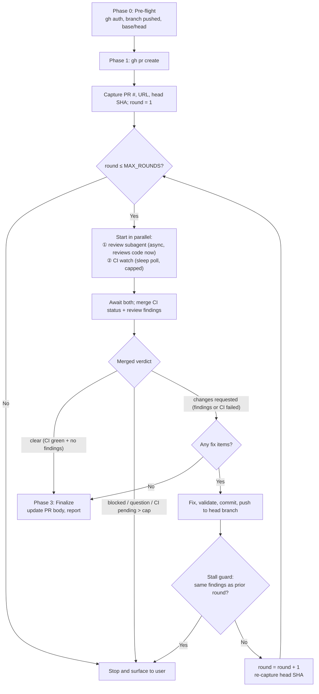

# GitHub PR Create

Use this skill when the supervisor must create a GitHub pull request and then drive it to a clean state through repeated independent review, without the user babysitting each round.

This skill defines the full create-and-converge loop: prepare and open the PR with `gh`, delegate a read-only review to a subagent while the supervisor concurrently watches CI, triage and fix valid findings, push the fix, and repeat the review round until the PR comes back clear (clean review and green CI) or a safety cap is reached.



## Ground Rules

- The supervisor opens the PR with the `gh` CLI and owns all commits and pushes on the PR head branch only.
- Each review round is delegated to an independent read-only subagent. The reviewer never edits source, commits, pushes, rewrites history, resolves GitHub threads, or posts public PR comments.
- The reviewer must follow the bundled `references/review-loop-protocol.md` and the `github-pr-review` skill's review procedure when available, and stay grounded in repository instructions, the live PR diff, touched code, tests, docs, and specs.
- The supervisor triages every finding and is the sole judge of what is valid and actionable. A clear round (no actionable findings) ends the loop; it is not permission to skip triage.
- The loop continues only while there are valid actionable fixes. Invalid, already-addressed, or deferred findings do not extend the loop.
- Never mutate branches other than the PR head branch, and never disturb unrelated dirty checkout state. If the PR work cannot be isolated safely, use a clean sibling worktree for supervisor-side fixes.
- A safety cap bounds the loop. When the cap is reached without a clear round, stop and surface the situation to the user instead of looping indefinitely.
- Each round runs the code review and CI watch in parallel to avoid serial waiting: the review subagent starts immediately (it does not wait for CI), while the supervisor concurrently polls required GitHub checks with `sleep` up to `CI_MAX_WAIT_SECONDS`. The supervisor merges CI status with the review findings — a round is `clear` only when the review found nothing actionable AND all required checks are green. Failed CI is treated as `changes requested` (the failing checks are lead findings the supervisor fixes); CI still pending after the cap is `blocked`, even when the review is clean.

## Supervisor Workflow

### Phase 0 — Pre-flight

1. Confirm `gh` is authenticated and the current repository is resolvable: `gh auth status` and `gh repo view`.
2. Confirm the intended changes are committed on the PR head branch and pushed to the remote. The head branch must be ahead of or diverged from the base branch with the intended commits. Do not create a PR from an unpushed local branch.
3. Confirm the base branch (default: the repository default branch) and the head branch name.
4. Capture the working tree state. Preserve unrelated dirty work; never switch, reset, clean, or overwrite the user's checkout. If isolation is needed, create a clean sibling worktree on the PR head branch.
5. Capture known validation already run, known limitations, and any areas needing extra attention to pass to the reviewer.

### Phase 1 — Create the PR

1. Resolve the PR title and body. Prefer a `--body-file` to keep the body reproducible and reviewable; do not inline a huge body on the command line.
2. Create the PR:
   - `gh pr create --base <BASE_BRANCH> --head <HEAD_BRANCH> --title "<TITLE>" --body-file <BODY_FILE>`
   - Add `--draft` only when the user explicitly asked for a draft PR.
3. Capture the PR number, PR URL, and exact head SHA from the created PR:
   - `gh pr view <PR_NUMBER> --json number,url,headRefName,headRefOid,baseRefName,state`
4. Round numbering starts at `1`.

### Phase 2 — Review-and-Fix Loop

Repeat for `round` in `1..MAX_ROUNDS` (default `MAX_ROUNDS = 5`):

1. Confirm the current head SHA is pushed and the local view matches it.
2. Start two concurrent tasks for this round:
   - **Review subagent (async)** — spawn it with the prompt template below. Resolve and pass `references/review-loop-protocol.md` from this skill's directory and the `github-pr-review` skill's review procedure when available. If the subagent cannot access either path, include the protocol text in its prompt. The reviewer reviews the code immediately; it does NOT wait for or poll CI.
   - **CI watch** — the supervisor polls `gh pr checks <PR_NUMBER> --json name,state,conclusion,link --required` every `CI_POLL_INTERVAL_SECONDS` (default 60) using `sleep`, up to `CI_MAX_WAIT_SECONDS` (default 900). Stop when all required checks are terminal (green or failed) or the cap is hit.
3. Await both tasks and merge CI status with the review verdict. The reviewer writes `pr-reviews/<PR_ID>-<round>-review.md` and returns a code verdict plus findings. The supervisor merges them into the round's verdict:
   - CI green + review `clear` → merged `clear` (converged).
   - CI green + review `changes requested` → merged `changes requested` (triage findings).
   - CI failed (any required check) → merged `changes requested`; the failing checks are lead findings added to the review's findings, regardless of the review verdict.
   - CI still pending after `CI_MAX_WAIT_SECONDS` → merged `blocked`; list the pending check names. Even a `clear` review cannot be trusted while CI is unresolved.
4. Triage every finding against the current diff:
   - `fix` — valid and actionable; implement in the supervisor workspace.
   - `already addressed` — the current head already satisfies it; no action.
   - `invalid` — not evidence-backed or out of scope; record the rationale.
   - `question` — needs product direction; stop and ask the user rather than guessing.
   - `defer` — valid but intentionally out of scope for this PR; record and continue.
5. Decide convergence from the merged verdict:
   - If merged `clear` → the PR is converged. Exit the loop.
   - If any finding is `question` → stop and surface the question to the user.
   - If merged `blocked` → stop and surface the blocker to the user.
   - If merged `changes requested` but no `fix` items remain after triage → the PR is converged (no actionable findings). Exit the loop.
   - Otherwise (there are `fix` items, which may include CI/build failures) → implement the fixes in the supervisor workspace, run the narrowest relevant local validation, commit, and push to the PR head branch. Increment `round` and continue.
6. After pushing a fix, re-capture the new head SHA. The next round reviews the new head.

### Phase 3 — Finalize

1. Confirm the final head SHA and that the local view matches it.
2. Re-run the smallest relevant local validation, then check the live required GitHub checks for the final head: `gh pr checks <PR_NUMBER>`.
3. Update the PR body or summary if the fixes changed behavior, validation, screenshots, docs, known limitations, or architecture. Keep any diagrams or evidence aligned with the final head.
4. Do not post public review comments unless the user explicitly approved it. The review artifacts live under `pr-reviews/`.
5. Report convergence: rounds run, final verdict, fixes applied, findings skipped with rationale, final head SHA, validation and CI status, and remaining risks.

## Convergence and Loop Safety

- `MAX_ROUNDS` defaults to `5`. Treat one review round plus its fix as one iteration.
- If `MAX_ROUNDS` is reached without a clear round, stop. Do not loop indefinitely. Summarize the unresolved findings, the rounds run, and ask the user how to proceed (for example, accept the residual findings, raise the cap, or take manual ownership).
- Guard against stalls: if two consecutive rounds return the same set of findings after fixes were applied, stop and surface the stall rather than repeating the same fix.
- A round with zero findings, or only invalid / already-addressed / deferred findings, counts as a clear round and ends the loop.
- The cap, the stall guard, and the `question` / `blocked` early exits ensure the loop is always bounded.
- CI and code review run in parallel each round so CI run time overlaps with review time. The supervisor merges them: `clear` requires both a clean review and green CI; failed CI is `changes requested`; CI pending past `CI_MAX_WAIT_SECONDS` is `blocked`, even when the review is clean.
- `CI_POLL_INTERVAL_SECONDS` defaults to `60` and `CI_MAX_WAIT_SECONDS` defaults to `900`. Override both when the repository's CI is known to be slower or faster.

## Review-Loop Protocol

Before spawning the reviewer, read `references/review-loop-protocol.md` from this skill's directory. It defines the parallel CI watch the supervisor runs alongside the code review, the per-round snapshot, the exact-head local view, review objectives, the per-round report file, the verdict semantics, the mandatory finding structure with an agent-ready fix prompt, the read-only constraints, and the final head recheck.

The reviewer remains read-only for source and external state. Report only evidence-backed issues caused or exposed by the PR; a clear review with no actionable findings is a valid outcome that ends the loop.

## Review Subagent Prompt Template

Use this shape when delegating each round:

```text
You are the independent review agent for round <ROUND_NUM> of this pull request.

Review this PR as a read-only exact-head review pass:
- Repository: <REPOSITORY>
- PR URL: <PR_URL>
- PR number: <PR_NUMBER>
- Base branch: <BASE_BRANCH>
- Head branch: <HEAD_BRANCH>
- Head SHA: <HEAD_SHA>
- Verified local checkout/worktree: <LOCAL_CONTEXT>
- Review-loop protocol: <RESOLVED_REVIEW_LOOP_PROTOCOL_PATH_OR_INCLUDED_TEXT>
- github-pr-review skill procedure (when available): <RESOLVED_GITHUB_PR_REVIEW_PATH_OR_INCLUDED_TEXT>
- Supervisor validation already run: <VALIDATION>
- Areas needing extra attention: <FOCUS_AREAS>
- Findings already resolved in earlier rounds: <PRIOR_ROUND_FINDINGS_AND_RESOLUTIONS>

The supervisor runs the CI watch in parallel; do NOT wait for or poll CI yourself. Begin the code review immediately. Read and follow the review-loop protocol and every repository instruction file that governs changed paths, including AGENTS.md and nested instructions when present. Inspect the live PR metadata/diff and verify the local context matches the supplied head SHA. Ground findings in the repository's domain and data invariants, module or service boundaries, typed contracts, security/privacy rules, conventions, testability, CI expectations, DRY/KISS/SOLID, and requested scope.

Do not edit source files. Do not commit, push, rewrite history, resolve GitHub threads, or post public PR comments.

Return a concise review report to the supervisor with:
- Verdict: clear, changes requested, or blocked
- Findings ordered by severity, each with file/line evidence, impact, suggested fix, and suggested verification
- For each issue or blocking question, an implementation prompt with files, exact change, constraints, acceptance criteria, and verification
- Validation commands run and results
- Remaining risk or unanswered questions

Write one markdown review artifact for this round at pr-reviews/<PR_ID>-<ROUND_NUM>-review.md. Include its path and paste the complete finding summary in your final response so the supervisor can act without relying on subagent workspace files.
```

## Supervisor Output

When reporting back to the user after the loop, include:

- PR number, URL, base and head branches, and final head SHA.
- Rounds run and the final verdict.
- Fixes applied per round (files changed and why).
- Findings skipped as invalid / already-addressed / deferred with rationale.
- Whether the cap or stall guard was hit and why.
- Local validation and live CI status for the final head, plus per-round CI watch results and any CI failures fixed during the loop.
- Remaining blockers, risks, or follow-up work.
