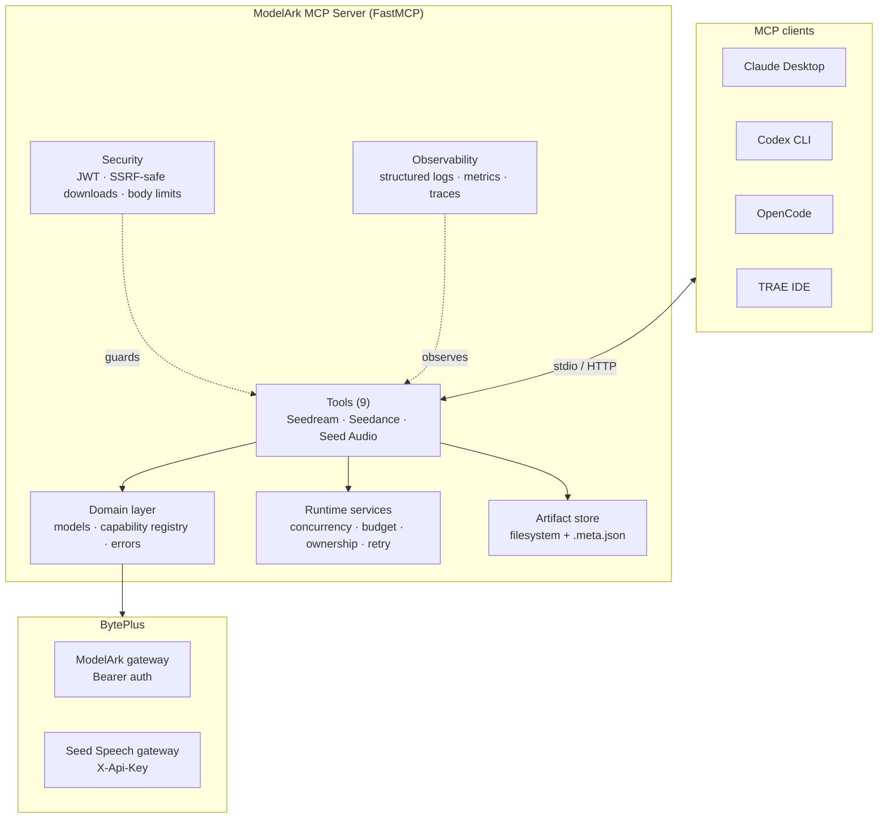
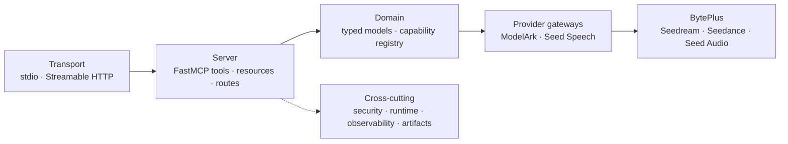
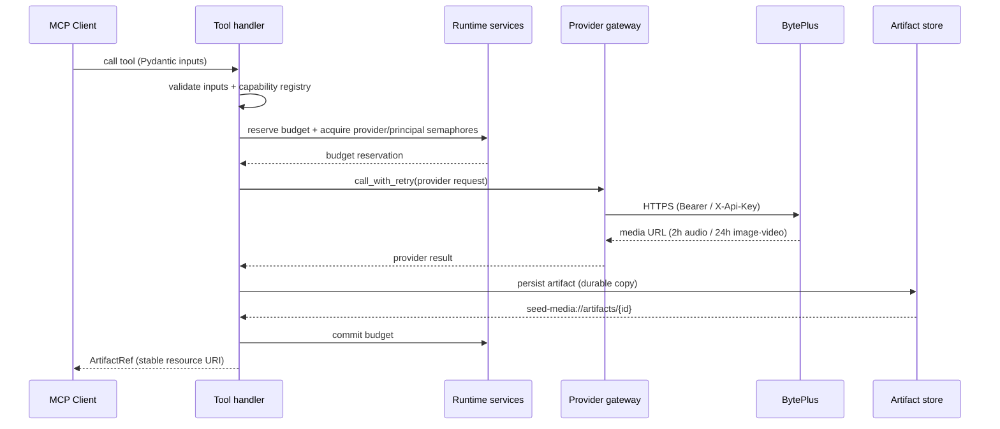

# ModelArk Seed Multimodal MCP Server

A Python [Model Context Protocol](https://modelcontextprotocol.io) server
built on [FastMCP](https://gofastmcp.com) that exposes BytePlus multimodal
generation through a typed, safe tool surface.

## What It Does

The server provides **9 MCP tools** across three BytePlus products:

| Product | Tools | Description |
|---|---|---|
| **Seed Audio** | `seed_audio_generate`, `seed_audio_generate_variations` | Full-scene audio generation through Seed Speech |
| **Seedream** | `seedream_generate_image`, `seedream_generate_image_variations` | Image generation and editing through ModelArk |
| **Seedance** | `seedance_create_task`, `seedance_create_task_variations`, `seedance_get_task`, `seedance_list_tasks`, `seedance_cancel_or_delete_task` | Async video generation and task management through ModelArk |

Key features:

- **Durable artifacts** — all generated media is persisted locally so MCP
  resources remain usable after provider URLs expire (2h audio, 24h
  image/video)
- **Parallel variations** — generate N independent variations in a single
  call with `asyncio.gather`, partial failures captured per variation
- **Per-variation seeds** — Seedream supports reproducible generation with
  `base_seed + index` deterministic seeds
- **Typed inputs** — Pydantic models validate all inputs before spending
  quota; unsupported combinations are rejected at the MCP layer
- **Model capability registry** — logical model families map to
  operator-configured model IDs; validates resolutions, formats, and
  batch support per model
- **Security** — DNS-pinned SSRF-safe downloads, tenant/principal ownership,
  scoped JWT auth for network HTTP, Host/Origin protection, and body limits
- **Runtime controls** — shared provider/principal concurrency, daily budget
  reservations, safe retries, task ownership, readiness, metrics, and tracing
- **459 offline tests** — unit, contract, integration, HTTP security, E2E, and
  MCP conformance with 88.08% branch coverage

## Architecture

The server uses two provider gateways behind one normalized domain layer, a
lifespan-owned runtime for concurrency/budget/ownership, and a durable
artifact store. See [docs/architecture.md](docs/architecture.md) for the full
overview.

**Components**



**Layered view**



**Request sequence (a billable generate call)**



## Quick Start

```bash
# Clone the repository
git clone <repo-url> modelark-mcp
cd modelark-mcp

# Install dependencies
uv sync

# Configure credentials
cp .env.example .env
# Edit .env and fill in your BytePlus API keys

# Run the server
make start

# Or run the verification script to test your credentials
uv run python scripts/verify_phase0.py
```

## Configuration

Edit `.env` with your BytePlus credentials:

```dotenv
BYTEPLUS_MODELARK_API_KEY=your_modelark_key
BYTEPLUS_SEED_AUDIO_API_KEY=your_seed_audio_key  # pragma: allowlist secret
SEEDREAM_DEFAULT_MODEL=dola-seedream-5-0-pro-260628
SEEDANCE_DEFAULT_MODEL=dreamina-seedance-2-0-260128
```

If a credential is absent, the server skips registering that product's
tools. Both keys are required for all 9 tools to appear.

See [Configuration](docs/configuration.md) for the full environment
variable reference.

## Using with MCP Clients

The server runs as a `stdio` process. Configure it in your MCP client:

### Claude Desktop

```json
{
  "mcpServers": {
    "modelark-seed": {
      "command": "uv",
      "args": ["--directory", "/path/to/modelark-mcp", "run", "python", "-m", "modelark_mcp"],
      "env": {
        "BYTEPLUS_MODELARK_API_KEY": "your_modelark_key",
        "BYTEPLUS_SEED_AUDIO_API_KEY": "your_seed_audio_key"
      }
    }
  }
}
```

### Codex CLI

Codex reads MCP servers from `~/.codex/config.toml` (global) or
`.codex/config.toml` (project-scoped, trusted projects). The format is TOML
with one `[mcp_servers.<name>]` table per server:

```toml
[mcp_servers.modelark-seed]
command = "uv"
args = ["--directory", "/path/to/modelark-mcp", "run", "python", "-m", "modelark_mcp"]

[mcp_servers.modelark-seed.env]
BYTEPLUS_MODELARK_API_KEY = "your_modelark_key"
BYTEPLUS_SEED_AUDIO_API_KEY = "your_seed_audio_key"
```

### OpenCode

OpenCode reads MCP servers from `opencode.json` / `opencode.jsonc` at the
project root, or `~/.config/opencode/opencode.json` globally. Use the
top-level `mcp` key with `type: "local"` and `command` as an array:

```json
{
  "$schema": "https://opencode.ai/config.json",
  "mcp": {
    "modelark-seed": {
      "type": "local",
      "command": ["uv", "--directory", "/path/to/modelark-mcp", "run", "python", "-m", "modelark_mcp"],
      "enabled": true,
      "environment": {
        "BYTEPLUS_MODELARK_API_KEY": "your_modelark_key",
        "BYTEPLUS_SEED_AUDIO_API_KEY": "your_seed_audio_key"
      }
    }
  }
}
```

### TRAE IDE

TRAE uses the standard `mcpServers` JSON shape, added either via
**Settings → MCP → Add → Manual** in the IDE, or declared in a project-level
`.trae/mcp.json` (enable project-level MCP in Settings → MCP). The
`${workspaceFolder}` variable resolves to the project root:

```json
{
  "mcpServers": {
    "modelark-seed": {
      "command": "uv",
      "args": ["--directory", "${workspaceFolder}", "run", "python", "-m", "modelark_mcp"],
      "env": {
        "BYTEPLUS_MODELARK_API_KEY": "your_modelark_key",
        "BYTEPLUS_SEED_AUDIO_API_KEY": "your_seed_audio_key"
      }
    }
  }
}
```

> The same `mcpServers` JSON can be pasted directly into TRAE's **Manual
> configuration** window if you already run this server in another IDE.

### Cursor, VS Code, MCP Inspector

See the [Integration Guide](docs/integration-guide.md) for configuration
snippets for Cursor IDE, VS Code MCP extension, and the MCP Inspector.

## Available Make Targets

```bash
make help          # Show all targets
make install       # Install dependencies from uv.lock
make start         # Run the server over stdio
make start-http    # Run the server over Streamable HTTP (localhost:3000)
make dev           # Run in dev mode with auto-reload
make test          # Run the test suite
make lint          # Lint with ruff
make typecheck     # Type-check with mypy
make inspect       # Launch FastMCP inspector
make check-env     # Validate environment configuration
```

## Documentation

| Document | Description |
|---|---|
| [Getting Started](docs/getting-started.md) | Installation, configuration, and first run |
| [Architecture](docs/architecture.md) | System structure, two-gateway domain layer, request flow |
| [Configuration](docs/configuration.md) | Full environment variable reference |
| [Integration Guide](docs/integration-guide.md) | MCP client setup (Claude, Cursor, VS Code, Inspector) |
| [API Reference](docs/api-reference.md) | Complete tool schemas, inputs, outputs, and examples |
| [Use Cases](docs/use-cases.md) | Common scenarios with example tool calls |
| [Tools](docs/tools.md) | Tool reference with input/output tables |
| [Security](docs/security.md) | Consolidated security model (auth, SSRF, body limits) |
| [Runtime](docs/runtime.md) | Concurrency, budget, ownership, retry |
| [Observability](docs/observability.md) | Structured logging, metrics, tracing |
| [Models](docs/models.md) | Model capability registry and validation |
| [Artifacts](docs/artifacts.md) | Durable artifact lifecycle and store |
| [Transports](docs/transports.md) | stdio vs HTTP deployment |
| [Deployment](docs/deployment.md) | Container, Kubernetes, and remote HTTP deployment |
| [Troubleshooting](docs/troubleshooting.md) | Common errors and fixes |

## Project Layout

```text
modelark-mcp/
├── src/modelark_mcp/
│   ├── server.py              # Deterministic FastMCP factory and registration
│   ├── __main__.py            # Entry point (truststore injection)
│   ├── runtime.py             # Lifespan-owned stores, limits, budgets, ownership
│   ├── config/                # Pydantic Settings, model capability registry
│   ├── domain/                # ArtifactRef, errors, media, models
│   ├── providers/             # ModelArk + Seed Speech gateways and adapters
│   ├── tools/                 # 9 tool handlers + parallel helpers + cost estimation
│   ├── artifacts/             # Tenant-aware filesystem artifact store
│   ├── observability/         # Structured logging and Prometheus metrics
│   └── security/              # JWT, URL/media policy, safe downloader, HTTP limits
├── tests/
│   ├── unit/                  # Model validators, URL policy, media policy, helpers
│   ├── contract/              # Provider gateway + adapter contract tests
│   ├── integration/           # Tool handler, HTTP security, MCP conformance
│   └── e2e/                   # In-process FastMCP client tests
├── docs/                      # User and contributor documentation
├── plans/                     # Implementation plans
├── scripts/                   # Verification and smoke test scripts
├── fastmcp.json               # Declarative server configuration
├── Makefile                  # Task runner
└── pyproject.toml             # Project metadata and dependencies
```

## Tech Stack

- [Python 3.12+](https://www.python.org/) on [uv](https://docs.astral.sh/uv/)
- [FastMCP v3](https://gofastmcp.com/) — MCP server framework
- [httpx](https://www.python-httpx.org/) — async HTTP client
- [Pydantic v2](https://docs.pydantic.dev/) — typed models and validation
- [pydantic-settings](https://pydantic.dev/docs/validation/latest/concepts/pydantic_settings/) — environment configuration
- [Starlette](https://www.starlette.io/) — HTTP middleware, body limits, and responses
- [prometheus-client](https://github.com/prometheus/client_python) — `/metrics` and Prometheus exposition
- [cachetools](https://github.com/tkem/cachetools) — TTL caching for provider responses and principal limits
- [truststore](https://truststore.readthedocs.io/) — macOS system certificate injection
- [respx](https://github.com/lundberg/respx) — HTTP mocking for contract tests

## License

See the project configuration for license details.

## Status

All three provider surfaces and both transports are implemented. The local
release gate passes 459 offline tests at 88.08% branch coverage, Ruff formatting
and lint, strict mypy, Bandit/secret scans, and package build. Dependency audit
and container health are enforced by CI. Remote HTTP requires JWT configuration
and is intentionally fail-closed.
