# ModelArk MCP Server — Codebase Gap Analysis & Improvement Report

## Overview

Three parallel sub-agents performed a thorough analysis of the codebase across
three domains: (1) architecture & code structure, (2) MCP tool surface & API
contracts, (3) testing, security & operational readiness. This report
consolidates their findings, de-duplicates overlapping issues, and prioritizes
actionable improvements.

**Codebase analyzed:** `modelark-mcp` — a Python MCP server (FastMCP on uv)
exposing BytePlus multimodal generation through Seed Audio, Seedream, and
Seedance.

**Source files analyzed:** 42 Python files in `src/`, 25 test files in `tests/`,
8 documentation files in `docs/`, plus config, plans, and infrastructure files.

---

## Consolidated Findings by Severity

### Critical

#### C1. Security: `media_policy.py` is completely dead code

The entire `security/media_policy.py` module — `validate_audio_mime()`,
`validate_image_mime()`, `validate_video_mime()`, `check_base64_size()`,
`decode_base64_safely()`, and `MediaLimits` — is never imported or called by
any tool handler, provider adapter, or domain model. The functions have unit
tests (`tests/unit/test_media_policy.py`) but are never wired into the actual
request pipeline.

**Impact:**
- User-supplied Base64 media data has **no size limit** — an LLM could pass a
  multi-gigabyte Base64 string that gets decoded and forwarded to the provider.
- MIME types on `MediaSource.mime_type` and `AudioReference.mime_type` are
  **never validated** against an allowlist.

**Files:** `src/modelark_mcp/security/media_policy.py` (entire file)

**Recommendation:** Wire `validate_audio_mime`/`validate_image_mime`/
`validate_video_mime` into `MediaSource` and `AudioReference` Pydantic model
validators. Call `check_base64_size` in `MediaSource.validate_source()` and
`AudioReference.validate_reference()`. Call `decode_base64_safely` in
`FilesystemArtifactStore.put_base64()` instead of raw `base64.b64decode()`.

---

#### C2. Security: User-supplied media URLs bypass SSRF validation

`MediaSource.url` and `AudioReference.url` in `domain/media.py` validate that
the URL field is present when `kind == "url"`, but they do **not** call
`validate_url()` from `security/url_policy.py`. User-supplied image, video, and
audio reference URLs are passed directly to provider APIs without any SSRF
check. `SeedanceVideoInput` (`seedance_create_task.py:34-39`) is even worse — it
has a plain `url: str` with no validation at all (no scheme check, no SSRF
protection, no length limit, no `model_validator`).

**Impact:** An LLM consumer (or attacker in HTTP mode) could pass
`http://169.254.169.254/latest/meta-data/` or `http://127.0.0.1:8080/internal`
as a reference URL, which would be forwarded to the provider and logged.

**Files:**
- `src/modelark_mcp/domain/media.py:46-55` (`MediaSource.validate_source`)
- `src/modelark_mcp/domain/media.py:81-94` (`AudioReference.validate_reference`)
- `src/modelark_mcp/tools/seedance_create_task.py:34-39` (`SeedanceVideoInput`)
- `src/modelark_mcp/security/url_policy.py:47-78` (`validate_url` — never
  called from `media.py`)

**Recommendation:** Add `model_validator(mode="after")` to `MediaSource`,
`AudioReference`, and `SeedanceVideoInput` that calls `validate_url(self.url)`
when `kind == "url"`.

---

#### C3. Security: Path traversal in artifact resource endpoint

The MCP resource template `seed-media://artifacts/{artifact_id}`
(`server.py:85-86`) passes `artifact_id` directly to `store.get(artifact_id)`.
In `FilesystemArtifactStore`, this becomes `self._base_dir / artifact_id[:2] /
artifact_id` (`filesystem_store.py:73`). If `artifact_id` contains path
separators or `..`, a client could traverse the filesystem.

**Files:** `src/modelark_mcp/server.py:85-96`;
`src/modelark_mcp/artifacts/filesystem_store.py:70-73, 187-191`

**Recommendation:** Validate that `artifact_id` matches a UUID pattern (e.g.,
`^[a-f0-9-]{36}$`) before using it in path construction. Alternatively, use
`Path.resolve()` and check that the resolved path is within `self._base_dir`.

---

#### C4. Operations: No CI/CD pipeline

There is no `.github/` directory, no CI/CD configuration of any kind. Quality
gates (tests, lint, typecheck, secrets scan, dependency audit) exist as
Makefile targets but are never enforced automatically. There is no branch
protection, no PR checks, no automated dependency updates.

**Recommendation:** Create a GitHub Actions workflow that runs on every push
and PR: `uv sync`, `make lint`, `make typecheck`, `make test`, `make audit`,
`pre-commit run --all-files`. Add Dependabot or Renovate for dependency updates.

---

### High

#### H1. Security: `follow_redirects=True` bypasses SSRF revalidation

`FilesystemArtifactStore._ensure_client()` (`filesystem_store.py:248-254`)
creates an `httpx.AsyncClient` with `follow_redirects=True`. This contradicts
`url_policy.py:89` which explicitly sets `follow_redirects=False` with the
comment "We handle redirects manually for safety." While `validate_url()` is
called before downloading, the redirect target is **not** revalidated. A
compromised or misconfigured BytePlus/TOS URL could redirect to an internal IP.

Additionally, `make_safe_client()` (`url_policy.py:81-89`) was written to solve
exactly this problem but is **never called** — it is dead code.

**Files:** `src/modelark_mcp/artifacts/filesystem_store.py:248-254`;
`src/modelark_mcp/security/url_policy.py:81-89`

**Recommendation:** Set `follow_redirects=False` and handle redirects manually
(revalidating each redirect target), or use `make_safe_client()`.

---

#### H2. Architecture: Massive code duplication between gateway classes

`ModelArkGateway` and `SeedSpeechGateway` are structurally near-identical. Both
implement: `__init__` (same pattern), `_ensure_client` (identical), `base_url`
property (identical), `close` (identical), `normalize_timeout` (identical except
provider name), `normalize_connection_error` (identical except provider name).
The `post`/`get`/`delete` methods differ only in logging event names.

**Files:**
- `src/modelark_mcp/providers/modelark/client.py:20-168` (entire file)
- `src/modelark_mcp/providers/seed_speech/client.py:20-158` (entire file)

**Recommendation:** Extract a `BaseHttpGateway` that implements `_ensure_client`,
`close`, `base_url`, `normalize_timeout`, `normalize_connection_error`, and a
generic `_request` method. Each provider subclass overrides only `_headers`,
`extract_request_id`, `normalize_error`, and the provider name. Removes ~100
lines of duplication.

---

#### H3. Architecture: ~80% code duplication across variation tools

The three variation tool files share nearly identical structure: cost estimate
logging, settings check, semaphore creation, inner `_generate_single()` /
`_create_single()` function with try/except → `VariationResult`,
`gather_with_timeout()` call, result post-processing, and summary computation.
The result post-processing block is almost character-for-character identical
across all three files (~20 lines each).

**Files:** Compare `seed_audio_generate_variations.py:121-205`,
`seedream_generate_image_variations.py:133-234`,
`seedance_create_task_variations.py:124-193`

**Recommendation:** Extract a shared `run_variation_batch()` function in
`_parallel.py` that takes a coroutine factory, count, timeout, and semaphore,
and returns `VariationSummary`. Tool-specific logic is passed as a callback.

---

#### H4. Architecture: Unbounded `_persistence_cache` — memory leak

`seedance_get_task.py:55` defines `_persistence_cache:
dict[str, dict[str, ArtifactRef | None]] = {}` at module level. It is never
cleared, has no TTL, and no max size. Every successfully persisted Seedance task
adds an entry. In a long-running HTTP server, this grows without bound.

Also a test isolation risk — tests must manually clear it.

**Files:** `src/modelark_mcp/tools/seedance_get_task.py:55, 89-93, 139-143`

**Recommendation:** Replace with a bounded `TTLCache` (e.g.,
`cachetools.TTLCache(maxsize=10000, ttl=86400)`) or an LRU cache. Add a `pytest`
fixture with `autouse=True` that clears it before every test.

---

#### H5. Architecture: Circular dependency — tools import from `server.py` at runtime

Every tool handler that needs the artifact store does a deferred
`from modelark_mcp.server import get_artifact_store` inside the function body.
This is a workaround for a circular dependency that couples the tool layer to
the server layer and makes the dependency invisible to static analysis.

**Files:** `src/modelark_mcp/tools/seed_audio_generate.py:154`,
`seed_audio_generate_variations.py:99`, `seedream_generate_image.py:138`,
`seedream_generate_image_variations.py:121`, `seedance_get_task.py:94`

**Recommendation:** Extract `get_artifact_store()` and the `_artifact_store`
singleton into a dedicated module (e.g., `src/modelark_mcp/artifacts/registry.py`
or `runtime.py`). Both `server.py` and tools import from there.

---

#### H6. Error handling: Tool handlers re-raise `ProviderError` instead of returning structured MCP error results

The plan specifies provider failures should be tool results with `isError: true`
and structured content. However, every tool handler catches `ProviderError`,
calls `ctx.error(...)`, then **re-raises**. This means the `ProviderError`
propagates as a Python exception to FastMCP, which surfaces it as a generic
internal error — not as a structured MCP result with the
`NormalizedProviderError` schema.

**Files:** `seed_audio_generate.py:143-145`, `seedream_generate_image.py:127-129`,
`seedance_create_task.py:193-195`, `seedance_get_task.py:71-73`,
`seedance_list_tasks.py:64-66`, `seedance_cancel_or_delete_task.py:103-105,140-142`

**Recommendation:** Convert `ProviderError` to a FastMCP `ToolError` (or result
with `is_error=True`) containing the `NormalizedProviderError` as structured
content.

---

#### H7. Error handling: Incomplete network exception handling

All provider service methods catch only `httpx.TimeoutException` and
`httpx.ConnectError`. Other transport errors — `ReadError`,
`RemoteProtocolError`, `WriteError`, `PoolTimeout`, `ConnectTimeout` —
propagate as unhandled exceptions.

**Files:** `providers/modelark/seedance.py:43-46`, `seedream.py:42-45`,
`providers/seed_speech/seed_audio.py:45-48`

**Recommendation:** Catch `httpx.TransportError` (or `httpx.HTTPError`) as a
final fallback and map it to a `ProviderError` with `code="TRANSPORT_ERROR"`.

---

#### H8. Testing: E2E test directory is empty — no end-to-end tests exist

`tests/e2e/` contains only an empty `__init__.py`. There are zero E2E tests.
No test exercises the full MCP protocol flow (client → server → provider →
response → resource retrieval). The `scripts/live_smoke_test.py` scripts require
real credentials and make billable calls — they are not automated E2E tests.

**Recommendation:** Add E2E tests that spin up the FastMCP server in-process,
call tools through the actual MCP client protocol, verify artifact resources
are retrievable via `seed-media://artifacts/{id}`, and test the full
create-task → poll → get-video lifecycle for Seedance. Use `respx` to mock
provider HTTP.

---

#### H9. Testing: Multiple source modules have zero test coverage

The following modules have no tests at all:
- `src/modelark_mcp/observability/logger.py` (70 lines — redaction logic untested)
- `src/modelark_mcp/domain/errors.py` (91 lines)
- `src/modelark_mcp/artifacts/store.py` (84 lines)
- `src/modelark_mcp/tools/_cost.py` (64 lines — cost estimation untested)
- `src/modelark_mcp/security/auth_context.py` (22 lines)
- `src/modelark_mcp/config/env.py:validate()` (lines 132-148)

**Recommendation:** Prioritize tests for `logger.py` (verify redaction of
nested keys), `_cost.py` (verify cost calculations per product), and
`env.py:validate()` (verify it rejects non-HTTPS URLs and invalid TTLs).

---

#### H10. Operations: No Dockerfile or container deployment story

There is no `Dockerfile`, `docker-compose.yml`, or `Containerfile`. The
`docs/transports.md` mentions HTTP deployment but provides no containerization
guidance. The `.env.example` references Docker/K8s (`secrets_dir="/run/secrets"`)
but there is no container image to deploy.

**Recommendation:** Create a multi-stage `Dockerfile` based on
`python:3.12-slim` that installs `uv`, syncs from `uv.lock`, runs as non-root,
and includes a health check. Create `docs/deployment.md` covering Docker,
reverse proxy with TLS, and K8s deployment.

---

### Medium

#### M1. Architecture: `structlog` dependency installed but never used

`pyproject.toml:16` lists `structlog>=25.5.0` as a runtime dependency, but the
observability layer (`observability/logger.py`) is a custom 70-line JSON logger
that does not import or use `structlog` at all. No file in `src/` imports it.

**Recommendation:** Remove the dependency, or migrate the custom logger to
`structlog` for structured logging features (context binding, processors).

---

#### M2. Config: `validate()` uses `assert` statements

`config/env.py:141-148` uses `assert` for validation. Python strips assertions
when running with `-O` (optimized mode), silently disabling validation in
production-optimized deployments.

**Recommendation:** Replace `assert` statements with explicit
`if ... : raise ValueError(...)`.

---

#### M3. Config: Capability registry infers model family via fragile string matching

`_seedream_capabilities()` determines the model family by checking
`"pro" in model_id.lower()`, `"5-0" in model_id`, and `"4-" in model_id`. This
is fragile: a model ID like `seedream-4-5-251128` would match `"4-"` and be
classified as `SEEDREAM_4X` even though 4.5 is a distinct family.

**Files:** `src/modelark_mcp/config/model_capabilities.py:71-115`

**Recommendation:** Let the operator explicitly bind model IDs to families via
environment variables, or maintain an explicit mapping table.

---

#### M4. Architecture: Side effects on import in `server.py`

`register_tools()` is called at module import time (line 271). Importing
`modelark_mcp.server` for any reason triggers tool registration, settings
loading, and logging side effects.

**Files:** `src/modelark_mcp/server.py:271`

**Recommendation:** Guard with `if __name__` or expose an explicit `init()`
function. Alternatively, use FastMCP's lifecycle hooks.

---

#### M5. Architecture: `test_utils.py` lives in the production source tree

`src/modelark_mcp/test_utils.py` is a production-source module containing
`FakeContext`, a test double. This ships with the package and pollutes the
production namespace.

**Recommendation:** Move to `tests/` (e.g., `tests/fixtures/fake_context.py`).

---

#### M6. Tool surface: No prompt length limits on Seedream and Seedance

`SeedreamGenerateInput.prompt` (`seedream_generate_image.py:34`) is `prompt: str`
with no `min_length` or `max_length`. `SeedanceCreateTaskInput.prompt`
(`seedance_create_task.py:51`) is `str | None = None` with no length constraints.
In contrast, `SeedAudioGenerateInput.text_prompt` correctly has
`min_length=1, max_length=3000`.

**Recommendation:** Add `Field(..., min_length=1, max_length=N)` to both
prompt fields. Check provider docs for actual maximum prompt lengths.

---

#### M7. Tool surface: No cost tracking for base (non-variation) tools

The three base generation tools (`seed_audio_generate`, `seedream_generate_image`,
`seedance_create_task`) do not call `log_cost_estimate()` at all. A single
`seedream_generate_image` call with `max_images=15` could cost $0.45 with no log.

**Recommendation:** Add `log_cost_estimate()` calls to all three base tools.

---

#### M8. Security: HTTP transport has no authentication — auth context is a stub

`derive_auth_from_context()` in `server.py:70-77` always returns
`AuthContext(principal_id="local", tenant_id="local")` regardless of transport.
`FilesystemArtifactStore.get()` accepts `auth: AuthContext | None = None` but
completely ignores it — there is no ownership check on artifact retrieval.

**Files:** `src/modelark_mcp/security/auth_context.py:13-22`,
`src/modelark_mcp/server.py:70-77`, `src/modelark_mcp/artifacts/filesystem_store.py:187-214`

**Recommendation:** Implement OAuth resource-server middleware for HTTP
deployment. Enforce artifact ownership by checking `auth.principal_id` against
stored metadata. Document clearly that HTTP transport is not production-ready
until auth is implemented.

---

#### M9. Security: TOCTOU vulnerability in DNS-based SSRF validation

`validate_url()` resolves the hostname via `socket.getaddrinfo()` and checks
that no resolved IP is private/loopback/metadata. However, the actual HTTP
request (via httpx) performs a **separate** DNS resolution. An attacker with
DNS control could return a public IP during validation, then a private IP when
httpx connects (DNS rebinding).

**Files:** `src/modelark_mcp/security/url_policy.py:69-78`

**Recommendation:** Resolve the IP once, then connect to that specific IP with
the Host header set to the original hostname. Or use a custom httpx transport
that pins the resolved IP.

---

#### M10. Operations: No health check endpoint for HTTP deployment

The server exposes a `seed-health://status` MCP resource, but this is only
accessible through the MCP protocol — not as an HTTP endpoint. For container
orchestration (K8s liveness/readiness probes, Docker health checks), a standard
HTTP `/health` endpoint is needed.

**Recommendation:** Add an HTTP `/health` endpoint separate from the MCP server,
or document that the MCP health resource is sufficient for MCP-aware
orchestrators.

---

#### M11. Operations: No metrics, request tracing, or error tracking

The server has structured JSON logging but no Prometheus metrics, no
OpenTelemetry tracing, no error tracking (Sentry). For a multi-provider server
making billable API calls, observability into cost and latency is important.

**Recommendation:** Add Prometheus metrics (request count, latency histogram,
error count per tool, artifact count, cache hit/miss). Add OpenTelemetry
tracing with spans for provider calls.

---

#### M12. Operations: No deployment documentation

There is no `docs/deployment.md`. The deployment story is scattered across
`docs/transports.md`, `docs/configuration.md`, `docs/getting-started.md`, and
`fastmcp.json`.

**Recommendation:** Create `docs/deployment.md` covering Docker deployment,
reverse proxy with TLS, K8s deployment with secrets, monitoring setup, and
scaling considerations.

---

#### M13. Tool surface: `request_id=""` hardcoded in Seed Audio output

`seed_audio_generate.py:193` sets `request_id=""` because
`X-Api-Request-Id` is set on request, not response. But `request_id: str`
cannot represent "missing."

**Recommendation:** Change to `request_id: str | None` and pass `None`.

---

#### M14. Tool surface: Semaphore is local per tool invocation, not global

Each variation tool creates its own `asyncio.Semaphore(5)`. If multiple
variation tools are called concurrently, total concurrency is 5 × N_invocations,
not 5. This could overwhelm the provider API.

**Files:** `seed_audio_generate_variations.py:119`,
`seedream_generate_image_variations.py:131`,
`seedance_create_task_variations.py:122`

**Recommendation:** Use a module-level or process-level semaphore that caps
total concurrent provider calls across all tools.

---

### Low

#### L1. Docs: `docs/tools.md` says "six typed tools" but there are nine

`docs/tools.md:3` states "six typed tools" but the server registers 9 tools.
The API reference correctly says "all nine MCP tools."

**Recommendation:** Fix to say "nine typed tools."

---

#### L2. Domain: `SeedanceTaskStatus` Literal duplicated across two files

Defined identically in both `seedance_get_task.py:22-29` and
`seedance_list_tasks.py:20`.

**Recommendation:** Define once in `domain/models.py` and import everywhere.

---

#### L3. Domain: Inconsistent enum/typing style

`MediaSourceKind` uses `StrEnum`, `MediaType` uses `Literal[...]`,
`SeedanceTaskStatus` is duplicated `Literal[...]`, `AudioReference.kind` uses
inline `Literal[...]`.

**Recommendation:** Pick one style (`StrEnum` for enumerable values,
`Literal` only for ad-hoc unions) and apply consistently.

---

#### L4. Domain: Untyped `dict[str, Any]` fields lose type safety

`Subtitle.utterances`, `Subtitle.words`, `VariationResult.error`,
`SeedanceTaskOutput.error`, `SeedanceTaskOutput.settings`,
`SeedAudioProviderRequest.references`, `SeedanceTaskResponse.content` — all
`dict[str, Any]`.

**Recommendation:** Define typed `BaseModel` or `TypedDict` classes for these
structures.

---

#### L5. Config: `lru_cache` on `get_settings()` prevents runtime refresh

`get_settings()` is decorated with `@lru_cache(maxsize=1)`. After the first
call, environment changes are never seen. No equivalent of
`refresh_capability_registry()` exists for settings.

**Recommendation:** Add a `refresh_settings()` wrapper for testing and
hot-reload, or document that settings are immutable after first load.

---

#### L6. Security: Pre-commit hooks missing type checking and vulnerability scanning

`.pre-commit-config.yaml` has only `detect-secrets`, `ruff` (lint), and
`ruff-format`. Missing: `mypy`, `pip-audit`, `bandit`, and standard file
hygiene hooks.

**Recommendation:** Add `mypy` and `pip-audit` to pre-commit hooks. Consider
adding `bandit` for security-focused static analysis and `pre-commit-hooks`
for file hygiene.

---

#### L7. Config: Dependencies use `>=` constraints, not pinned ranges

`pyproject.toml:10-17` uses `>=` for all dependencies. A breaking change in a
dependency (e.g., FastMCP 4.0, Pydantic 3.0) could break a fresh `uv sync`
without a lockfile update.

**Recommendation:** Consider using `~=` or explicit upper bounds
(e.g., `fastmcp>=3.4.4,<4.0`) for major version pinning.

---

#### L8. Testing: Integration tests mock out SSRF validation

Integration tests for Seedance and Seedream patch out `validate_url`, so the
SSRF validation is never exercised in the full tool flow.

**Files:** `tests/integration/test_seedance_tool.py:189`,
`tests/integration/test_seedream_tool.py:61`

**Recommendation:** Add at least one integration test per tool that does NOT
patch `validate_url` and uses a mocked provider URL that passes validation.
Add a negative test that verifies an untrusted host is rejected.

---

#### L9. Testing: MCP conformance test uses `importlib.reload` which is fragile

`tests/integration/test_mcp_conformance.py:33` uses `importlib.reload()` to
re-register tools. Module reloading creates new class objects, breaks
`isinstance` checks, and can leave stale references.

**Recommendation:** Refactor `register_tools()` to be idempotent and callable
with explicit settings, or use a factory function that creates a fresh
`FastMCP` instance per test.

---

#### L10. Tool surface: No retry or backoff for transient failures in variations

Failed variations are captured as errors with no retry. The `ProviderError`
model has a `retryable` field, but variation tools don't check it — all
failures (including retryable 429 or 5xx) are treated as final.

**Recommendation:** Add retry with exponential backoff for `retryable=True`
errors, with a max retry count.

---

## Strengths

1. **Clean domain/provider separation** — Tool handlers use domain models
   (`MediaSource`, `ArtifactRef`, `VariationResult`), and provider DTOs are
   internal to the provider layer. Vendor field changes don't leak through to
   tool contracts.

2. **Well-designed error normalization** — `NormalizedProviderError` and
   `ProviderError` provide a consistent cross-provider error taxonomy with
   `retryable`, `ambiguous_completion`, and `request_id` fields.

3. **Thoughtful artifact persistence model** — `ArtifactRef` cleanly separates
   `source_expires_at` (provider URL expiry) from `expires_at` (local TTL).
   Two-level directory sharding avoids huge directories. Atomic temp-file rename
   prevents partial writes. SHA-256 checksums on all artifacts.

4. **Capability registry** — Validates model-specific features (batch support,
   resolution, duration, output format, size) before spending quota.

5. **Destructive operation safety** — `seedance_cancel_or_delete_task` requires
   `expected_status` (optimistic concurrency), `confirm: Literal[True]` (forced
   acknowledgment), and a pre-flight status check. `destructiveHint=True`
   annotation is correct.

6. **Comprehensive contract tests** — `tests/contract/` covers all CRUD
   operations across both gateways with thorough error path coverage (400, 401,
   403, 404, 429, 500, 503, malformed JSON, timeout, connection error).

7. **Strong MCP conformance tests** — Verifies tool discovery, inputSchema/
   outputSchema auto-generation, ToolAnnotations propagation, resource template
   registration, and conditional registration based on credentials.

8. **Good secrets hygiene** — `.env` gitignored, `detect-secrets` configured
   with 25 detector plugins, logger redacts sensitive keys.

9. **Structured logging to stderr** — Correctly separates JSON-RPC (stdout) from
   logs (stderr), includes UTC timestamps, recursively redacts sensitive keys.

10. **Conditional tool registration** — Tools only registered when credentials
    are present, preventing exposure of tools that would always fail.

---

## Top 10 Prioritized Recommendations

| # | Priority | Recommendation | Addresses |
|---|----------|---------------|-----------|
| 1 | Critical | Wire `media_policy.py` and `url_policy.py` into the input pipeline — add `validate_url()` to `MediaSource`/`AudioReference`/`SeedanceVideoInput` model validators, add `check_base64_size()` and MIME validation | C1, C2 |
| 2 | Critical | Fix path traversal in artifact resource endpoint — validate `artifact_id` against UUID pattern before path construction | C3 |
| 3 | Critical | Set up CI/CD with GitHub Actions (lint, typecheck, test, audit, pre-commit on every push/PR) | C4 |
| 4 | High | Fix `follow_redirects=True` in `FilesystemArtifactStore` — use `make_safe_client()` or handle redirects manually with revalidation | H1 |
| 5 | High | Extract `BaseHttpGateway` to eliminate ~100 lines of duplication between `ModelArkGateway` and `SeedSpeechGateway` | H2 |
| 6 | High | Extract shared `run_variation_batch()` helper to eliminate ~80% duplication across variation tools | H3 |
| 7 | High | Replace unbounded `_persistence_cache` with bounded `TTLCache`; break circular dependency by extracting `get_artifact_store()` to a dedicated module | H4, H5 |
| 8 | High | Convert `ProviderError` re-raises to structured MCP `isError: true` results; catch broader `httpx.TransportError` in provider methods | H6, H7 |
| 9 | High | Add E2E tests and fill unit test gaps (logger, `_cost.py`, `env.py:validate()`, `errors.py`); add Dockerfile and `docs/deployment.md` | H8, H9, H10 |
| 10 | Medium | Remove unused `structlog` dependency; replace `assert` in `validate()` with explicit raises; fix `docs/tools.md` tool count | M1, M2, L1 |

---

## Summary Architecture Diagram

```mermaid
graph TB
    subgraph "MCP Client"
        C[LLM / MCP Client]
    end

    subgraph "FastMCP Server (server.py)"
        T[Tools Layer]
        R[Resources Layer]
        AUTH[Auth Context — STUB]
    end

    subgraph "Tool Handlers (tools/)"
        T1[seed_audio_generate]
        T2[seedream_generate_image]
        T3[seedance_create_task]
        T4[3 × variation tools]
        COST[_cost.py — log only]
        PAR[_parallel.py]
    end

    subgraph "Domain Layer (domain/)"
        DM[models.py]
        DE[errors.py]
        DMed[media.py]
        DA[artifacts.py]
    end

    subgraph "Provider Gateways (providers/)"
        MG[ModelArkGateway]
        SG[SeedSpeechGateway]
    end

    subgraph "Security (security/)"
        UP[url_policy.py — validate_url]
        MP[media_policy.py — DEAD CODE]
        AC[auth_context.py — STUB]
    end

    subgraph "Infrastructure"
        FS[FilesystemArtifactStore]
        CFG[config/env.py]
        OBS[observability/logger.py]
        CAP[model_capabilities.py]
    end

    subgraph "BytePlus Providers"
        BP1[ModelArk API]
        BP2[Seed Speech API]
    end

    C <-->|MCP JSON-RPC| T
    T --> T1 & T2 & T3 & T4
    T1 & T2 & T3 -->|deferred import circular dep| FS
    T1 & T2 & T3 --> DM & DE
    T4 --> PAR & COST

    T1 --> SG --> BP2
    T2 & T3 --> MG --> BP1

    T1 & T2 & T3 -.->|should validate, doesn't| UP
    T1 & T2 & T3 -.->|should validate, doesn't| MP
    FS -->|follow_redirects=True ❌| UP

    R --> FS
    AUTH -.->|ignored| FS

    style MP fill:#f99,stroke:#c00
    style AUTH fill:#fc9,stroke:#c80
    style FS fill:#fc9,stroke:#c80
    style UP fill:#fc9,stroke:#c80
```

**Legend:** Red = critical gap (dead code / vulnerability). Orange = high/medium
gap (stub, misconfiguration, or missing wiring).

---

*Report generated by 3 parallel analysis sub-agents on 2026-07-22.*

---

## Remediation Status — 2026-07-23

The findings above are retained as the historical review snapshot. The
implementation followed
[`plans/PLAN_CODEBASE_GAP_REMEDIATION.md`](plans/PLAN_CODEBASE_GAP_REMEDIATION.md).

| ID | Status | Resolution and evidence |
|---|---|---|
| C1 | Resolved | Media type is determined by each tool and every stored/downloaded payload passes media-policy MIME and size validation. |
| C2 | Resolved | All provider URL persistence uses the injected `SafeDownloader` and `UrlPolicy`. |
| C3 | Resolved | Artifact IDs must be canonical UUID4 values; resolved paths remain beneath the configured store root. |
| C4 | Resolved | CI now enforces lock consistency, lint/format, mypy, offline coverage, Bandit, audit, secret scan, package smoke, and container health. |
| H1 | Resolved | Redirects are followed manually with validation and IP pinning at every hop. |
| H2 | Resolved | Provider gateways share request, telemetry, normalization, and retry behavior through `providers/base.py`. |
| H3 | Resolved | Variation tools share seed/prompt resolution, timeout gathering, error conversion, runtime policy, and typed result models. |
| H4 | Resolved | Persistence uses a lifespan-owned, size-bounded `TTLCache`. |
| H5 | Resolved | Tools obtain stores and services from `RuntimeServices`; the old registry no longer owns global state. |
| H6 | Resolved | Provider failures return `ToolResult(is_error=True)` with normalized structured error content. |
| H7 | Resolved | HTTP/network failures are normalized, retry-classified, and marked ambiguous where replay could duplicate a billable mutation. |
| H8 | Resolved | In-process FastMCP E2E tests invoke all nine tools: base and variation generation, the full Seedance lifecycle, resources, and structured failures. |
| H9 | Resolved | Previously uncovered configuration, logging, runtime, downloader, retry, HTTP, and entrypoint dispatch paths have dedicated tests; enforced branch coverage is 85% (88.08% current). |
| H10 | Resolved | A pinned multi-stage, non-root image runs the installed module and probes the real `/health` endpoint. |
| M1 | Resolved | Unused `structlog` was removed; the lightweight stderr JSON logger remains. |
| M2 | Resolved | Configuration validation uses explicit exceptions rather than assertions. |
| M3 | Resolved | Model capabilities use explicit typed binding lists; custom IDs require a declared family. |
| M4 | Resolved | `create_server()` is deterministic; mutable I/O resources are opened and closed only by the lifespan. |
| M5 | Resolved | `test_utils.py` was removed from the production package; test context helpers live under `tests/`. |
| M6 | Resolved | Seedream and Seedance prompt constraints are enforced by Pydantic before dispatch. |
| M7 | Resolved | Base and variation generation calls reserve and commit/release per-principal budget estimates. |
| M8 | Resolved | FastMCP JWT verification validates JWKS, issuer, audience, scopes, principal, and tenant; non-loopback local auth fails closed. |
| M9 | Resolved | Downloads connect to the already validated IP while preserving the original Host header and TLS SNI. |
| M10 | Resolved | `/health` and dependency-aware `/ready` endpoints are registered on the HTTP app. |
| M11 | Resolved | Prometheus counters/histograms and FastMCP/OpenTelemetry provider spans are integrated; structured errors remain observable in logs. |
| M12 | Resolved | `docs/deployment.md` documents protected Docker/Kubernetes operation, probes, monitoring, and the single-replica boundary. |
| M13 | Resolved | Seed Audio creates and propagates a UUID request ID for every generation. |
| M14 | Resolved | Lifespan-owned semaphores enforce shared per-provider and per-principal limits. |
| L1 | Resolved | Tool documentation consistently lists all nine tools. |
| L2 | Resolved | Seedance status has one shared `StrEnum`. |
| L3 | Resolved | Media and task status values use consistent enums and typed models. |
| L4 | Resolved | Variation errors, subtitles, Seedance errors, and generation settings have explicit models. |
| L5 | Resolved | `refresh_settings()` provides an explicit cache invalidation API. |
| L6 | Resolved | Pre-commit and CI include mypy, dependency audit, secret detection, and non-mutating Ruff checks. |
| L7 | Resolved | Direct runtime dependencies have compatible upper bounds where upstream major-version changes are material; `uv.lock` is authoritative and checked. |
| L8 | Resolved | URL-policy and downloader tests exercise real validation logic with deterministic DNS and socket blocking. |
| L9 | Resolved | Conformance and E2E tests use fresh factory-created servers instead of `importlib.reload`. |
| L10 | Resolved | Shared retry policy implements exponential jitter and `Retry-After`, restricted to safe, non-ambiguous failures. |

### Verification snapshot

- Ruff lint and formatting: pass for `src`, `tests`, and `scripts`.
- Strict mypy: pass for 51 source files.
- Offline tests: 459 passed; real sockets blocked except Unix sockets required
  by asyncio.
- Branch coverage: 88.08%; enforced floor: 85%.
- Authorized live smoke verification: baseline image/audio/video generation and
  durable retrieval passed; all three image/audio variations and two video
  variations completed and persisted. Live task listing and terminal-task
  deletion also passed after correcting the current ModelArk list contract.
- Bandit and detect-secrets: pass.
- Lock verification, offline sync, sdist, wheel, and wheel-content inspection:
  pass.
- `pip-audit`: enforced in CI; local execution was blocked because this sandbox
  did not authorize sending the installed package inventory to the public
  vulnerability service.
- Container health smoke: enforced in CI; not run locally because the Docker
  daemon was unavailable.
