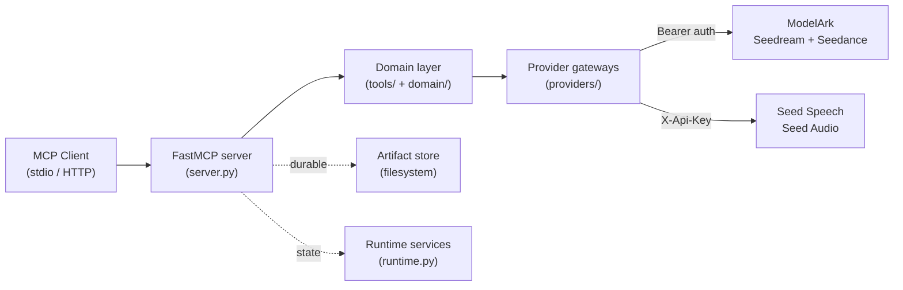
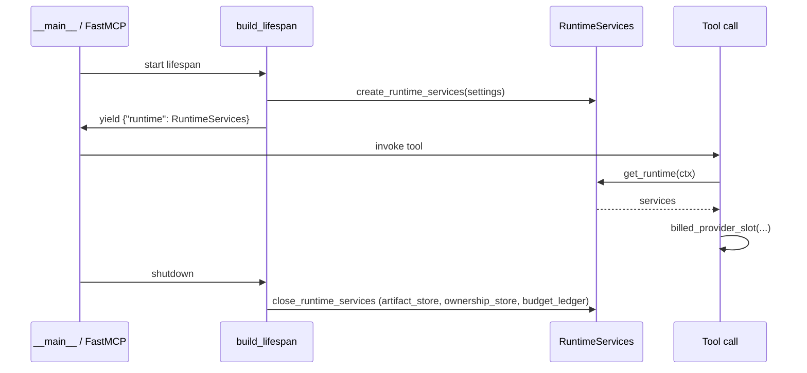
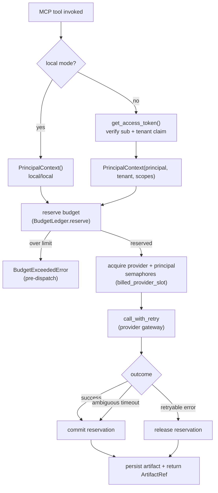

# Architecture

This document describes the structure of the ModelArk Seed Multimodal MCP
Server as shipped today. For the original design rationale, see
[../plans/PLAN_MODELARK_SEED_MULTIMODAL_MCP.md](../plans/PLAN_MODELARK_SEED_MULTIMODAL_MCP.md).

## Design goals

- **Small, typed tool surface** — a handful of Pydantic-validated tools rather
  than a wide REST API.
- **Two provider gateways, one domain layer** — Seedance and Seedream share
  the ModelArk host and Bearer auth; Seed Audio uses a separate host and
  `X-Api-Key`. The difference is hidden behind a normalized domain layer.
- **Durable artifacts** — provider media URLs expire (2h audio, 24h
  image/video), so outputs are persisted to a local store and re-exposed as
  stable `seed-media://artifacts/{id}` MCP resources.
- **Safe by default** — local `stdio` requires no auth; remote HTTP requires
  JWT verification, Host/Origin protection, and body limits.
- **Observable and budget-aware** — structured logs, Prometheus metrics, and a
  per-principal daily budget ledger.

## Layered structure

```text
src/modelark_mcp/
├── __main__.py            # entry point; truststore injection; transport wiring
├── server.py              # FastMCP factory; tool/resource/route registration
├── config/                # settings (env), model capability registry
│   ├── env.py
│   └── model_capabilities.py
├── domain/                # pure models: ArtifactRef, MediaSource, errors
│   ├── artifacts.py
│   ├── media.py
│   ├── models.py
│   └── errors.py
├── tools/                 # MCP tool implementations (+ _cost, _parallel, _errors)
├── providers/             # two HTTP gateways + retry policy
│   ├── base.py            # BaseHttpGateway: spans, metrics, error normalization
│   ├── retry.py
│   ├── modelark.py        # Seedream + Seedance
│   └── seed_speech.py     # Seed Audio
├── runtime.py             # lifespan-owned services (limiter, budget, ownership)
├── artifacts/             # durable artifact store (filesystem backend)
│   ├── store.py           # ArtifactStore protocol
│   └── filesystem_store.py
├── security/              # auth, SSRF-safe downloads, URL/media policy, body limit
├── observability/         # structured logging + Prometheus metrics
└── transports (via FastMCP) # stdio + Streamable HTTP
```

## Two-gateway domain layer



- **ModelArk gateway** (`providers/modelark.py`) — serves Seedream (image)
  and Seedance (video). Uses `Authorization: Bearer` and base URL
  `https://ark.ap-southeast.bytepluses.com/api/v3`.
- **Seed Speech gateway** (`providers/seed_speech.py`) — serves Seed Audio.
  Uses `X-Api-Key` and base URL `https://voice.ap-southeast-1.bytepluses.com`.
- Both extend `BaseHttpGateway` (`providers/base.py`), which wraps every
  outbound request in an OpenTelemetry span, records Prometheus
  provider metrics, and normalizes transport/HTTP errors into a single
  `ProviderError` carrying a `NormalizedProviderError`.

## Server lifecycle and runtime services

`server.py::create_server` builds the FastMCP instance. The server lifespan
is owned by `runtime.py::build_lifespan`, which constructs a single
`RuntimeServices` object and yields it as the FastMCP lifespan context:



`RuntimeServices` holds seven components (see [runtime.md](runtime.md) for
full detail):

| Field | Purpose |
|---|---|
| `settings` | resolved `Settings` |
| `artifact_store` | `FilesystemArtifactStore` — durable media |
| `safe_downloader` | SSRF-safe HTTP downloader |
| `ownership_store` | `SQLiteTaskOwnershipStore` — Seedance task ownership |
| `budget_ledger` | `BudgetLedger` — per-principal UTC daily budget |
| `provider_limiters` | `ProviderLimiters` — provider + principal concurrency |
| `persistence_cache` | `TTLCache` — provider task → artifact ref cache |

`close_runtime_services` closes exactly three of these: `artifact_store`,
`ownership_store`, and `budget_ledger`.

## Request flow for a billable tool



Three layers of control compose on a single billable call: the provider
bucket semaphore (per provider, global, default 5), the principal semaphore
(per `(tenant, principal)`, default 3), and — for parallel variation tools — a
per-batch local semaphore (`max_concurrent=5`). See [runtime.md](runtime.md).

## Transports

| Transport | When | Auth |
|---|---|---|
| `stdio` | local default | none (single trusted principal `local`) |
| Streamable HTTP | remote / shared | JWT verification required for non-loopback hosts |

`truststore.inject_into_ssl()` runs at module import in both `server.py` and
`__main__.py`, so every run path loads the macOS system Keychain for TLS.
Transport wiring, Host/Origin protection, and body-limit middleware live in
`__main__.py`. See [transports.md](transports.md) and [security.md](security.md).

## Where to read more

| Topic | Document |
|---|---|
| Runtime services (limiter, budget, ownership, retry) | [runtime.md](runtime.md) |
| Logging, metrics, tracing | [observability.md](observability.md) |
| Consolidated security model | [security.md](security.md) |
| Model capability registry | [models.md](models.md) |
| Durable artifact lifecycle | [artifacts.md](artifacts.md) |
| Tool contracts | [api-reference.md](api-reference.md) |
| Configuration | [configuration.md](configuration.md) |
