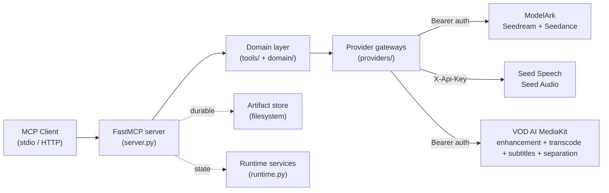
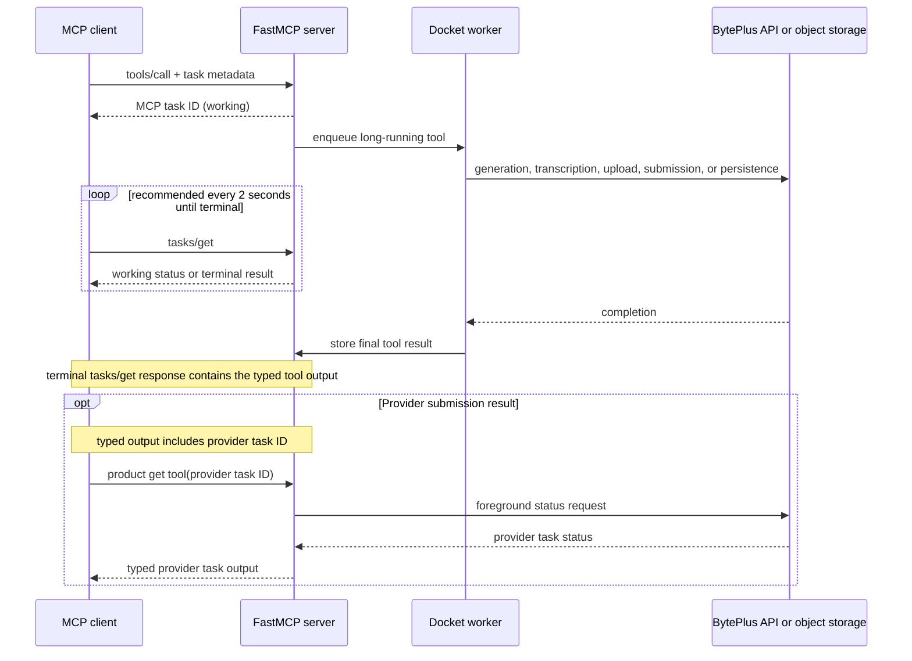
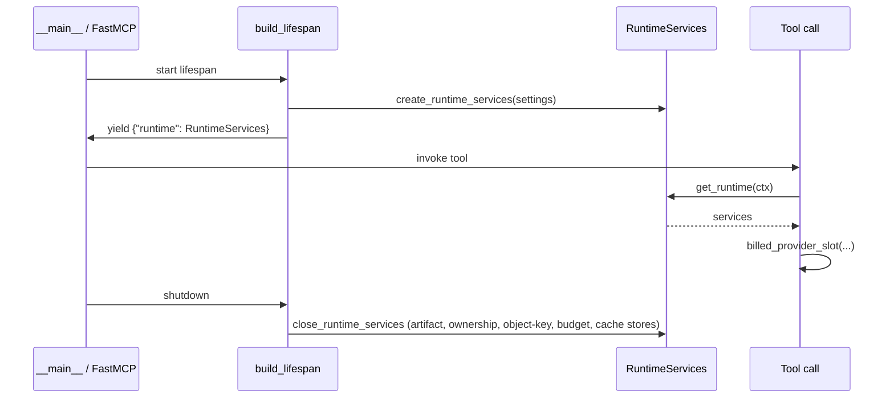
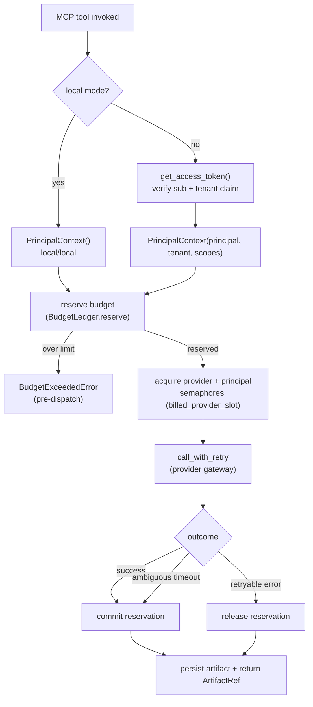

# Architecture

This document describes the structure of the ModelArk Seed Multimodal MCP
Server as shipped today. For the original design rationale, see
[../plans/PLAN_MODELARK_SEED_MULTIMODAL_MCP.md](../plans/PLAN_MODELARK_SEED_MULTIMODAL_MCP.md).

## Design goals

- **Small, typed tool surface** — a handful of Pydantic-validated tools rather
  than a wide REST API.
- **Dedicated provider gateways, one domain layer** — Seedance and Seedream
  share the ModelArk host and Bearer auth; Seed Audio uses a separate host and
  `X-Api-Key`; VOD AI MediaKit uses its own Bearer-authenticated convenience
  endpoint for enhancement, transcoding, and audio separation. The differences
  are hidden behind normalized adapters.
- **Durable artifacts** — known provider media URLs expire (2h Seed Audio; 24h
  ModelArk image/video and observed MediaKit outputs), so outputs are persisted
  to a local store and re-exposed as stable `seed-media://artifacts/{id}` MCP
  resources. MediaKit persistence is best-effort.
- **Safe by default** — local `stdio` requires no auth; remote HTTP requires
  JWT verification, Host/Origin protection, and body limits.
- **Observable and budget-aware** — structured logs, Prometheus metrics, and a
  per-principal daily budget ledger.
- **Timeout-safe long operations** — generation, transcription, upload, and
  provider-submission calls use required MCP task augmentation; completed-media
  retrieval supports optional background persistence.

## Layered structure

```text
src/modelark_mcp/
├── __main__.py            # entry point; truststore injection; transport wiring
├── server.py              # FastMCP factory; tool/resource/route registration
├── config/                # settings (env), model capability registry
│   ├── env.py
│   └── model_capabilities.py
├── domain/                # pure models: ArtifactRef, MediaSource, errors
│   ├── artifacts.py
│   ├── media.py
│   ├── models.py
│   └── errors.py
├── tools/                 # MCP tool implementations (+ _cost, _parallel, _errors)
├── providers/             # dedicated HTTP gateways + retry policy
│   ├── base.py            # BaseHttpGateway: spans, metrics, error normalization
│   ├── retry.py
│   ├── modelark.py        # Seedream + Seedance
│   ├── seed_speech.py     # Seed Audio
│   └── vod_mediakit/      # VOD AI MediaKit (Bearer; enhancement, transcode, subtitles, separation)
├── runtime.py             # lifespan-owned services (limiter, budget, ownership)
├── artifacts/             # durable artifact store (filesystem backend)
│   ├── store.py           # ArtifactStore protocol
│   └── filesystem_store.py
├── security/              # auth, SSRF-safe downloads, URL/media policy, body limit
├── observability/         # structured logging + Prometheus metrics
└── transports (via FastMCP) # stdio + Streamable HTTP
```

## Provider gateway domain layer


```mermaid
flowchart LR
    Client["MCP Client\n(stdio / HTTP)"] --> Server["FastMCP server\n(server.py)"]
    Server --> Domain["Domain layer\n(tools/ + domain/)"]
    Domain --> Gateway["Provider gateways\n(providers/)"]
    Gateway -->|"Bearer auth"| ModelArk["ModelArk\nSeedream + Seedance"]
    Gateway -->|"X-Api-Key"| SeedSpeech["Seed Speech\nSeed Audio"]
    Gateway -->|"Bearer auth"| MediaKit["VOD AI MediaKit\nenhancement + transcode + subtitles + separation"]
    Server -.durable.-> Store["Artifact store\n(filesystem)"]
    Server -.state.-> Runtime["Runtime services\n(runtime.py)"]
```

- **ModelArk gateway** (`providers/modelark.py`) — serves Seedream (image)
  and Seedance (video). Uses `Authorization: Bearer` and base URL
  `https://ark.ap-southeast.bytepluses.com/api/v3`.
- **Seed Speech gateway** (`providers/seed_speech.py`) — serves Seed Audio.
  Uses `X-Api-Key` and base URL `https://voice.ap-southeast-1.bytepluses.com`.
- **VOD AI MediaKit gateway** (`providers/vod_mediakit/`) — serves the
  `vod_enhance_video` / `vod_get_enhancement_task` submit-then-poll pair, the
  `vod_transcode_video` / `vod_get_transcode_task` submit-then-poll pair, and
  the subtitle burn-in and precision-erasure submit-then-poll pairs, and
  the `vod_separate_audio` / `vod_get_audio_separation` submit-then-poll pair
  (`POST /tools/separate-voice` + `GET /tasks/{task_id}`). It uses Bearer auth
  and defaults to `https://mediakit.ap-southeast-1.bytepluses.com/api/v1`. Its
  success schemas are isolated in the adapters; the gateway accepts only known
  result shapes and rejects unknown shapes.
- These gateways extend `BaseHttpGateway` (`providers/base.py`), which wraps every
  outbound request in an OpenTelemetry span, records Prometheus
  provider metrics, and normalizes transport/HTTP errors into a single
  `ProviderError` carrying a `NormalizedProviderError`.

MediaKit enhancement, transcode, subtitle, and separation submissions are non-idempotent
mutations and bypass the automatic retry helper: a timeout can be ambiguous after
the provider has begun work. All operations use the verified task-status
endpoint (`GET /tasks/{task_id}`), so `vod_get_enhancement_task`,
`vod_get_transcode_task`, both subtitle poll tools, and
`vod_get_audio_separation` poll it and reuse the
shared ownership store and task-artifact cache under the `vod-mediakit` provider
key. For all surfaces, a completed provider URL is preserved and
persistence is attempted separately as a best-effort operation (under the
200 MiB video limit for video, 10 MiB audio limit for separated tracks).

## Long-running task flow

Generation and variation calls, transcription, uploads, multimodal
understanding, and Seedance, Seed 3D, and MediaKit submissions are registered
with `execution.taskSupport="required"` and a two-second recommended poll
interval. FastMCP's Docket worker runs the existing tool handler after returning
the MCP task ID, while the handler retains the normal provider timeout, budget,
concurrency, error, and usage accounting paths.

Seedance, Seed 3D, and MediaKit get calls use optional task support: foreground
execution remains available for short processing-status checks, while task
augmentation protects the completed-output download and persistence path. List,
presign, artifact-read, and cancel/delete operations stay foreground.


```mermaid
sequenceDiagram
    participant C as MCP client
    participant S as FastMCP server
    participant W as Docket worker
    participant A as BytePlus API or object storage
    C->>S: tools/call + task metadata
    S-->>C: MCP task ID (working)
    S->>W: enqueue long-running tool
    W->>A: generation, transcription, upload, submission, or persistence
    loop recommended every 2 seconds until terminal
        C->>S: tasks/get
        S-->>C: working status or terminal result
    end
    A-->>W: completion
    W->>S: store final tool result
    Note over C,S: terminal tasks/get response contains the typed tool output
    opt Provider submission result
        Note over S,C: typed output includes provider task ID
        C->>S: product get tool(provider task ID)
        S->>A: foreground status request
        A-->>S: provider task status
        S-->>C: typed provider task output
    end
```

## Server lifecycle and runtime services

`server.py::create_server` builds the FastMCP instance. The server lifespan
is owned by `runtime.py::build_lifespan`, which constructs a single
`RuntimeServices` object and yields it as the FastMCP lifespan context:


```mermaid
sequenceDiagram
    participant M as __main__ / FastMCP
    participant L as build_lifespan
    participant R as RuntimeServices
    participant T as Tool call
    M->>L: start lifespan
    L->>R: create_runtime_services(settings)
    L->>M: yield {"runtime": RuntimeServices}
    M->>T: invoke tool
    T->>R: get_runtime(ctx)
    R-->>T: services
    T->>T: billed_provider_slot(...)
    M->>L: shutdown
    L->>R: close_runtime_services (artifact, ownership, object-key, budget, cache stores)
```

`RuntimeServices` holds nine components (see [runtime.md](runtime.md) for
full detail):

| Field | Purpose |
|---|---|
| `settings` | resolved `Settings` |
| `artifact_store` | `FilesystemArtifactStore` — durable media |
| `safe_downloader` | SSRF-safe HTTP downloader |
| `ownership_store` | `SQLiteTaskOwnershipStore` — provider task ownership |
| `object_key_ownership_store` | `SQLiteObjectKeyOwnershipStore` — uploaded-object ownership |
| `budget_ledger` | `BudgetLedger` — per-principal UTC daily budget |
| `provider_limiters` | `ProviderLimiters` — provider + principal concurrency |
| `task_artifact_cache` | `SQLiteTaskArtifactCache` — provider task → artifact ref cache |
| `task_artifact_locks` | `TaskArtifactPersistenceLocks` — process-local per-task single-flight |

`close_runtime_services` closes the five resources that own I/O state:
`artifact_store`, `ownership_store`, `object_key_ownership_store`,
`budget_ledger`, and `task_artifact_cache`. The lock registry is process-local,
removes entries after the last holder or waiter exits, and needs no close step.

## Request flow for a billable tool


```mermaid
flowchart TD
    A["MCP tool invoked"] --> B{"local mode?"}
    B -->|yes| C["PrincipalContext()\nlocal/local"]
    B -->|no| D["get_access_token()\nverify sub + tenant claim"]
    D --> C2["PrincipalContext(principal, tenant, scopes)"]
    C --> E["reserve budget\n(BudgetLedger.reserve)"]
    C2 --> E
    E -->|"over limit"| F["BudgetExceededError\n(pre-dispatch)"]
    E -->|"reserved"| G["acquire provider + principal\nsemaphores (billed_provider_slot)"]
    G --> H["call_with_retry\n(provider gateway)"]
    H --> I{"outcome"}
    I -->|success| J["commit reservation"]
    I -->|"ambiguous timeout"| J
    I -->|"retryable error"| K["release reservation"]
    J --> L["persist artifact + return ArtifactRef"]
    K --> L
```

Three layers of control compose on a single billable call: the provider
bucket semaphore (per provider, global, default 5), the principal semaphore
(per `(tenant, principal)`, default 3), and — for parallel variation tools — a
per-batch local semaphore (`max_concurrent=5`). See [runtime.md](runtime.md).

## Transports

| Transport | When | Auth |
|---|---|---|
| `stdio` | local default | none (single trusted principal `local`) |
| Streamable HTTP | remote / shared | JWT verification required for non-loopback hosts |

`truststore.inject_into_ssl()` runs at module import in both `server.py` and
`__main__.py`, so every run path loads the macOS system Keychain for TLS.
Transport wiring, Host/Origin protection, and body-limit middleware live in
`__main__.py`. See [transports.md](transports.md) and [security.md](security.md).

## Where to read more

| Topic | Document |
|---|---|
| Runtime services (limiter, budget, ownership, retry) | [runtime.md](runtime.md) |
| Logging, metrics, tracing | [observability.md](observability.md) |
| Consolidated security model | [security.md](security.md) |
| Model capability registry | [models.md](models.md) |
| Durable artifact lifecycle | [artifacts.md](artifacts.md) |
| Tool contracts | [api-reference.md](api-reference.md) |
| Configuration | [configuration.md](configuration.md) |
