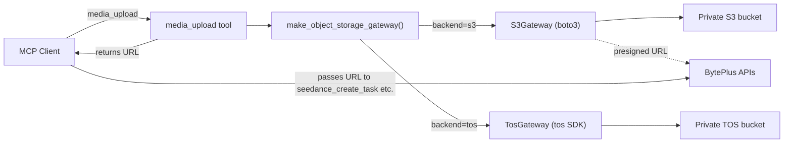
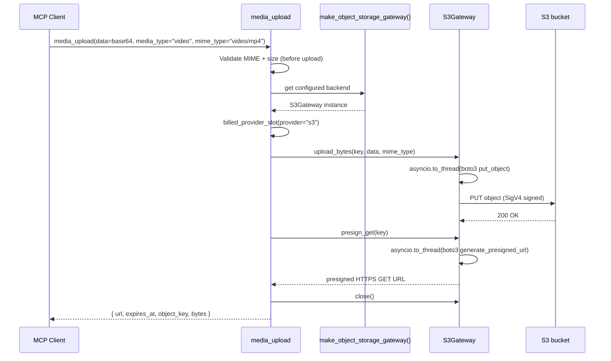
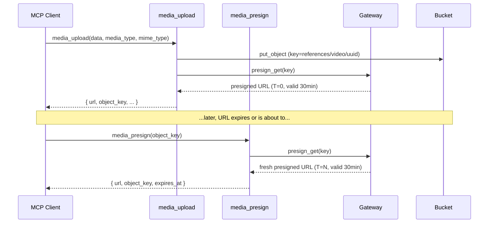

# S3 Object Storage

The `media_upload` and `media_presign` tools manage media in a **private**
object-storage bucket. `media_upload` accepts media (images, audio, video)
from MCP clients and uploads it; `media_presign` generates a fresh presigned
URL for an existing object without re-uploading. The server generates presigned
HTTPS GET URLs that BytePlus generation APIs fetch when processing references.
This is the integrated upload path for media that cannot be inlined as Base64
— most notably Seedance video references, which are URL-only.

Amazon S3 is one of two supported backends. The other is BytePlus TOS,
which is the default. Both implement the same `ObjectStorageGateway`
protocol, so the `media_upload` tool works identically regardless of
which backend is active. Only one backend is active per process, selected
at startup by `OBJECT_STORAGE_BACKEND`.

> See [configuration.md](configuration.md#object-storage-tos-or-s3-optional)
> for the full env-var reference and [api-keys.md](api-keys.md#s3-backend)
> for credential acquisition. This document covers architecture, security,
> and setup.

## How it works

### Architecture



The `S3Gateway` (`providers/s3/client.py`) wraps a synchronous `boto3`
client behind async-friendly methods using `asyncio.to_thread`, mirroring
`TosGateway`. All SDK exceptions (`botocore.exceptions.ClientError`) are
normalized into `ProviderError` so the retry policy and error-result
helpers work uniformly across both backends.

### Upload and presign sequence



### Object key generation

Object keys are **server-generated**, never user-controlled:

```text
references/{media_type}/{uuid4}
```

- `media_type` — `image`, `audio`, or `video`
- `uuid4` — a random UUIDv4, preventing collisions and path traversal
- `key_prefix` — the caller may optionally override `references` with an
  alphanumeric + `-_/` prefix, validated by an allowlist

This prevents path traversal attacks where a malicious key could write
outside the intended prefix.

### Presigned URLs

The bucket stays **private**. No objects are made public. The
`S3Gateway.presign_get()` method calls `boto3.generate_presigned_url(
"get_object", ...)` with a SigV4 signature embedded in the query string.
This grants temporary GET access to a single object without exposing
credentials.

| Setting | Default | Range | Meaning |
|---|---|---|---|
| `S3_PRESIGN_TTL_SECONDS` | `1800` (30 min) | 60–604800 (1 min – 7 days) | How long the presigned URL remains valid |

The default of **30 minutes** balances security and reliability: the
presigned URL is a bearer token — anyone who obtains it can download the
object until it expires. Thirty minutes is enough time for BytePlus APIs to
fetch references under queue load or cold-start conditions, while still
expiring fast enough that leaked URLs are short-lived. The TOS backend
defaults to 30 minutes (`TOS_PRESIGN_TTL_SECONDS`); both backends use the same default.

### Re-presigning existing objects (`media_presign`)

When the same reference media is used across multiple generation calls spread
over time (e.g. several Seedance tasks throughout a day), re-uploading the
same file each time is wasteful. The `media_presign` tool generates a fresh
presigned URL for an existing object without re-uploading:



The tool accepts the `object_key` returned by a prior `media_upload` call,
validates it against a strict alphanumeric + `-_/` pattern (preventing path
traversal), and calls the same `presign_get` gateway method. No data is
transferred — only a new URL is minted. This works with both the TOS and S3
backends through the shared `ObjectStorageGateway` protocol.

The presigned URL is passed directly to BytePlus generation tools
(`seedance_create_task` video references, `seedream_edit_image` reference
images, `seed_audio_generate` audio references). Your S3 bucket must be
reachable from BytePlus endpoints — if it is behind a restrictive firewall
or VPC, the presigned URL will not resolve and the generation will fail.

### Error handling and retry

`S3Gateway` normalizes `botocore.exceptions.ClientError` into
`ProviderError` with a `retryable` flag:

| Condition | Retryable | Rationale |
|---|---|---|
| HTTP 5xx | Yes | Server-side transient errors |
| HTTP 429 | Yes | Throttling |
| Connection error (no `HTTPStatusCode`) | Yes | Network-level transient; parity with TOS `TosClientError` |
| HTTP 4xx (non-429) | No | Client-side errors (bad key, permissions) |
| Unknown exception | Yes | Fail-open for safety on unexpected errors |

All upload calls go through `call_with_retry`, which respects the
`retryable` flag with exponential backoff.

### S3-compatible storage

The gateway supports any S3-compatible storage via `S3_ENDPOINT`. When an
endpoint is set, `BotoConfig` automatically enables **path-style
addressing** (`s3={"addressing_style": "path"}`), which most S3-compatible
hosts require.

| Storage | `S3_ENDPOINT` | Path-style | Notes |
|---|---|---|---|
| Native AWS S3 | empty | No (virtual-host) | Default; no extra config needed |
| MinIO | `http://localhost:9000` | Yes | Set for local development |
| Cloudflare R2 | `https://<account>.r2.cloudflarestorage.com` | Yes | |
| TOS via boto3 | `https://tos-<region>.bytepluses.com` | Yes | Alternative to the `tos` SDK backend |

## Security model

### Credentials

S3 credentials are **startup configuration only**, loaded from environment
variables at process start. They are never accepted as tool arguments,
never logged, and never included in MCP responses.

| Property | Enforcement |
|---|---|
| Loaded from | `S3_ACCESS_KEY`, `S3_SECRET_KEY` env vars (or `.env`) |
| Passed as tool args | Never — `media_upload` has no credential fields |
| Validation | AK and SK must both be set or both empty (`config/env.py`) |
| Fail-closed | `OBJECT_STORAGE_BACKEND=s3` without AK + SK + bucket raises at startup |
| IAM rotation | Rotate AK/SK by updating `.env` and restarting the process |

The `boto3` client is constructed with `signature_version="s3v4"` (AWS
Signature Version 4) for all operations. Uploads (`put_object`,
`upload_file`) authenticate with your AK/SK — **no bucket-level public
read access is needed**.

### Bucket privacy

**Keep your bucket private.** The server never makes objects public and
never sets a public-read ACL. Access is exclusively through:

1. **Authenticated uploads** — the `boto3` client signs `put_object` /
   `upload_file` requests with SigV4.
2. **Presigned GET URLs** — temporary, time-limited, per-object read
   access with an embedded signature.

Enable **S3 Block Public Access** on your bucket to prevent accidental
public exposure:

```bash
aws s3api put-public-access-block \
  --bucket your-bucket-name \
  --public-access-block-configuration \
  BlockPublicAcls=true,IgnorePublicAcls=true,BlockPublicPolicy=true,RestrictPublicBuckets=true
```

### Upload validation

The `media_upload` tool validates input **before** uploading:

| Check | Enforcement | Code |
|---|---|---|
| **MIME allowlist** | Only specific formats accepted per media type | `security/media_policy.py` |
| **Size limit (Base64)** | Pre-check decoded size without full decode | `check_base64_size()` |
| **Size limit (file)** | `path.stat().st_size` checked before upload | `tools/media_upload.py` |
| **Object key** | Server-generated UUID; not user-controlled | `tools/media_upload.py` |
| **key_prefix** | Alphanumeric + `-_/` only | `_validate_key_prefix()` |
| **file_path** | Restricted to `stdio` transport only | `tools/media_upload.py` |

Allowed MIME types:

| Category | MIME types |
|---|---|
| Image | `image/jpeg`, `image/jpg`, `image/png`, `image/webp` |
| Audio | `audio/wav`, `audio/x-wav`, `audio/wave`, `audio/mpeg`, `audio/mp3`, `audio/pcm`, `audio/x-pcm`, `audio/ogg`, `audio/ogg;codecs=opus`, `audio/webm`, `audio/flac`, `audio/x-flac` |
| Video | `video/mp4`, `video/quicktime`, `video/x-matroska` |

Size limits (applied before upload):

| Media type | Max bytes |
|---|---|
| Image | 10 MiB |
| Audio | 10 MiB |
| Video | 200 MiB |

### Transport restrictions

`file_path` input is available **only in stdio transport**. Over HTTP,
only Base64 `data` is accepted. This prevents remote clients from reading
arbitrary files on the server host:

```python
if input.file_path is not None:
    if settings.mcp_transport != "stdio":
        raise ValueError(
            "file_path input is only supported in stdio transport mode for security."
        )
```

### JWT scope

In JWT auth mode, the `media_upload` tool requires the `media:upload`
scope. See [security.md](security.md#scope-taxonomy).

## Setup guide

### 1. Create an S3 bucket (if not already done)

```bash
aws s3api create-bucket \
  --bucket your-bucket-name \
  --region us-east-1 \
  --create-bucket-configuration LocationConstraint=us-east-1
```

> If your account is in a different region, replace `us-east-1` and set
> `LocationConstraint` accordingly. For `us-east-1` (N. Virginia), omit
> `--create-bucket-configuration` entirely.

Enable Block Public Access:

```bash
aws s3api put-public-access-block \
  --bucket your-bucket-name \
  --public-access-block-configuration \
  BlockPublicAcls=true,IgnorePublicAcls=true,BlockPublicPolicy=true,RestrictPublicBuckets=true
```

### 2. Create an IAM access key

Create an IAM user (or use an existing one) with `s3:PutObject` and
`s3:GetObject` permissions on the bucket:

```json
{
  "Version": "2012-10-17",
  "Statement": [
    {
      "Effect": "Allow",
      "Action": ["s3:PutObject", "s3:GetObject"],
      "Resource": "arn:aws:s3:::your-bucket-name/*"
    }
  ]
}
```

Create an access key pair and copy both the Access Key ID and Secret
Access Key immediately — the secret is shown once.

> **Least privilege:** the server only needs `PutObject` and
> `GetObject` on the bucket. It does not need `ListBucket`, `DeleteObject`,
> or bucket-level permissions. Do not grant broader access than necessary.

### 3. Configure `.env`

Add the S3 variables to your `.env` file:

```dotenv
# --- S3 object storage ---
S3_ACCESS_KEY=your-access-key-id
S3_SECRET_KEY=your-secret-access-key
S3_BUCKET=your-bucket-name
S3_REGION=us-east-1

# Leave empty for native AWS S3. Set for S3-compatible storage:
# S3_ENDPOINT=http://localhost:9000

# Presigned URL validity in seconds (default: 1800 = 30 minutes)
S3_PRESIGN_TTL_SECONDS=1800

# Select S3 as the active backend (default is tos)
OBJECT_STORAGE_BACKEND=s3
```

### 4. Verify configuration

Check that the settings are valid:

```bash
make check-env
```

Start the server and verify the health resource reports S3 as active:

```bash
make dev
```

The `seed-health://status` MCP resource should show:

```text
S3 configured: True
Object storage backend: s3
```

### 5. Test the upload

Use the MCP Inspector to test interactively:

```bash
make inspect
```

Call `media_upload` with a small test image:

```json
{
  "media_type": "image",
  "mime_type": "image/png",
  "data": "<base64-encoded-png>"
}
```

The response should include a presigned URL, expiry timestamp, object key,
and byte count. Verify the URL resolves by opening it in a browser or
fetching it with `curl`.

## S3-compatible storage setup

### MinIO (local development)

```bash
# Start MinIO
docker run -d -p 9000:9000 -p 9001:9001 \
  -e MINIO_ROOT_USER=minioadmin \
  -e MINIO_ROOT_PASSWORD=minioadmin \
  minio/minio server /data --console-address ":9001"

# Create a bucket (via the console at http://localhost:9001)
```

Configure `.env`:

```dotenv
S3_ACCESS_KEY=minioadmin
S3_SECRET_KEY=minioadmin
S3_BUCKET=test-bucket
S3_REGION=us-east-1
S3_ENDPOINT=http://localhost:9000
OBJECT_STORAGE_BACKEND=s3
```

### Cloudflare R2

```dotenv
S3_ACCESS_KEY=your-r2-access-key-id
S3_SECRET_KEY=your-r2-secret-access-key
S3_BUCKET=your-r2-bucket
S3_REGION=auto
S3_ENDPOINT=https://<account-id>.r2.cloudflarestorage.com
OBJECT_STORAGE_BACKEND=s3
```

## Operational notes

### Object lifecycle

The server does **not** auto-delete uploaded objects. Configure a bucket
lifecycle rule to expire objects under the `references/` prefix to control
storage cost over time:

```bash
aws s3api put-bucket-lifecycle-configuration \
  --bucket your-bucket-name \
  --lifecycle-configuration '{
    "Rules": [
      {
        "ID": "expire-references",
        "Filter": { "Prefix": "references/" },
        "Status": "Enabled",
        "Expiration": { "Days": 7 }
      }
    ]
  }'
```

Adjust the `Days` value based on your usage pattern. Seven days is a
reasonable default — presigned URLs expire in 30 minutes, but the
underlying objects remain in the bucket until the lifecycle rule cleans
them up.

### Encryption

The `boto3` client does not explicitly set server-side encryption headers
on `put_object`. Encryption behavior depends on your bucket settings:

| Setting | Behavior |
|---|---|
| Default (no bucket policy) | SSE-S3 (Amazon-managed keys) applied automatically by S3 |
| SSE-KMS bucket policy | Enforced by bucket policy; the IAM key must have `kms:GenerateDataKey` |
| SSE-C | Not supported (the server does not pass customer-managed keys) |

To enforce SSE-KMS, apply a bucket policy that denies unencrypted
uploads. The server will inherit the encryption without code changes.

### TLS in transit

`boto3` uses HTTPS by default for all S3 operations. For S3-compatible
storage with self-signed certificates (e.g. local MinIO), you may need to
disable certificate verification — but this should only be done in local
development, never in production.

### Audit and monitoring

- **CloudTrail** — enable S3 data events on the bucket to log all
  `PutObject` and `GetObject` calls, including presigned URL access.
- **S3 access logs** — an alternative to CloudTrail for access logging.
- **CloudWatch alarms** — alert on anomalous upload volume or error rates.

### Concurrency

The server enforces a process-wide concurrency limit per provider
(`PROVIDER_MAX_CONCURRENCY`, default 5). When `OBJECT_STORAGE_BACKEND=s3`,
uploads count against the `"s3"` provider slot, not the `"tos"` slot.
This means TOS and S3 uploads have independent concurrency pools.

## Environment variable reference

| Variable | Default | Required | Purpose |
|---|---|---|---|
| `S3_ACCESS_KEY` | empty | Yes (when backend=s3) | AWS access key ID |
| `S3_SECRET_KEY` | empty | Yes (when backend=s3) | AWS secret access key |
| `S3_BUCKET` | empty | Yes (when backend=s3) | Target bucket name |
| `S3_REGION` | `us-east-1` | No | AWS region |
| `S3_ENDPOINT` | empty | No | Custom endpoint for S3-compatible storage |
| `S3_PRESIGN_TTL_SECONDS` | `1800` | No | Presigned URL validity (60–604800 seconds) |
| `OBJECT_STORAGE_BACKEND` | `tos` | No | Select active backend: `tos` or `s3` |

Validation rules (enforced at startup):

- `S3_ACCESS_KEY` and `S3_SECRET_KEY` must both be set or both be empty.
- `S3_BUCKET` is required when S3 credentials are set.
- `OBJECT_STORAGE_BACKEND=s3` requires all three: AK, SK, and bucket.
- If S3 credentials are set but `OBJECT_STORAGE_BACKEND=tos` and TOS
  credentials are missing, the server raises a guidance error pointing you
  to set `OBJECT_STORAGE_BACKEND=s3`.

## Where to read more

## Tools

Both tools are registered when `has_object_storage` is true (either TOS or S3
credentials are configured). They work identically with either backend.

| Tool | Scope | Description |
|---|---|---|
| `media_upload` | `media:upload` | Upload media (Base64 or file), return presigned URL + object key |
| `media_presign` | `media:presign` | Generate a fresh presigned URL for an existing object key |

## Where to read more

| Topic | Document |
|---|---|
| Full env-var reference | [configuration.md](configuration.md) |
| Credential acquisition | [api-keys.md](api-keys.md) |
| Consolidated security model | [security.md](security.md) |
| Durable artifact lifecycle | [artifacts.md](artifacts.md) |
| Tool reference | [tools.md](tools.md) |
| Architecture overview | [architecture.md](architecture.md) |
| Design plan | [../plans/PLAN_S3_OBJECT_STORAGE.md](../plans/PLAN_S3_OBJECT_STORAGE.md) |
