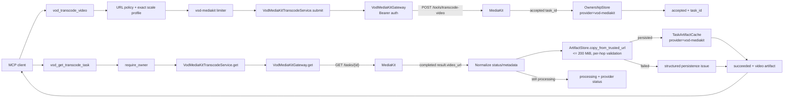

<!-- markdownlint-disable MD013 MD025 -->

# BytePlus VOD AI MediaKit Video Transcoding Implementation Plan

> **Status note (2026-08-14):** Implemented. Tasks 1–5 shipped; validation (817
> tests, ruff, mypy, detect-secrets) is green apart from two pre-existing
> environmental failures in `test_seedance_2_5_tool.py` caused by the local
> `.env` carrying a real Seedance 2.5 binding — unrelated to this feature.

**Goal:** Add a safe, typed, **submit-then-poll** MCP tool pair — `vod_transcode_video` and `vod_get_transcode_task` — that lets clients transcode a public video through the BytePlus VOD AI MediaKit Bearer convenience surface, starting with the verified portrait-to-720x720 scale profile, and best-effort persists completed outputs as durable `seed-media://` video artifacts under the existing 200 MiB policy.

## Source Context

- User request: integrate the supplied `POST https://mediakit.ap-southeast-1.bytepluses.com/api/v1/tools/transcode-video` + `GET /api/v1/tasks/{task_id}` workflow. The quickstart verifies a portrait-to-square (720x720) example using `video: { scale_type: 2, scale_width: 720, scale_height: 720, scale_mode: 2 }`, async acceptance (`{ success, task_id, request_id }`), and a completed task shape with `result.video_url` (24-hour lifetime) and epoch timestamps.
- User decisions: (1) initial surface = **verified scale profile + gated extras**; (2) Task 1 may run **one sanctioned low-cost probe** on a short non-sensitive clip.
- **Task 1 resolution (2026-08-14):** the full contract was verified from the official AI MediaKit API reference (rendered via the zh-CN/zh-TW variants, which carry identical English content and were cross-confirmed on two pages). The `video` object fields (`codec`, `scale_*`, `bitrate_*`, `fps`/`fps_mode`, `is_hdr_to_sdr`), top-level `container_format`, statuses (`running`/`completed`/`failed`), task result/error shapes, 24h URL lifetime, and `client_token` idempotency are all **confirmed** — so the extras are de-gated and **no billable probe is required** for the field contract. `queue_id`/`Project` as request parameters remain unverified and are **not** exposed. The output URL hostname remains unverified (persistence stays best-effort).
- Docs/specs read: `AGENTS.md`, `plans/PLAN_BYTEPLUS_VOD_AI_MEDIAKIT_VIDEO_ENHANCEMENT.md`, `specs/SPEC_VOD_MEDIAKIT_PROVIDER_CONTRACT.md`, `README.md`, `docs/tools.md`, `docs/api-reference.md`, `.agents/skills/modelark-mcp/SKILL.md`.
- Code inspected: `src/modelark_mcp/providers/vod_mediakit/client.py`, `schemas.py`, `enhancement.py`, `__init__.py`; `src/modelark_mcp/tools/vod_enhance_video.py`, `_errors.py`, `seedance_get_task.py`; `src/modelark_mcp/providers/base.py`, `retry.py`; `src/modelark_mcp/runtime.py`; `src/modelark_mcp/server.py`; `src/modelark_mcp/config/env.py`; `src/modelark_mcp/security/http_auth.py`; `tests/contract/test_vod_mediakit_adapter.py`; `tests/integration/test_vod_enhancement_tool.py`, `test_mcp_conformance.py`.
- External research: the official BytePlus VOD transcoding-template guide lists the console parameter space (codecs H.264/H.265; containers MP4/DASH/HLS/FLV/TS; resolutions 240p-4k; scaling modes; bitrate 10-50000 Kbps; fps 1-60), but the **convenience endpoint's `video` object field names** for those are not exposed by the JS-rendered docs. Only the quickstart `scale_*` fields are verified.
- Secret handling: only `BYTEPLUS_VOD_MEDIAKIT_API_KEY` is used; it must never be logged, embedded in fixtures, or accepted as a tool argument.

## Verified Facts, Provisional Assumptions, and Gaps

| Classification | Item | Implementation consequence |
| --- | --- | --- |
| Verified from supplied quickstart | `POST /tools/transcode-video` accepts Bearer auth and a JSON body with `video_url` plus a `video` object containing `scale_type`, `scale_width`, `scale_height`, `scale_mode`. The sample `scale_type: 2`, `scale_mode: 2` converts a portrait video to 720x720 with black-bar padding. | Ship the exact verified scale profile as the default. |
| Verified from supplied quickstart | Submission is asynchronous: `{ success: true, task_id, request_id }`. | `vod_transcode_video` returns `accepted` with the task ID, records ownership under provider `vod-mediakit`. |
| Verified from supplied quickstart | `GET /tasks/{task_id}` polls; a completed response is `{ success, task_id, task_type: "transcode-video", status: "completed", result: { duration, resolution, video_codec, video_url }, expires_at, created_at, finished_at, request_id, queue_id }`. | `vod_get_transcode_task` maps `completed` → `succeeded`, persists `result.video_url`. |
| Verified from supplied quickstart | `result.video_url` is valid 24 hours by default. | Durable persistence window: copy within expiry; after expiry return a non-retryable `source_expired` issue. |
| Verified from supplied quickstart | `expires_at` / `created_at` / `finished_at` are **unix epoch seconds** (e.g. `1780472196`), not ISO-8601. | New transcode task DTO accepts both epoch-int and ISO-8601 and normalizes to ISO-8601 UTC for MCP output. Do not reuse the enhancement result validator, which requires ISO-8601. |
| Verified from official docs (2026-08-14) | `video` object: `codec` (h264/h265), `scale_type` (0=source,1=short/long,2=width/height), `scale_mode` (0=no upsample,1=stretch,2=letterbox), `scale_width`/`scale_height` ([0,4320], type=2), `scale_short`/`scale_long` (type=1), `bitrate_mode` (crf/abr/cbr), `bitrate_crf` [0,51], `bitrate_kbps` [10,50000], `fps` [1,240], `fps_mode` (vfr/cfr), `is_hdr_to_sdr`. Top-level: `video_url`, `container_format` (MP4/FLV/MPEGTS), optional `audio`/metadata/`client_token`/callbacks. | Expose the full confirmed `video` + `container_format` surface; do not expose `audio`/metadata/callbacks in the initial tool. |
| Verified from official docs (2026-08-14) | Statuses are only `running`/`completed`/`failed`; `queued`/`expired`/`cancelled` are not documented. Task error shape: `{code, message, param, type}` with `type` TaskError/ApiError. | Map `running`→processing, `completed`→succeeded, `failed`→failed; any other value fails closed as `INVALID_RESPONSE`. No queued/expired/cancelled statuses exposed. |
| Verified from official docs (2026-08-14) | `client_token` (≤64 printable ASCII) forces idempotency; without it a default key (account + core params, 24h window) deduplicates. | POST timeout remains ambiguous and is not blindly retried by the adapter, but re-submission with the same body/token is documented as safe for the user. Not exposed in the initial tool. |
| Unverified | `queue_id` / `Project` as request parameters; the output URL hostname and every redirect hop. | Do not expose `queue_id`/`Project`. Durable persistence remains best-effort; a succeeded output may report `persistence="failed"` / `untrusted_output_host` until a host is observed. |
| Provisional | Other status values (`queued`, `running`, `failed`, `expired`, `cancelled`) exist but are not shown in the quickstart sample. | Normalize to the shared `SeedanceTaskStatus`-style vocabulary; unknown non-terminal statuses map to `processing` with the raw provider label preserved. Task 1 confirms the real set. |
| Gated (Task 1) | Codec/bitrate/fps/container field names for the `video` object (e.g. `video_codec`, `bitrate`, `fps`, `container`). | Not exposed until confirmed by the sanctioned probe or official docs. The tool schema reserves a clear path to add them as optional fields once verified. |
| Gated (Task 1) | Whether a `task_id`-scoped task body carries an `error` detail and whether cancellation/list endpoints exist. | No cancel/list tools in the initial surface. Error handling uses the existing MediaKit error envelope normalization. |
| Verified from current code | `VodMediaKitGateway` currently exposes only `post`; `BaseHttpGateway._request` supports any method. | Add a `get` method to the gateway for polling. |
| Verified from current code | `vod-mediakit` provider key, limiter, and `byteplus-vod-mediakit` `ProviderName` already exist; ownership/cache stores are already provider-scoped. | No shared-runtime migration and no new environment variables. Reuses `BYTEPLUS_VOD_MEDIAKIT_API_KEY` + base URL. |
| Verified from current code | Provider artifact URLs are revalidated per redirect hop and capped at 200 MiB by `SafeDownloader`/`FilesystemArtifactStore`. | Best-effort persistence with structured `persistence` outcome; provider success is never erased by a local persistence failure. |
| Missing provider contract | Retry/idempotency guarantees for the transcode POST, exact non-`completed` statuses, terminal error shape, task retention, and whether extra `video` fields are accepted. | POST stays non-idempotent and is never blindly retried on timeout/5xx (ambiguous completion). GET is retryable only on provider-marked retryable errors (429). |

## Architecture Decision

Reuse the existing `byteplus-vod-mediakit` provider boundary and its Bearer gateway, `vod-mediakit` limiter, provider-scoped ownership store, and task-artifact cache. Add a second adapter (`VodMediaKitTranscodeService`) that mirrors the enhancement service but exposes both `submit` (POST) and `get` (GET for polling), because — unlike enhancement — the transcode surface has a documented task-status endpoint. Two tools are registered under the same `has_vod_mediakit` gate:

1. `vod_transcode_video` (submit; `vod:transcode` scope) — validates the source URL, submits the exact verified scale profile, records task ownership, returns `accepted` + `task_id`.
2. `vod_get_transcode_task` (poll; `vod:read` scope) — requires ownership, calls `GET /tasks/{task_id}`, maps `completed` → `succeeded`, best-effort persists `result.video_url` into the artifact store (once, cached under provider `vod-mediakit`), and returns normalized status/metadata.

The full confirmed `video`/`container_format` surface ships in the submit tool (codec, scaling, bitrate, fps, HDR). Cost estimation stays `null` until the convenience-endpoint billing mapping is confirmed (consistent with enhancement). No cancel, list, or variations tools are added in this unit.



## Proposed MCP Contract

### Tool: `vod_transcode_video`

```python
class VodTranscodeVideoOptions(BaseModel):
    """Transcode ``video`` object; fields and enums verified from official docs 2026-08-14."""
    codec: Literal["h264", "h265"] = Field(
        default="h264", description="Output video codec: h264 or h265."
    )
    scale_type: Literal[0, 1, 2] = Field(
        default=2,
        description="Scaling mode: 0 = follow source (no scaling), 1 = long/short-side limit, 2 = width/height limit.",
    )
    scale_mode: Literal[0, 1, 2] = Field(
        default=2,
        description="Aspect-ratio handling when scale_type is 1 or 2: 0 = no upsampling (shrink only), 1 = stretch to target, 2 = letterbox with black-bar padding.",
    )
    scale_width: int | None = Field(
        default=None, ge=0, le=4320,
        description="Target output width in pixels; only when scale_type=2. If only width or height is given, the other scales proportionally.",
    )
    scale_height: int | None = Field(
        default=None, ge=0, le=4320,
        description="Target output height in pixels; only when scale_type=2.",
    )
    scale_short: int | None = Field(
        default=None, ge=0, le=4320,
        description="Target short side in pixels; only when scale_type=1.",
    )
    scale_long: int | None = Field(
        default=None, ge=0, le=4320,
        description="Target long side in pixels; only when scale_type=1.",
    )
    bitrate_mode: Literal["crf", "abr", "cbr"] = Field(
        default="crf", description="Bitrate control: crf (quality), abr (average bitrate), cbr (constant bitrate).",
    )
    bitrate_crf: int = Field(
        default=25, ge=0, le=51,
        description="CRF quality level [0,51]; 0 is lossless; only used when bitrate_mode=crf.",
    )
    bitrate_kbps: int = Field(
        default=2000, ge=10, le=50000,
        description="Bitrate in kbps [10,50000]; crf = max limit, abr = average target, cbr = constant target.",
    )
    fps_mode: Literal["vfr", "cfr"] = Field(
        default="vfr",
        description="Frame-rate mode; only takes effect after fps is set: vfr (max limit), cfr (forced constant).",
    )
    fps: int | None = Field(
        default=None, ge=1, le=240,
        description="Target frame rate [1,240]; if unset the source frame rate is kept.",
    )
    is_hdr_to_sdr: bool = Field(
        default=True, description="Convert HDR input to SDR; false keeps HDR."
    )

    @model_validator(mode="after")
    def _validate_scale_fields(self) -> "VodTranscodeVideoOptions":
        if self.scale_type == 2 and self.scale_width is None and self.scale_height is None:
            raise ValueError("scale_type=2 requires scale_width and/or scale_height")
        if self.scale_type == 1 and self.scale_short is None and self.scale_long is None:
            raise ValueError("scale_type=1 requires scale_short and/or scale_long")
        if self.scale_type == 0:
            for name in ("scale_width", "scale_height", "scale_short", "scale_long"):
                if getattr(self, name) is not None:
                    raise ValueError(f"{name} is ignored when scale_type=0")
        if self.scale_type != 2 and (self.scale_width is not None or self.scale_height is not None):
            raise ValueError("scale_width/scale_height require scale_type=2")
        if self.scale_type != 1 and (self.scale_short is not None or self.scale_long is not None):
            raise ValueError("scale_short/scale_long require scale_type=1")
        return self

class VodTranscodeVideoInput(BaseModel):
    video_url: HttpsUrl = Field(
        description="Public HTTPS source-video URL that BytePlus can fetch. Private and link-local destinations are rejected."
    )
    container_format: Literal["MP4", "FLV", "MPEGTS"] = Field(
        default="MP4", description="Output container format: MP4 (default), FLV, or MPEGTS."
    )
    video: VodTranscodeVideoOptions = Field(
        default_factory=VodTranscodeVideoOptions,
        description="Transcoding options for the output video (codec, scaling, bitrate, frame rate, HDR). Defaults reproduce the verified portrait-to-720x720 letterbox profile.",
    )
    persist: bool = Field(
        default=True,
        description="Whether a later completed poll should copy the output into the durable MCP artifact store.",
    )

class VodTranscodeVideoOutput(BaseModel):
    provider: Literal["byteplus-vod-mediakit"] = Field(
        default="byteplus-vod-mediakit", description="Provider surface that processed the request."
    )
    status: Literal["accepted"] = Field(
        description="Always 'accepted': the transcode task is asynchronous."
    )
    request_id: str | None = Field(
        default=None, description="Provider diagnostic request ID, when returned."
    )
    provider_log_id: str | None = Field(
        default=None, description="Provider x-tt-logid diagnostic identifier, when returned."
    )
    task_id: str = Field(
        description="Provider task ID to pass to vod_get_transcode_task for polling."
    )
    recommended_poll_after_ms: int = Field(
        description="Server-side suggested poll delay; a heuristic, not a provider guarantee."
    )
```

Tool annotations (submit): `readOnlyHint=false`, `destructiveHint=false`, `idempotentHint=false`, `openWorldHint=true`. HTTP scope: `vod:transcode`.

### Tool: `vod_get_transcode_task`

```python
class VodGetTranscodeTaskInput(BaseModel):
    task_id: str = Field(
        description="Task ID returned by vod_transcode_video."
    )
    persist_output: bool = Field(
        default=True,
        description="Whether to copy a completed output into durable artifact storage on first successful poll.",
    )

class VodTranscodeTaskOutput(BaseModel):
    provider: Literal["byteplus-vod-mediakit"] = Field(
        default="byteplus-vod-mediakit", description="Provider surface that processed the request."
    )
    task_id: str = Field(description="Provider task ID.")
    status: Literal["processing", "succeeded", "failed"] = Field(
        description="Normalized transcode state: processing until the provider reports completed, then succeeded or failed. queued/expired/cancelled are not documented by the provider.",
    )
    provider_status: str | None = Field(
        default=None, description="Raw provider status label, when returned."
    )
    request_id: str | None = Field(
        default=None, description="Provider diagnostic request ID, when returned."
    )
    duration_seconds: float | None = Field(
        default=None, description="Output duration in seconds, when reported by the completed result."
    )
    resolution: str | None = Field(
        default=None, description="Output resolution label (e.g. '720p'), when reported."
    )
    video_codec: str | None = Field(
        default=None, description="Output video codec label (e.g. 'h264'), when reported."
    )
    created_at: str | None = Field(
        default=None, description="ISO-8601 task creation time normalized from the provider response."
    )
    finished_at: str | None = Field(
        default=None, description="ISO-8601 task completion time normalized from the provider response."
    )
    video: ArtifactRef | None = Field(
        default=None, description="Durable transcoded-video artifact when best-effort persistence succeeds."
    )
    source_url: HttpsUrl | None = Field(
        default=None, description="Expiring provider output URL for a succeeded task; preserved even when durable persistence is skipped or fails."
    )
    source_expires_at: str | None = Field(
        default=None, description="ISO-8601 expiry for source_url, normalized from the provider's expires_at."
    )
    persistence: Literal["not_applicable", "not_requested", "persisted", "failed"] = Field(
        description="Outcome of durable artifact persistence, independent of provider success."
    )
    persistence_issue: VodArtifactPersistenceIssue | None = Field(
        default=None, description="Safe explanation when a succeeded output could not be persisted durably."
    )
    error: VodTranscodeTaskFailure | None = Field(
        default=None, description="Provider failure code and safe message for failed/expired tasks."
    )

class VodTranscodeTaskFailure(BaseModel):
    code: str | None = Field(default=None, description="Provider failure code, when returned.")
    message: str = Field(description="Safe provider failure explanation without credentials or signed URLs.")
```

`VodArtifactPersistenceIssue` is reused from `vod_enhance_video.py` (same codes and limits). Tool annotations (poll): `readOnlyHint=true`, `destructiveHint=false`, `idempotentHint=true`, `openWorldHint=false`. HTTP scope: `vod:read`.

**Output invariants** (enforced by a Pydantic model validator on `VodTranscodeTaskOutput`):

- `processing`: `source_url` and `video` are `None`; `persistence` is `not_applicable`.
- `succeeded`: `source_url` is always present; `persistence="persisted"` requires `video` and forbids `persistence_issue`; `persistence="failed"` requires `persistence_issue` and permits `video=None`; `persistence="not_requested"` forbids both.
- `failed`: `error` is required; `source_url` and `video` are `None`; `persistence` is `not_applicable`.

`source_url` is returned to the authorized caller but never logged, cached in plaintext telemetry, or included in error messages.

### Confirmed extras (de-gated by Task 1)

Task 1 verified the full `video` object and `container_format` from official docs (2026-08-14), so the extras are shipped in the initial surface, not gated. `audio`, metadata tags, `client_token`, `callback_url`/`callback_args`, `queue_id`, and `Project` are **not** exposed in the initial tool (audio/metadata/callbacks are YAGNI; `queue_id`/`Project` are unverified).

## Configuration Contract

No new environment variables. Both tools register when `settings.has_vod_mediakit` (i.e. `BYTEPLUS_VOD_MEDIAKIT_API_KEY` set), using the existing `BYTEPLUS_VOD_MEDIAKIT_BASE_URL`. The gateway already reads both from settings; the transcode adapter uses the same `VodMediaKitGateway`.

## File Ownership

| Path | Owner | Responsibility | Notes |
| --- | --- | --- | --- |
| `plans/PLAN_BYTEPLUS_VOD_AI_MEDIAKIT_VIDEO_TRANSCODING.md` | Main agent | Source of implementation decisions | This plan. |
| `specs/SPEC_VOD_MEDIAKIT_PROVIDER_CONTRACT.md` | Main agent | Add verified transcode request, acceptance, and task-status contract | Extend the existing spec; Task 1 evidence freezes it. |
| `src/modelark_mcp/providers/vod_mediakit/client.py` | Provider worker | Add `get(path, ...)` to `VodMediaKitGateway` | Trivial addition next to `post`. |
| `src/modelark_mcp/providers/vod_mediakit/schemas.py` | Provider worker | Transcode request DTOs, task DTOs (epoch-aware timestamps), normalized `TranscodeSubmission`/`TranscodeTask` | Internal-only DTOs; do not reuse enhancement's ISO-8601-only validator. |
| `src/modelark_mcp/providers/vod_mediakit/transcode.py` | Provider worker | `VodMediaKitTranscodeService.submit` / `.get` normalization | New file mirroring `enhancement.py`. |
| `src/modelark_mcp/providers/vod_mediakit/__init__.py` | Provider worker | Export new service/DTOs | Small additive edit. |
| `src/modelark_mcp/tools/vod_transcode_video.py` | Tool worker | Submit tool: models, URL guard, ownership, accepted output | Depends on service. |
| `src/modelark_mcp/tools/vod_get_transcode_task.py` | Tool worker | Poll tool: ownership, status mapping, single-shot persistence, caching | Depends on service + artifact store. |
| `src/modelark_mcp/server.py` | Main agent | Register both tools under `has_vod_mediakit` with scopes `vod:transcode` / `vod:read` | Reuse the `vod_enhance_video` registration block. |
| `src/modelark_mcp/security/http_auth.py` | Main agent | No code change expected; `component_auth` accepts any scope string | Confirm `vod:transcode` scope needs no registration. |
| `src/modelark_mcp/artifacts/filesystem_store.py` | Main agent (fallback owner) | Add a Task-1-confirmed exact output host to the trusted-host policy only if the observed host falls outside the existing suffix policy | Expected to be already covered (`.bytepluses.com`/`.volces.com`); exact-host additions only with Task 1 evidence. |
| `tests/contract/test_vod_mediakit_transcode_adapter.py` | Provider worker | Sanitized HTTP fixtures: exact POST body, async acceptance, poll completed/processing/failed shapes, epoch timestamps, error normalization | New file; no real provider calls. |
| `tests/integration/test_vod_transcode_tool.py` | Tool worker | Submit, poll success/persistence, ownership, provider error, output invariants | New file; no real provider calls. |
| `tests/integration/test_mcp_conformance.py` | Main agent | Conditional inventory, schemas, annotations for both new tools | Extend existing tests. |
| `README.md`, `docs/tools.md`, `docs/api-reference.md`, `docs/security.md`, `docs/configuration.md`, `docs/architecture.md`, `.agents/skills/modelark-mcp/SKILL.md` | Docs worker | Shipped tool pair, scopes (`vod:transcode` / `vod:read`), verified profile, persistence semantics | Update only after code contract is settled. |

> **Shared model note:** `VodArtifactPersistenceIssue` currently lives in `src/modelark_mcp/tools/vod_enhance_video.py`. Reuse it from the new poll tool to avoid a tool→tool import; if the implementer prefers, promote it to a shared module (e.g. `tools/_vod_shared.py`) in the same unit of work.

## Implementation Tasks

### Task 1: Verify the Transcode Convenience-Endpoint Contract — COMPLETE (docs-based)

**Files:** read-only research + one sanctioned probe; main-agent-owned `specs/SPEC_VOD_MEDIAKIT_PROVIDER_CONTRACT.md`

**Depends on:** none.

**Can run in parallel with:** Task 2.

**Status (2026-08-14):** COMPLETE via official docs. A research pass rendered the JS-only API reference through the zh-CN/zh-TW variants (identical English content, cross-confirmed on two pages) and verified the full request body, `video`/`audio` objects, `container_format`, statuses (`running`/`completed`/`failed`), task result/error shapes, 24h URL lifetime, and `client_token` idempotency. The `specs/SPEC_VOD_MEDIAKIT_PROVIDER_CONTRACT.md` was updated with the transcode request and task contracts, and the stale "no polling" passages were reconciled. The sanctioned low-cost probe is **not required** for the field contract; it remains optional only to observe the live output URL hostname (for durable persistence) and the real completed response, and would require explicit owner approval with a stated maximum charge.

Remaining verified outputs from Task 1:
- `video` object: `codec`, `scale_type`, `scale_mode`, `scale_width`, `scale_height`, `scale_short`, `scale_long`, `bitrate_mode`, `bitrate_crf`, `bitrate_kbps`, `fps`, `fps_mode`, `is_hdr_to_sdr` (all enums/ranges confirmed).
- Top-level: `video_url`, `container_format` (MP4/FLV/MPEGTS), optional `audio`/metadata/`client_token`/callbacks.
- Statuses: `running`/`completed`/`failed` only. Task error: `{code, message, param, type}`.
- Unverified (not exposed): `queue_id`/`Project` request params; output URL hostname/redirect hops.

**Exit criterion:** met — the contract spec defines every transcode DTO field, status mapping, timestamp normalization, and the exact confirmed extras list.

### Task 2: Add the Transcode Gateway Method and Provider Adapter

**Files:** `src/modelark_mcp/providers/vod_mediakit/client.py`, `schemas.py`, `transcode.py`, `__init__.py`, `tests/contract/test_vod_mediakit_transcode_adapter.py`

**Depends on:** Task 1 contract spec (for exact DTO field set and gated extras); the scale-only core can proceed with the quickstart contract before the probe completes.

**Can run in parallel with:** Task 3 tool scaffolding after the service interface is frozen; Task 4 registration after schemas settle.

- [ ] Add `async def get(self, path: str, *, params: dict[str, Any] | None = None) -> httpx.Response` to `VodMediaKitGateway`, delegating to `_request("GET", path, params=params)`. Keep `follow_redirects=False` and per-hop validation behavior unchanged.
- [ ] Define strict outbound request DTOs with `extra="forbid"`: `VodMediaKitTranscodeRequest { video_url, video: VodMediaKitTranscodeVideoOptions }` and `VodMediaKitTranscodeVideoOptions` with the verified `scale_*` fields (plus Task-1-confirmed extras). Serialize only non-`None` fields.
- [ ] Define response DTOs with `extra="ignore"`: `VodMediaKitTranscodeAcceptedResponse` (reuse/alias the existing top-level `{ success, task_id, request_id }` acceptance), and `VodMediaKitTranscodeTaskResponse` with `status`, `result: { video_url, duration, resolution, video_codec } | None`, and **epoch-or-ISO-8601-aware** `expires_at`/`created_at`/`finished_at` (accept int epoch or ISO string; normalize to ISO-8601 UTC). Do not reuse `VodMediaKitProviderResult`, whose expiry validator requires ISO-8601.
- [ ] Implement `VodMediaKitTranscodeService.submit(request) -> TranscodeSubmission` (accepted task + IDs) and `VodMediaKitTranscodeService.get(task_id) -> TranscodeTask` (normalized status, result metadata, optional error). POST timeout/5xx → ambiguous, non-retryable; GET 429 → retryable; other 4xx → non-retryable. Use the existing `VodMediaKitGateway.normalize_error` / transport helpers.
- [ ] Contract-test with `respx`: exact POST path/headers/JSON (scale profile + `Project`-style aliasing if any), async acceptance, poll `completed` → succeeded with epoch timestamps normalized, `queued`/`running` → processing, terminal failure → failed with safe message, malformed 2xx → `INVALID_RESPONSE`, 429 retry hint, 5xx ambiguous, transport timeout, URL redaction in error messages.

### Task 3: Implement the Two MCP Tools

**Files:** `src/modelark_mcp/tools/vod_transcode_video.py`, `src/modelark_mcp/tools/vod_get_transcode_task.py`, `tests/integration/test_vod_transcode_tool.py`

**Depends on:** Task 2.

**Can run in parallel with:** Task 4 after output schemas are frozen.

- [ ] Implement every Pydantic field with accurate `Field(description=...)` and complete handler docstrings so MCP schemas stay self-describing (repo Tool Contract Rules).
- [ ] `vod_transcode_video`: require HTTPS source via `validate_url`, reject embedded credentials and local/private/link-local targets, never download the source locally. Acquire `runtime.provider_limiters.acquire("vod-mediakit", principal)` before POST. Call the service directly (no blind retry on ambiguous POST). On `accepted`, `ownership_store.record("vod-mediakit", task_id, owner)`, then return `VodTranscodeVideoOutput(status="accepted", ...)` with a server-side `recommended_poll_after_ms` (e.g. 3000) labeled as a heuristic. Provider errors return via `provider_error_result`.
- [ ] `vod_get_transcode_task`: call `ownership_store.require_owner("vod-mediakit", task_id, owner)`. Poll via `call_with_retry` (safe only for non-ambiguous, provider-marked-retryable GET errors). Map statuses: `completed` → `succeeded`; `failed` → `failed`; `expired` → `expired`; `cancelled` → `cancelled`; anything else → `processing` (preserving `provider_status`).
- [ ] On first `succeeded` poll with `persist_output=true`: check `task_artifact_cache.get("vod-mediakit", task_id)`; if cached, reuse the artifact (no re-download). Otherwise `artifact_store.copy_from_trusted_url(url=result.video_url, media_type=video, mime_type="video/mp4", source_expires_at=normalized expiry, auth=owner)`, then `task_artifact_cache.set("vod-mediakit", task_id, {"video": ref})` only on success. Never cache a persistence failure — a later poll may retry before expiry.
- [ ] Map post-success persistence exceptions into the existing `VodArtifactPersistenceIssue` codes (`untrusted_output_host`, `output_too_large`, `invalid_output_mime`, `source_expired`, `download_failed`, `storage_failed`). Return `status="succeeded"` + expiring `source_url` + `persistence="failed"` + safe issue; never return `isError=true` for a post-success failure.
- [ ] When the provider returns no `video_url` but `completed` (should not happen), fail closed with `INVALID_RESPONSE` rather than inventing a URL.
- [ ] `persist_output=false` → `persistence="not_requested"` with `source_url` preserved. Once `source_expires_at` passes, return a non-retryable `source_expired` persistence issue while preserving task-success metadata.
- [ ] Test: exact defaults, invalid URLs, missing credential behavior, concurrency path, accepted-task ownership, poll processing → succeeded, persisted artifact via the `seed-media://` resource with the owning principal, cross-provider task-ID isolation, `persist_output=false`, output invariants, every post-success persistence failure path, provider error result, and the absence of source URLs/credentials in logs and error messages.

### Task 4: Register, Secure, and Observe the Capability

**Files:** `src/modelark_mcp/server.py`, `tests/integration/test_mcp_conformance.py`

**Depends on:** frozen Task 3 schemas.

**Can run in parallel with:** Task 3 tests only after handler signatures are stable.

- [ ] Inside the existing `if settings.has_vod_mediakit:` block, register `vod_transcode_video` with `vod:transcode` scope and `vod_get_transcode_task` with `vod:read` scope, each with its `TOOL_ANNOTATIONS` and explicit `output_schema`.
- [ ] Extend conformance tests: the configured-server inventory includes both tools; `no_creds_server` excludes them; submit annotations (`openWorldHint=true`) and poll annotations (`readOnlyHint=true`, `idempotentHint=true`); every input/output field has a description; both tools absent without the MediaKit key.
- [ ] Verify logs, metrics, spans, and error text contain provider/operation/request ID but never the Authorization header, source query strings, signed URLs, or raw response bodies.

### Task 5: Update Shipped Documentation and Project Skill

**Files:** `README.md`, `docs/tools.md`, `docs/api-reference.md`, `docs/security.md`, `docs/configuration.md`, `docs/architecture.md`, `.agents/skills/modelark-mcp/SKILL.md`

**Depends on:** Tasks 1–4.

**Can run in parallel with:** final test execution; it must consume the frozen schema.

- [ ] Add both tools to the README capability table, `docs/api-reference.md` tool inventory + annotations tables, `docs/tools.md` reference sections, `docs/security.md` scope taxonomy, `docs/configuration.md` scope list, `docs/architecture.md` tool inventory/flow, and the project skill's tool inventory and examples.
- [ ] Document the verified scale profile (portrait → 720x720 with black-bar padding via `scale_mode: 2`), the submit-then-poll flow, JWT scopes (`vod:transcode` / `vod:read`), 24-hour `source_url` lifetime, epoch-timestamp normalization, 200 MiB persistence ceiling, and best-effort `persistence` outcomes.
- [ ] If Task 1 confirmed extras, document them; otherwise state explicitly that codec/bitrate/fps/container are not yet exposed pending contract verification.
- [ ] Add a credential-free MCP example using placeholder URLs. Never reproduce the user token or any private/signed media URL.
- [ ] Update the Mermaid architecture and the canonical project skill in lockstep with the shipped tool surface.

## Parallelization Summary

The scale-only core is implementable immediately because the quickstart fully verifies it. Two lanes are safe early: (A) Task 1 contract research/probe (read-only, plus one sanctioned probe) and (B) Task 2 scale-only adapter + Task 3 submit/poll tools. They have disjoint write sets except that Task 3's "gated extras" portion waits for Task 1 evidence. Task 4 registration and Task 5 docs consume the frozen schemas and can run in parallel with final validation. The main agent owns the spec freeze, server registration, conformance tests, and conflict resolution.

## Parallel Subagent Execution Plan

| Lane | Agent Role | Write Scope | Task(s) | Can Start After | Conflict Guard |
| --- | --- | --- | --- | --- | --- |
| A | Contract researcher | Read-only research + one sanctioned probe; evidence handoff to main agent | Task 1 | Sanctioned probe approved (short clip, stated max charge) | No credential capture; no private media URLs; main agent owns the contract spec. |
| B | Provider worker | `providers/vod_mediakit/{client,schemas,transcode,__init__}.py`, transcode contract test | Task 2 | Immediate for scale core; Task 1 for extras | Must not edit tool/server/shared runtime files. |
| C | Tool worker | `tools/vod_transcode_video.py`, `tools/vod_get_transcode_task.py`, transcode integration test | Task 3 | Task 2 frozen | Must not redefine provider DTOs, artifact failure codes, or settings. |
| D | Main agent | `server.py`, conformance tests | Task 4 | Task 3 schemas frozen | One owner edits registration and the shared conformance inventory. |
| E | Docs worker | Listed README/docs/project skill files | Task 5 | Task 4 schema frozen | Must describe only verified shipped behavior. |

**Implementation handoff:** When implementation is requested and subagents are permitted, the main agent must recheck the worktree and contract status, preserve unrelated user changes, dispatch only lanes whose dependencies are stable, and retain ownership of the contract spec, shared-file integration, full validation, and final reporting.

## Validation

- `uv run ruff check src tests`: no lint errors.
- `uv run mypy src`: no type errors, including the new transcode DTOs and result unions.
- `uv run pytest tests/contract/test_vod_mediakit_adapter.py tests/contract/test_vod_mediakit_transcode_adapter.py tests/integration/test_vod_transcode_tool.py tests/integration/test_vod_enhancement_tool.py tests/integration/test_mcp_conformance.py -q`: focused adapter/tool/conformance suite passes.
- `uv run pytest -q`: full regression suite passes.
- `make check-env`: accepts the default HTTPS MediaKit URL and settings tests reject unsafe overrides.
- Manual `make inspect` check (entrypoint `src/modelark_mcp/server.py:mcp`): both tools appear only with a placeholder/test MediaKit credential and every input/output field has a description; record tool names/schema as review evidence.
- `git diff --check`: no whitespace errors.
- `uv run detect-secrets scan --baseline .secrets.baseline`: exits successfully without new unreviewed secrets.

No live billable transcode is part of automated validation. The single sanctioned Task 1 probe requires explicit approval, a stated maximum expected charge, a short non-sensitive clip, and read-back verification of the resulting artifact. All automated tests use sanitized `respx` fixtures.

## Release Gates and Rollback

- The full confirmed `video`/`container_format` surface ships; `audio`, metadata, `client_token`, and callbacks are YAGNI and omitted; `queue_id`/`Project` are unverified and must not be exposed.
- Do not add cancel/list/variations tools in this unit; their contracts are unverified.
- Do not blindly retry the transcode POST on timeout or 5xx; treat completion as ambiguous (documented idempotency makes user re-submission safe, but the adapter does not auto-replay). Only provider-marked retryable GET errors (429) are retried via `call_with_retry`.
- Do not authorize an output host or redirect suffix without observed evidence; add an exact hostname when the current trusted-suffix policy does not cover it.
- Do not raise the 200 MiB video artifact ceiling. Oversized outputs remain provider successes with an expiring `source_url` and `persistence="failed"` / `output_too_large`.
- Do not return a provider error after MediaKit reports success solely because local persistence failed; preserve successful request/task metadata and `source_url`.
- Rollback is configuration-first: unset `BYTEPLUS_VOD_MEDIAKIT_API_KEY` to remove both tools at startup without affecting ModelArk, Seed Speech, artifacts, TOS, or S3.

## Documentation and Follow-Up

- The full `video`/`container_format` contract is verified; the initial tool ships it. `audio`, metadata tags, `client_token`, and callbacks remain future work (YAGNI). `queue_id`/`Project` and the output URL hostname remain unverified; an optional sanctioned probe could observe the output host to enable durable persistence.
- A future `vod_list_transcode_tasks`, cancellation, callback/event-notification wiring, or multi-output (ABR) support would be separate units once their contracts are verified.
- The most important unresolved item is the output URL hostname (for durable persistence) and the `projects-and-queues` guide (for `queue_id`/`Project`). Neither blocks the scale/container surface.

## Sources

- [BytePlus VOD AI MediaKit — Create a video transcoding task](https://docs.byteplus.com/en/docs/byteplus-vod/ai-mediakit-create-a-video-transcoding-task), accessed 2026-08-13 (page body is JS-rendered; field-level details pending API Explorer).
- [BytePlus VOD AI MediaKit — Get task details](https://docs.byteplus.com/en/docs/byteplus-vod/ai-mediakit-get-task-details), accessed 2026-08-13.
- [BytePlus VOD — Video transcoding template](https://docs.byteplus.com/en/docs/byteplus-vod/docs-video-transcoding-template), accessed 2026-08-13 (console parameter space: codec/container/resolution/scaling/bitrate/fps).
- [BytePlus VOD — Audio and video transcoding](https://docs.byteplus.com/en/docs/byteplus-vod/docs-audio-and-video-transcoding), accessed 2026-08-13.
