<!-- markdownlint-disable MD013 MD025 -->

# BytePlus VOD Voice and Background Audio Separation

**Goal:** Add a `vod_separate_audio` / `vod_get_audio_separation` MCP tool pair
that submits and polls a BytePlus VOD OpenAPI `StartExecution` task with
`Task.Type = AudioExtract` (voice + background separation), using the VOD
OpenAPI signature-auth surface (AccessKey/SecretKey), with DirectUrl
(storage-path) input and `FileName`-based output plus optional playback URLs.

## Scope decisions (confirmed with owner)

1. **New VOD OpenAPI provider**, separate from the Bearer-authenticated AI
   MediaKit surface (`vod_enhance_video` / `vod_transcode_video`). VOD OpenAPI
   uses HMAC-SHA256 request signing with an AccessKey/SecretKey pair.
2. **Input: DirectUrl storage path only** — `{ FileName, SpaceName, BucketName }`
   pointing at media already in the VOD space's TOS bucket. A public HTTPS URL
   is *not* accepted directly (that would require `UploadMediaByUrl` first, out
   of scope for this unit).
3. **Output: `FileName` + `Size` for Voice and Background tracks**, plus
   optional `https://{playback_domain}/{FileName}` URLs when a playback domain
   is supplied per call or configured via `BYTEPLUS_VOD_PLAYBACK_DOMAIN`.

## Verified contract

| Item | Value |
| --- | --- |
| Submit endpoint | `POST https://vod.byteplusapi.com/?Action=StartExecution&Version=2025-07-01` |
| Submit body | `{ "Input": { "Type": "DirectUrl", "DirectUrl": { "FileName", "SpaceName", "BucketName" } }, "Operation": { "Type": "Task", "Task": { "Type": "AudioExtract", "AudioExtract": { "Voice": true, "AudioOption": { "Format": "aac" } } } } }` |
| Submit response | `{ ResponseMetadata: { RequestId, ... }, Result: { RunId } }` |
| Poll endpoint | `GET https://vod.byteplusapi.com/?Action=GetExecution&Version=2025-07-01&RunId=...` |
| Poll response | `{ ResponseMetadata, Result: { Code?, Status, RunId, Output: { Type: "Task", Task: { Type: "AudioExtract", AudioExtract: { Duration, Voice: { FileName, Size }, Background: { FileName, Size } } } } } }` |
| Status values | `Success` → succeeded; `Fail`/`Failed`/`Error`/`Terminated`/`Timeout` → failed (with `Code` when present); anything else non-empty → processing |
| Output artifact | Two AAC files: voice (`..._audiospeech.aac`) and background (`..._background.aac`); `Size` is a string of bytes in the sample but tolerated as int |
| Signature | BytePlus V4 HMAC-SHA256 signing: signed headers `content-type`(POST only)/`host`/`x-content-sha256`/`x-date`; credential scope `{YYYYMMDD}/{region}/vod/request` |

The `AudioExtract` task object and `GetExecution` result fields come from the
official feature guide (last updated 2026-08-19). The DirectUrl input object
mirrors `StartWorkflow`'s `DirectUrl` object (`FileName` required, `SpaceName` /
`BucketName` optional). `Status` values beyond `Success` are normalized
defensively; the full enum is not published.

## Architecture

New provider package `src/modelark_mcp/providers/vod/`:

```mermaid
flowchart LR
    Client["MCP client"] --> Submit["vod_separate_audio"]
    Client --> Poll["vod_get_audio_separation"]
    Submit --> Limiter["vod limiter"]
    Limiter --> Svc["VodAudioSeparationService.submit"]
    Svc --> GW["VodOpenApiGateway\nHMAC-SHA256 signing"]
    GW -->|"POST /?Action=StartExecution"| API["vod.byteplusapi.com"]
    API -->|"RunId"| Own["OwnershipStore provider=vod"]
    Own --> Out1["accepted + run_id"]
    Poll --> Req["require_owner provider=vod"]
    Req --> Svc2["VodAudioSeparationService.get"]
    Svc2 --> GW2["VodOpenApiGateway.get"]
    GW2 -->|"GET /?Action=GetExecution&RunId=..."| API2["vod.byteplusapi.com"]
    API2 -->|"AudioExtract Voice/Background FileName"| Map["Normalize + optional playback URLs"]
    Map --> Out2["succeeded/processing/failed + tracks"]
```



- `providers/vod/client.py` — `VodOpenApiGateway(BaseHttpGateway)` with
  `PROVIDER = "byteplus-vod"`, canonical-request signing, `post_json`/`get`,
  and `normalize_error` parsing `ResponseMetadata.Error`.
- `providers/vod/schemas.py` — PascalCase-aliased outbound DTOs, inbound
  response DTOs, and normalized `AudioSeparationSubmission`/`AudioSeparationTask`.
- `providers/vod/audio_separation.py` — `VodAudioSeparationService` with
  `submit` (non-retryable, ambiguous on timeout/5xx) and `get` (429 retryable).

### Configuration (`config/env.py`)

```python
vod_access_key_id: str     # BYTEPLUS_VOD_ACCESS_KEY_ID
vod_secret_access_key: str # BYTEPLUS_VOD_SECRET_ACCESS_KEY  (never logged)
vod_region: str = "ap-southeast-1"   # BYTEPLUS_VOD_REGION
vod_base_url: str = "https://vod.byteplusapi.com"  # BYTEPLUS_VOD_BASE_URL
vod_playback_domain: str = ""  # BYTEPLUS_VOD_PLAYBACK_DOMAIN (optional, hostname only)
has_vod: bool  # access key + secret key both set
```

New scopes: submit `vod:extract`, poll `vod:read`. New `ProviderName`
`"byteplus-vod"` and limiter key `"vod"`.

### Tool contracts

`vod_separate_audio` (submit; annotations readOnly=false, idempotent=false,
openWorld=true):

```python
class VodSeparateAudioInput(BaseModel):
    file_name: str          # required storage path in the VOD space's TOS bucket
    space_name: str | None  # optional space name
    bucket_name: str | None # optional bucket name

class VodSeparateAudioOutput(BaseModel):
    provider: Literal["byteplus-vod"]
    status: Literal["accepted"]
    request_id: str | None
    run_id: str
    recommended_poll_after_ms: int
```

`vod_get_audio_separation` (poll; annotations readOnly=true, idempotent=true,
openWorld=false):

```python
class VodGetAudioSeparationInput(BaseModel):
    run_id: str
    playback_domain: str | None = None  # overrides BYTEPLUS_VOD_PLAYBACK_DOMAIN

class VodAudioTrack(BaseModel):
    file_name: str
    size_bytes: int | None
    url: HttpsUrl | None  # built only when a valid playback domain is available

class VodAudioSeparationTaskOutput(BaseModel):
    provider: Literal["byteplus-vod"]
    run_id: str
    status: Literal["processing", "succeeded", "failed"]
    provider_status: str | None
    request_id: str | None
    duration_seconds: float | None
    voice: VodAudioTrack | None
    background: VodAudioTrack | None
    error: VodAudioSeparationFailure | None
```

Output invariants: `succeeded` requires `voice`; `processing` forbids tracks and
error; `failed` requires `error`.

Playback URL building validates the domain is a bare HTTPS hostname (no scheme,
path, query, or credentials) and concatenates `https://{domain}/{file_name}`.
No durable artifact persistence in this unit (outputs live in the VOD space;
clients resolve them via the playback domain).

## Files

| Path | Change |
| --- | --- |
| `plans/PLAN_BYTEPLUS_VOD_AUDIO_SEPARATION.md` | This plan |
| `src/modelark_mcp/config/env.py` | VOD OpenAPI settings + `has_vod` |
| `src/modelark_mcp/domain/errors.py` | Add `"byteplus-vod"` to `ProviderName` |
| `src/modelark_mcp/runtime.py` | Add `"vod"` to `ProviderKey` + limiter |
| `src/modelark_mcp/providers/vod/__init__.py` | Exports |
| `src/modelark_mcp/providers/vod/client.py` | Signing gateway |
| `src/modelark_mcp/providers/vod/schemas.py` | DTOs + normalized models |
| `src/modelark_mcp/providers/vod/audio_separation.py` | Service |
| `src/modelark_mcp/tools/vod_separate_audio.py` | Submit tool |
| `src/modelark_mcp/tools/vod_get_audio_separation.py` | Poll tool |
| `src/modelark_mcp/server.py` | Register tools, health, instructions |
| `tests/contract/test_vod_openapi_signing.py` | Signature fixture tests |
| `tests/contract/test_vod_audio_separation_adapter.py` | Adapter contract tests |
| `tests/integration/test_vod_audio_separation_tool.py` | Tool tests |
| `tests/integration/test_mcp_conformance.py` | Inventory/annotations/schema |
| `tests/integration/conftest.py` | VOD OpenAPI test env |
| `docs/*`, `README.md`, `.agents/skills/modelark-mcp/SKILL.md` | Shipped docs |
| `specs/SPEC_VOD_OPENAPI_PROVIDER_CONTRACT.md` | New contract spec |

## Validation

- `uv run ruff check src tests` and `uv run ruff format --check src tests`
- `uv run mypy src`
- `uv run pytest tests/contract/test_vod_openapi_signing.py tests/contract/test_vod_audio_separation_adapter.py tests/integration/test_vod_audio_separation_tool.py tests/integration/test_mcp_conformance.py -q`
- `uv run pytest -q` (full suite)

No live billable call is part of automated validation. The `AudioExtract`
task shape and `Status` enum beyond `Success` remain the only partially
verified contract points (flagged in the contract spec).
