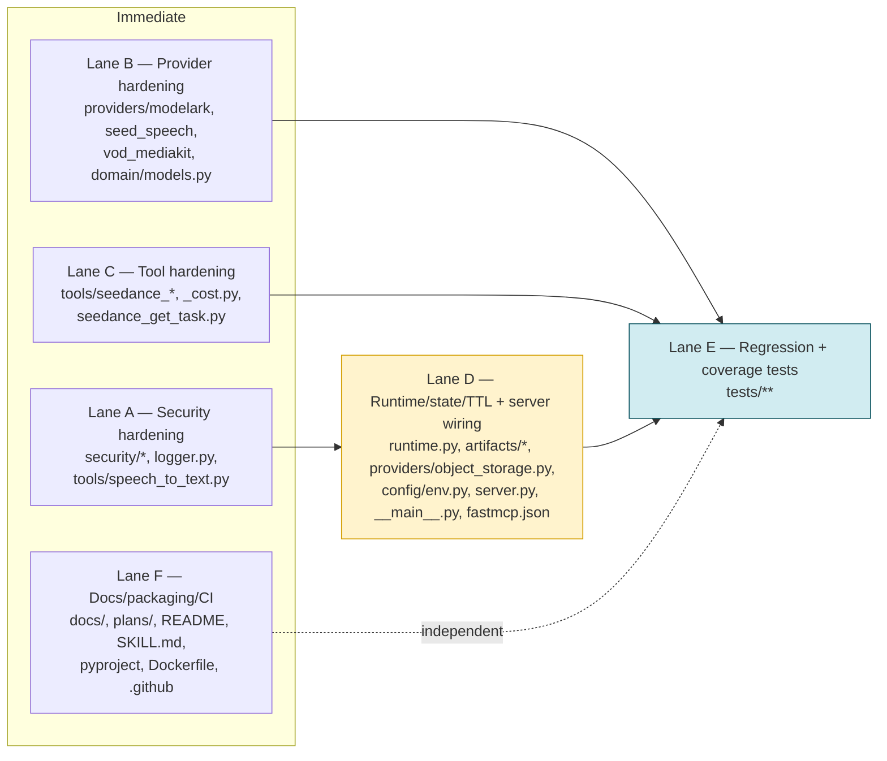
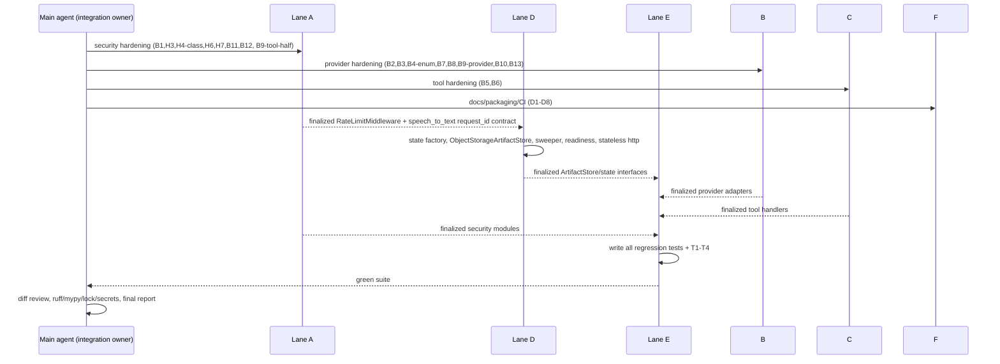

# Cloud Readiness and Hardening Implementation Plan

**Goal:** Make the ModelArk Seed MCP server safe and correct under multi-replica cloud
deployment and hostile input: scheduled state TTL sweeps, an object-storage artifact
backend, strict JWT/transport/auth hardening, guarded provider JSON parsing, correct
billing/cost guards, SSRF/ASR security fixes, comprehensive regression tests, and
docs/CI/packaging that match the shipped server.

**Source Context:**
- User request: a deduplicated cloud-readiness + hardening audit (grouped findings C1–C2,
  H1–H8, B1–B13, T1–T4, D1–D8) to be turned into an actionable plan.
- Docs/specs read: [`AGENTS.md`], [`docs/runtime.md`], [`docs/deployment.md`],
  [`docs/security.md`], [`docs/models.md`], [`docs/api-reference.md`], [`docs/tools.md`],
  [`specs/SPEC_VOD_MEDIAKIT_PROVIDER_CONTRACT.md`], [`.agents/skills/writing-plans/SKILL.md`].
- Code inspected: `src/modelark_mcp/{runtime.py,server.py,__main__.py,config/env.py,
  security/auth_context.py,security/http_auth.py,security/http_middleware.py,
  security/url_policy.py,artifacts/store.py,artifacts/filesystem_store.py,
  providers/object_storage.py,providers/s3/client.py,providers/tos/client.py,
  providers/base.py,providers/modelark/{client.py,seedance.py,seedream.py,understanding.py,schemas.py},
  providers/seed_speech/{client.py,seed_audio.py,asr.py,asr_http.py,schemas.py},
  providers/vod_mediakit/{client.py,transcode.py,separate_voice.py},
  tools/{speech_to_text.py,seedance_create_task.py,seedance_create_task_variations.py,
  seedance_2_5_create_task.py,seedance_2_5_create_task_variations.py,seedance_get_task.py,
  seedance_list_tasks.py,seed_media_get_artifact.py,media_upload.py,seed_audio_generate.py,_cost.py},
  observability/{logger.py,metrics.py},domain/models.py}`,
  `fastmcp.json`, `pyproject.toml`, `Makefile`, `Dockerfile`, `.dockerignore`,
  `.github/workflows/{ci.yml,codeql.yml}`, `tests/conftest.py`, `tests/live/test_stt_live.py`,
  and the installed FastMCP 3.4 package under
  `.venv/lib/python3.12/site-packages/fastmcp/` (`server/auth/providers/jwt.py`,
  `server/auth/auth.py`, `server/mixins/transport.py`, `server/http.py`, `server/server.py`).

**Architecture Decision:** Keep SQLite as the single-instance state backend but make it a
clean, swappable boundary — an env-selected `STATE_BACKEND=sqlite` factory plus the
existing `TaskOwnershipStore`/`TaskArtifactCache` protocols and a new
`ObjectStorageArtifactStore` implementing the `ArtifactStore` protocol so durable artifacts
move off the pod filesystem when object storage is configured. Enforce TTL by scheduling a
lifespan sweeper (`asyncio` task inside `build_lifespan`) that calls `delete_expired` and new
pruning methods. Harden the HTTP surface by sub-classing `FastMCP` so the body/rate-limit
ASGI middleware is applied in `create_server()` (both `python -m modelark_mcp` and
`fastmcp run`), and pin JWT algorithm + require `exp` via a `JWTVerifier` subclass.

**Parallelization Summary:** Yes — six lanes with disjoint write scopes. Lanes A (security),
B (providers), C (tools), and F (docs/packaging/CI) start immediately. Lane D
(runtime/state/TTL + server wiring) starts after A because it wires A's finalized ASGI
middleware and reuses the `request_id` contract A adds to `speech_to_text`. Lane E (tests)
starts after A/B/C/D because it asserts on their finalized interfaces. Shared-file conflicts
(`server.py`, `tools/speech_to_text.py`, `fastmcp.json`, `domain/models.py`,
`providers/object_storage.py`) are resolved by explicit single-lane ownership; the
main agent owns final integration and full validation.

## File Ownership

| Path | Owner | Responsibility | Notes / conflicts |
| --- | --- | --- | --- |
| `src/modelark_mcp/security/auth_context.py` | Lane A | Fix `is_local` transport check (B1) | disjoint |
| `src/modelark_mcp/security/http_auth.py` | Lane A | `StrictJWTVerifier` + pin algorithm (H3) | disjoint |
| `src/modelark_mcp/security/http_middleware.py` | Lane A | Proxy-aware rate limit key + eviction (H4-class) | read by Lane D for wiring — D starts after A |
| `src/modelark_mcp/observability/logger.py` | Lane A | Recurse redaction into tuple/set (B11) | disjoint |
| `src/modelark_mcp/tools/speech_to_text.py` | Lane A | stdio gate + size cap (H6), trusted-host allowlist (H7), Field descriptions (B12), pass one `request_id` per call (B9 tool-half) | B owns `providers/seed_speech/asr.py` half; contract below |
| `src/modelark_mcp/providers/modelark/seedance.py` | Lane B | Guard `response.json()` (B2); status mapping via tolerant enum (B4) | disjoint from C |
| `src/modelark_mcp/providers/modelark/seedream.py` | Lane B | Guard `response.json()` (B2); data-URI base64 (B3) | disjoint |
| `src/modelark_mcp/providers/modelark/understanding.py` | Lane B | Guard `response.json()` (B2) | disjoint |
| `src/modelark_mcp/domain/models.py` | Lane B | Add `UNKNOWN` + `_missing_` to `SeedanceTaskStatus` (B4) | C must NOT edit this file |
| `src/modelark_mcp/providers/seed_speech/asr_http.py` | Lane B | Codec/rate from `audio_format` (B7); terminal/missing status → failure (B8) | disjoint |
| `src/modelark_mcp/providers/seed_speech/asr.py` | Lane B | `transcribe(..., request_id=None)` (B9 provider-half) | A passes it from speech_to_text |
| `src/modelark_mcp/providers/seed_speech/seed_audio.py` | Lane B | Reject HTTP 200 + `code != 0` (B13) | disjoint |
| `src/modelark_mcp/providers/vod_mediakit/transcode.py` | Lane B | `_sanitize_task_error` never returns `None` message (B10) | disjoint |
| `src/modelark_mcp/providers/vod_mediakit/separate_voice.py` | Lane B | Same B10 fallback via shared helper | disjoint |
| `src/modelark_mcp/tools/seedance_create_task.py` | Lane C | Seedance 2.5 model guard + pass `model_id` to cost (B6) | disjoint |
| `src/modelark_mcp/tools/seedance_create_task_variations.py` | Lane C | Same B6 guard + `model_id` cost | disjoint |
| `src/modelark_mcp/tools/seedance_get_task.py` | Lane C | Partial-persist cache never loses `last_frame` (B5) | disjoint |
| `src/modelark_mcp/tools/_cost.py` | Lane C | Verify `_video_cost_for_model` keyed on `model_id` (no code change expected) | read-only check |
| `src/modelark_mcp/runtime.py` | Lane D | State factory, sweeper, prune methods (C1/C2/H8) | disjoint |
| `src/modelark_mcp/artifacts/object_storage_store.py` | Lane D | New `ObjectStorageArtifactStore(ArtifactStore)` (H8) | disjoint |
| `src/modelark_mcp/artifacts/store.py` | Lane D | Read-only (protocol already complete) | do not change |
| `src/modelark_mcp/providers/object_storage.py` | Lane D | Factory already correct; only testable surface (T3) | B must NOT touch; E writes tests |
| `src/modelark_mcp/config/env.py` | Lane D | `STATE_BACKEND`, `artifact_backend` gain `object_storage`, sweep/prune settings | F must NOT touch |
| `src/modelark_mcp/server.py` | Lane D | `HardenedFastMCP.http_app` middleware (H4), `/ready` uses resolved settings (H5) | contended — D sole owner |
| `src/modelark_mcp/__main__.py` | Lane D | `stateless_http=True` + `uvicorn_config` graceful shutdown; drop duplicate middleware (H2/H4) | D sole owner |
| `fastmcp.json` | Lane D | Add `boto3` + `tos` to `environment.dependencies` (H1) | F must NOT touch |
| `tests/**` | Lane E | All new regression tests + T1–T4 | starts after A/B/C/D |
| `docs/**`, `README.md`, `plans/**` | Lane F | D1–D4, models.md | disjoint from src |
| `.agents/skills/modelark-mcp/SKILL.md` | Lane F | Presign TTL correction | disjoint |
| `pyproject.toml` (license + pytest `markers`), `LICENSE`, `Dockerfile`, `.dockerignore`, `.github/workflows/*` | Lane F | D6–D8, dockerignore entries, live-test marker registration | sole owner of `pyproject.toml` — Lane E must not edit it |

**Integration owner:** the main agent owns `server.py` integration, the
`speech_to_text`/`asr.py` request-id contract, conflict resolution, full validation, and
final reporting (per `references/subagent-execution.md` in the writing-plans skill).

## Implementation Tasks

### Task A1: Fix local-principal spoofing (B1)

**Files:** `src/modelark_mcp/security/auth_context.py`

**Depends on:** None

**Can run in parallel with:** B, C, F — no shared files

- [ ] Step 1: Change `PrincipalContext.is_local` (line 26-27) from
  `return self.principal_id == "local"` to
  `return self.principal_id == "local" and self.transport == "stdio"`.
- [ ] Step 2: Test (Lane E) — `tests/unit/test_auth_context.py`:
  `PrincipalContext(principal_id="local", transport="http").is_local is False`;
  `PrincipalContext(principal_id="local", transport="stdio").is_local is True`;
  a spoofed JWT principal `PrincipalContext(principal_id="local", tenant_id="x", transport="http")`
  is non-local so `SQLiteTaskOwnershipStore.require_owner` raises `PermissionError`
  (seedance_get_task ownership path).

### Task A2: Require `exp` and pin algorithm on JWT verifier (H3)

**Files:** `src/modelark_mcp/security/http_auth.py`

**Depends on:** None

**Can run in parallel with:** B, C, F

- [ ] Step 1: Import `AccessToken` from `fastmcp.server.auth`; add a
  `class StrictJWTVerifier(JWTVerifier)` whose `__init__` passes
  `algorithm="RS256"` (FastMCP `jwt.py:221` accepts `algorithm`; default is `RS256`,
  `jwt.py:264`) and overrides
  `async def verify_token(self, token: str) -> AccessToken | None` to call
  `verified = await super().verify_token(token)`, then return `None` when
  `verified is None` or `(verified.claims or {}).get("exp") is None` (FastMCP only rejects
  *expired* tokens when `exp` is present — `jwt.py:479-482`).
- [ ] Step 2: Change `build_auth_provider` (line 14-19) to return `StrictJWTVerifier(...)`
  instead of `JWTVerifier(...)`, keeping `jwks_uri`/`issuer`/`audience`/`ssrf_safe=True`.
- [ ] Step 3: Test (Lane E) — `tests/unit/test_http_auth.py`: use
  `fastmcp.server.auth.providers.jwt.RSAKeyPair.generate()` to sign (a) a token without
  `exp` and (b) an expired token; assert `verify_token` returns `None` for both; assert a
  valid token with `exp` and matching `iss`/`aud` returns a non-None `AccessToken`. Note:
  `RSAKeyPair.create_token()` always emits `exp`, so the no-`exp` token must be built with a
  manual `jwt.encode(..., headers={"kid": ...})` using the generated key; and
  `JWTVerifier(jwks_uri=...)` needs a served/mocked JWKS endpoint (respx or a local ASGI
  fixture).

### Task A3: Proxy-aware rate limit key + always-on bucket eviction (H4, middleware class)

**Files:** `src/modelark_mcp/security/http_middleware.py`

**Depends on:** None

**Can run in parallel with:** B, C, F

- [ ] Step 1: Add `trust_proxy_headers: bool = False` kwarg to `RateLimitMiddleware.__init__`
  (line 81); in `__call__` (line 94-95) replace `ip = client[0] if client else "unknown"`
  with a `self._client_key(scope)` helper that, when `trust_proxy_headers`, reads the first
  comma-separated entry of the `x-forwarded-for` header, else falls back to
  `scope.get("client")[0]`.
- [ ] Step 2: In `_consume` (line 109-124), evict expired buckets whenever
  `len(self._buckets) > self._MAX_BUCKETS` (before the throttled-path check at line 121),
  not only on the throttled path.
- [ ] Step 3: Test (Lane E) — extend `tests/integration/test_http_security.py`: requests
  with a stable `X-Forwarded-For` are bucketed together when `trust_proxy_headers=True`,
  and distinct `scope["client"]` IPs are not; bucket count stays ≤ `_MAX_BUCKETS` under a
  flood of distinct keys.

### Task A4: Redaction recurses into tuple/set (B11)

**Files:** `src/modelark_mcp/observability/logger.py`

**Depends on:** None

**Can run in parallel with:** B, C, F

- [ ] Step 1: In `_redact` (line 66-74) add branches for `tuple` and `set`/`frozenset`,
  returning the same container type with each element redacted (e.g.
  `tuple(_redact(i) for i in value)`, `{_redact(i) for i in value}`).
- [ ] Step 2: Test (Lane E) — extend `tests/unit/test_logger.py`: a tuple containing a
  dict with `"api_key"` yields `"[REDACTED]"` in emitted JSON; a set containing
  `{"token": "x"}` redacts the key.

### Task A5: speech_to_text hardening (H6, H7, B12, B9 tool-half)

**Files:** `src/modelark_mcp/tools/speech_to_text.py`

**Depends on:** None (contract with Task B6 defined below)

**Can run in parallel with:** B, C, F — do not edit `providers/seed_speech/asr.py`

- [ ] Step 1 (H6): In `_resolve_audio_bytes` (line 89-103), before `p.read_bytes()`, add a
  stdio gate mirroring `media_upload.py:146-150`: `settings = get_settings()` and
  `if settings.mcp_transport != "stdio": raise ValueError("audio_file_path is only supported in stdio transport mode.")`;
  after `p.is_file()` check, reject `p.stat().st_size > _STT_MAX_BYTES`.
- [ ] Step 2 (H7): Replace `trusted_hosts=lambda _host: True` (line 94) with the shared
  BytePlus allowlist: `from modelark_mcp.artifacts.filesystem_store import _is_trusted_host`
  and pass `trusted_hosts=_is_trusted_host`.
- [ ] Step 3 (B12): Add `Field(description=...)` to `SpeechToTextInput.audio` (line 76) and
  `SpeechToTextInput.options` (line 77).
- [ ] Step 4 (B9 tool-half): In `speech_to_text` (line 137-155), generate
  `client_request_id = str(uuid4())` once before `call_with_retry`, and pass
  `request_id=client_request_id` into `service.transcribe(...)` inside the lambda, so a
  retry resubmits the same `X-Api-Request-Id` instead of minting a new billable task.
- [ ] Step 5: Test (Lane E) — `tests/unit/test_speech_to_text_tool.py` covers: stdio gate
  raises in HTTP transport; oversized file raises; URL to a non-BytePlus host is rejected;
  the input JSON schema includes descriptions for `audio` and `options`; a retried call
  submits the same `request_id` (assert via respx on the ASR submit URL).

### Task B1: Guard ModelArk success-path JSON parsing (B2)

**Files:** `src/modelark_mcp/providers/modelark/seedance.py`,
`src/modelark_mcp/providers/modelark/seedream.py`,
`src/modelark_mcp/providers/modelark/understanding.py`

**Depends on:** None

**Can run in parallel with:** A, C, F

- [ ] Step 1: Add a module-level helper in `seedance.py`:
  `def _parse_success_body(response: httpx.Response, operation: str) -> dict[str, Any]`
  that calls `response.json()` inside `try/except (json.JSONDecodeError, ValueError)` and
  raises `ProviderError(NormalizedProviderError(provider="modelark", operation=operation,
  http_status=response.status_code, code="INVALID_RESPONSE",
  message="ModelArk returned a non-JSON success response.", request_id=<extracted>,
  retryable=False, ambiguous_completion=False))` on failure; reuse
  `ModelArkGateway.extract_request_id(response)`.
- [ ] Step 2: Replace the three unguarded `body = response.json()` calls with
  `body = _parse_success_body(response, "<op>")` in `seedance.py` (`create_task` line 59,
  `get_task` line 82, `list_tasks` line 126), `seedream.py` (`generate` line 54), and
  `understanding.py` (`generate` line 56).
- [ ] Step 3: Test (Lane E) — extend `tests/contract/test_seedance_adapter.py`,
  `test_seedream_adapter.py`, `test_understanding_adapter.py`: a 2xx response with
  non-JSON/empty body raises `ProviderError` with `code == "INVALID_RESPONSE"` (respx mock).

### Task B2: Seedream base64 images as data URIs (B3)

**Files:** `src/modelark_mcp/providers/modelark/seedream.py`

**Depends on:** None

**Can run in parallel with:** A, C, F

- [ ] Step 1: In `build_request` (line 76-85), when an image dict has `data` and no `url`,
  wrap as `f"data:{item.get('mime_type', 'image/png')};base64,{item['data']}"` — matching
  `seedance.py:167-169` and `understanding.py:92-98`. Apply to both the single-image branch
  (line 79) and the list branch (lines 81-85).
- [ ] Step 2: Test (Lane E) — extend `tests/contract/test_seedream_adapter.py`: a base64
  image input produces `image == "data:image/png;base64,<data>"`; a URL input is passed
  through unchanged.

### Task B3: Tolerate unknown Seedance status strings (B4)

**Files:** `src/modelark_mcp/domain/models.py`

**Depends on:** None

**Can run in parallel with:** A, C, F — C must not edit this file

- [ ] Step 1: In `SeedanceTaskStatus` (line 17-23) add `UNKNOWN = "unknown"` and a
  `@classmethod def _missing_(cls, value)` returning `cls.UNKNOWN`, so strict `StrEnum`
  construction in `seedance.py:248` (`SeedanceTaskStatus(task.status)`) and the
  `SeedanceTaskOutput`/`SeedanceTaskSummary` output models no longer raise `ValueError` for
  unrecognized provider status strings.
- [ ] Step 2: Test (Lane E) — extend `tests/contract/test_seedance_adapter.py`:
  `SeedanceService.to_task_summary` on a `SeedanceTaskResponse(status="invented_status")`
  returns `status == SeedanceTaskStatus.UNKNOWN`; `seedance_list_tasks` and
  `seedance_get_task` output models validate with the unknown status present.

### Task B4: ASR submit codec derives from audio_format (B7)

**Files:** `src/modelark_mcp/providers/seed_speech/asr_http.py`

**Depends on:** None

**Can run in parallel with:** A, C, F

- [ ] Step 1: In `submit` (line 67-74) build the `audio` dict as
  `{"format": audio_format, "language": language}` and only add
  `"codec": "raw", "rate": 16000, "bits": 16, "channel": 1` when
  `audio_format in {"wav", "raw"}`; for `mp3`/`ogg`/`flac` omit codec/rate/bits/channel so
  the format is not mislabeled as raw PCM.
- [ ] Step 2: Test (Lane E) — extend `tests/contract/test_seed_speech_asr_gateway.py`:
  `submit(audio_format="mp3")` posts an `audio` dict without `codec`/`rate`; `wav`/`raw`
  include them; all requests still include `format` matching the argument.

### Task B5: ASR query terminal/missing status must not read as success (B8)

**Files:** `src/modelark_mcp/providers/seed_speech/asr_http.py`

**Depends on:** None

**Can run in parallel with:** A, C, F

- [ ] Step 1: In `query` (line 109-129) add `_SUCCESS_STATUSES: frozenset[str] =
  frozenset({"10000000"})` at class scope (verify the exact success code against the Seed
  Speech ASR contract before merging — the existing fixture statuses in
  `tests/contract/test_seed_speech_asr_gateway.py` are the source of truth). Logic:
  (a) if `x-api-status-code` header is missing → raise a `ProviderError` with
  `code="MISSING_STATUS"`; (b) if present and in `_NON_TERMINAL_STATUSES` → return `None`;
  (c) if present and in `_SUCCESS_STATUSES` → parse JSON guarded by `json.JSONDecodeError`;
  (d) otherwise → raise a `ProviderError` carrying the provider status code
  (`retryable=False, ambiguous_completion=False`).
- [ ] Step 2: Test (Lane E) — extend `tests/contract/test_seed_speech_asr_gateway.py`:
  missing status header raises; a terminal-failure status code raises instead of returning
  parsed JSON; non-terminal statuses still return `None`.

### Task B6: ASR request_id minted once, passed through (B9 provider-half)

**Files:** `src/modelark_mcp/providers/seed_speech/asr.py`

**Depends on:** None (contract with Task A5)

**Can run in parallel with:** A, C, F — do not edit `tools/speech_to_text.py`

- [ ] Step 1: Add `request_id: str | None = None` to `transcribe` (line 37-48 signature);
  replace `task_id = str(uuid4())` (line 69) with
  `task_id = request_id or str(uuid4())`. The tool (Task A5) generates one id per
  invocation and passes it; a retried `call_with_retry` lambda therefore reuses the same
  `X-Api-Request-Id`.
- [ ] Step 2: Test (Lane E) — extend `tests/contract/test_seed_speech_asr_gateway.py`
  (service-level): `transcribe(request_id="fixed")` submits with `X-Api-Request-Id: fixed`
  on both submit and query; `transcribe()` without it mints a fresh UUID.

### Task B7: Reject HTTP 200 with non-zero Seed Audio code (B13)

**Files:** `src/modelark_mcp/providers/seed_speech/seed_audio.py`

**Depends on:** None

**Can run in parallel with:** A, C, F

- [ ] Step 1: In `generate` (after `body = SeedAudioProviderResponse.model_validate(body)`,
  line 57-58), when `body.code not in (0, None, "")` raise
  `ProviderError(NormalizedProviderError(provider="seed-speech",
  operation="generate_audio", http_status=response.status_code, code=str(body.code),
  message=body.message or f"Seed Audio failed with code {body.code}",
  request_id=log_id, retryable=False, ambiguous_completion=False))` — importing
  `NormalizedProviderError`/`ProviderError` from `modelark_mcp.domain.errors`.
- [ ] Step 2: Test (Lane E) — extend `tests/contract/test_seed_audio_adapter.py`: a 200 with
  `{"code": 3001, "message": "boom"}` raises `ProviderError` (not a misleading downstream
  `ValueError` from `seed_audio_generate.py:277`); a 200 with `code == 0` returns normally.

### Task B8: MediaKit failed-task error fallback never None (B10)

**Files:** `src/modelark_mcp/providers/vod_mediakit/transcode.py`,
`src/modelark_mcp/providers/vod_mediakit/separate_voice.py`

**Depends on:** None

**Can run in parallel with:** A, C, F

- [ ] Step 1: In `transcode.py` `_sanitize_task_error` (line 52-63) return
  `(code_or_none, sanitize_provider_message(message or "", fallback))` so the message tuple
  element is never `None` — currently `(None, None)` escapes when `detail` is `None` or
  message empty, and `TranscodeTask`/`SeparateVoiceTask` construction then hits a required
  `failure_message` validation error.
- [ ] Step 2: Verify both failed branches (`transcode.py:214-227`,
  `separate_voice.py:186-199`) now always receive a non-None `failure_message`.
- [ ] Step 3: Test (Lane E) — extend `tests/contract/test_vod_mediakit_transcode_adapter.py`
  and `test_vod_mediakit_separate_voice_adapter.py`: a `failed` task response with
  `error == null` returns `status="failed"` with a non-empty `failure_message` and no
  escaping `pydantic.ValidationError`.

### Task C1: Seedance 2.0 create/variations reject 2.5 models and bill correctly (B6)

**Files:** `src/modelark_mcp/tools/seedance_create_task.py`,
`src/modelark_mcp/tools/seedance_create_task_variations.py`

**Depends on:** None

**Can run in parallel with:** A, B, F

- [ ] Step 1: In `seedance_create_task.py`, import `ModelFamily` from
  `modelark_mcp.config.model_capabilities`; after `caps = registry.get_video_capabilities(...)`
  (line 195) raise `ValueError` when `caps.family is ModelFamily.SEEDANCE_2_5`, mirroring
  the 2.5 tool guard at `seedance_2_5_create_task.py:191-196`.
- [ ] Step 2: Change `log_cost_estimate(product="video", variations=1)` (line 256) to pass
  `model_id=caps.model_id` so a 2.5 model is never billed at the 2.0 rate
  (`COST_PER_VIDEO_TASK = 0.07` vs `COST_PER_VIDEO_TASK_2_5 = 0.35`, `_cost.py:15-16`).
- [ ] Step 3: In `seedance_create_task_variations.py`, move capability resolution
  `caps = registry.get_video_capabilities(input.model)` (currently at line 98) BEFORE the
  `log_cost_estimate(product="video", variations=...)` call (currently at line 91), then add
  the same `ModelFamily.SEEDANCE_2_5` guard and pass `model_id=caps.model_id` to both
  `log_cost_estimate` (line 91) and the per-variation `estimate_cost(product="video",
  variations=1)` (line 162). Do not reference `caps` before it is assigned.
- [ ] Step 4: Test (Lane E) — extend `tests/integration/test_seedance_tool.py`: a
  2.5 model ID through `seedance_create_task`/`seedance_create_task_variations` raises
  `ValueError` before any provider call; cost log for a 2.0 model uses 0.07 and for a 2.5
  model (via the 2.5 tool) uses 0.35.

### Task C2: get_task partial persist never permanently loses last_frame (B5)

**Files:** `src/modelark_mcp/tools/seedance_get_task.py`

**Depends on:** None

**Can run in parallel with:** A, B, F

- [ ] Step 1: In the persist block (line 114-173), cache only when every expected output is
  either absent from the provider response or successfully persisted. Track
  `video_ok = task.video_url is None or video_ref is not None` and
  `last_frame_ok = task.last_frame_url is None or last_frame_ref is not None`; replace the
  `if video_ref is not None or last_frame_ref is not None:` cache condition (line 165) with
  `if video_ok and last_frame_ok:` so a failed last-frame download is retried on the next
  poll instead of being cached as `None` permanently. Note: a `succeeded` task whose provider
  response has neither `video_url` nor `last_frame_url` will now be cached as
  `{"video": None, "last_frame": None}` — this is an intentional idempotent terminal state,
  not a regression.
- [ ] Step 2: Test (Lane E) — extend `tests/integration/test_seedance_tool.py`: with
  `persist_output=True`, a video persist success + last-frame download failure leaves the
  cache empty; a second `seedance_get_task` call re-attempts last-frame persistence and, on
  success, caches both refs.

### Task D1: State backend selection + artifact backend env (C1/H8 config)

**Files:** `src/modelark_mcp/config/env.py`

**Depends on:** None (D internal)

**Can run in parallel with:** A, B, C, F

- [ ] Step 1: Add `state_backend: Literal["sqlite"] = Field("sqlite",
  validation_alias="STATE_BACKEND")`; change `artifact_backend` (line 245) to
  `Literal["filesystem", "object_storage"]`.
- [ ] Step 2: Add `artifact_sweep_interval_seconds: int = Field(3600, ge=60,
  validation_alias="ARTIFACT_SWEEP_INTERVAL_SECONDS")` and
  `state_prune_max_age_days: int = Field(30, ge=1,
  validation_alias="STATE_PRUNE_MAX_AGE_DAYS")`.
- [ ] Step 3: In `validate_model_bindings` (the `model_validator`, line 442) add: when
  `artifact_backend == "object_storage"` and `not self.has_object_storage`, raise
  `ValueError("ARTIFACT_BACKEND=object_storage requires TOS_* or S3_* credentials.")`.
- [ ] Step 4: Test (Lane E) — extend `tests/unit/test_env_config.py`: object_storage
  backend without credentials fails validation; `state_backend` accepts only `sqlite`.

### Task D2: `ObjectStorageArtifactStore` (H8)

**Files:** `src/modelark_mcp/artifacts/object_storage_store.py` (new)

**Depends on:** D1

**Can run in parallel with:** A, B, C, F

- [ ] Step 1: Implement `class ObjectStorageArtifactStore(ArtifactStore)` against the
  protocol in `artifacts/store.py:86-121`:
  - `__init__(self, *, settings: Settings, downloader: SafeDownloader | None = None)`:
    store `self._gateway = make_object_storage_gateway(settings)` from
    `providers/object_storage.py:67`, `ttl_seconds = settings.artifact_ttl_seconds`.
  - `put_base64(...)`: `decode_base64_safely` (same policy as
    `filesystem_store.py:152-168`), validate MIME via `validate_*_mime`, upload under key
    `artifacts/{artifact_id[:2]}/{artifact_id}{ext}`, write an `ArtifactMetadata`
    sidecar object at `artifacts/{artifact_id[:2]}/{artifact_id}.meta.json`, return an
    `ArtifactRef` with `expires_at = now + ttl_seconds`.
  - `copy_from_trusted_url(...)`: `SafeDownloader.download(url, trusted_hosts=_is_trusted_host,
    max_bytes=...)` (import `_is_trusted_host` from `artifacts/filesystem_store.py`), then
    delegate to `put_base64`.
  - `get(...)`: `presign_get(key=...)` then `SafeDownloader.download` the presigned URL;
    load the metadata sidecar (same presign+download) and enforce
    `metadata.principal_id == owner.principal_id and metadata.tenant_id == owner.tenant_id`
    exactly like `filesystem_store.py:344-347`; return `StoredArtifact`.
  - `delete_expired(self, now)`: log at debug (once, not every tick)
    `object_artifact_sweep_unsupported` and return `0` (lifecycle policy on the bucket is
    the documented enforcement; see follow-up).
  - `close()`: `await self._gateway.close()` and downloader close.
- [ ] Step 2: Test (Lane E) — `tests/unit/test_object_storage_store.py` with a fake
  `ObjectStorageGateway` and fake downloader: put/get round-trip preserves bytes, MIME, and
  ownership; a cross-tenant `get` raises `PermissionError`; `delete_expired` returns `0`.

### Task D3: Runtime state factory, prune methods, and lifespan sweeper (C1/C2)

**Files:** `src/modelark_mcp/runtime.py`

**Depends on:** D1, D2

**Can run in parallel with:** A, B, C, F

- [ ] Step 1: Add `def build_state_stores(settings, database_path) -> tuple[TaskOwnershipStore,
  BudgetLedger, TaskArtifactCache]` returning the SQLite implementations (current
  `SQLiteTaskOwnershipStore`/`BudgetLedger`/`SQLiteTaskArtifactCache`); log
  `warning("single_instance_state_backend", backend=settings.state_backend,
  note="run one replica")` when `state_backend == "sqlite"`. `create_runtime_services`
  (line 536) calls it, and builds `artifact_store` via a branch on
  `settings.artifact_backend` — `FilesystemArtifactStore` for `"filesystem"`,
  `ObjectStorageArtifactStore` for `"object_storage"` (Task D2) — instead of the hard-coded
  `FilesystemArtifactStore` at line 543.
- [ ] Step 2: Add `prune(self, max_age_days: int) -> int` to the `TaskOwnershipStore`
  protocol (`runtime.py:89-98`) and `prune_expired(self) -> int` to the `TaskArtifactCache`
  protocol (`runtime.py:101-115`) so the sweeper can call them through the protocol-typed
  `RuntimeServices` fields. Implement them on the concrete classes:
  `SQLiteTaskOwnershipStore.prune` (DELETE rows with `created_at` older than N days),
  `SQLiteTaskArtifactCache.prune_expired` (DELETE rows whose `created_at` is older than
  `self._ttl_seconds`, complementing the read-side TTL at `runtime.py:329-331`), and
  `BudgetLedger.prune` (DELETE `budget_reservations` rows with `usage_date` older than N
  days).
- [ ] Step 3: In `build_lifespan`/`server_lifespan` (line 643-665), after `runtime` is
  created, start `sweeper = asyncio.create_task(_state_sweeper(runtime, settings))`; in the
  `finally`, `sweeper.cancel()` and `with suppress(asyncio.CancelledError): await sweeper`
  before `close_runtime_services(runtime)`.
- [ ] Step 4: Add
  `async def _state_sweeper(runtime: RuntimeServices, settings: Settings) -> None:` that
  loops `await asyncio.sleep(settings.artifact_sweep_interval_seconds)` then calls, with
  per-step exception isolation,
  `await runtime.artifact_store.delete_expired(datetime.now(UTC))`,
  `await runtime.ownership_store.prune(settings.state_prune_max_age_days)`,
  `await runtime.budget_ledger.prune(settings.state_prune_max_age_days)`, and
  `await runtime.task_artifact_cache.prune_expired()`, logging deleted counts. The
  `datetime.now(UTC)` argument matches the `ArtifactStore.delete_expired(self, now)` protocol
  signature (`artifacts/store.py:115-117`); `ownership_store.prune`/`task_artifact_cache.prune_expired`
  are valid because Step 2 extends those protocols, while `budget_ledger.prune` is a
  concrete-class method on `BudgetLedger`.
- [ ] Step 5: Test (Lane E) — extend `tests/unit/test_runtime.py`: with a fake settings +
  fake stores, entering the lifespan spawns the sweeper and exiting cancels it; each prune
  method deletes only aged rows; `artifact_backend="object_storage"` yields an
  `ObjectStorageArtifactStore` while `"filesystem"` yields a `FilesystemArtifactStore`.

### Task D4: Server wiring — middleware in create_server + `/ready` uses resolved settings (H4/H5)

**Files:** `src/modelark_mcp/server.py`

**Depends on:** A (finalized `RateLimitMiddleware`), D1

**Can run in parallel with:** B, C, F

- [ ] Step 1 (H4): Add `class HardenedFastMCP(FastMCP)` that overrides
  `http_app(self, *args, middleware=None, **kwargs)` and, when
  `self._app_settings.mcp_transport == "http"`, set
  `middleware = list(middleware or [])` first, then prepend
  `[Middleware(RequestBodyLimitMiddleware, max_bytes=...) , Middleware(RateLimitMiddleware,
  rpm=..., burst=..., trust_proxy_headers=...)]` (starlette `Middleware`, as `fastmcp`'s
  `http_app(middleware=...)` expects `list[ASGIMiddleware]` per
  `fastmcp/server/mixins/transport.py`) to the incoming `middleware` list before calling
  `super().http_app(...)`. Store the resolved settings on the instance during
  `create_server` as `self._app_settings = resolved_settings` (a plain instance attribute —
  not a FastMCP built-in) so the override can read them. Change `create_server` (line 379) to
  build `HardenedFastMCP` instead of `FastMCP`, and keep the FastMCP-level
  `middleware=[MetricsMiddleware()]` (that param is FastMCP middleware, not ASGI — do not
  move the ASGI classes there).
- [ ] Step 2 (H5): In `ready` (line 446-523), build every gateway from `resolved_settings`
  explicitly instead of the global `get_settings()` each gateway constructor reads
  internally (`client.py:35-36` etc.): e.g.
  `ModelArkGateway(api_key=resolved_settings.modelark_api_key,
  base_url=resolved_settings.modelark_base_url, timeout=resolved_settings.request_timeout_ms/1000,
  connect_timeout=resolved_settings.connect_timeout_ms/1000)`; likewise for
  `SeedSpeechGateway`, `SeedSpeechAsrHttpGateway`, and `VodMediaKitGateway`.
- [ ] Step 3: Test (Lane E) — extend `tests/integration/test_mcp_conformance.py` or
  `test_http_security.py`: `create_server()` over HTTP transport applies
  `RequestBodyLimitMiddleware` + `RateLimitMiddleware` to the ASGI app (inspect the app
  middleware stack); `/ready` probes use a `resolved_settings` with overridden provider
  URLs (assert the gateway hits the override base URL via respx).

### Task D5: `__main__` stateless HTTP + graceful shutdown; drop duplicate middleware (H2/H4)

**Files:** `src/modelark_mcp/__main__.py`

**Depends on:** D4

**Can run in parallel with:** B, C, F

- [ ] Step 1: Remove the local `middleware = [...]` block (line 31-44) — the ASGI middleware
  now comes from `HardenedFastMCP.http_app` (Task D4).
- [ ] Step 2: In `mcp.run(transport="http", ...)` (line 45-53) add
  `stateless_http=True` and
  `uvicorn_config={"timeout_graceful_shutdown": int(settings.request_timeout_ms / 1000)}`
  (FastMCP defaults `timeout_graceful_shutdown` to 2s — `fastmcp/server/mixins/transport.py`
  `config_kwargs`).
- [ ] Step 3: Test (Lane E) — extend `tests/unit/test_main.py`: assert `main()` calls
  `mcp.run` with `stateless_http=True` and the computed graceful-shutdown value when
  `MCP_TRANSPORT=http` (monkeypatch `mcp.run`).

### Task D6: fastmcp.json declares boto3 + tos (H1)

**Files:** `fastmcp.json`

**Depends on:** None

**Can run in parallel with:** A, B, C, F — F must not edit this file

- [ ] Step 1: Add `"boto3>=1.43,<2.0"` and `"tos>=2.9.2,<3.0"` to
  `environment.dependencies` (line 11-19), matching `pyproject.toml:11,19` so the
  `fastmcp run`/deployment environment can import `ObjectStorageArtifactStore`'s object
  gateways.

### Task E1: Speech-to-text + get-artifact + object-storage-factory coverage (T1/T2/T3)

**Files:** `tests/unit/test_speech_to_text_tool.py`,
`tests/unit/test_seed_media_get_artifact_tool.py`,
`tests/unit/test_object_storage_factory.py` (all new)

**Depends on:** A, C, D

**Can run in parallel with:** F

- [ ] Step 1 (T1): `test_speech_to_text_tool.py` — happy path (Base64 → ASR submit/query via
  respx → `SpeechToTextOutput`), URL path with non-BytePlus host rejected (H7), file_path
  rejected when `mcp_transport != "stdio"` and when `st_size > 200MB` (H6), exactly-one-source
  validator, and `SpeechToTextInput.model_fields["audio"].description is not None` (B12).
- [ ] Step 2 (T2): `test_seed_media_get_artifact_tool.py` — `seed_media_get_artifact` returns
  base64 + correct SHA-256 + byte count; missing artifact raises `FileNotFoundError`;
  cross-owner fetch raises `PermissionError`.
- [ ] Step 3 (T3): `test_object_storage_factory.py` —
  `make_object_storage_gateway(settings)` returns a `TosGateway` for
  `object_storage_backend="tos"` and an `S3Gateway` for `"s3"`; raises `ValueError` when the
  selected backend lacks credentials (lines 73-85).

### Task E2: Regression tests for B1/B2/B3/B4/B5/B6/B7/B8/B10/B11/B13/H3/H4

**Files:** tests as named in Tasks A1–C2 plus `tests/unit/test_http_auth.py`,
`tests/unit/test_auth_context.py`

**Depends on:** A, B, C, D

**Can run in parallel with:** F

- [ ] Step 1: Implement every Step-2/3 test listed in Tasks A1–A5, B1–B8, C1–C2, D1–D5,
  asserting behavior (not implementation) as specified per task.
- [ ] Step 2: Run `uv run pytest --disable-socket --allow-unix-socket --cov=modelark_mcp
  --cov-report=term-missing` and require every new test to pass and overall coverage to stay
  ≥ 85% (`pyproject.toml:124`).

### Task E3: Live-test skip guard + `live` marker (T4)

**Files:** `tests/live/conftest.py` (new), `tests/live/test_stt_live.py`,
`tests/live/test_stt_podcast.py`

**Depends on:** A

**Can run in parallel with:** F

- [ ] Step 1: Add `pytestmark = pytest.mark.live` to both live test modules. Register the
  `live` marker in `pyproject.toml` `[tool.pytest.ini_options]` (`markers = ["live: requires
  live credentials and network"]`) — this pyproject edit is done by Lane F in Task F4 Step 5.
- [ ] Step 2: Replace the file-existence-only skip (`test_stt_live.py:35-36`) with a
  module-level guard that skips when `get_settings().seed_speech_api_key` is empty OR the
  sample file is missing OR pytest-socket disabled the socket; keep `--force-enable-socket`
  in the documented run command. Account for the autouse `isolate_settings_env` fixture in
  `tests/conftest.py` (it strips `BYTEPLUS_*`/`SEED_SPEECH_*` env): restore or repopulate the
  credential env in a `tests/live/conftest.py` before the skip check, otherwise the live
  suite always skips even when credentials exist.

### Task F1: Remove dangling `scripts/verify_phase0.py` references (D1)

**Files:** `README.md`, `docs/getting-started.md`, `docs/troubleshooting.md`

**Depends on:** None

**Can run in parallel with:** A, B, C, D, E

- [ ] Step 1: Replace the three references (`README.md:173`, `docs/getting-started.md:81`,
  `docs/troubleshooting.md:44`) with the existing `make check-env` /
  `uv run python -c "from modelark_mcp.config.env import validate; validate()"` command.

### Task F2: Document the six missing tools + Seedance 2.5 tools (D2/D3)

**Files:** `docs/api-reference.md`, `docs/tools.md`

**Depends on:** None

**Can run in parallel with:** A, B, C, D, E

- [ ] Step 1 (D2): Add `docs/api-reference.md` sections for every shipped tool currently
  absent — verified missing: `seed_understand`, `seedance_2_5_create_task`,
  `seedance_2_5_create_task_variations`, `seed_media_get_artifact`; reconcile the remaining
  two against the full 22-tool inventory in `server.py::register_tools` (grep each tool name
  in `docs/api-reference.md`; zero matches = add a section). Also update the Tool Inventory
  and Tool Annotations tables from 16 to the full 22 rows — not only the new sections.
- [ ] Step 2 (D3): Add `seedance_2_5_create_task` and
  `seedance_2_5_create_task_variations` sections to `docs/tools.md`, matching the schema
  descriptions already in `tools/seedance_2_5_create_task.py` and
  `tools/seedance_2_5_create_task_variations.py`.

### Task F3: Plans hygiene + docs/models.md + SKILL presign TTL (D4 + follow-up)

**Files:** `plans/*.md`, `docs/models.md`, `.agents/skills/modelark-mcp/SKILL.md`

**Depends on:** None

**Can run in parallel with:** A, B, C, D, E

- [ ] Step 1 (D4): Add YAML frontmatter to any plan missing it; remove shipped/superseded/
  deprecated plans per `AGENTS.md` repository-hygiene rules (shipped plans
  `PLAN_RUNTIME_IMPROVEMENTS.md`, `PLAN_S3_OBJECT_STORAGE.md`, and
  `PLAN_BYTEPLUS_VOD_AI_MEDIAKIT_VIDEO_TRANSCODING.md` were removed, with durable decisions
  already living in `docs/runtime.md`, `docs/s3-object-storage.md`, and
  `specs/SPEC_VOD_MEDIAKIT_PROVIDER_CONTRACT.md`); fix dangling `related:` links (verify each
  linked path exists).
- [ ] Step 2: Update `docs/models.md` `ModelFamily` table from 6 to 9 members — add
  `SEEDANCE_2_5 = "seedance_2_5"`, `SEED_2_1_PRO = "seed_2_1_pro"`,
  `SEED_2_1_TURBO = "seed_2_1_turbo"` (see `config/model_capabilities.py:27-38`) and add
  `SEEDANCE_2_5` to the `SeedanceFamily` note (env.py:36-40).
- [ ] Step 3: Correct `.agents/skills/modelark-mcp/SKILL.md:391` "Presigned URLs expire after
  10 minutes (600s)" → default is 1800s (30 min) via `TOS_PRESIGN_TTL_SECONDS`/
  `S3_PRESIGN_TTL_SECONDS` (`env.py:270-274,284-289`).

### Task F4: License metadata, CodeQL gate, image push, dockerignore (D6/D7/D8 + follow-up)

**Files:** `pyproject.toml`, `LICENSE` (new), `.github/workflows/codeql.yml`,
`.github/workflows/ci.yml`, `.dockerignore`

**Depends on:** None

**Can run in parallel with:** A, B, C, D, E

- [ ] Step 1 (D6): Add `license = { text = "MIT" }` (or the chosen license) to `[project]`
  in `pyproject.toml` and add a `LICENSE` file.
- [ ] Step 2 (D7): In `.github/workflows/codeql.yml`, remove
  `if: github.event.repository.visibility == 'public'` (line 20) or replace with a check
  that CodeQL is enabled for the org, so private repos are also scanned.
- [ ] Step 3 (D8): In `.github/workflows/ci.yml` `container` job, add a registry push step
  (e.g. `docker/build-push-action` to `ghcr.io`) after the health check, with
  `permissions: packages: write` added at job level.
- [ ] Step 4: In `.dockerignore` add `.artifacts`, `.coverage`, `.DS_Store`,
  `.secrets.baseline`, `sample/`, `out/`, `pr-reviews/`.
- [ ] Step 5: In `pyproject.toml` `[tool.pytest.ini_options]` add
  `markers = ["live: requires live credentials and network"]` (consumed by Task E3).

## Parallel Subagent Execution Plan

| Lane | Agent Role | Write Scope | Task(s) | Can Start After | Conflict Guard |
| --- | --- | --- | --- | --- | --- |
| Worker A | `worker` | `src/modelark_mcp/security/**`, `src/modelark_mcp/observability/logger.py`, `src/modelark_mcp/tools/speech_to_text.py` | A1–A5 | Immediately | Must not edit `providers/**`, `server.py`, `domain/models.py`, `runtime.py` |
| Worker B | `worker` | `src/modelark_mcp/providers/{modelark,seed_speech,vod_mediakit}/**`, `src/modelark_mcp/domain/models.py` | B1–B8 | Immediately | Must not edit `providers/object_storage.py`, `tools/**`, `server.py` |
| Worker C | `worker` | `src/modelark_mcp/tools/{seedance_create_task.py,seedance_create_task_variations.py,seedance_get_task.py,_cost.py}` | C1–C2 | Immediately | Must not edit `tools/speech_to_text.py`, `domain/models.py`, `providers/**` |
| Worker D | `worker` | `src/modelark_mcp/{runtime.py,server.py,__main__.py,config/env.py}`, `src/modelark_mcp/artifacts/**`, `src/modelark_mcp/providers/object_storage.py`, `fastmcp.json` | D1–D6 | After A (wires A's finalized `RateLimitMiddleware`; consumes A's speech_to_text `request_id` contract) | Must not edit `security/**`, `domain/models.py`, `tools/speech_to_text.py` |
| Worker E | `worker` | `tests/**` | E1–E3 | After A, B, C, D | Must not edit `src/**`; must not touch `pyproject.toml` (F owns it, including pytest `markers`) |
| Worker F | `worker` | `docs/**`, `plans/**`, `README.md`, `.agents/skills/**`, `pyproject.toml` (license + pytest `markers`), `LICENSE`, `Dockerfile`, `.dockerignore`, `.github/workflows/**` | F1–F4 | Immediately | Must not edit `fastmcp.json`, `config/env.py`, `src/**`, `tests/**` |

**Implementation handoff:** When the user asks to implement this plan and subagents are
permitted, the main agent must recheck the current repository state and lane assumptions,
spawn only lanes with stable inputs and disjoint write scopes, tell workers to preserve
concurrent changes and stay inside their assigned scope, sequence overlapping or
contract-changing work (D after A; E after A/B/C/D), and retain ownership of integration,
conflict resolution, full validation, and final reporting.

## Validation

- `uv sync` — clean lockfile install (matches `Makefile:40`).
- `uv run pytest --disable-socket --allow-unix-socket --cov=modelark_mcp --cov-report=term-missing`
  — full offline suite green, coverage ≥ 85% (`ci.yml:49`, `pyproject.toml:124`).
- `uv run ruff check src tests scripts` and `uv run ruff format --check src tests scripts`
  — lint + format clean (`Makefile:65-66`, `ci.yml:42-43`).
- `uv run mypy src` — strict type check clean (`Makefile:72`, `ci.yml:46`).
- `uv lock --check` — lockfile up to date (`ci.yml:37`).
- `uv run bandit -q -r src/modelark_mcp` — no new security findings (`ci.yml:52`).
- `uv run detect-secrets scan --baseline .secrets.baseline` — no secrets (`ci.yml:58`).
- `make check-env` — env validation still passes (`Makefile:101`).
- Smoke: `make start` (stdio) and `MCP_TRANSPORT=http MCP_AUTH_MODE=jwt ... uv run python -m
  modelark_mcp` then `curl /health` and `curl /ready` return 200; `/ready` provider probes
  honor an overridden base URL (Task D4).

## Documentation And Follow-Up

- Docs/specs to update: `docs/configuration.md` (new `STATE_BACKEND`, `ARTIFACT_BACKEND`,
  `ARTIFACT_SWEEP_INTERVAL_SECONDS`, `STATE_PRUNE_MAX_AGE_DAYS`), `docs/runtime.md` and
  `docs/deployment.md` (state backend boundary + replica=1 guard + sweeper),
  `docs/artifacts.md` (`object_storage` backend), `docs/security.md` (JWT `exp` requirement,
  algorithm pin, proxy-aware rate limiting, STT stdio gate), `docs/api-reference.md` and
  `docs/tools.md` (Task F2). Update `.agents/skills/modelark-mcp/SKILL.md` tool schemas for
  any changed input models (`speech_to_text` descriptions, Seedance family guard error).
- Known risks or non-blocking follow-up:
  - Redis/Postgres `STATE_BACKEND` implementations are out of scope — the deliverable is a
    clean protocol boundary + SQLite default + a startup warning that only one replica may
    run; budget caps and task ownership remain single-instance until a shared backend lands.
  - `ObjectStorageArtifactStore.delete_expired` returns 0 (bucket lifecycle policy required);
    `ObjectStorageGateway` has no list/delete, so add `list_objects`/`delete_object` to the
    gateway protocol when TTL enforcement on object storage becomes a requirement.
  - The ASR success status code for `_SUCCESS_STATUSES` must be confirmed against the Seed
    Speech ASR contract during Task B5 implementation.
  - `docs/api-reference.md` has at least 4 verified-missing tools; reconcile the full
    22-tool inventory during Task F2.
