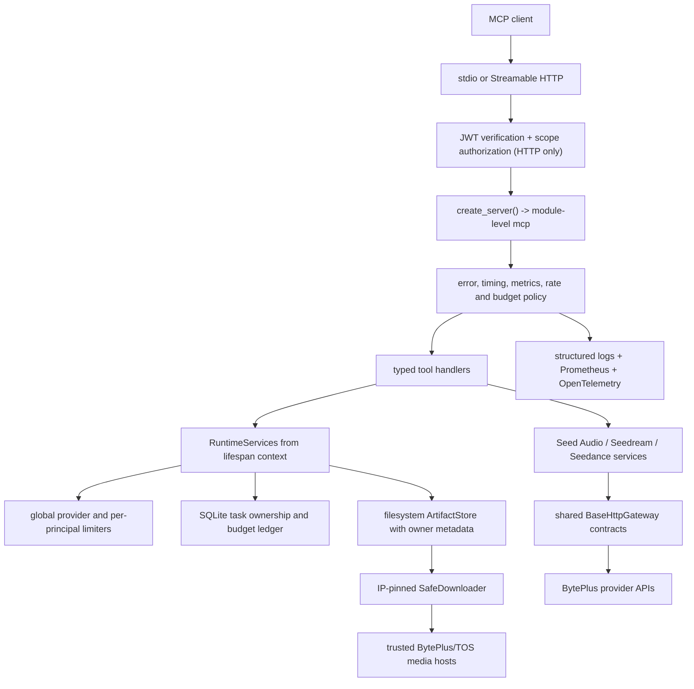

<!-- markdownlint-disable MD013 MD024 MD025 MD060 -->

# ModelArk MCP Codebase Gap Remediation Plan

## Outcome

Complete the remediation work identified in
`REVIEW_CODEBASE_GAP_ANALYSIS.md`, repair the partially implemented changes
already in the worktree, and leave the server reproducible from a clean clone,
secure for explicitly configured HTTP deployment, observable, container-ready,
and fully verified by offline automated tests.

The work is complete only when:

- all source packages required at runtime are tracked and included in the wheel;
- `pyproject.toml`, `uv.lock`, the virtual environment, CI, and the Docker image
  resolve the same dependency graph;
- lint, formatting, type checking, unit, contract, integration, E2E, security,
  build, audit, and container smoke gates pass;
- generated media and Seedance tasks enforce tenant/principal ownership;
- HTTP deployment fails closed unless authentication is explicitly configured;
- every gap-analysis item is either implemented or resolved by an explicit,
  tested non-feature decision reflected in current documentation.

## Starting Point

This plan continues from a dirty worktree produced by an earlier agent. Preserve
all existing user and agent changes until each is reconciled. Do not reset the
worktree or create a commit unless the user separately requests one.

Verified baseline on 2026-07-23:

- Ruff passes.
- Mypy passes for 46 source files.
- `git diff --check` passes.
- Pytest reports 389 passed and 18 failed; failures depend on live DNS.
- The worktree contains 44 modified files, one deletion, and 14 untracked paths.
- `src/modelark_mcp/artifacts/` is accidentally ignored by `.gitignore` and is
  absent from `HEAD` even though runtime code imports it.
- The Docker runtime invokes an unavailable `uv` executable.
- `pyproject.toml` and `uv.lock` disagree about `cachetools` and `structlog`.
- `HANDOVER.md` contains completion claims not supported by the current code.

## Progress

- **2026-07-23 — Checkpoint A completed.** The artifact source package is no
  longer ignored, the wheel contains all artifact modules, cachetools and
  prometheus-client are locked as runtime dependencies, the offline/security
  test dependencies are locked, structlog was removed from the environment,
  and `uv lock --check`, `uv sync --locked --offline`, and `uv build --offline`
  pass.
- **2026-07-23 — Checkpoint B completed.** Media-category policy is type-owned,
  URL validation is deterministic and rejects mixed/transition addresses, the
  downloader pins validated IPs across redirects with Host/SNI preservation and
  streaming size limits, artifact IDs and paths are canonicalized, and v2
  metadata enforces tenant/principal ownership while legacy metadata is
  local-only. Ruff, strict mypy, and all 425 tests pass; the focused security
  suite passes 62 tests without external DNS or network access.
- **2026-07-23 — Checkpoint C completed.** A FastMCP server factory and lifespan
  own artifact, SQLite ownership/budget, bounded cache, and shared limiter
  services. Generation calls reserve budgets, process-wide and per-principal
  concurrency is enforced, task access is ownership-scoped, and retries honor
  Retry-After while never replaying ambiguous mutations. All 436 tests pass.
- **2026-07-23 — Checkpoint D completed.** Provider errors are explicit MCP
  error results with normalized structured content; success schemas remain
  stable. Domain errors/subtitles/task settings and media/status values are
  typed, model capabilities use explicit bindings, prompt and startup settings
  are constrained, and precise stderr-only redaction replaces broad generic
  field suppression. Ruff, strict mypy, and all 440 tests pass.
- **2026-07-23 — Checkpoint E completed.** JWT verification, component scopes,
  principal/tenant derivation, Host/Origin protection, streamed request limits,
  liveness/readiness routes, Prometheus metrics, and provider tracing are wired
  into deterministic HTTP server tests. All 449 tests pass.
- **2026-07-23 — Checkpoint F implementation completed; external verification
  pending.** CI, Docker, coverage enforcement, offline socket blocking, security
  scans, packaging, smoke scripts, and current-behavior documentation are in
  place. The local gate passes Ruff, strict mypy, 449 tests at 87.18% branch
  coverage, Bandit, detect-secrets, lock/offline sync, and sdist/wheel builds.
  `pip-audit` awaits authorized vulnerability-service egress and the container
  smoke awaits an available Docker daemon; both are enforced by CI. The plan is
  intentionally not marked `shipped` until those two external gates execute.
- **2026-07-23 — verification expansion.** The FastMCP E2E layer now exercises
  every registered tool surface, including all three variation tools, Seed Audio,
  and the Seedance create/get/list/cancel lifecycle, and unit tests cover both
  stdio and HTTP entrypoint dispatch. The full offline gate now reports 456
  passing tests and 87.92% branch coverage. A real loopback HTTP process
  returned healthy, ready, and Prometheus metrics responses.
- **2026-07-23 — live provider verification completed.** Authorized baseline
  smoke testing generated and durably retrieved Seedream image, Seed Audio, and
  Seedance video output. The variation smoke test completed three images, three
  audio clips, and two videos, including live list/get persistence. It exposed
  and fixed the current ModelArk list query/response contract
  (`page_num`/`filter.*`, `items`) and replaced an invalid 1x1 video fixture
  with a generated image. The offline gate now reports 459 passing tests and
  88.08% branch coverage. Docker health and local `pip-audit` remain CI-only
  because the Docker daemon and vulnerability-service egress are unavailable.

## Design Decisions

1. **Preserve a module-level `mcp` export, but build it with a factory.** FastMCP
   deployment discovery expects a module-level `mcp`, `server`, or `app`. A
   deterministic `create_server()` factory will construct fresh instances for
   tests while `mcp = create_server()` remains available to the CLI. Importing
   the module may construct component definitions but must not open clients,
   create directories, validate DNS, or emit startup logs.
2. **Manage mutable resources through a FastMCP lifespan.** Artifact storage,
   ownership persistence, budgets, shared concurrency limiters, and optional
   telemetry exporters are created once at server startup and closed once at
   shutdown. Tools access them through `ctx.lifespan_context` rather than a
   module singleton.
3. **Use FastMCP-native HTTP authentication and authorization.** Configure a
   `JWTVerifier` for production HTTP, use `require_scopes()` on tools/resources,
   and derive application ownership from the verified token. Stdio keeps the
   local principal because OAuth is an HTTP transport concern.
4. **Return structured MCP error results.** Provider failures return
   `ToolResult(content=..., structured_content=..., is_error=True)`. The normal
   success contract retains its Pydantic output schema; internal details remain
   masked.
5. **Pin outbound artifact downloads to validated IPs.** Resolve once, reject all
   unsafe addresses, connect to the selected IP, retain the original `Host`
   header and TLS SNI hostname, and repeat the procedure for every redirect.
6. **Keep billable retries conservative.** Retry only errors explicitly marked
   `retryable=True` and `ambiguous_completion=False`. Never blindly replay a
   timeout or mutation whose completion is unknown.
7. **Make tests network-independent.** All DNS and HTTP behavior is injected or
   mocked. A test guard prevents accidental socket access.
8. **Document only shipped behavior.** Object-store persistence, multi-replica
   guarantees, auth, metrics, and health endpoints appear in `docs/` only after
   their acceptance tests pass.

## Target Architecture



## Phase 0 — Make the Worktree Reproducible

### 0.1 Restore the artifact package to version-control visibility

Change `.gitignore` so runtime media output is ignored without matching Python
source directories:

```gitignore
/.artifacts/
/artifacts/
```

Then verify these files appear as trackable source paths:

```text
src/modelark_mcp/artifacts/__init__.py
src/modelark_mcp/artifacts/store.py
src/modelark_mcp/artifacts/filesystem_store.py
src/modelark_mcp/artifacts/object_store.py
src/modelark_mcp/artifacts/registry.py
```

The registry will be removed in Phase 2 after lifespan injection replaces it;
it must remain visible until that migration is complete. Add a wheel-content
test that builds the package and asserts the artifact modules are present.

### 0.2 Reconcile dependencies through `uv`

Do not hand-edit dependency declarations. Use dependency commands so
`pyproject.toml` and `uv.lock` change together:

```bash
uv add "cachetools>=7.1.4,<8"
uv remove structlog
uv add prometheus-client
uv add --dev pytest-socket pytest-cov bandit
```

If FastMCP telemetry requires an exporter not already present, add the minimum
OTLP exporter package only after verifying the installed FastMCP telemetry API.
Run `uv sync --locked` and verify the resolved cachetools major matches the
declared range and `structlog` is absent unless retained transitively by another
package.

CI must use `uv sync --locked`, not a stale `--frozen` environment that silently
accepts project/lock disagreement.

### 0.3 Isolate unrelated changes

The newline-only changes under `.agents/skills/mcp-builder/reference/` are not
part of remediation. Do not overwrite or commit them. Record them as pre-existing
worktree changes and keep implementation edits scoped to project files.

### Phase 0 acceptance

- `git check-ignore src/modelark_mcp/artifacts/filesystem_store.py` returns no
  match.
- A clean wheel contains every `modelark_mcp.artifacts` module.
- `uv lock --check` and `uv sync --locked` pass.
- `uv tree` agrees with the declared direct dependencies.

## Phase 1 — Close Security and Artifact-Persistence Gaps

### 1.1 Make media categories type-owned, not client-controlled

Remove the public `media_category` Pydantic field from `MediaSource`. Replace it
with a class-level policy excluded from generated MCP schemas:

```python
class MediaSource(BaseModel):
    MEDIA_CATEGORY: ClassVar[MediaType] = "image"

class SeedanceImageInput(MediaSource):
    MEDIA_CATEGORY: ClassVar[MediaType] = "image"

class SeedanceAudioInput(MediaSource):
    MEDIA_CATEGORY: ClassVar[MediaType] = "audio"
```

`MediaSource.validate_source()` will use `type(self).MEDIA_CATEGORY` for MIME
and decoded-size limits. `AudioReference` remains explicitly audio-specific.
Add schema tests proving `media_category` is not callable input and validation
tests proving audio/image/video limits cannot be selected by the caller.

### 1.2 Split URL policy into pure validation and injected resolution

Refactor `security/url_policy.py` around explicit contracts:

```python
Resolver = Callable[[str, int], Sequence[ResolvedAddress]]

def validate_url_syntax(url: str, *, allow_http: bool = False) -> ParsedUrl: ...
def resolve_public_addresses(
    parsed: ParsedUrl,
    *,
    resolver: Resolver = system_resolver,
) -> tuple[IPAddress, ...]: ...
def validate_url(
    url: str,
    *,
    allow_http: bool = False,
    resolver: Resolver = system_resolver,
) -> ValidatedUrl: ...
```

Reject credentials in URLs, non-HTTPS schemes, missing hosts, unsafe ports,
loopback/private/link-local/multicast/reserved/unspecified addresses, cloud
metadata hosts, IPv4-mapped IPv6, and transition-address forms. Normalize IDNA
hostnames before allowlist checks.

Pydantic model tests inject a deterministic resolver. No test may resolve a live
hostname.

### 1.3 Introduce an IP-pinned safe downloader

Create `security/safe_downloader.py`:

```python
class DownloadedMedia(BaseModel):
    body: bytes
    content_type: str | None
    final_url: str

class SafeDownloader:
    async def download(
        self,
        url: str,
        *,
        trusted_hosts: HostPolicy,
        max_bytes: int,
        max_redirects: int = 5,
    ) -> DownloadedMedia: ...

    async def close(self) -> None: ...
```

For each request and redirect:

1. Parse and normalize the URL.
2. Enforce the BytePlus/TOS hostname allowlist.
3. Resolve and reject any unsafe result.
4. Select a validated IP and request `https://<ip>/<path>` with the original
   `Host` header and HTTPX `extensions={"sni_hostname": original_hostname}`.
5. Use `trust_env=False` and `follow_redirects=False` so environment proxies and
   implicit redirects cannot bypass the policy.
6. Resolve relative `Location` headers with `urljoin()` and repeat validation.
7. Stream response bytes, reject an oversized `Content-Length` early, and abort
   if accumulated bytes exceed the media-specific limit.

If every resolved address is not public, reject the hostname instead of choosing
one safe address from a mixed response. Tests cover rebinding simulation, SNI,
relative redirects, redirect loops, untrusted domains, oversized chunked bodies,
MIME mismatch, and cleanup after exceptions.

### 1.4 Harden artifact identifiers and metadata

Use `UUID(artifact_id, version=4)` plus canonical-string comparison instead of a
permissive regex. Resolve every computed path and assert it remains under the
configured artifact root before reading or writing.

Create a versioned metadata model:

```python
class ArtifactMetadata(BaseModel):
    schema_version: Literal[2] = 2
    ref: ArtifactRef
    principal_id: str
    tenant_id: str
```

`FilesystemArtifactStore.put_base64()` and `copy_from_trusted_url()` require a
resolved principal context and write owner metadata atomically. `get()` and
deletion paths compare both tenant and principal. Existing version-1 metadata is
treated as owned by the local stdio principal and is never exposed to remote
tenants.

Replace raw Base64 decoding with `decode_base64_safely()` and validate MIME at
both request-model and storage boundaries. Storage is a trust boundary and must
not rely only on upstream callers.

### Phase 1 acceptance

- C1, C2, C3, H1, M9, and the discovered media-category bypass are covered by
  negative security tests.
- Artifact reads reject malformed UUIDs and cross-principal/cross-tenant access.
- No redirect or downloader test requires external DNS or network access.
- Large downloads stop at the configured byte limit without buffering the full
  response.

## Phase 2 — Runtime Lifecycle, Concurrency, Retries, and Ownership

### 2.1 Replace mutable module singletons with lifespan services

Create `src/modelark_mcp/runtime.py`:

```python
@dataclass(slots=True)
class RuntimeServices:
    settings: Settings
    artifact_store: ArtifactStore
    safe_downloader: SafeDownloader
    ownership_store: TaskOwnershipStore
    budget_ledger: BudgetLedger
    provider_limiters: ProviderLimiters

async def create_runtime_services(settings: Settings) -> RuntimeServices: ...
async def close_runtime_services(runtime: RuntimeServices) -> None: ...
def get_runtime(ctx: Context) -> RuntimeServices: ...
```

Define a FastMCP v3 lifespan that yields `{"runtime": runtime}` and closes the
artifact downloader/store, database handles, and telemetry exporters in
`finally`. Remove `artifacts/registry.py` after all tool, script, and test imports
move to runtime injection.

Direct tool unit tests use `FakeContext(lifespan_context={"runtime": runtime})`.
E2E tests construct a fresh server and runtime per fixture rather than reloading
modules or mutating removed globals.

### 2.2 Introduce a deterministic server factory

Refactor `server.py`:

```python
def create_server(
    settings: Settings | None = None,
    *,
    runtime_factory: RuntimeFactory = create_runtime_services,
) -> FastMCP: ...

mcp = create_server()
```

`register_tools(server, settings)` receives the server explicitly, is idempotent
per server instance, and does not mutate a global server. All filesystem/client
initialization stays in the lifespan. Tests call `create_server(test_settings)`;
`importlib.reload()` is removed.

### 2.3 Enforce process-wide and per-principal concurrency

Create reusable policies in `runtime/concurrency.py` or, if the runtime remains a
single module, adjacent private classes:

```python
class ProviderLimiters:
    def provider(self, provider: ProviderName) -> asyncio.Semaphore: ...
    def principal(self, principal: PrincipalContext) -> asyncio.Semaphore: ...

async def run_variation_batch(
    count: int,
    timeout: float,
    factory: Callable[[int], Awaitable[VariationResult]],
    *,
    limiter: asyncio.Semaphore,
) -> VariationSummary: ...
```

Semaphores are created once per runtime, not once per tool call. All generation
tools, including non-variation tools, acquire the provider and principal limits.
Bound the per-principal limiter map with TTL/LRU eviction so identities cannot
create an unbounded dictionary.

### 2.4 Add safe retry/backoff

Implement without another dependency:

```python
@dataclass(frozen=True)
class RetryPolicy:
    max_attempts: int = 3
    base_delay_seconds: float = 0.25
    max_delay_seconds: float = 4.0
    jitter_ratio: float = 0.2

async def call_with_retry(
    operation: Callable[[], Awaitable[T]],
    *,
    policy: RetryPolicy,
    sleep: AsyncSleep = asyncio.sleep,
) -> T: ...
```

Retry only `ProviderError` values where `retryable` is true and
`ambiguous_completion` is false. Mark mutation timeouts and uncertain 5xx
generation failures as ambiguous. Honor `Retry-After` for 429 responses. Inject
sleep/randomness in tests so backoff tests are instantaneous and deterministic.

### 2.5 Persist task ownership and budgets

Use the standard-library `sqlite3` module behind an async lock; the data volume is
small and does not justify another database dependency.

```python
class TaskOwnershipStore(Protocol):
    async def record(self, task_id: str, owner: PrincipalContext) -> None: ...
    async def require_owner(self, task_id: str, owner: PrincipalContext) -> None: ...
    async def list_task_ids(self, owner: PrincipalContext) -> set[str]: ...

class BudgetLedger(Protocol):
    async def reserve(self, owner: PrincipalContext, estimate: CostEstimate) -> Reservation: ...
    async def commit(self, reservation: Reservation) -> None: ...
    async def release(self, reservation: Reservation) -> None: ...
```

Record ownership immediately after Seedance task creation. Require ownership for
get, cancel, and delete. Filter list results to locally owned tasks so one tenant
cannot enumerate another tenant's provider tasks.

Budget reservations are keyed by tenant, principal, and UTC date. Successful or
ambiguous billable calls commit the reservation; definite pre-dispatch failures
release it. If no daily limit is configured, the ledger records usage without
blocking.

### Phase 2 acceptance

- H4, H5, M4, M14, L9, L10, task ownership, and cost enforcement have unit and
  concurrent E2E coverage.
- Two simultaneous variation calls never exceed the configured process-wide
  provider limit.
- Server fixtures do not leak artifact stores, caches, task ownership, or budgets
  between tests.
- Retry tests prove ambiguous mutations are never replayed.

## Phase 3 — Error Contracts, Domain Types, and Configuration

### 3.1 Return structured provider errors

Replace `raise_tool_error()` with:

```python
def provider_error_result(exc: ProviderError) -> ToolResult:
    payload = exc.error.model_dump(mode="json")
    return ToolResult(
        content=f"{payload['provider']} {payload['operation']} failed: {payload['message']}",
        structured_content={"error": payload},
        is_error=True,
    )
```

Tool functions return `SuccessOutput | ToolResult`. Registration passes the
success Pydantic schema explicitly so discovery remains stable:

```python
server.tool(
    output_schema=SeedreamGenerateOutput.model_json_schema(),
    annotations=...,
)(seedream_generate_image)
```

FastMCP passes an explicit `ToolResult` through unchanged, allowing error
`structuredContent` and `isError=true` without leaking traceback details. Tests
assert content, structured content, and raw MCP `isError` behavior.

### 3.2 Complete domain typing

Add and use explicit models:

```python
class VariationError(BaseModel):
    code: str
    message: str
    request_id: str | None = None
    retryable: bool = False
    ambiguous_completion: bool = False

class SubtitleUtterance(BaseModel): ...
class SubtitleWord(BaseModel): ...
class SeedanceTaskError(BaseModel): ...
class SeedanceTaskSettings(BaseModel): ...
```

Known provider fields are typed. Provider-extension models may use
`model_config = ConfigDict(extra="allow")` to preserve forward compatibility
without returning unstructured dictionaries throughout the domain layer.

Convert reusable enumerable contracts to `StrEnum`: `MediaType`,
`MediaSourceKind`, `SeedanceTaskStatus`, product names, model families, and
artifact backends. Keep `Literal` only for fields where it materially improves a
single tool schema.

### 3.3 Replace model-family string inference with explicit bindings

Introduce typed configuration:

```python
class ImageModelBinding(BaseModel):
    model_id: str
    family: SeedreamFamily

class VideoModelBinding(BaseModel):
    model_id: str
    family: SeedanceFamily

class ModelBindings(BaseModel):
    seedream: list[ImageModelBinding]
    seedance: list[VideoModelBinding]
```

Load JSON environment variables (`SEEDREAM_MODEL_BINDINGS` and
`SEEDANCE_MODEL_BINDINGS`) while retaining the existing single-model variables as
a documented compatibility path. Default bindings are explicit; arbitrary model
IDs require an explicit family. Validate duplicate IDs, unknown family values,
missing defaults, and empty registries at startup. Remove unused
`SEEDANCE_MODEL_FAMILY` or wire it into the compatibility path—never leave a
declared setting unused.

### 3.4 Finish input constraints and configuration validation

- Seedream prompt: 1–4,000 characters.
- Seedance prompt: `None` or 1–4,000 characters; reject empty strings.
- Validate configured URL schemes/hosts, positive TTLs/timeouts/limits, writable
  artifact directory during lifespan readiness, valid auth mode, and mutually
  compatible transport/auth settings.
- Avoid warnings for a missing `/run/secrets` directory by configuring
  `secrets_dir` only when it exists.
- Keep `refresh_settings()` for tests, but production runtime treats settings as
  immutable after startup.

### 3.5 Correct logger behavior

Keep the existing standard-library JSON logger and remove all claims that it uses
`structlog`. Define precise redaction rules for credentials, Base64-bearing fields,
full prompts, subtitles, and full media URLs. Do not redact harmless generic
fields such as every `data` object unless its key/path is sensitive.

Move log-level parsing into `Settings`; reject invalid levels instead of silently
falling back to INFO. Tests cover nested objects, lists, similarly named harmless
keys, and stderr-only emission.

### Phase 3 acceptance

- H6, M1, M2, M3, M6, M13, L2, L3, L4, L5, and L7 are resolved.
- Every tool success still advertises and returns its expected output schema.
- Every provider failure returns `isError=true` with a machine-readable normalized
  error and a concise safe text block.
- No configuration variable is documented but ignored.

## Phase 4 — Secure HTTP, Health, Metrics, and Tracing

### 4.1 Add explicit auth configuration

Extend `Settings`:

```python
class AuthMode(StrEnum):
    LOCAL = "local"
    JWT = "jwt"

mcp_auth_mode: AuthMode = AuthMode.LOCAL
mcp_jwt_jwks_uri: AnyHttpUrl | None = None
mcp_jwt_issuer: str | None = None
mcp_jwt_audience: str | None = None
mcp_tenant_claim: str = "tenant_id"
```

`build_auth_provider(settings)` returns a FastMCP `JWTVerifier` for JWT mode.
Validation rules:

- stdio may use local mode;
- HTTP bound only to loopback may use local mode for development;
- HTTP bound to `0.0.0.0` or a non-loopback address requires JWT mode;
- JWT mode requires JWKS URI, issuer, and audience;
- production examples never use static/debug tokens.

Use FastMCP `StaticTokenVerifier` or generated RSA test keys only in tests.

### 4.2 Add scope authorization and principal derivation

Register components with required scopes:

| Component | Required scope |
|---|---|
| Seed Audio generation tools | `seed:audio:generate` |
| Seedream generation tools | `seedream:generate` |
| Seedance create/variation | `seedance:create` |
| Seedance get/list | `seedance:read` |
| Seedance cancel/delete | `seedance:delete` |
| Artifact resource | `artifacts:read` |

Create an application-level `PrincipalContext` to avoid name collision with
FastMCP's auth context:

```python
class PrincipalContext(BaseModel):
    principal_id: str
    tenant_id: str
    scopes: frozenset[str]
    transport: Literal["stdio", "http"]
```

For HTTP, derive it from `get_access_token()` using `sub`, then `client_id`, and
the configured tenant claim. Missing identity/tenant claims are authorization
errors. For stdio, use the stable local principal/tenant.

### 4.3 Add real HTTP health/readiness endpoints

Use FastMCP custom routes:

```python
@server.custom_route("/health", methods=["GET"])
async def health(request: Request) -> JSONResponse: ...

@server.custom_route("/ready", methods=["GET"])
async def ready(request: Request) -> JSONResponse: ...
```

`/health` reports process liveness. `/ready` verifies runtime initialization,
artifact-root writability, ownership database connectivity, and configuration
validity without calling billable providers. Responses contain no credentials,
paths, model IDs, or tenant data.

### 4.4 Add Prometheus metrics and OpenTelemetry

Add `observability/metrics.py` with low-cardinality metrics:

- `modelark_mcp_tool_requests_total{tool,status}`;
- `modelark_mcp_tool_duration_seconds{tool}`;
- `modelark_mcp_provider_requests_total{provider,operation,status}`;
- `modelark_mcp_provider_duration_seconds{provider,operation}`;
- `modelark_mcp_artifact_operations_total{operation,status,media_type}`;
- `modelark_mcp_budget_rejections_total{product}`;
- `modelark_mcp_retry_attempts_total{provider,operation}`.

Never label metrics with principal, tenant, prompt, task ID, request ID, model ID,
or URL. Expose `/metrics` through a custom route and document network-level access
control.

Use FastMCP's OpenTelemetry integration for MCP spans and add child spans around
provider calls and artifact persistence. Configure exporters through standard
`OTEL_*` variables; when no exporter is configured, tracing must add negligible
overhead and no network calls.

### 4.5 Enforce origin and request policies

Keep FastMCP at `>=3.4.4,<4`. Configure explicit trusted hosts/origins for HTTP,
request/body size limits, and middleware ordering:

```text
error handling -> timing/tracing -> structured logging -> auth/scope checks
-> per-principal rate/concurrency -> metrics -> handler
```

Test missing/invalid token, wrong issuer/audience, insufficient scope, invalid
Origin, oversized body, cross-tenant artifact access, and cross-tenant task access.

### Phase 4 acceptance

- M8, M10, and M11 are resolved.
- HTTP on a non-loopback interface cannot start in local/no-auth mode.
- Authenticated E2E tests cover valid and invalid token/scope/tenant paths.
- `/health`, `/ready`, and `/metrics` are exercised over real ASGI HTTP transport.
- Stdio behavior remains backward compatible and does not require a token.

## Phase 5 — Tests, CI, Container, and Documentation

### 5.1 Make the entire test suite offline and layered

Add an autouse network guard using `pytest-socket`; individual tests may enable
only local ASGI/in-process sockets when strictly necessary. Inject resolvers,
HTTPX mock transports, clocks, random jitter, and sleeps.

Complete the matrix:

| Layer | Required coverage |
|---|---|
| Unit | settings, model bindings, media schemas, URL/IP policy, downloader, artifact ownership, budget ledger, retries, global limiters, logger, metrics |
| Contract | both gateways, all provider response/error mappings, retry flags and ambiguity |
| Integration | every tool through mocked provider and real filesystem/SQLite runtime |
| E2E | FastMCP client discovery/calls/resources for Seed Audio, Seedream, and full Seedance create→poll→persist→read flow |
| HTTP security | JWT, scopes, origins, tenant isolation, health/readiness/metrics |
| Packaging | wheel/sdist contents and installed-entrypoint smoke |
| Container | build, start, `/health`, `/ready`, non-root write to artifact volume |

Replace `importlib.reload()` fixtures with `create_server(test_settings)`. Ensure
the persistence cache/ownership database and lifespan close cleanly after every
test. Add coverage thresholds after establishing the baseline; target at least
90% statements for security/runtime modules and 85% overall without excluding
hard branches merely to raise the number.

### 5.2 Strengthen CI

Update `.github/workflows/ci.yml` to run:

1. dependency lock validation and `uv sync --locked`;
2. Ruff check and format check;
3. strict Mypy for `src`;
4. offline pytest with coverage;
5. Bandit, pip-audit, and detect-secrets;
6. pre-commit without mutation;
7. wheel/sdist build and installed-wheel smoke test;
8. Docker build and health smoke test.

Pin GitHub Actions and the uv container/action to reviewed immutable versions or
commit SHAs, with Dependabot maintaining updates. CI must fail if it modifies the
worktree or if the lock file is stale.

### 5.3 Repair the Docker image

Use a pinned `uv` builder image/version. In the runtime image, execute the
installed binary directly instead of invoking absent `uv`:

```dockerfile
CMD ["/app/.venv/bin/python", "-m", "modelark_mcp"]
```

Alternatively use `/app/.venv/bin/fastmcp` only if the module entrypoint cannot
express all validated settings. Copy the installed virtual environment and the
application package, run as UID/GID 1001, and keep only the artifact directory
writable.

Replace the parent-PID health check with an HTTP probe against `/health`. The
readiness probe targets `/ready`. Validate SIGTERM shutdown and lifespan cleanup.
Do not claim multi-replica support while the filesystem/SQLite backend is active.

### 5.4 Synchronize documentation and review status

Update only current behavior in:

- `README.md`;
- `docs/configuration.md`;
- `docs/transports.md`;
- `docs/deployment.md`;
- `docs/tools.md`;
- `docs/api-reference.md`;
- `docs/integration-guide.md`;
- `docs/troubleshooting.md`.

Remove claims that the logger uses structlog, that object-store persistence is
implemented, or that horizontal scaling needs no shared state. Document JWT and
scope configuration, health/readiness/metrics, filesystem single-instance limits,
safe retry semantics, budgets, and the exact Docker command.

Append a dated remediation-status section to
`REVIEW_CODEBASE_GAP_ANALYSIS.md`. Preserve the original findings and mark each as
resolved, superseded, or intentionally deferred with evidence. Replace or update
`HANDOVER.md` so it reports actual gate outputs rather than inherited claims.

### Phase 5 acceptance

- C4, H8, H9, H10, M12, L1, L6, and L8 are resolved.
- Every CI job passes from a clean checkout.
- The container starts, becomes healthy/ready, handles an authenticated HTTP MCP
  call, and shuts down cleanly.
- Docs contain no future behavior presented as shipped.

## Gap-to-Phase Traceability

| Finding | Resolution phase |
|---|---|
| C1 dead media policy | Phase 1.1 and 1.4 |
| C2 unvalidated user URLs | Phase 1.2 |
| C3 artifact path traversal | Phase 1.4 |
| C4 no CI/CD | Phase 5.2 |
| H1 unsafe redirects | Phase 1.3 |
| H2 gateway duplication | Preserve and verify in Phases 2 and 5 |
| H3 variation duplication | Preserve and verify in Phases 2 and 5 |
| H4 unbounded persistence cache | Phase 2.1 and 2.5 |
| H5 circular server/tool dependency | Phase 2.1 |
| H6 unstructured tool failures | Phase 3.1 |
| H7 incomplete transport errors | Preserve and extend in Phase 2.4 |
| H8 missing E2E coverage | Phase 5.1 |
| H9 unit-test gaps | Phase 5.1 |
| H10 no container deployment | Phase 5.3 |
| M1 unused structlog | Phase 0.2 and 3.5 |
| M2 assert validation | Preserve and verify in Phase 3.4 |
| M3 fragile model-family inference | Phase 3.3 |
| M4 import-time side effects | Phase 2.1 and 2.2 |
| M5 production test utilities | Preserve and verify in Phase 5.1 |
| M6 prompt limits | Phase 3.4 |
| M7 missing base-tool cost logs | Preserve and extend with budgets in Phase 2.5 |
| M8 HTTP auth/ownership stub | Phase 2.5 and Phase 4 |
| M9 DNS TOCTOU | Phase 1.3 |
| M10 no HTTP health endpoint | Phase 4.3 |
| M11 no metrics/tracing | Phase 4.4 |
| M12 missing deployment docs | Phase 5.4 |
| M13 empty request ID | Preserve and verify in Phase 3.1 |
| M14 invocation-local semaphore | Phase 2.3 |
| L1 incorrect tool count | Preserve and verify in Phase 5.4 |
| L2 duplicated task status | Phase 3.2 |
| L3 inconsistent enums | Phase 3.2 |
| L4 untyped domain dictionaries | Phase 3.2 |
| L5 no settings refresh | Preserve for tests in Phase 3.4 |
| L6 incomplete pre-commit security gates | Phase 5.2 |
| L7 unbounded dependency majors | Phase 0.2 |
| L8 SSRF mocked in integration tests | Phase 1 and 5.1 |
| L9 fragile module reload | Phase 2.2 and 5.1 |
| L10 no retry/backoff | Phase 2.4 |
| Ignored artifact source package | Phase 0.1 |
| Dependency/lock drift | Phase 0.2 |
| Client-selectable media category | Phase 1.1 |
| Broken Docker runtime and fake health check | Phase 5.3 |
| Inaccurate handover/deployment claims | Phase 5.4 |

## Verification Commands

Run these from the repository root after each applicable phase:

```bash
git diff --check
uv lock --check
uv sync --locked
uv run ruff check src tests scripts
uv run ruff format --check src tests scripts
uv run mypy src
uv run pytest tests -q --disable-socket --cov=modelark_mcp --cov-report=term-missing
uv run bandit -r src/modelark_mcp
uv run pip-audit --strict
uv run pre-commit run --all-files
uv build --offline
```

Packaging/container verification:

```bash
python -m zipfile -l dist/*.whl
docker build -t modelark-mcp:remediation .
docker run --rm --name modelark-mcp-remediation modelark-mcp:remediation
```

Use an isolated temporary directory and non-production static test tokens for the
container smoke test. Never use provider credentials or make billable calls in CI.

## Implementation Sequence and Checkpoints

Execute phases in order. Do not begin HTTP auth/observability work on top of an
untracked artifact package or stale lock file.

1. **Checkpoint A — reproducible tree:** Phase 0 complete, clean-clone package
   imports successfully.
2. **Checkpoint B — security core:** Phase 1 complete, focused security tests pass.
3. **Checkpoint C — deterministic runtime:** Phase 2 complete, factory/lifespan and
   concurrent tests pass.
4. **Checkpoint D — stable contracts:** Phase 3 complete, MCP schema snapshots and
   structured error E2E tests pass.
5. **Checkpoint E — protected HTTP:** Phase 4 complete, authenticated HTTP matrix
   passes.
6. **Checkpoint F — release candidate:** Phase 5 complete, all gates and container
   smoke pass from a clean checkout.

After each checkpoint, update this plan's `updated` date and add a short status
note. Mark `status: shipped` only after Checkpoint F.

## Risks and Explicit Tradeoffs

| Risk | Mitigation |
|---|---|
| IP pinning interacts with TLS and HTTPX internals | Use the documented `sni_hostname` request extension, keep the downloader behind a small protocol, and pin compatible HTTPX/httpcore major versions |
| Auth configuration can lock out local users | Skip OAuth checks for stdio and provide generated-token HTTP tests plus clear validation errors |
| SQLite is not a multi-replica ownership/budget store | Document single-instance HTTP support; do not claim horizontal scaling until a shared backend is implemented |
| Structured error results differ from success schemas | Return explicit `ToolResult` only for errors and retain explicit success output schemas during registration |
| Retry can duplicate billable generation | Require `retryable` and non-ambiguous errors; never retry mutation timeouts |
| The current worktree contains changes from another agent | Reconcile file-by-file, avoid resets, and report any overlap before overwriting user-owned edits |
| Scope is large | Preserve phase gates; keep each phase independently testable and do not mix documentation claims ahead of shipped code |

## Sources

Official documentation checked on 2026-07-23:

- [FastMCP server](https://gofastmcp.com/servers/server) — server construction
  and module-level configuration.
- [FastMCP lifespans](https://gofastmcp.com/servers/lifespan) — once-per-server
  setup/teardown and lifespan context.
- [FastMCP testing](https://gofastmcp.com/servers/testing) — in-memory FastMCP
  client fixtures and async pytest configuration.
- [FastMCP tools](https://gofastmcp.com/servers/tools) — typed output schemas,
  `ToolResult`, structured content, and controlled tool errors.
- [FastMCP token verification](https://gofastmcp.com/servers/auth/token-verification)
  — `JWTVerifier`, static test tokens, issuer/audience validation, and verifier
  client lifecycle.
- [FastMCP authorization](https://gofastmcp.com/servers/authorization) — scope
  checks, component authorization, middleware, and access-token context.
- [FastMCP HTTP deployment](https://gofastmcp.com/deployment/http) — custom health
  routes, authenticated HTTP, sessions/stateless deployment, and ASGI lifespan.
- [FastMCP middleware](https://gofastmcp.com/servers/middleware) — middleware
  ordering and cross-cutting request policies.
- [HTTPX request extensions](https://www.python-httpx.org/advanced/extensions/) —
  explicit-IP connections with original Host and TLS `sni_hostname`.
- [HTTPX transports](https://www.python-httpx.org/advanced/transports/) — custom
  async transport and mock-transport contracts.
- [actions/checkout](https://github.com/actions/checkout) and
  [astral-sh/setup-uv](https://github.com/astral-sh/setup-uv) — reviewed action
  versions, immutable revision pins, and built-in uv caching.
- [Official Python image](https://hub.docker.com/_/python/) — available Python
  3.12 slim variants and the current exact patch tag used by the container.
