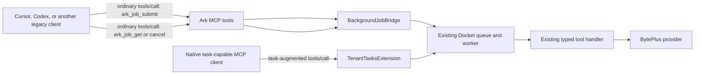
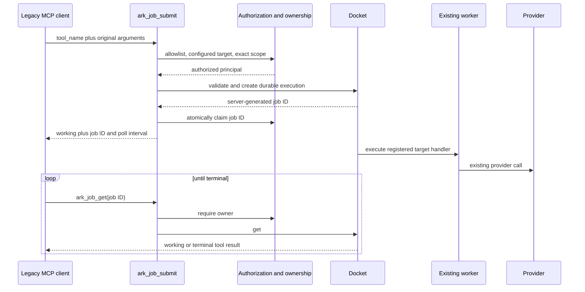

# MCP Background Job Compatibility

## Outcome

Make every task-enabled Ark MCP operation usable from clients that can call
ordinary MCP tools but cannot negotiate FastMCP's task extension, including the
currently tested Cursor and Codex client paths. A compatibility call must return
a durable server job ID before the client's foreground timeout, continue work in
the existing Docket worker, and expose polling and cancellation through ordinary
`tools/call` requests.

The implementation must retain the native task-augmented path for clients that
support it. It must not make long-running tools synchronous, extend client
timeouts as the primary remedy, move work to a second queue, weaken target-tool
authorization, or duplicate a billable provider submission during retries or
worker redelivery.

## Problem Statement and Evidence

The server currently registers 19 operations with
`TaskConfig(mode="required")` and eight provider-status/persistence operations
with `TaskConfig(mode="optional")` in `src/ark_mcp/server.py`. Required mode is
correct for preventing a 30- to 60-second foreground client deadline from
interrupting generation, understanding, transcription, upload, or persistence.
It also means a client that does not opt into the task extension is rejected
before the tool handler or provider is called.

This behavior is intentional in FastMCP:

- Task execution is negotiated by client capability, independently of whether
  the connection uses stdio or Streamable HTTP.
- `mode="required"` rejects a non-task-augmented call instead of falling back to
  synchronous execution.
- `mode="optional"` falls back to synchronous execution for an unsupported
  client, which would recreate the original timeout for slow operations.
- MCP Tasks remain experimental, so support cannot be assumed from a client's
  basic MCP connection or tool discovery support.

Repository evidence already includes
`tests/e2e/test_mcp_e2e.py::TestSeedUnderstandE2E::test_rejects_foreground_execution_before_provider_call`,
which uses a legacy client, receives the required-capability error, and proves
the provider was not called. The current Cursor documentation describes stdio,
HTTP, and SSE transports but does not document task-augmented tool calls. The
locally installed Codex CLI reports its `mcp_2026_07_28` feature as under
development and disabled.

## Goals

1. Provide a normal-tool compatibility path that works over both stdio and
   Streamable HTTP without task-extension negotiation.
2. Reuse FastMCP's existing Docket execution, task result, TTL, cancellation,
   snapshot, worker, and typed tool-result behavior.
3. Preserve application tenant/principal ownership in addition to FastMCP's
   internal client/subject task scope.
4. Preserve the exact authorization scope and strict argument validation of the
   target tool selected for execution.
5. Keep compatibility job IDs distinct from provider task IDs returned by
   Seedance, Seed 3D, and VOD operations.
6. Preserve the existing native task API and output contracts for task-capable
   clients.
7. Update the project skill so agents select the compatibility path only when
   the host cannot drive native tasks.

## Non-Goals

- Do not implement or emulate an alternative `tasks/*` protocol extension.
- Do not remove `TenantTasksExtension` or change native task modes.
- Do not create an asyncio-only fire-and-forget task; it would be lost on
  process exit and would bypass Docket's worker semantics.
- Do not expose arbitrary server tools through a generic dispatcher.
- Do not add `ark_job_list` in the first release; the caller receives the job
  ID at submission and can persist it. Listing can be added only with a bounded,
  paginated, tenant-filtered contract.
- Do not add an input/update API for elicitation in the first release. None of
  the currently allowlisted Ark background tools uses task elicitation. A future
  eliciting tool cannot enter the compatibility allowlist until an
  `ark_job_update` contract exists.
- Do not automatically retry an ambiguous provider submission. Existing
  provider reconciliation and replay rules remain authoritative.

## Architecture Decision

Add four ordinary MCP tools backed by a small repository-owned adapter around
the existing FastMCP task engine:

- `ark_job_submit`
- `ark_job_get`
- `ark_job_cancel`
- `ark_job_capabilities`

`ark_job_capabilities` gives clients a credential-filtered inventory of valid
targets, task mode, required scope, and the original tool's input schema. This
avoids asking an agent to guess the contents of the generic `arguments` object
and gives clients whose cached `tools/list` strips `execution.taskSupport` an
explicit compatibility contract.

`ark_job_submit` resolves only a centrally allowlisted task-enabled tool,
enforces its scope, validates its original arguments, and enqueues that exact
registered component in the Docket instance already owned by
`TenantTasksExtension`. `ark_job_get` and `ark_job_cancel` call the same
underlying result/cancellation functions used by the native extension after
performing the application's tenant/principal ownership check.

FastMCP 4.0.3 does not export a public server-side submit/get/cancel service;
the installed implementation exposes these operations in
`fastmcp_tasks.creation` and `fastmcp_tasks.handlers`. Keep those imports inside
one adapter module, narrow the dependency to the compatible FastMCP 4.0 minor
series, and add an adapter contract test. When FastMCP exposes a public API,
replace the adapter internals without changing the four MCP tool contracts.



## Compatibility Tool Contracts

### Shared types

Create `src/ark_mcp/domain/background_jobs.py` with fully described Pydantic
models. Use `pydantic.JsonValue` for dynamic JSON fields so the public contract
does not degrade to unbounded Python `Any`.

```python
BackgroundJobStatus = Literal[
    "working",
    "input_required",
    "completed",
    "failed",
    "cancelled",
]

class BackgroundJobError(BaseModel):
    code: int
    message: str
    data: JsonValue | None = None

class BackgroundJobToolResult(BaseModel):
    content: list[dict[str, JsonValue]]
    structured_content: dict[str, JsonValue] | None = None
    is_error: bool = False

class BackgroundJobAccepted(BaseModel):
    job_id: str
    target_tool: str
    status: Literal["working"]
    created_at: datetime
    ttl_ms: int
    poll_after_ms: int

class BackgroundJobSnapshot(BaseModel):
    job_id: str
    status: BackgroundJobStatus
    created_at: datetime
    updated_at: datetime
    ttl_ms: int
    poll_after_ms: int
    result: BackgroundJobToolResult | None = None
    error: BackgroundJobError | None = None
```

Keep wire fields in the project's snake-case convention. The adapter translates
FastMCP's task result into these stable models and preserves structured content,
text/media content, `is_error`, and protocol error data. It must not flatten a
provider task ID into `job_id`: a completed Seedance/VOD/3D submission contains
its provider `task_id` only inside `result.structured_content`.

### `ark_job_capabilities`

Input: no fields.

Output: a list of `BackgroundJobTarget` objects containing:

- `tool_name`
- `task_mode: Literal["required", "optional"]`
- `required_scope`
- `input_schema`
- `description`

Return only targets registered in the current server configuration. In JWT mode,
filter the list to scopes held by the caller. In local mode, return every
configured target. Never expose disabled-provider tools or credential state.

### `ark_job_submit`

```python
class BackgroundJobSubmitInput(BaseModel):
    tool_name: str
    arguments: dict[str, JsonValue]
```

Behavior:

1. Resolve `tool_name` through the background-tool registry, never directly from
   arbitrary client input.
2. Confirm that the target is registered for the current credential/configuration
   set and has a task config whose mode is `required` or `optional`.
3. In JWT mode, require the target's exact scope before creating task metadata;
   in local mode, retain the existing trusted-local behavior.
4. Pass `arguments` through FastMCP's existing strict target-tool coercion and
   validation before enqueueing. Invalid arguments must not create a job.
5. Enqueue the registered target component through `BackgroundJobBridge.submit`.
6. Atomically claim the resulting ID in `TaskOwnershipStore` under the existing
   `mcp` namespace before returning it. If the claim fails, cancel the new
   execution and fail closed.
7. Return `BackgroundJobAccepted` immediately after FastMCP confirms durable
   creation.

Do not accept a client-selected job ID. Do not automatically retry submission
inside the tool. The returned job ID is the recovery handle and should be
journaled by calling agents before any subsequent provider polling.

### `ark_job_get`

Input: a server-generated URL-safe `job_id`, constrained to 20–128 ASCII
letters, digits, `_`, or `-`. FastMCP 4.0.3 currently generates a 43-character
`secrets.token_urlsafe(32)` ID; the wider bound permits compatible future
server-generated IDs without accepting unbounded lookup keys.

Behavior:

1. Require application ownership under the `mcp` namespace before asking the
   task backend for metadata.
2. Return the shared not-found response for unknown, expired, malformed, or
   cross-tenant IDs; do not reveal whether another tenant owns the job.
3. Return quickly for `working` and include `poll_after_ms`.
4. Inline the complete original `CallToolResult` when terminal, translated into
   `BackgroundJobToolResult`.
5. Surface `input_required` with an explicit unsupported-compatibility error
   and allow cancellation until a future update tool exists. The registry must
   prevent any currently eliciting tool from being allowlisted.

### `ark_job_cancel`

Input: `job_id: str`.

Output: `job_id` and `status: Literal["cancelled"]`.

Require ownership before cancellation and preserve FastMCP's terminal-state
rules. Cancellation is best-effort with respect to a provider request already in
flight; it must never claim that a remote provider operation was cancelled unless
the provider-specific API confirms it.

## Central Background-Tool Registry

Replace the separate required/optional name sets in `src/ark_mcp/server.py` with
one immutable registry that is the source of truth for task mode and required
scope:

```python
@dataclass(frozen=True, slots=True)
class BackgroundToolSpec:
    mode: Literal["required", "optional"]
    required_scope: str

BACKGROUND_TOOL_SPECS: Mapping[str, BackgroundToolSpec] = MappingProxyType({...})
```

The registry contains all 19 required targets and all eight optional retrieval
targets. `_task_config(name)`, native `component_auth`, capability discovery,
and compatibility submission must all consume this registry. Add a conformance
test proving that every registered `execution.taskSupport` value and every
declared auth scope matches its registry entry. This prevents a new long-running
tool from being task-enabled without also receiving a compatibility route and
security policy.

## Adapter Boundary

Create `src/ark_mcp/background_jobs.py`:

```python
class BackgroundJobBridge:
    async def submit(
        self,
        server: FastMCP,
        context: Context,
        target: Tool,
        arguments: dict[str, JsonValue],
    ) -> BackgroundJobAccepted: ...

    async def get(
        self,
        server: FastMCP,
        job_id: str,
    ) -> BackgroundJobSnapshot: ...

    async def cancel(
        self,
        server: FastMCP,
        job_id: str,
    ) -> None: ...
```

The implementation may import only these FastMCP 4.0.3 implementation
boundaries:

- `fastmcp_tasks.creation.create_task`
- `fastmcp_tasks.handlers.tasks_get`
- `fastmcp_tasks.handlers.tasks_cancel`

No compatibility tool may access Docket Redis keys, parse execution keys, or
reimplement task state transitions. The bridge translates library models to
repository domain models at its boundary. Add one test that asserts the imported
call signatures and result conversion against the locked dependency so a
FastMCP upgrade fails during CI rather than at runtime.

Update the dependency with `uv add 'fastmcp[tasks]>=4.0.3,<4.1'` rather than
editing `pyproject.toml` directly, then commit the regenerated `uv.lock` with the
implementation. Track removal of this temporary upper bound when FastMCP ships a
public server-side task service.

## Security Invariants

The compatibility layer is an alternate wire entry point, not an alternate
security model. It must preserve all of the following:

1. **Allowlist only:** `tool_name` must match a configured registry entry.
   Reject `ark_job_*`, foreground-only tools, unknown tools, aliases, and
   version strings not represented in the registry.
2. **Target-scope authorization:** the submitter must possess the exact scope
   attached to the selected target before argument validation or queue writes.
3. **Tenant/principal ownership:** claim and verify the job ID through
   `TaskOwnershipStore` for submit/get/cancel. FastMCP's client/subject scope is
   defense in depth, not the tenant boundary.
4. **Replay protection:** the existing `guard_task_execution` remains attached
   to required target handlers, so a redelivered Docket execution cannot repeat
   potentially billable work. Optional persistence targets retain their existing
   single-flight artifact cache behavior.
5. **Snapshot protection:** JWT-authenticated Redis deployments still require
   `FASTMCP_TASKS_ENCRYPTION_KEY`; compatibility submission uses the same context
   snapshot path and must not persist credentials elsewhere.
6. **No argument logging:** logs and metrics may contain job ID, target name,
   status, and durations, but never prompts, URLs, subtitles, tokens, headers, or
   raw result bodies.
7. **No existence oracle:** malformed, expired, unknown, and cross-owner job IDs
   use the same outward error shape.
8. **No automatic paid retry:** capability fallback is safe only after the
   explicit missing-task-capability error because that rejection occurs before
   provider invocation. A timeout or connection loss is ambiguous and must not
   trigger automatic resubmission.



## File-Level Implementation Plan

### Phase 1: Registry and adapter

**Files:**

- `src/ark_mcp/server.py`
- `src/ark_mcp/background_jobs.py` (new)
- `src/ark_mcp/domain/background_jobs.py` (new)
- `src/ark_mcp/security/tasks.py`
- `pyproject.toml`
- `uv.lock`

Tasks:

- [ ] Introduce `BackgroundToolSpec` and one immutable registry containing mode
  and scope for all 27 current task-enabled targets.
- [ ] Refactor `_task_config` and every applicable `component_auth` registration
  to consume the registry without changing the existing tool names, schemas, or
  task modes.
- [ ] Implement `BackgroundJobBridge` as the only module allowed to import the
  non-exported FastMCP task functions.
- [ ] Add conversions from `CreateTaskResult`, `GetTaskResult`, and cancellation
  acknowledgement into the stable Ark job models.
- [ ] Reuse the ownership checks from `TenantTasksExtension` through shared
  helper functions rather than copying its authorization logic.
- [ ] Narrow the FastMCP dependency through `uv add` and regenerate the lockfile.

Acceptance:

- Native task-capable calls produce identical MCP schemas and behavior.
- Registry conformance tests cover all 27 targets and fail on mode/scope drift.
- The adapter contract test passes against the locked FastMCP version.

### Phase 2: Ordinary compatibility tools

**Files:**

- `src/ark_mcp/tools/background_jobs.py` (new; one cohesive compatibility surface)
- `src/ark_mcp/server.py`

Tasks:

- [ ] Implement the four handlers with docstrings, `Field(description=...)` on
  every client-facing field, explicit annotations, and declared output schemas.
- [ ] Register them as foreground-only tools without `TaskConfig`.
- [ ] Require an authenticated token for the generic tools in JWT mode, then
  enforce the selected target scope inside submission.
- [ ] Resolve only tools currently registered on `ctx.fastmcp`; missing provider
  configuration returns `target_unavailable` without leaking which credential is
  absent.
- [ ] Validate arguments before the ownership claim and before provider work.
- [ ] Claim the server-generated ID before returning it; cancel and fail closed
  if ownership cannot be established.
- [ ] Convert task state/results without exposing FastMCP implementation models
  in the public output schema.

Acceptance:

- A legacy client receives a job ID while the mocked provider remains blocked.
- Polling returns `working`, then the original structured result after release.
- No compatibility call requires `execution.taskSupport`.

### Phase 3: Security, failure, and observability coverage

**Files:**

- `tests/unit/test_background_jobs.py` (new)
- `tests/integration/test_mcp_conformance.py`
- `tests/integration/test_task_security.py`
- `src/ark_mcp/observability/metrics.py`
- `docs/observability.md`

Tasks:

- [ ] Test unknown, foreground-only, self-referential, unconfigured, and
  malformed targets; assert no Docket job and no provider call is created.
- [ ] Test missing target scope, missing tenant, cross-tenant get/cancel, unknown
  IDs, expired IDs, and terminal-task cancellation.
- [ ] Test same `client_id` and subject across two tenants to retain the existing
  tenant-isolation regression coverage.
- [ ] Test worker redelivery and assert the potentially billable provider handler
  executes once.
- [ ] Test optional persistence targets through `ark_job_submit` with
  `persist_output=true` and foreground polling with `persist_output=false`.
- [ ] Emit `ark_mcp_background_job_submissions_total{target,status,path}` with
  bounded values for `path=native|compatibility`, and reuse existing execution
  duration/outcome metrics for the worker. Never label metrics with job IDs,
  principals, prompts, or URLs.
- [ ] Add structured admission/get/cancel events containing only safe metadata.

Acceptance:

- Compatibility submissions have the same tenant, replay, encryption, budget,
  and concurrency guarantees as native tasks.
- Metric cardinality remains bounded by the allowlisted target names and status
  values.

### Phase 4: Protocol and real-process tests

**Files:**

- `tests/e2e/test_mcp_e2e.py`
- `tests/e2e/test_stdio_tasks.py`
- `tests/integration/test_task_security.py`
- `tests/unit/test_smoke_workflows.py`

Tasks:

- [ ] Extend tool discovery expectations with the four compatibility tools and
  validate every input/output field description.
- [ ] Add a legacy in-process Seed Understanding test that submits, observes
  `working`, completes, and retrieves the typed result without native tasks.
- [ ] Add a Seedream artifact test proving completed compatibility output retains
  the durable `seed-media://` reference.
- [ ] Add a Seedance or VOD test proving the compatibility job ID is different
  from the provider task ID returned in terminal structured content.
- [ ] Add an optional retrieval/persistence test proving a legacy client can
  persist a completed provider output through the compatibility path.
- [ ] Add a real subprocess stdio test using `Client(..., mode="legacy")`; hold
  the mocked provider beyond a short foreground deadline and prove submission
  still returns promptly.
- [ ] Add a stateless HTTP test without task-extension metadata, including JWT
  scope and tenant isolation.
- [ ] Keep every existing native `call_tool_task` E2E test green.

Acceptance:

- Both legacy stdio and legacy HTTP clients complete a slow mocked operation via
  ordinary MCP tool calls.
- Native task clients continue to use `tasks/get` with no regression.
- Tests prove provider calls never happen during rejected validation or auth
  paths.

### Phase 5: Client routing, documentation, and configuration repair

**Files:**

- `.agents/skills/ark-mcp/SKILL.md`
- `README.md`
- `docs/architecture.md`
- `docs/getting-started.md`
- `docs/integration-guide.md`
- `docs/tools.md`
- `docs/api-reference.md`
- `docs/security.md`
- `docs/troubleshooting.md`

Tasks:

- [ ] Document both workflows: native tasks for capable clients and ordinary
  `ark_job_*` tools for clients without task augmentation.
- [ ] Update the Ark MCP skill to use native task execution when supported. On
  the explicit missing-task-capability error, retry once through
  `ark_job_submit`; this fallback is safe because the target handler was not
  invoked. Never perform that retry after timeout, disconnect, or an ambiguous
  error.
- [ ] Document the generic argument shape as the original target tool's complete
  `arguments` object, normally `{"input": {...}}`, and point callers to
  `ark_job_capabilities` for its schema.
- [ ] Document job-ID journaling and the distinction between compatibility job
  IDs and provider task IDs.
- [ ] Replace the statement that Codex/Cursor are unverified connection templates
  with an explicit compatibility matrix after named-client smoke tests.
- [ ] Repair each developer's local Codex registration separately so it
  launches the project checkout with `python -m ark_mcp` under the `ark-mcp`
  name. Do not include machine-specific paths in repository configuration.
- [ ] Retain Ark CLI as the fallback only when the MCP server is unavailable,
  misconfigured, or fails independently of task capability.

Acceptance:

- The skill never responds to a capability error by shortening the media prompt
  or increasing provider timeout.
- Cursor and Codex examples invoke the compatibility tools without claiming
  native task-extension support.

## Required Test Matrix

| Layer | Happy path | Edge cases | Failure/security path |
| --- | --- | --- | --- |
| Unit | Submit/get/cancel conversion | Optional target, terminal tool error, TTL fields | Unknown target, invalid arguments, adapter API drift |
| MCP conformance | Four schemas discoverable | Credential-filtered capability list | No arbitrary/self/foreground target invocation |
| In-process E2E | Slow understanding and Seedream artifact | Working-to-completed polling | Provider error preserved; provider not called on rejection |
| stdio subprocess | Legacy client completes slow mocked work | Server process remains responsive while worker runs | Cancellation and process shutdown |
| HTTP integration | JWT owner submits and retrieves | Configured tenant-claim variants | Missing scope/tenant and cross-tenant get/cancel |
| Native regression | Existing task-capable workflow unchanged | Optional foreground status | Required foreground call still rejects safely |
| Named client smoke | Cursor and Codex each complete one compatibility workflow | Poll interval respected | No automatic retry after ambiguous failure |

## Validation and Self-Review

Implementation is complete only after all of the following pass:

```bash
uv run pytest -q
make lint
make typecheck
uv build
git diff --check
uv run bandit -q -r src
uv run pre-commit run
bash scripts/audit_dependencies.sh
```

Also run:

1. The real subprocess stdio compatibility test.
2. The stateless HTTP/JWT compatibility test.
3. An installed-wheel smoke test from a temporary directory.
4. A no-credentials tool-discovery smoke test.
5. One explicitly approved Cursor compatibility call and one explicitly
   approved Codex compatibility call. Do not make paid provider calls merely to
   satisfy CI or unattended validation.
6. A full diff review for dynamic authorization gaps, duplicate provider
   submissions, raw argument logging, unbounded metric labels, stale
   `tasks/result` guidance, and accidental changes to unrelated worktree files.

## Rollout Sequence

1. Ship the registry refactor and adapter with native behavior unchanged.
2. Ship the four compatibility tools and automated legacy-client coverage.
3. Update the project skill and client documentation in the same PR so agents
   can discover the new path immediately.
4. Run named-client smoke tests against the PR branch with mocked or explicitly
   approved provider calls.
5. Merge without changing required/optional native task modes.
6. Monitor compatibility submissions, terminal outcomes, cancellations, and
   duration separately from native admission metrics.
7. Remove the FastMCP 4.0 minor upper bound only after a public server-side task
   API replaces the transitional adapter and all compatibility tests pass.

## Acceptance Criteria

- Cursor and Codex can start, poll, and retrieve every configured required-task
  operation through ordinary MCP tools without holding a foreground request open
  for provider completion.
- Optional persistence operations work through compatibility jobs while their
  `persist_output=false` status calls remain available in the foreground.
- Native task-capable clients retain their current typed task workflow.
- Both transports use the same compatibility contracts; changing stdio to HTTP
  is not required.
- Invalid or unauthorized compatibility submissions never call a provider.
- Job get/cancel cannot cross tenant or principal boundaries.
- Docket redelivery cannot repeat a protected billable handler.
- Terminal results preserve the original structured output and durable artifact
  references.
- Job IDs and provider task IDs remain visibly distinct in schemas, docs, logs,
  and tests.
- The complete test, lint, type-check, build, security, and diff-review suite is
  green, with no secrets or generated artifacts added.

## Known Follow-Up

The compatibility adapter depends on non-exported FastMCP 4.0 task functions
because the package currently exposes only client task helpers and the extension
class publicly. Track an upstream public server-side submit/get/cancel API. The
repository adapter and temporary dependency bound make that dependency explicit
and replaceable; they are not intended to become a second permanent task
implementation.

## Sources

- [FastMCP Background Tasks](https://gofastmcp.com/servers/tasks), accessed
  2026-09-13.
- [FastMCP Client Background Tasks](https://gofastmcp.com/clients/tasks),
  accessed 2026-09-13.
- [MCP Tasks specification](https://modelcontextprotocol.io/specification/2025-11-25/basic/utilities/tasks),
  accessed 2026-09-13.
- [Cursor CLI MCP documentation](https://prod.cursor.com/docs/cli/mcp), accessed
  2026-09-13.
