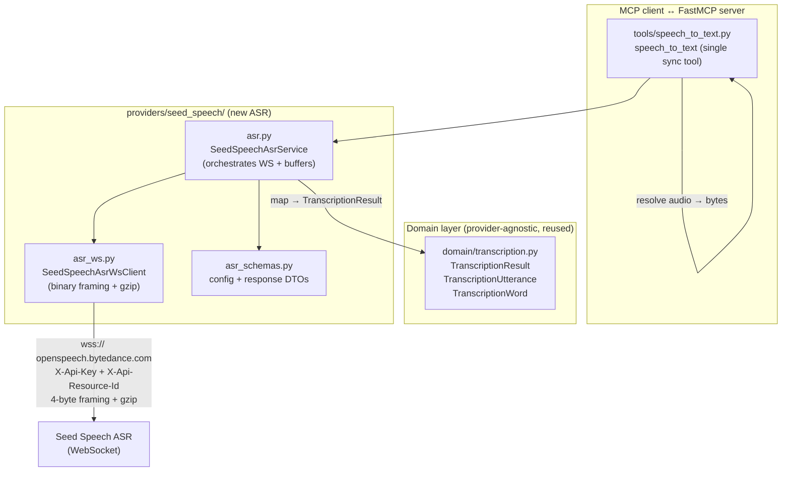
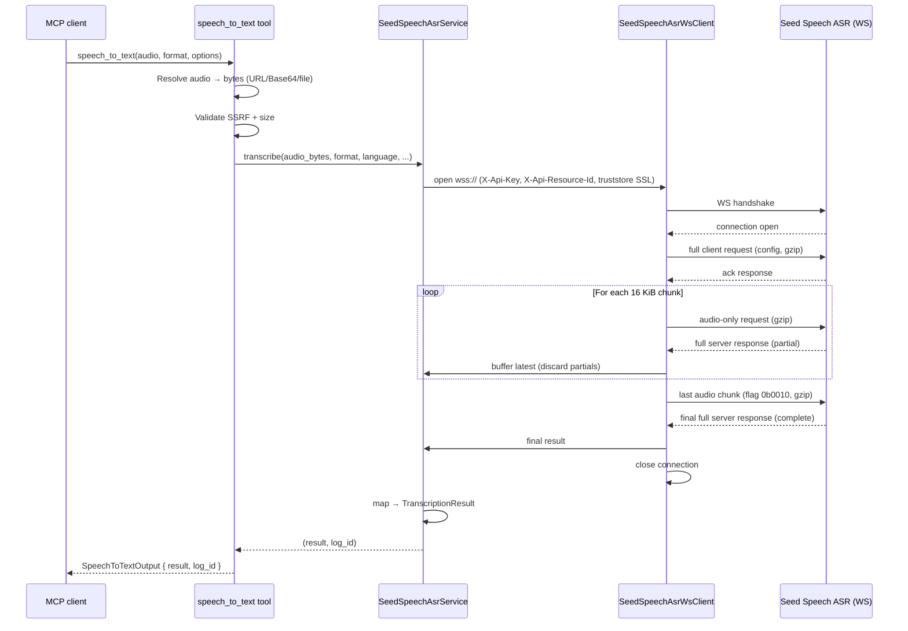

<!-- markdownlint-disable MD013 MD025 MD060 -->

# Migrate Speech-to-Text from LAS to Seed Speech ASR (WebSocket)

## Outcome

Migrate speech-to-text (STT) from **BytePlus LAS ASR** (asynchronous HTTP
submit/poll, two tools) to **Seed Speech ASR** (streaming WebSocket) —
consolidating all speech capabilities (TTS + STT) under one service and one
`X-Api-Key` credential.

The migration introduces a **single synchronous tool**,
`speech_to_text`, that wraps the Seed Speech ASR WebSocket binary protocol,
buffers the streaming partial results server-side, and returns the **complete
`TranscriptionResult` in one MCP tool response**. The WS protocol's streaming
nature is hidden entirely behind one request/response; no partial results are
forwarded to the MCP client. The existing create/poll idiom
(`speech_to_text_create_task` / `speech_to_text_get_result`) is **removed
entirely** — the LAS provider, its two tools, LAS config, LAS tests, and the
LAS-only `AsrTaskStatus` domain model are all deleted in this plan. Seed
Speech ASR is the sole STT provider going forward.

**Design decisions (confirmed with user):**
1. **Single synchronous tool** — download
transcription in ONE response. This blocks the tool call for the transcription
duration (up to a configurable max) but is the simplest contract for MCP
clients and drops the create/poll task lifecycle.
2. **Full LAS removal** — LAS is not deprecated or kept as a fallback; it is
   deleted entirely. Seed Speech ASR is the sole STT provider.

## Background and Current State

### What exists today (LAS ASR)

The server implements STT via two tools backed by the LAS provider:

- `tools/speech_to_text_create_task.py` — resolves audio to a URL (URL/Base64
  via TOS upload / local file via TOS), submits via `LasAsrService.submit()`
  (`POST /api/v1/submit`), returns a task ID.
- `tools/speech_to_text_get_result.py` — polls via `LasAsrService.poll()`
  (`POST /api/v1/poll`), maps the LAS `LasAsrPollResponse` to a domain
  `TranscriptionResult`.
- `providers/las/` — `LasGateway` (HTTP, `Authorization: <bare key>`),
  `LasAsrService` adapter, `schemas.py` DTOs.
- `domain/transcription.py` — **provider-agnostic** models:
  `TranscriptionResult`, `TranscriptionUtterance`, `TranscriptionWord`,
  `AsrTaskStatus`.
- `config/env.py` — `las_api_key`, `las_base_url`, `las_default_operator`,
  `las_default_resource`, `has_las`.

### What exists today (Seed Speech — TTS, to be reused)

- `providers/seed_speech/client.py` — `SeedSpeechGateway` (HTTP, `X-Api-Key`,
  `voice.ap-southeast-1.bytepluses.com`, extracts `X-Tt-Logid`).
- `providers/seed_speech/seed_audio.py` — `SeedAudioService` (TTS adapter).
- `config/env.py` — `seed_audio_api_key`, `seed_audio_base_url`,
  `has_seed_audio`.
- The same `X-Api-Key` credential and `voice.*` host domain serve both TTS and
  ASR; the WS layer is new infrastructure but shares the credential.

### Existing specs and research

- `specs/SPEECH_TO_TEXT_PROVIDER_SELECTION.md` — proposed this migration
  (status: proposed, horizon: future). This plan is its **execution**: it
  implements Phase 2 (add Seed Speech ASR tools) and Phase 3 (remove LAS)
  from that spec, with the **single-tool simplification** chosen above.
- `plans/RESEARCH_SEED_SPEECH_STT_VS_LAS.md` — research note (still open).
- `plans/PLAN_SPEECH_TO_TEXT.md` — the implemented LAS plan (status:
  implemented). It rejected Seed Speech ASR on the claim that the WS protocol
  "doesn't fit MCP's request/response model." **This plan overcomes that** by
  wrapping the WS protocol into a single synchronous tool that buffers the
  stream internally.

## Seed Speech ASR WebSocket Protocol (Verified)

Source: Volcengine streaming ASR WebSocket protocol documentation
(`https://www.volcengine.com/docs/6561/80818`), accessed 2026-07-26. The
BytePlus (Voice / Seed Speech) international surface uses the same binary
framing with `X-Api-Key` handshake auth instead of the Volcengine
`appid`/`token`/`cluster` signature.

### Endpoint and authentication

| Aspect | Value |
|---|---|
| **Transport** | WebSocket Secure (`wss://`) |
| **Host** | `openspeech.bytedance.com` (Volcengine / Seed Speech ASR) |
| **Path** | `/api/v3/sauc/bigmodel` |
| **Auth** | `X-Api-Key: <key>` in the WS handshake headers (same credential as TTS) |
| **Protocol** | Binary messages (not text) |

Additional WS handshake headers required:
- `X-Api-Resource-Id`: Resource ID from the Volcengine console (default: `volc.seedasr.sauc.duration`)
- `X-Api-Request-Id`: UUID for request tracking
- `X-Api-Sequence`: Fixed value `-1`

> **Config items:** The WS endpoint, resource ID, appid, and cluster are all
> configurable (`SEED_SPEECH_ASR_WS_URL`, `SEED_SPEECH_ASR_RESOURCE_ID`,
> `SEED_SPEECH_ASR_APPID`, `SEED_SPEECH_ASR_CLUSTER`) so operators set them
> from the BytePlus/Volcengine console.

### Binary framing

Every WS message is a binary frame: a **4-byte header** + a **big-endian
payload size** (4 bytes) + the **payload**. All integers are big-endian.

```text
Byte 0: [ protocol version (4b) | header size (4b) ]
Byte 1: [ message type (4b)      | msg-type flags (4b) ]
Byte 2: [ serialization (4b)     | compression (4b)  ]
Byte 3: [ reserved (8b) = 0x00 ]
Bytes 4-7: payload size (uint32, big-endian)
Bytes 8..:  payload
```

| Field | Bits | Values |
|---|---|---|
| Protocol version | 4 | `0b0001` = v1 (only version) |
| Header size | 4 | `0b0001` → actual size = value × 4 = 4 bytes |
| Message type | 4 | `0b0001` full client request (config) · `0b0010` audio-only request · `0b1001` full server response · `0b1111` server error |
| Msg-type flags | 4 | `0b0000` none · `0b0010` "last audio chunk" (set on the final audio-only request) |
| Serialization | 4 | `0b0000` none (raw bytes) · `0b0001` JSON |
| Compression | 4 | `0b0000` none · `0b0001` gzip |
| Reserved | 8 | `0x00` (also pads header to 4 bytes) |

**Payload rules:**

- **Full client request** (config): JSON-serialized, then gzip-compressed. The
  server echoes the client's serialization/compression for responses.
- **Audio-only request** (chunks): raw audio bytes, gzip-compressed. No JSON
  serialization. The final chunk sets the `0b0010` flag.
- **Full server response**: gzip-compressed JSON. Contains partial or final
  transcription.
- **Server error**: standard header (4 bytes) + payload size (4 bytes) +
  payload = error code (uint32 BE) + error message size (uint32 BE) + error
  message (UTF-8). (`decode_server_message` reads `payload_size` from bytes
  4–7, then splits the gzip-decompressed payload into code / len / message.)

### Interaction flow

1. **Open connection** — WS handshake with `X-Api-Key` header.
2. **Send full client request** — one binary message with the config JSON
   (gzip). The server responds with an ack full server response.
3. **Stream audio chunks** — N audio-only binary messages (gzip), each
   triggering a full server response with the **partial** transcription so far.
4. **Final audio chunk** — audio-only message with the `0b0010` flag. The
   server responds with the **final** full server response containing the
   complete text + utterances + word timestamps.
5. **Close connection.**

### Config JSON payload (full client request)

```json
{
  "user": {"uid": "modelark-mcp"},
  "audio": {
    "format": "wav",
    "rate": 16000,
    "bits": 16,
    "channel": 1,
    "language": "en-US"
  },
  "request": {
    "model_name": "bigmodel",
    "enable_punc": true,
    "enable_itn": true,
    "result_type": "full",
    "show_utterances": true
  },
  "workflow": "audio_in,resample,partition,vad,fe,decode,itn,nlu_ddc,nlu_punctuate"
}
```

### Server response JSON structure

```json
{
  "result": {
    "text": "full transcription text",
    "utterances": [
      {
        "text": "segment text",
        "start_time": 0,
        "end_time": 1500,
        "definite": true,
        "words": [
          {"text": "word", "start_time": 0, "end_time": 200, "confidence": 0.98}
        ]
      }
    ]
  },
  "code": 1000
}
```

`definite=false` marks a partial (non-final) utterance; `definite=true` marks a
finalized segment. The final response (after the last audio chunk) contains
the complete, finalized result.

### Error codes (notable)

| Code | Meaning | Retryable? |
|---|---|---|
| 1000 | Success | — |
| 1001 | Invalid request parameters | No |
| 1002 | No access / token invalid | No |
| 1003 | QPS exceeded | Yes (backoff) |
| 1005 | Server busy / overloaded | Yes (backoff) |
| 1010 | Audio too long | No |
| 1011 | Audio too large | No |
| 1012 | Invalid audio format | No |
| 1020 | Recognition wait timeout | Yes |
| 1021 | Recognition processing timeout | Yes |
| 1022 | Recognition error | No |

Full table in the source doc; mapped to `ProviderError` per the
retryable column.

## Architecture



### Key design decisions

1. **Single synchronous tool.** `speech_to_text` does everything: resolve
   audio → bytes, open WS, stream chunks, buffer partials, return the complete
   `TranscriptionResult`. No task ID, no second tool, no in-memory task store.
   The WS stream is fully contained within one tool invocation.

2. **WS protocol wrapper is isolated.** The binary framing + gzip + message
   typing lives in one pure module (`asr_ws.py`) with no I/O coupling — it
   encodes/decodes `bytes` → `bytes` and `bytes` → parsed dicts. This makes it
   unit-testable without a live socket. The WS I/O (`websockets` connect/send/
   recv) lives in a thin client class on top.

3. **Reuse the provider-agnostic domain models.** `TranscriptionResult`,
   `TranscriptionUtterance`, `TranscriptionWord` are already provider-agnostic
   and stay unchanged. The Seed Speech adapter maps its WS response into them,
   exactly as the LAS adapter maps `LasAsrPollResponse` into them today.

4. **Reuse the existing credential and gateway host.** STT uses the same
   `seed_audio_api_key` (`BYTEPLUS_SEED_AUDIO_API_KEY`) and `voice.*` host as
   TTS — one key, one console, one billing relationship. No new secret.

5. **Audio resolution returns BYTES, not a URL.** Unlike LAS (which needed a
   URL, requiring TOS upload for Base64/file input), the WS protocol streams
   raw audio bytes. So Base64 → decode, file → read, URL → download via the
   existing SSRF-safe downloader. **No TOS upload is needed for STT** — a
   simplification over LAS.

6. **LAS is removed entirely.** The LAS provider (`providers/las/`), its two
   tools (`speech_to_text_create_task.py`, `speech_to_text_get_result.py`),
   all LAS config fields (`las_api_key`, `las_base_url`, `las_default_operator`,
   `las_default_resource`, `has_las`, and their validators), the LAS-only
   `AsrTaskStatus` domain model, and all LAS tests are deleted. There is no
   fallback, no deprecation window, and no `has_las` precedence logic — Seed
   Speech ASR is the sole STT provider.

### Tool surface (before / after)

| | Before (LAS) | After (Seed Speech) |
|---|---|---|
| Tool count | 2 (`create_task` + `get_result`) | 1 (`speech_to_text`) |
| Pattern | async submit → poll | synchronous buffer-and-return |
| Transport | HTTP REST | WebSocket (binary) |
| Credential | `BYTEPLUS_LAS_API_KEY` | `BYTEPLUS_SEED_AUDIO_API_KEY` (shared with TTS) |
| Audio input | URL only (Base64/file via TOS upload) | URL / Base64 / file (resolved to raw bytes) |
| Returns | task ID, then `TranscriptionResult` on poll | `TranscriptionResult` directly |
| Task lifecycle | server-side task ID + ownership store | none (no task ID) |

## Implementation Details

### New dependency

Add `websockets` (async-native, well-maintained). `httpx` does not support
WebSockets. The SSL context must use `truststore` (already injected globally in
`__main__.py` and `server.py` via `truststore.inject_into_ssl()`); construct it
with `truststore.SSLContext(ssl.PROTOCOL_TLS_CLIENT)` and pass to
`websockets.connect(ssl=...)`. The modern asyncio client uses the
`additional_headers=` kwarg (verified: `extra_headers` was removed in v13);
the `additional_headers` API is stable across v13–v16.

```bash
uv add "websockets>=13,<17"
```

> The latest stable is 16.x (already present in `.venv`); pin the major
> boundary `<17` rather than `<14`, which would force a downgrade and conflict
> with the installed version. `websockets.connect()` accepts `additional_headers`,
> `open_timeout`, and `ssl`.

For WS contract tests, use `websockets`'s built-in loopback test server
(`websockets.serve` on `localhost`) — no new test dependency needed.

### File layout (new + changed)

```text
src/modelark_mcp/
├── providers/seed_speech/
│   ├── asr_ws.py          # NEW — binary framing (pure) + WS I/O client
│   ├── asr.py             # NEW — SeedSpeechAsrService adapter (orchestrates)
│   ├── asr_schemas.py     # NEW — config-payload + response DTOs
│   ├── client.py          # unchanged (TTS gateway)
│   ├── seed_audio.py      # unchanged (TTS service)
│   └── schemas.py         # unchanged (TTS DTOs)
├── providers/las/          # DELETED — entire directory (client.py, asr.py,
│                           #          schemas.py, __init__.py)
├── tools/
│   ├── speech_to_text.py            # NEW — single synchronous tool
│   ├── speech_to_text_create_task.py # DELETED
│   └── speech_to_text_get_result.py  # DELETED
├── domain/transcription.py # CHANGED — remove AsrTaskStatus (LAS-only)
├── config/env.py           # CHANGED — add seed_speech_asr_* + has_stt;
│                           #          DELETE las_* fields, has_las, validators
└── server.py               # CHANGED — replace LAS block with speech_to_text

tests/
├── unit/
│   ├── test_asr_ws_framing.py          # NEW — encode/decode binary frames
│   ├── test_seed_speech_asr_service.py # NEW — orchestration + mapping
│   └── test_env.py / test_env_config.py # CHANGED — drop LAS config tests
├── contract/
│   ├── test_seed_speech_asr_adapter.py # NEW — WS protocol vs fake server
│   └── test_las_asr_adapter.py         # DELETED
├── integration/
│   ├── test_speech_to_text_tool.py      # NEW — tool handler → mock service
│   ├── test_speech_to_text_create_task.py # DELETED
│   └── test_speech_to_text_get_result.py  # DELETED
└── e2e/
    └── test_mcp_e2e.py                  # CHANGED — add speech_to_text, drop LAS tools
```

### `providers/seed_speech/asr_ws.py` — binary framing (pure) + WS I/O

Split into two concerns: a **stateless framing module** (pure functions, fully
unit-testable) and a **thin async WS client** (owns the socket, error
normalization).

```python
"""Seed Speech ASR WebSocket binary framing + client.

Pure framing functions encode/decode the 4-byte-header + payload-size + payload
binary protocol. The async client wraps `websockets` for connect/send/recv.
"""

from __future__ import annotations

import gzip
import json
import struct
from enum import IntEnum
from typing import Any

PROTOCOL_VERSION = 0b0001
HEADER_SIZE = 0b0001  # actual size = value * 4 = 4 bytes


class MessageType(IntEnum):
    FULL_CLIENT_REQUEST = 0b0001
    AUDIO_ONLY_REQUEST = 0b0010
    FULL_SERVER_RESPONSE = 0b1001
    SERVER_ERROR = 0b1111


class Serialization(IntEnum):
    NONE = 0b0000
    JSON = 0b0001


class Compression(IntEnum):
    NONE = 0b0000
    GZIP = 0b0001


_FLAG_LAST_CHUNK = 0b0010


def _build_header(msg_type, flags=0, serialization=Serialization.NONE,
                  compression=Compression.GZIP) -> bytes:
    byte0 = (PROTOCOL_VERSION << 4) | HEADER_SIZE
    byte1 = (msg_type << 4) | (flags & 0x0F)
    byte2 = (serialization << 4) | compression
    return bytes([byte0, byte1, byte2, 0x00])


def encode_full_client_request(config: dict[str, Any]) -> bytes:
    """Encode JSON config: header + size + gzip(json)."""
    payload = gzip.compress(json.dumps(config).encode("utf-8"))
    header = _build_header(MessageType.FULL_CLIENT_REQUEST,
                           serialization=Serialization.JSON)
    return header + struct.pack(">I", len(payload)) + payload


def encode_audio_chunk(data: bytes, *, is_last: bool = False) -> bytes:
    """Encode raw audio: header + size + gzip(data)."""
    payload = gzip.compress(data)
    flags = _FLAG_LAST_CHUNK if is_last else 0
    header = _build_header(MessageType.AUDIO_ONLY_REQUEST, flags=flags)
    return header + struct.pack(">I", len(payload)) + payload


def decode_server_message(frame: bytes) -> tuple[MessageType, Any]:
    """Decode a server frame → (msg_type, payload).

    FULL_SERVER_RESPONSE → (type, parsed_dict); SERVER_ERROR → (type, (code, msg)).
    """
    msg_type = MessageType((frame[1] >> 4) & 0x0F)
    serialization = Serialization((frame[2] >> 4) & 0x0F)
    compression = Compression(frame[2] & 0x0F)
    payload_size = struct.unpack(">I", frame[4:8])[0]
    payload = frame[8 : 8 + payload_size]
    if compression == Compression.GZIP:
        payload = gzip.decompress(payload)
    if msg_type == MessageType.SERVER_ERROR:
        code = struct.unpack(">I", payload[:4])[0]
        msg_len = struct.unpack(">I", payload[4:8])[0]
        message = payload[8 : 8 + msg_len].decode("utf-8", errors="replace")
        return msg_type, (code, message)
    if serialization == Serialization.JSON:
        return msg_type, json.loads(payload.decode("utf-8"))
    return msg_type, payload
```

The **async WS client** on top (owns the socket + error normalization):

```python
class SeedSpeechAsrWsClient:
    """Async WebSocket client for Seed Speech ASR (owns the socket)."""

    PROVIDER: ClassVar[ProviderName] = "seed-speech"

    def __init__(self, *, ws_url: str, api_key: str,
                 connect_timeout: float, recv_timeout: float) -> None: ...

    async def __aenter__(self) -> "SeedSpeechAsrWsClient":
        # websockets.connect(ws_url, additional_headers={"X-Api-Key": ...},
        #                     ssl=truststore.SSLContext(...), open_timeout=...)
        ...
    async def __aexit__(self, *exc) -> None: ...

    async def send_config(self, config: dict[str, Any]) -> None:
        await self._ws.send(encode_full_client_request(config))

    async def send_audio(self, chunk: bytes, *, is_last: bool = False) -> None:
        await self._ws.send(encode_audio_chunk(chunk, is_last=is_last))

    async def recv(self) -> tuple[MessageType, Any]:
        # Apply recv_timeout so a stalled server cannot hang the call forever.
        raw = await asyncio.wait_for(self._ws.recv(), timeout=self._recv_timeout)
        return decode_server_message(raw)

    @classmethod
    def from_settings(cls) -> "SeedSpeechAsrWsClient":
        # Reads SEED_SPEECH_ASR_WS_URL + seed_audio_api_key + timeouts from env.
        ...

    @classmethod
    def normalize_error(cls, code: int, message: str, operation: str) -> ProviderError:
        # Map ASR error codes → NormalizedProviderError (retryable per table).
        # Reuse the existing NormalizedProviderError/ProviderError model so
        # error handling, metrics, and logging match the TTS gateway.
        ...
```

### `providers/seed_speech/asr_schemas.py` — DTOs

```python
"""Seed Speech ASR provider schemas (STT).

Provider DTOs for the WS config payload and the server response.
"""

from __future__ import annotations
from pydantic import BaseModel, ConfigDict, Field


class AsrAudioConfig(BaseModel):
    model_config = ConfigDict(extra="allow")
    format: str
    rate: int = 16000
    bits: int = 16
    channel: int = 1
    language: str = "en-US"


class AsrRequestConfig(BaseModel):
    model_config = ConfigDict(extra="allow")
    model_name: str = "bigmodel"
    enable_punc: bool | None = None
    enable_itn: bool | None = None
    result_type: str = "full"
    show_utterances: bool | None = None


class AsrFullClientRequest(BaseModel):
    """The config JSON sent as the full client request."""
    user: dict[str, str] = Field(default_factory=lambda: {"uid": "modelark-mcp"})
    audio: AsrAudioConfig
    request: AsrRequestConfig
    workflow: str = (
        "audio_in,resample,partition,vad,fe,decode,itn,nlu_ddc,nlu_punctuate"
    )


class AsrWord(BaseModel):
    model_config = ConfigDict(extra="allow")
    text: str = ""
    start_time: int | None = None
    end_time: int | None = None
    confidence: float | None = None


class AsrUtterance(BaseModel):
    model_config = ConfigDict(extra="allow")
    text: str = ""
    start_time: int | None = None
    end_time: int | None = None
    definite: bool | None = None
    words: list[AsrWord] = Field(default_factory=list)


class AsrResult(BaseModel):
    model_config = ConfigDict(extra="allow")
    text: str = ""
    utterances: list[AsrUtterance] = Field(default_factory=list)


class AsrServerResponse(BaseModel):
    """Parsed full server response."""
    code: int = 1000
    message: str = ""
    result: AsrResult | None = None
```

### `providers/seed_speech/asr.py` — service adapter (orchestrates + buffers)

This is the core "wrapper": it opens the WS, sends the config, streams audio in
fixed-size chunks, **buffers every partial server response**, keeps only the
latest `definite=true` utterances + the growing full text, and returns the
final `TranscriptionResult` when the server's final response arrives.

```python
"""Seed Speech ASR adapter — speech-to-text over WebSocket.

Orchestrates the WS binary protocol: sends config, streams audio chunks,
buffers partial results, and maps the final response to a domain
TranscriptionResult. Streaming is fully hidden from the caller — one call,
one complete result.
"""

from __future__ import annotations

from modelark_mcp.domain.transcription import (
    TranscriptionResult, TranscriptionUtterance, TranscriptionWord,
)
from modelark_mcp.providers.seed_speech.asr_schemas import (
    AsrAudioConfig, AsrFullClientRequest, AsrRequestConfig, AsrServerResponse,
)
from modelark_mcp.providers.seed_speech.asr_ws import (
    MessageType, SeedSpeechAsrWsClient,
)

_CHUNK_BYTES = 16 * 1024  # 16 KiB audio chunks streamed to the WS


class SeedSpeechAsrService:
    """Service layer for Seed Speech ASR (speech-to-text)."""

    def __init__(self, client: SeedSpeechAsrWsClient | None = None) -> None:
        self._client = client  # injected for testing; built from settings if None

    async def transcribe(
        self,
        *,
        audio_bytes: bytes,
        audio_format: str,
        language: str = "en-US",
        enable_punc: bool | None = None,
        enable_itn: bool | None = None,
        chunk_bytes: int = _CHUNK_BYTES,
    ) -> tuple[TranscriptionResult, str | None]:
        """Transcribe audio via one WS session. Returns (result, log_id).

        Blocks until the server emits the final response after the last audio
        chunk. All partial responses are buffered and discarded; only the
        final, complete transcription is returned.
        """
        config = self.build_client_request(
            audio_format=audio_format, language=language,
            enable_punc=enable_punc, enable_itn=enable_itn,
        )
        client = self._client or SeedSpeechAsrWsClient.from_settings()

        latest: AsrServerResponse | None = None
        async with client:
            await client.send_config(config.model_dump())
            # Drain and validate the server ack — it may be a SERVER_ERROR frame
            # (bad config / auth failure); raise instead of swallowing it.
            ack_type, ack_payload = await client.recv()
            if ack_type == MessageType.SERVER_ERROR:
                code, message = ack_payload
                raise SeedSpeechAsrWsClient.normalize_error(code, message, "configure")
            # Stream audio in chunks.
            for offset in range(0, len(audio_bytes), chunk_bytes):
                chunk = audio_bytes[offset : offset + chunk_bytes]
                is_last = offset + chunk_bytes >= len(audio_bytes)
                await client.send_audio(chunk, is_last=is_last)
                # Buffer the latest partial/final response; keep only the last.
                msg_type, payload = await client.recv()
                if msg_type == MessageType.SERVER_ERROR:
                    code, message = payload
                    raise SeedSpeechAsrWsClient.normalize_error(
                        code, message, "transcribe")
                latest = AsrServerResponse.model_validate(payload)

        if latest is None or latest.result is None:
            return TranscriptionResult(text=""), None
        return self.map_result(latest), None

    @staticmethod
    def build_client_request(
        *, audio_format: str, language: str,
        enable_punc: bool | None, enable_itn: bool | None,
    ) -> AsrFullClientRequest:
        return AsrFullClientRequest(
            audio=AsrAudioConfig(format=audio_format, language=language),
            request=AsrRequestConfig(
                enable_punc=enable_punc, enable_itn=enable_itn,
                show_utterances=True,
            ),
        )

    @staticmethod
    def map_result(response: AsrServerResponse) -> TranscriptionResult:
        r = response.result
        utterances = [
            TranscriptionUtterance(
                text=u.text,
                start_time_ms=u.start_time,
                end_time_ms=u.end_time,
                words=[
                    TranscriptionWord(
                        text=w.text, confidence=w.confidence,
                        start_time_ms=w.start_time, end_time_ms=w.end_time,
                    ) for w in u.words
                ],
            )
            for u in r.utterances if u.definite is not False
        ]
        return TranscriptionResult(text=r.text, utterances=utterances)

    async def close(self) -> None:
        """No-op: the WS connection is owned and closed by `async with client:`
        inside transcribe(). An injected client is likewise consumed (closed)
        there, so the service holds nothing to release."""
        ...
```

**Buffering note:** the server sends one response per audio chunk. Each is a
*full* server response (cumulative, not delta) with `result_type=full`, so
keeping only the **latest** response is correct — the final one (after the
last-chunk flag) is the complete transcription. If a future server variant
sends deltas instead, accumulate utterances by `definite` status; the current
contract is cumulative, so `latest`-wins is the simplest correct strategy.

**Filter note:** `map_result` is called only on `latest` (the final response),
so all utterances are finalized. The `if u.definite is not False` filter is a
defensive net: it drops `definite=False` (partial) segments while *keeping*
`definite=True` **and** `None`. Keeping `None` is intentional and correct — the
complete final response may omit the `definite` flag for already-finalized
segments, and `is True` would wrongly drop them. Per the Volcengine doc,
`definite` is `true` (final) or `false` (partial), so `is not False` is the safer
choice for the final response.

**Robustness of send→recv pairing:** the Volcengine protocol sends exactly one
full server response per audio-only request (confirmed by the source doc's
message-flow example), so the strict send-one/recv-one pairing is
protocol-correct. The `recv_timeout` passed to the client bounds a stall if the
server ever batches or stalls. The `latest is None` fallback after the loop
covers the empty-audio edge case (0 bytes → `range(0, 0, …)` sends no chunks, so
no final response arrives) by returning an empty `TranscriptionResult`. If the
server ever fails to emit a final response for non-empty audio, the same
fallback returns `("", None)` rather than raising; consider surfacing this as a
`ProviderError` if callers need to distinguish "no audio" from "server failed to
finalize."

### `tools/speech_to_text.py` — single synchronous tool

The tool resolves audio to **raw bytes** (URL → SSRF-safe download, Base64 →
decode, file → read), calls `SeedSpeechAsrService.transcribe()`, and returns
the `TranscriptionResult` directly. **No task ID, no TOS upload, no second
tool.** Reuses `billed_provider_slot`, `call_with_retry`, `provider_error_result`.

Input/output models:

```python
_STT_MAX_BYTES = 200 * 1024 * 1024

class AsrAudioInput(BaseModel):
    """Audio source — resolved to raw bytes for the WS stream."""
    audio_url: str | None = Field(None, description="HTTPS URL of the audio file.")
    audio_data: str | None = Field(None, description="Base64-encoded audio bytes.")
    audio_file_path: str | None = Field(
        None, description="Absolute local file path. stdio transport only.")
    audio_format: Literal["wav", "mp3", "ogg", "raw", "flac"] = Field(
        ..., description="Audio format: wav, mp3, ogg, raw, flac.")

    @model_validator(mode="after")
    def validate_exactly_one_source(self) -> AsrAudioInput:
        provided = sum(1 for v in (self.audio_url, self.audio_data,
                                   self.audio_file_path) if v)
        if provided != 1:
            raise ValueError(
                "Provide exactly one of audio_url, audio_data, or audio_file_path.")
        if self.audio_url:
            validate_url(self.audio_url)
        return self

class AsrRequestOptions(BaseModel):
    """Optional transcription feature toggles."""
    language: str = Field("en-US", description="BCP-47 language code.")
    enable_punc: bool | None = Field(None, description="Enable punctuation.")
    enable_itn: bool | None = Field(None, description="Enable ITN.")

class SpeechToTextInput(BaseModel):
    audio: AsrAudioInput
    options: AsrRequestOptions | None = None

class SpeechToTextOutput(BaseModel):
    result: TranscriptionResult
    log_id: str | None = None
```

Audio resolution returns **raw bytes** (no TOS upload needed — a key
simplification over LAS, which required a URL and thus TOS for Base64/file):

```python
async def _resolve_audio_bytes(audio: AsrAudioInput,
                               ctx: Context) -> bytes:
    """Resolve any input source to raw audio bytes."""
    if audio.audio_url:
        # No `safe_download_bytes` helper exists; the SSRF-safe downloader lives
        # on the runtime as `SafeDownloader.download(url, *, trusted_hosts,
        # max_bytes) -> DownloadedMedia` (`.body`). It re-runs `validate_url`
        # per hop, so DNS pinning + redirect-to-private-IP protection stay
        # intact; `trusted_hosts` is an extra allowlist gate, permissive here
        # because `validate_url` already blocks unsafe IPs.
        downloaded = await get_runtime(ctx).safe_downloader.download(
            audio.audio_url, trusted_hosts=lambda _host: True,
            max_bytes=_STT_MAX_BYTES)
        return downloaded.body
    if audio.audio_data:
        return decode_base64_safely(
            audio.audio_data, _STT_MAX_BYTES, label="audio")
    p = Path(audio.audio_file_path or "").expanduser().resolve()
    if not p.is_file():
        raise ValueError(f"Audio file not found: {p}")
    return p.read_bytes()
```

The handler wires it together with the existing billing/retry/error helpers:

```python
async def speech_to_text(
    input: SpeechToTextInput, ctx: Context
) -> SpeechToTextOutput | ToolResult:
    """Transcribe audio to text via Seed Speech ASR (single synchronous call)."""
    await ctx.info("Starting speech-to-text transcription")
    await ctx.report_progress(progress=10, total=100)

    settings = get_settings()
    if not settings.has_stt:
        raise ValueError(
            "BYTEPLUS_SEED_AUDIO_API_KEY is not configured. "
            "Set it in .env to enable speech-to-text.")

    try:
        audio_bytes = await _resolve_audio_bytes(input.audio, ctx)
    except ProviderError as exc:
        await ctx.error(f"Audio resolution failed: {exc.message}")
        return provider_error_result(exc)

    await ctx.report_progress(progress=30, total=100)
    estimated_cost = log_cost_estimate(product="stt", variations=1, duration_seconds=60.0)

    options = input.options or AsrRequestOptions()
    service = SeedSpeechAsrService()
    try:
        async with billed_provider_slot(ctx, provider="seed-speech", product="stt",
                                        estimated_cost_usd=estimated_cost):
            result, log_id = await call_with_retry(
                lambda: service.transcribe(
                    audio_bytes=audio_bytes,
                    audio_format=input.audio.audio_format,
                    language=options.language,
                    enable_punc=options.enable_punc,
                    enable_itn=options.enable_itn,
                ))
    except ProviderError as exc:
        await ctx.error(f"Speech-to-text failed: {exc.message}")
        return provider_error_result(exc)
    finally:
        await service.close()

    await ctx.report_progress(progress=100, total=100)
    log_info("stt_completed", chars=len(result.text),
             utterances=len(result.utterances), log_id=log_id)
    return SpeechToTextOutput(result=result, log_id=log_id)

TOOL_ANNOTATIONS = {
    "readOnlyHint": True, "destructiveHint": False,
    "idempotentHint": True, "openWorldHint": False,
}
```

> `safe_download_bytes` does **not** exist. The SSRF-safe downloader is the
> `SafeDownloader` class (`security/safe_downloader.py`) — its `download(url, *,
> trusted_hosts: HostPolicy, max_bytes: int) -> DownloadedMedia` returns
> `.body: bytes`. A shared instance is exposed on `RuntimeServices.safe_downloader`
> (`runtime.py`), reached via `get_runtime(ctx).safe_downloader`. The existing
> call site is `artifacts/filesystem_store.py`. `download()` re-validates every
> hop through `validate_url`, so DNS pinning and redirect-to-private-IP
> protections stay intact; `trusted_hosts` is an additional allowlist gate (use
> a permissive callback for arbitrary user audio URLs since `validate_url`
> already blocks private/loopback/metadata IPs). The Base64 path uses
> `decode_base64_safely(data, max_bytes, label=...)` from
> `security/media_policy.py` (as the LAS tool does) so the byte cap is enforced
> before decoding.

### `config/env.py` — additions and LAS removal

**Add** WS-specific settings and a `has_stt` flag. STT is enabled when the Seed
Audio key is set (same service). **Delete** all `las_*` fields, `has_las`,
and the LAS validators (see the LAS Removal section for the exact line list).

```python
# --- Seed Speech ASR (STT) configuration ---------------------------------

seed_speech_asr_ws_url: str = Field(
    default="wss://openspeech.bytedance.com/api/v3/sauc/bigmodel",
    validation_alias="SEED_SPEECH_ASR_WS_URL",
    description="Seed Speech ASR WebSocket endpoint (wss://).",
)
seed_speech_asr_appid: str = Field(
    default="", validation_alias="SEED_SPEECH_ASR_APPID",
    description="BytePlus appid for ASR config payload, if required.",
)
seed_speech_asr_cluster: str = Field(
    default="", validation_alias="SEED_SPEECH_ASR_CLUSTER",
    description="BytePlus cluster for ASR config payload, if required.",
)
seed_speech_asr_resource_id: str = Field(
    default="volc.seedasr.sauc.duration",
    validation_alias="SEED_SPEECH_ASR_RESOURCE_ID",
    description="Resource ID for Seed Speech ASR (from BytePlus/Volcengine console).",
)
seed_speech_asr_chunk_bytes: int = Field(
    default=16384, ge=1024, validation_alias="SEED_SPEECH_ASR_CHUNK_BYTES",
    description="Audio chunk size (bytes) streamed per WS message.",
)
seed_speech_asr_max_duration_seconds: int = Field(
    default=3600, ge=1, validation_alias="SEED_SPEECH_ASR_MAX_DURATION_SECONDS",
    description="Hard cap on audio duration to bound the blocking call.",
)

@property
def has_stt(self) -> bool:
    """Whether Seed Speech ASR (STT) is configured. Shares the TTS key."""
    return bool(self.seed_audio_api_key)
```

Add `has_stt` to the health-status string in `server.py` and to `validate()`
(WS URL must start with `wss://`).

### `server.py` — registration

Replace the existing `if settings.has_las:` block (lines ~112-138, which
registers `speech_to_text_create_task` and `speech_to_text_get_result`) with
the new `speech_to_text` registration, gated on `has_stt`:

```python
if settings.has_stt:
    from modelark_mcp.tools.speech_to_text import (
        TOOL_ANNOTATIONS as stt_annotations,
        SpeechToTextOutput, speech_to_text,
    )
    server.tool(
        name="speech_to_text",
        annotations={**stt_annotations},
        output_schema=SpeechToTextOutput.model_json_schema(),
        auth=component_auth(settings, "seed:asr:transcribe"),
    )(speech_to_text)
```

Also update the health-status string (line ~322): replace
`f"LAS configured: {resolved_settings.has_las}\n"` with
`f"STT configured: {resolved_settings.has_stt}\n"`.

The entire LAS registration block is deleted — no `elif`, no fallback. The
`las:asr:create` / `las:asr:read` auth scopes are replaced by the single
`seed:asr:transcribe` scope.

## LAS Removal (Full Deletion)

LAS is **removed entirely** — not deprecated, not kept as a fallback. Every LAS
artifact is deleted in this plan:

### Source files to delete

| Path | Contents |
|---|---|
| `src/modelark_mcp/providers/las/__init__.py` | package init |
| `src/modelark_mcp/providers/las/client.py` | `LasGateway` (HTTP, `Authorization: <bare key>`) |
| `src/modelark_mcp/providers/las/asr.py` | `LasAsrService` adapter (submit/poll) |
| `src/modelark_mcp/providers/las/schemas.py` | `LasAsrPollResponse` + DTOs |
| `src/modelark_mcp/tools/speech_to_text_create_task.py` | `speech_to_text_create_task` tool |
| `src/modelark_mcp/tools/speech_to_text_get_result.py` | `speech_to_text_get_result` tool |

Delete the entire `providers/las/` directory and the two LAS tool files.

### Test files to delete

| Path | Tests |
|---|---|
| `tests/contract/test_las_asr_adapter.py` | LAS ASR contract tests |
| `tests/integration/test_speech_to_text_create_task.py` | create-task tool integration |
| `tests/integration/test_speech_to_text_get_result.py` | get-result tool integration |

### `config/env.py` — LAS fields to delete

Remove these fields, properties, and validators from `Settings`:

| Line (approx) | Item | Type |
|---|---|---|
| 76 | `las_api_key: str` (`BYTEPLUS_LAS_API_KEY`) | field |
| 88-89 | `las_base_url: str` (`https://operator.las...`) | field |
| 95-96 | `las_default_operator: str` (`las_asr_pro`) | field |
| 100-103 | `las_default_resource: str` (`bigasr`/`seedasr`) | field |
| 253-255 | `has_las` property | property |
| 281 | `las_base_url` in the `@field_validator("modelark_base_url", "seed_audio_base_url", "las_base_url")` validator | remove `"las_base_url"` from the decorator args and its body branch |
| 298-301 | `validate_las_operator` field validator | validator |
| 306-308 | `validate_las_resource` field validator | validator |
| 425 | `if not settings.las_base_url.startswith("https://"):` check in `validate()` | guard |

After removal, also remove the `las_base_url` entry from the
`_validate_url_https` validator's decorator tuple (line 281) and its
conditional body branch (lines ~290: `if "las" in value.lower() or ...`).

### `domain/transcription.py` — remove `AsrTaskStatus`

Delete the `AsrTaskStatus(StrEnum)` class (line ~49). It is used **only** by
the LAS adapter's submit/poll lifecycle; the Seed Speech synchronous tool has
no task status. Confirm no other import references it before deleting:

```bash
grep -rn 'AsrTaskStatus' src/modelark_mcp/ tests/
# Expected: only providers/las/asr.py and its tests — all being deleted
```

`TranscriptionResult`, `TranscriptionUtterance`, and `TranscriptionWord` stay
(provider-agnostic, reused by Seed Speech ASR).

### `server.py` — remove LAS registration

Delete the `if settings.has_las:` block (lines ~112-138) entirely and replace
with the `if settings.has_stt:` block (see the registration section above).
Update the health-status string (line ~322).

### Documentation to update

Remove all LAS references from:
- `docs/tools.md` — delete the STT section describing `speech_to_text_create_task`
  / `speech_to_text_get_result`; add `speech_to_text`.
- `docs/api-keys.md` — remove `BYTEPLUS_LAS_API_KEY`; document
  `BYTEPLUS_SEED_AUDIO_API_KEY` as the STT credential (shared with TTS).
- `README.md` — remove LAS from the features list and env table.
- `.agents/skills/modelark-mcp/SKILL.md` — remove LAS tool docs; add
  `speech_to_text`.
- `fastmcp.json` — remove any LAS-related auth scope config if present.
- `.env.example` — remove `BYTEPLUS_LAS_API_KEY` and `LAS_*` vars.

## Testing Strategy

The pure framing module is the foundation — test it exhaustively without any
socket. The WS I/O and orchestration use a loopback fake server.

| Layer | File | Coverage |
|---|---|---|
| **Unit (framing)** | `tests/unit/test_asr_ws_framing.py` | `encode_full_client_request` round-trips through `decode_server_message`; `encode_audio_chunk` sets the last-chunk flag only when `is_last=True`; header byte layout matches the protocol table; gzip compression applied/decompressed; error frame decoding (code + message); big-endian size field |
| **Unit (service)** | `tests/unit/test_seed_speech_asr_service.py` | `build_client_request` produces correct config JSON; `map_result` maps utterances/words/timestamps to domain models; drops `definite=False` partials; empty result → `TranscriptionResult(text="")` |
| **Contract (WS)** | `tests/contract/test_seed_speech_asr_adapter.py` | Spin up a `websockets.serve` loopback fake that implements the binary protocol; assert `transcribe()` sends config → chunks → last-chunk flag and returns the final buffered result; assert partial responses are discarded; assert `SERVER_ERROR` frame → `ProviderError`; assert connection-error / timeout → normalized error |
| **Integration** | `tests/integration/test_speech_to_text_tool.py` | Tool handler with a mocked `SeedSpeechAsrService`: happy path (URL/Base64/file inputs), missing key raises, audio resolution failure → `provider_error_result`, provider error propagates, billing slot acquired/released |
| **E2E** | `tests/e2e/test_mcp_e2e.py` | `speech_to_text` appears in tool discovery; has `inputSchema` + `outputSchema`; `readOnlyHint=True`; old LAS tools (`speech_to_text_create_task`, `speech_to_text_get_result`) are **absent** from discovery |
| **Security** | `tests/integration/test_http_security.py` (extend) | SSRF targets in the audio URL are rejected by the existing URL policy; oversized audio rejected by `_STT_MAX_BYTES` |
| **Removal** | existing `test_env.py` / `test_env_config.py` (extend) | LAS config fields (`las_api_key`, `las_base_url`, `las_default_operator`, `las_default_resource`) are rejected/absent; `has_las` property no longer exists; `has_stt` works |

**Live tests** are opt-in (`RUN_BYTEPLUS_LIVE_TESTS=1`) with a real
`BYTEPLUS_SEED_AUDIO_API_KEY` and a small audio sample. Never in default CI.

## Migration Phases

### Phase 1 — WS protocol wrapper (foundation)

Implement `asr_ws.py` (pure framing + async client) and `asr_schemas.py`.
Write all unit + contract tests against the loopback fake server. No tool
wiring yet.

**Acceptance:** `test_asr_ws_framing.py` and
`test_seed_speech_asr_adapter.py` pass; `ruff` + `mypy` clean on new files.

### Phase 2 — ASR service + single tool

Implement `asr.py` (`SeedSpeechAsrService.transcribe`), `tools/speech_to_text.py`,
and `config/env.py` additions. Write integration tests with a mocked service.

**Acceptance:** `test_seed_speech_asr_service.py` and
`test_speech_to_text_tool.py` pass; tool discovery includes `speech_to_text`
when `has_stt`.

### Phase 3 — Registration, LAS removal, docs

Wire `server.py` registration (replace the LAS block with `speech_to_text`).
**Delete all LAS artifacts**: `providers/las/` directory, the two LAS tool
files, LAS config fields/validators, `AsrTaskStatus` domain model, and all LAS
tests (see the LAS Removal section for the exact file list). Update
`docs/tools.md`, `docs/api-keys.md`, `README.md`, `.env.example`,
`.agents/skills/modelark-mcp/SKILL.md`, and `fastmcp.json`. Add `has_stt` to
the health resource. Update the spec status to `accepted` / `horizon:
current`, and conclude `RESEARCH_SEED_SPEECH_STT_VS_LAS.md`.

**Acceptance:** full `pytest` suite green with no LAS tests; `grep -rn 'las\|LAS\|Las' src/modelark_mcp/` returns no STT references (only unrelated `false`/`class`/etc.); docs/skills reflect the new single tool with no LAS mentions; `make check-env` validates the WS URL; health resource lists STT.

### Phase 4 — Live validation (opt-in)

Run one live transcription with a small sample against a real
`BYTEPLUS_SEED_AUDIO_API_KEY`. Confirm the exact BytePlus WS path, whether
`appid`/`cluster` are required, and that `definite` flags behave as assumed.
Adjust config defaults and buffering logic based on real responses.

**Acceptance:** one successful end-to-end transcription; config confirmed
against the BytePlus console; rollback triggers (spec §"When to Reconsider")
evaluated.

## Sequence Diagram



## Risks and Open Questions

| # | Risk / unknown | Effect | Mitigation |
|---|---|---|---|
| 1 | **Exact BytePlus WS path/appid unconfirmed** | Connection failures at live test | Made configurable; default candidate path set; Phase 4 confirms against the BytePlus console. Phase 1-3 use the loopback fake, so they don't block. |
| 2 | **Response is cumulative vs. delta** | Buffering logic wrong (lost segments) | Plan assumes cumulative (`result_type=full`) — latest-wins is correct. If live test shows deltas, switch to accumulating `definite=true` utterances. Isolated in `map_result`. |
| 3 | **Blocking call for long audio** | Tool call holds for minutes; MCP client timeout | Enforce `seed_speech_asr_max_duration_seconds` cap; document that this tool blocks. If this is unacceptable, revisit the two-tool async option (deferred in this plan). |
| 4 | **No video input (LAS supported mp4/mov/mkv)** | Regression for video-file users | Document as a known limitation; optionally add `ffmpeg` audio extraction as a preprocessing step in a follow-up. LAS is removed, so there is no fallback — this is a genuine capability gap to track. |
| 5 | **Reduced diarization** | Speaker labels less rich than LAS | `show_utterances=true` requested; speaker info depends on the model. Document the limitation. Users needing richer diarization must be aware LAS is no longer available. |
| 6 | **WS reliability** | Connection drops mid-stream | `call_with_retry` wraps `transcribe()`; on failure the whole WS session restarts. Timeouts normalized to `ProviderError(ambiguous_completion=False)` (ASR is not mutation, so retry is safe). |
| 7 | **`websockets` + truststore SSL** | TLS verification failures | Build the SSL context with `truststore.SSLContext(ssl.PROTOCOL_TLS_CLIENT)` and pass explicitly to `websockets.connect(ssl=...)`. Verify in Phase 4 live test. |
| 8 | **`AsrTaskStatus` removed** | Downstream code importing it breaks | Removed entirely in Phase 3 along with LAS. Confirm via `grep -rn 'AsrTaskStatus' src/ tests/` before deletion — the only references are the LAS adapter and its tests (all being deleted). No other provider uses it. |

## Self-Review Checklist (per AGENTS.md)

Before declaring the migration complete, run through:

1. **Unit tests** — `test_asr_ws_framing.py` + `test_seed_speech_asr_service.py`
   cover happy path, edge cases (empty audio, single-chunk audio, oversized
   header), and error-frame decoding.
2. **Smoke test** — `make dev` + MCP Inspector: call `speech_to_text` with a
   Base64 sample against the loopback fake (or a live key in Phase 4).
3. **Lint** — `uv run ruff check src/modelark_mcp/providers/seed_speech/asr*.py
   src/modelark_mcp/tools/speech_to_text.py`.
4. **Type check** — `uv run mypy` clean on new files (strict mode).
5. **Build** — `uv build` succeeds; `websockets` pinned in `uv.lock`.
6. **Diff review** — no debug `print`, no hard-coded keys, no dead code.
7. **Secrets scan** — `bandit` + `detect-secrets` clean; the WS URL and
   `X-Api-Key` come from `Settings`, never inline.

## Sources

- Volcengine streaming ASR WebSocket protocol:
  `https://www.volcengine.com/docs/6561/80818` (accessed 2026-07-26) — binary
  framing, message types, config payload, error codes.
- BytePlus Seed Audio (TTS) docs: `https://docs.byteplus.com/en/docs/byteplusvoice/seedaudio-01`
  — `X-Api-Key` auth and `voice.*` host domain (shared with ASR).
- BytePlus LAS ASR docs: `https://docs.byteplus.com/en/docs/Byteplus_LAS/las_asr`
  — the legacy provider being removed.
- Existing repo: `providers/seed_speech/client.py`, `providers/las/` (to be
  deleted), `domain/transcription.py`, `config/env.py`, `server.py`.