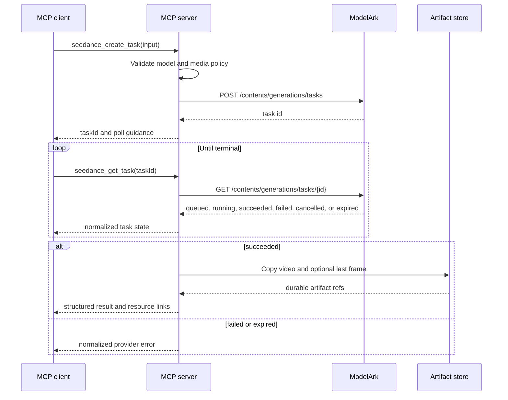

<!-- markdownlint-disable MD013 MD025 MD060 -->

# ModelArk Seed Multimodal MCP Server Plan

> [!important] Scope assumption
> The request repeated “Seedance.” Existing vault context confirms that similar requests used “Seedance” when they meant the still-image model, Seedream. This plan therefore covers **Seed Audio**, **Seedance** video, and **Seedream** image. If the third product was something else, only that adapter and its tools need to change.

## Outcome

Build a Python MCP server (FastMCP on uv) that exposes BytePlus multimodal generation through a small, typed, safe tool surface:

- Seed Audio full-scene audio generation through Seed Speech;
- Seedream image generation and editing through ModelArk;
- Seedance asynchronous video generation and task management through ModelArk;
- durable MCP resources for generated media whose provider URLs expire;
- local `stdio` first, with protected Streamable HTTP as a deployable option
  (both natively supported by FastMCP).

The most important research result is that this is **not one upstream API**. Seedance and Seedream share the ModelArk data-plane host and Bearer authentication, while Seed Audio is hosted by Seed Speech and uses `X-Api-Key`. The MCP server needs two provider gateways behind one normalized domain layer.

## Research Method

Three bounded sub-agent tracks researched Seed Audio, Seedance, and Seedream independently. The orchestrator then checked the official BytePlus documentation index, opened or fetched the cited live pages, verified current MCP SDK/specification behavior, and preserved contradictions instead of guessing.

All live sources were accessed on **2026-07-20**. Official BytePlus and Model Context Protocol sources take precedence over older vault notes and third-party wrappers.

## Verified API Inventory

| Product | Official surface | Authentication | Execution | Output lifetime |
|---|---|---|---|---|
| Seed Audio 1.0 | `POST https://voice.ap-southeast-1.bytepluses.com/api/v3/tts/create` | `X-Api-Key` | Non-streaming, single request/response | Returned URL is valid for 2 hours |
| Seedream | `POST {MODELARK_BASE_URL}/images/generations` | `Authorization: Bearer <API key>` | Synchronous JSON by default; supported models can stream partial images | Returned URL is valid for 24 hours |
| Seedance | `POST {MODELARK_BASE_URL}/contents/generations/tasks` plus task APIs | `Authorization: Bearer <API key>` | Provider-native asynchronous task | Video and last-frame URLs are valid for 24 hours; list history is 7 days |

ModelArk AP base URL: `https://ark.ap-southeast.bytepluses.com/api/v3`. The official image API also documents `https://ark.eu-west.bytepluses.com/api/v3`; API keys, model activation, and endpoint IDs are region-scoped. The implementation must make the base URL configurable and must not silently mix regions. See [ModelArk base URL and authentication](https://docs.byteplus.com/en/docs/ModelArk/1298459) and [Image generation API](https://docs.byteplus.com/en/docs/ModelArk/1541523).

### Seed Audio 1.0

Seed Audio is under **Seed Speech**, not the ModelArk data-plane API. The official [Audio 1.0 API reference](https://docs.byteplus.com/en/docs/byteplusvoice/seedaudio-01) documents:

- required `model: "seed-audio-1.0"` and `text_prompt` of at most 3,000 characters;
- optional `X-Api-Request-Id` UUID and diagnostic `X-Tt-Logid` response header;
- text-only generation when `references` is absent;
- up to three audio references, each using exactly one of `speaker`, `audio_data`, or `audio_url`;
- one image reference using exactly one of `image_data` or `image_url`;
- no mixing of audio and image references;
- audio references up to 30 seconds and 10 MB each in WAV, MP3, PCM, or OGG Opus;
- one reference image up to 10 MB in JPEG, PNG, or WebP;
- output formats WAV, MP3, PCM, or OGG Opus and a maximum output of 120 seconds;
- `speech_rate` from `-50` to `100`, `loudness_rate` from `-50` to `100`, and `pitch_rate` from `-12` to `12`;
- optional utterance- and word-level subtitle timestamps;
- explicit and metadata-based AIGC watermark controls;
- response fields `code`, `message`, Base64 `audio`, `duration`, billing `original_duration`, two-hour `url`, and optional `subtitle`.

> [!warning] Verified documentation contradiction
> The page lists the default WAV/PCM sample rate as `40000`, but the accepted-value list omits `40000` and includes `8000`, `16000`, `24000`, `32000`, `44100`, and `48000`. The MCP should omit `sample_rate` by default and only accept the explicit documented values until BytePlus confirms whether `40000` is valid.

Current official billing is published: pay-as-you-go is USD 0.15 per generated minute, billing uses `original_duration` with one-second precision, and activation includes a 60-minute trial. See [Audio 1.0 billing](https://docs.byteplus.com/en/docs/byteplusvoice/audiopricing). The current API, billing, and console pages no longer mention the invite-only/Lark-whitelist path recorded in older vault notes. Treat the older access and pricing notes as stale pending product-team confirmation.

### Seedream image generation and editing

The same [Image generation API](https://docs.byteplus.com/en/docs/ModelArk/1541523) performs text-to-image and editing. Adding `image` as a URL, data URI, or array of either selects reference-based generation/editing.

Current documented families include:

| Family | Example documented model ID | MCP capability stance |
|---|---|---|
| Seedream 5.0 Pro | `dola-seedream-5-0-pro-260628` | Single result, up to 10 references, precise editing, PNG/JPEG; no sequential generation or streaming |
| Seedream 5.0 Lite | `seedream-5-0-260128` / `seedream-5-0-lite-260128` | Up to 14 references, batch generation, streaming, PNG/JPEG |
| Seedream 4.5 | `seedream-4-5-251128` | Up to 14 references, batch/streaming, JPEG |
| Seedream 4.0 | `seedream-4-0-250828` | Up to 14 references, batch/streaming, JPEG |
| Seedream 3.0 T2I | `seedream-3-0-t2i-250415` | Deprecated/deactivated; do not expose as a default |

The official pages use inconsistent 5.0 Lite aliases. Model IDs must therefore be configuration, not hard-coded truth. The server will ship a capability registry keyed by logical family and let the operator bind the account-authorized model or endpoint ID.

Core request fields are `model`, `prompt`, optional `image`, `size`, `sequential_image_generation`, `sequential_image_generation_options.max_images`, `stream`, `output_format`, `response_format`, `watermark`, and `optimize_prompt_options.mode`. `response_format` is `url` or `b64_json`; URL outputs expire within 24 hours. Input images for current 4.x/5.x models can be up to 30 MB and 36 million pixels, and the current models support aspect ratios from 1:16 through 16:1.

MVP will force `stream: false`. Streaming events are useful but are incremental image delivery, not a durable job API. A later adapter can translate `image_generation.partial_succeeded`, `partial_failed`, `partial_image`, and `completed` events into MCP progress notifications.

### Seedance video task API

ModelArk exposes four operations:

| Operation | Method and path | MCP mapping |
|---|---|---|
| Create | `POST /contents/generations/tasks` | `seedance_create_task` |
| Retrieve | `GET /contents/generations/tasks/{id}` | `seedance_get_task` |
| List | `GET /contents/generations/tasks` | `seedance_list_tasks` |
| Cancel or delete | `DELETE /contents/generations/tasks/{id}` | `seedance_cancel_or_delete_task` |

The [create API](https://docs.byteplus.com/en/docs/ModelArk/1520757) accepts a `model` and a `content[]` array with `text`, `image_url`, `video_url`, and `audio_url` items. Important roles are `first_frame`, `last_frame`, `reference_image`, `reference_video`, and `reference_audio`.

For the Seedance 2.0 family, the current docs describe:

- 1-9 `reference_image` items;
- up to three reference videos, each 2-15 seconds, with total reference-video duration at most 15 seconds;
- MP4 or MOV reference video up to 200 MB each, 24-60 FPS;
- up to three reference audios in WAV or MP3, each 2-15 seconds and 15 MB, with total audio duration at most 15 seconds;
- reference audio cannot be the only media input; at least one image or video is required;
- controls including `resolution`, `ratio`, `duration` or `frames`, `seed`, `camera_fixed`, `watermark`, `generate_audio`, `return_last_frame`, `service_tier`, `execution_expires_after`, `priority`, and `safety_identifier`, subject to model support;
- current documented model IDs `dreamina-seedance-2-0-260128`, `dreamina-seedance-2-0-fast-260128`, and `dreamina-seedance-2-0-mini-260615`.

For Seedance 2.0 specifically, `duration` is `-1` or 4-15 seconds, `priority` is 0-9, `execution_expires_after` is 3,600-259,200 seconds, and `safety_identifier` is at most 64 English characters. The main 2.0 model supports 480p/720p/1080p/4K; Fast and Mini are limited to 480p/720p. Seedance 2.0 does **not** support `seed`, `camera_fixed`, `frames`, `draft`, or offline/flex `service_tier`, so the MVP schema will not expose those older-model controls.

The API also documents `callback_url`, but it does not document callback signing or verification. Do not expose callbacks in MVP; polling by task ID is safer until an authenticated callback contract is confirmed.

The [retrieve API](https://docs.byteplus.com/en/docs/ModelArk/1521309) returns `queued`, `running`, `cancelled`, `succeeded`, `failed`, or `expired`, plus provider error, timestamps, usage, generation settings, and successful `video_url`/optional `last_frame_url`. Output URLs expire in 24 hours.

The [list API](https://docs.byteplus.com/en/docs/ModelArk/1521675) queries only the previous seven days and supports page number/size plus status, task IDs, model, and service-tier filters. Page number and size are each documented from 1 to 500.

The [DELETE API](https://docs.byteplus.com/en/docs/ModelArk/1521720) has state-dependent semantics:

- `queued`: cancel and transition to `cancelled`;
- `running`: cannot cancel or delete;
- `succeeded`, `failed`, or `expired`: delete the task record;
- `cancelled`: cannot delete.

The MCP tool must not present this as a generic safe “cancel.” It will require an explicit `mode: "cancel" | "delete"`, fetch current state, and reject a mode/state mismatch before issuing DELETE.

## Architecture Decisions

1. **Python 3.12+ on uv.** Python 3.12 is the current stable line; uv is the modern, fast Python package manager and project runner. This choice provides native `asyncio`, `httpx` for async HTTP, and FastMCP's decorator-based tool/resource model. See [FastMCP installation](https://gofastmcp.com/getting-started/installation).
2. **Use the standalone FastMCP framework.** FastMCP (by the Prefect team) is the high-level Python framework for MCP servers. It auto-generates tool `inputSchema`/`outputSchema` from type hints and docstrings, supports `@mcp.tool` / `@mcp.resource` decorators, and ships a CLI with `uv` integration. Install with `uv add fastmcp`; do not use the low-level `mcp` SDK directly. See [FastMCP server](https://gofastmcp.com/servers/server) and [FastMCP tools](https://gofastmcp.com/servers/tools).
3. **Use `httpx` async adapters, not one vendor SDK abstraction.** The two upstream hosts, authentication schemes, error shapes, and execution styles differ. A small `httpx.AsyncClient`-based gateway keeps those differences explicit and stays within the async ecosystem FastMCP expects.
4. **Start with `stdio`; add Streamable HTTP via FastMCP.** `mcp.run()` defaults to `stdio` for local deployment. `mcp.run(transport="http", host="127.0.0.1", port=3000)` enables the current Streamable HTTP transport; legacy SSE is deprecated. See [FastMCP running](https://gofastmcp.com/deployment/running-server) and [MCP transports](https://modelcontextprotocol.io/specification/2025-11-25/basic/transports).
5. **Do not make experimental MCP Tasks an MVP dependency.** MCP Tasks are explicitly experimental in protocol revision `2025-11-25`, and client support varies. Seedance already exposes a durable provider task ID, so explicit create/get/list/cancel tools work everywhere. FastMCP's background tasks extra (`fastmcp[tasks]`) can be revisited after the specification stabilizes.
6. **Return structured content and artifact resources.** FastMCP auto-generates `outputSchema` from return type hints. Each tool returns a Pydantic model as structured content and a serialized text block for compatibility. Small images/audio may also be embedded as MCP image/audio content; video and large media use resource links. See [FastMCP tools](https://gofastmcp.com/servers/tools) and [MCP tool result content](https://modelcontextprotocol.io/specification/2025-11-25/server/tools).
7. **Persist generated media immediately by default.** Provider URLs live for two hours or 24 hours. `ArtifactStore` copies outputs into local storage for `stdio` or an object store for remote deployments and returns `seed-media://artifacts/{id}`.
8. **Use a model capability registry.** Logical model families map to operator-configured model IDs and supported parameters. The server validates combinations before spending quota and can be updated without rewriting tool handlers.
9. **No arbitrary provider JSON pass-through.** Typed Pydantic inputs prevent unsupported combinations, secret injection, and accidental exposure of newly added high-cost options.

## Component Design


### Core interfaces

```python
from typing import Protocol
from datetime import datetime

class SeedAudioGateway(Protocol):
    async def generate(
        self, request: SeedAudioProviderRequest
    ) -> SeedAudioProviderResponse: ...

class SeedreamGateway(Protocol):
    async def generate(
        self, request: SeedreamProviderRequest
    ) -> SeedreamProviderResponse: ...

class SeedanceGateway(Protocol):
    async def create(self, request: SeedanceCreateProviderRequest) -> str: ...
    async def get(self, task_id: str) -> SeedanceTask: ...
    async def list(self, query: SeedanceListQuery) -> SeedanceTaskPage: ...
    async def remove(self, task_id: str) -> None: ...

class ArtifactStore(Protocol):
    async def put_base64(self, input: Base64ArtifactInput) -> ArtifactRef: ...
    async def copy_from_trusted_url(
        self, input: TrustedUrlArtifactInput
    ) -> ArtifactRef: ...
    async def get(self, artifact_id: str, auth: AuthContext) -> StoredArtifact: ...
    async def delete_expired(self, now: datetime) -> int: ...
```

Provider DTOs live only inside provider modules. Tool inputs and domain outputs are separate Pydantic models so vendor field changes do not leak through the entire server. FastMCP auto-generates the MCP `inputSchema` from each tool function's type hints and docstring.

## MCP Tool Contracts

All six tools use FastMCP's `@mcp.tool` decorator. Every handler accepts a
`ctx: Context` parameter (from `fastmcp import Context`) for progress reporting
(`ctx.report_progress`), structured logging (`ctx.info` / `ctx.log`), and
client-initiated cancellation observation. The input model is passed as the
first argument; `ctx` as the second.

```python
from fastmcp import FastMCP, Context
from fastmcp.types import ToolAnnotations

mcp = FastMCP("ModelArk Seed Multimodal")
```

### 1. `seed_audio_generate`

```python
from pydantic import BaseModel, Field
from enum import Enum

class MediaSourceKind(str, Enum):
    url = "url"
    base64 = "base64"

class MediaSource(BaseModel):
    kind: MediaSourceKind
    url: str | None = None
    data: str | None = None          # base64
    mime_type: str | None = None

class AudioReference(BaseModel):
    kind: Literal["speaker", "url", "base64"]
    speaker_id: str | None = None
    url: str | None = None
    data: str | None = None          # base64
    mime_type: str | None = None

class SeedAudioGenerateInput(BaseModel):
    text_prompt: str = Field(..., min_length=1, max_length=3000)
    audio_references: list[AudioReference] = Field(default_factory=list, max_length=3)
    image_reference: MediaSource | None = None   # mutually exclusive with audio_references
    output: AudioOutputOptions | None = None
    watermark: AudioWatermarkOptions | None = None
    persist: bool = True

class SeedAudioGenerateOutput(BaseModel):
    provider: Literal["byteplus-seed-speech"] = "byteplus-seed-speech"
    model: Literal["seed-audio-1.0"] = "seed-audio-1.0"
    duration_seconds: float
    billing_duration_seconds: float
    artifact: ArtifactRef
    subtitle: Subtitle | None = None
    request_id: str
    provider_log_id: str | None = None
```

Validation uses a Pydantic model validator to reject image+audio mixing, more than three references, invalid MIME types, and out-of-range controls. The adapter maps discriminated unions to the provider's `speaker`, `audio_url`, `audio_data`, `image_url`, or `image_data` fields.

```python
@mcp.tool(annotations=ToolAnnotations(readOnlyHint=False, idempotentHint=False, openWorldHint=True))
async def seed_audio_generate(
    input: SeedAudioGenerateInput, ctx: Context
) -> SeedAudioGenerateOutput:
    """Generate full-scene audio through Seed Speech."""
    ...
```

### 2. `seedream_generate_image`

```python
class SeedreamGenerateInput(BaseModel):
    prompt: str
    images: list[MediaSource] | None = None
    model: str | None = None          # must be present in configured capability registry
    size: str | None = None           # validated against selected model
    max_images: int | None = Field(None, ge=1, le=15)  # only batch-capable models
    output_format: Literal["png", "jpeg"] | None = None
    response_format: Literal["url", "b64_json"] | None = None
    watermark: bool | None = None     # preserve provider default true unless explicitly set
    prompt_optimization: Literal["standard", "fast"] | None = None
    persist: bool = True

class SeedreamGenerateOutput(BaseModel):
    provider: Literal["byteplus-modelark"] = "byteplus-modelark"
    model: str
    created_at: str
    artifacts: list[ArtifactRef]
    item_errors: list[SeedreamItemError]
    usage: SeedreamUsage
```

The handler derives `sequential_image_generation` from `max_images`, forces `stream: false` for MVP, and validates model-specific features. For example, Pro rejects batch/streaming fields, and 4.x rejects `output_format` until the API-reference/tutorial conflict is resolved.

```python
@mcp.tool(annotations=ToolAnnotations(readOnlyHint=False, idempotentHint=False, openWorldHint=True))
async def seedream_generate_image(
    input: SeedreamGenerateInput, ctx: Context
) -> SeedreamGenerateOutput:
    """Generate or edit an image through ModelArk Seedream."""
    ...
```

### 3. `seedance_create_task`

```python
class SeedanceImageInput(MediaSource):
    role: Literal["first_frame", "last_frame", "reference_image"] | None = None

class SeedanceVideoInput(BaseModel):
    kind: Literal["url"] = "url"
    url: str
    role: Literal["reference_video"] = "reference_video"

class SeedanceAudioInput(MediaSource):
    role: Literal["reference_audio"] = "reference_audio"

class SeedanceCreateTaskInput(BaseModel):
    prompt: str | None = None
    images: list[SeedanceImageInput] | None = None
    videos: list[SeedanceVideoInput] | None = None
    audios: list[SeedanceAudioInput] | None = None
    model: str | None = None
    resolution: Literal["480p", "720p", "1080p", "4k"] | None = None
    ratio: str | None = None
    duration: int | None = Field(None, ge=-1, le=15)  # -1 or 4..15 for Seedance 2.0
    generate_audio: bool | None = None
    watermark: bool | None = None
    return_last_frame: bool | None = None
    execution_expires_after: int | None = Field(None, ge=3600, le=259200)
    priority: int | None = Field(None, ge=0, le=9)
    safety_identifier: str | None = Field(None, max_length=64)

class SeedanceCreateTaskOutput(BaseModel):
    task_id: str
    status: Literal["queued"] = "queued"
    recommended_poll_after_ms: int
```

The capability registry validates whether the selected model supports a field or resolution. Pydantic cross-field validators enforce Seedance 2.0 duration bounds, reference roles, media counts, and the rule that audio cannot be the sole media input. Draft/sample promotion and legacy Seedance 1.x prompt-suffix parameters are outside MVP.

```python
@mcp.tool(annotations=ToolAnnotations(readOnlyHint=False, idempotentHint=False, openWorldHint=True))
async def seedance_create_task(
    input: SeedanceCreateTaskInput, ctx: Context
) -> SeedanceCreateTaskOutput:
    """Create an asynchronous Seedance video generation task."""
    ...
```

### 4. `seedance_get_task`

```python
class SeedanceGetTaskInput(BaseModel):
    task_id: str
    persist_output: bool = True  # default true on success

SeedanceTaskStatus = Literal[
    "queued", "running", "cancelled",
    "succeeded", "failed", "expired",
]

class SeedanceTaskOutput(BaseModel):
    task_id: str
    model: str
    status: SeedanceTaskStatus
    created_at: str
    updated_at: str
    error: NormalizedProviderError | None = None
    video: ArtifactRef | None = None
    last_frame: ArtifactRef | None = None
    usage: SeedanceTaskUsage | None = None
    settings: dict[str, Any]
```

On first successful retrieval, copy 24-hour output URLs into `ArtifactStore`. Cache the mapping by provider task ID so repeated status checks do not download twice.

```python
@mcp.tool(annotations=ToolAnnotations(readOnlyHint=True, idempotentHint=True))
async def seedance_get_task(
    input: SeedanceGetTaskInput, ctx: Context
) -> SeedanceTaskOutput:
    """Retrieve the status and output of a Seedance video generation task."""
    ...
```

### 5. `seedance_list_tasks`

```python
class SeedanceListTasksInput(BaseModel):
    page: int | None = Field(None, ge=1, le=500)
    page_size: int | None = Field(None, ge=1, le=100)  # server policy caps at 100
    status: SeedanceTaskStatus | None = None
    task_ids: list[str] | None = None
    model: str | None = None
    service_tier: Literal["default", "flex"] | None = None
```

Return normalized task summaries and `total`. The server policy caps `page_size` at 100 even though the provider accepts 500, avoiding oversized model context.

```python
@mcp.tool(annotations=ToolAnnotations(readOnlyHint=True, idempotentHint=True))
async def seedance_list_tasks(
    input: SeedanceListTasksInput, ctx: Context
) -> SeedanceTaskPage:
    """List recent Seedance video generation tasks."""
    ...
```

### 6. `seedance_cancel_or_delete_task`

```python
class SeedanceCancelOrDeleteInput(BaseModel):
    task_id: str
    mode: Literal["cancel", "delete"]
    expected_status: Literal["queued", "succeeded", "failed", "expired"]
    confirm: Literal[True] = True
```

The handler first retrieves the task, compares current and expected status, enforces cancel-only-for-queued and delete-only-for-terminal states, then calls DELETE. Register it with `ToolAnnotations(destructiveHint=True, openWorldHint=True)` and clear tool text describing the record-deletion behavior.

```python
@mcp.tool(annotations=ToolAnnotations(destructiveHint=True, openWorldHint=True))
async def seedance_cancel_or_delete_task(
    input: SeedanceCancelOrDeleteInput, ctx: Context
) -> None:
    """Cancel (queued) or delete (terminal) a Seedance video generation task."""
    ...
```

### Tool annotations summary

Each tool declares FastMCP `ToolAnnotations` (camelCase field names per the MCP specification) to communicate behavior hints to clients:

| Tool | `readOnlyHint` | `destructiveHint` | `idempotentHint` | `openWorldHint` |
|---|---|---|---|---|
| `seed_audio_generate` | `False` | `False` | `False` | `True` |
| `seedream_generate_image` | `False` | `False` | `False` | `True` |
| `seedance_create_task` | `False` | `False` | `False` | `True` |
| `seedance_get_task` | `True` | `False` | `True` | `False` |
| `seedance_list_tasks` | `True` | `False` | `True` | `False` |
| `seedance_cancel_or_delete_task` | `False` | `True` | `False` | `True` |

## MCP Resources and Results

Register a resource template:

```python
from fastmcp import Context
from fastmcp.resources import ResourceResult, ResourceContent

@mcp.resource("seed-media://artifacts/{artifact_id}")
async def get_artifact(artifact_id: str, ctx: Context) -> ResourceResult:
    """Return persisted media by artifact ID with the correct MIME type."""
    auth = derive_auth_from_context(ctx)
    artifact = await artifact_store.get(artifact_id, auth=auth)
    return ResourceResult(
        contents=[
            ResourceContent(
                content=artifact.data,       # bytes
                mime_type=artifact.mime_type,  # e.g. image/png, audio/wav, video/mp4
            )
        ],
        meta={"artifact_id": artifact_id, "media_type": artifact.media_type},
    )
```

The handler must set the correct MIME (e.g. `image/png`, `audio/wav`,
`video/mp4`) from stored artifact metadata so the returned blob does not
default to `application/octet-stream`.

`ArtifactRef` is the stable cross-tool contract:

```python
class ArtifactRef(BaseModel):
    id: str
    uri: str
    media_type: Literal["image", "audio", "video"]
    mime_type: str
    bytes: int | None = None
    sha256: str | None = None
    created_at: str
    expires_at: str | None = None
    source_expires_at: str | None = None
```

Every successful tool result returns:

1. `structuredContent` conforming to its output schema;
2. a concise serialized JSON text block for older MCP clients;
3. an MCP image or audio content block only when below `MCP_INLINE_MEDIA_MAX_BYTES`, using FastMCP's `Image` and `Audio` helpers from `fastmcp.utilities.types` to auto-serialize to `ImageContent` / `AudioContent`;
4. a `resource_link` for all persisted artifacts, especially video.

## Repository Structure

```text
modelark-mcp/
├── pyproject.toml
├── uv.lock
├── fastmcp.json
├── .env.example
├── Makefile
├── src/
│   └── modelark_mcp/
│       ├── __init__.py
│       ├── __main__.py
│       ├── server.py
│       ├── config/
│       │   ├── __init__.py
│       │   ├── env.py
│       │   └── model_capabilities.py
│       ├── tools/
│       │   ├── __init__.py
│       │   ├── seed_audio_generate.py
│       │   ├── seedream_generate_image.py
│       │   ├── seedance_create_task.py
│       │   ├── seedance_get_task.py
│       │   ├── seedance_list_tasks.py
│       │   └── seedance_cancel_or_delete_task.py
│       ├── domain/
│       │   ├── __init__.py
│       │   ├── artifacts.py
│       │   ├── errors.py
│       │   ├── media.py
│       │   └── models.py
│       ├── providers/
│       │   ├── __init__.py
│       │   ├── modelark/
│       │   │   ├── __init__.py
│       │   │   ├── client.py
│       │   │   ├── seedream.py
│       │   │   ├── seedance.py
│       │   │   └── schemas.py
│       │   └── seed_speech/
│       │       ├── __init__.py
│       │       ├── client.py
│       │       ├── seed_audio.py
│       │       └── schemas.py
│       ├── artifacts/
│       │   ├── __init__.py
│       │   ├── store.py
│       │   ├── filesystem_store.py
│       │   └── object_store.py
│       ├── security/
│       │   ├── __init__.py
│       │   ├── media_policy.py
│       │   ├── url_policy.py
│       │   └── auth_context.py
│       └── observability/
│           ├── __init__.py
│           └── logger.py
└── tests/
    ├── __init__.py
    ├── unit/
    ├── contract/
    ├── integration/
    ├── e2e/
    └── fixtures/
```

This keeps MCP protocol code, application behavior, provider DTOs, persistence, and security policy in separate layers with explicit interfaces. The `fastmcp.json` file declares the entrypoint, environment, and transport for portable runs.

## Configuration Contract

### `fastmcp.json`

Declarative server configuration (portable across environments). See
[Project configuration](https://gofastmcp.com/deployment/server-configuration).

```json
{
  "$schema": "https://gofastmcp.com/public/schemas/fastmcp.json/v1.json",
  "source": {
    "type": "filesystem",
    "path": "src/modelark_mcp/server.py",
    "entrypoint": "mcp"
  },
  "environment": {
    "type": "uv",
    "python": ">=3.12",
    "dependencies": ["fastmcp", "httpx", "pydantic"]
  },
  "deployment": {
    "transport": "stdio",
    "log_level": "INFO"
  }
}
```

### `.env`

```dotenv
BYTEPLUS_MODELARK_API_KEY=
BYTEPLUS_MODELARK_BASE_URL=https://ark.ap-southeast.bytepluses.com/api/v3
BYTEPLUS_SEED_AUDIO_API_KEY=
BYTEPLUS_SEED_AUDIO_BASE_URL=https://voice.ap-southeast-1.bytepluses.com

SEEDREAM_DEFAULT_MODEL=dola-seedream-5-0-pro-260628
SEEDANCE_DEFAULT_MODEL=dreamina-seedance-2-0-260128

MCP_TRANSPORT=stdio
MCP_HOST=127.0.0.1
MCP_PORT=3000
MCP_ALLOWED_ORIGINS=

ARTIFACT_BACKEND=filesystem
ARTIFACT_DIR=.artifacts
ARTIFACT_TTL_SECONDS=604800
MCP_INLINE_MEDIA_MAX_BYTES=8388608

BYTEPLUS_CONNECT_TIMEOUT_MS=10000
BYTEPLUS_REQUEST_TIMEOUT_MS=300000
```

Provider credentials are startup configuration only and never tool arguments. If a credential is absent, do not register that product's tool set. Validate host URLs, model bindings, writable artifact storage, and incompatible configuration before accepting MCP requests. FastMCP's built-in settings system reads `.env` for its own keys (transport, host, port, log level); see [FastMCP settings](https://gofastmcp.com/more/settings). The project's custom keys (`BYTEPLUS_*`, `SEEDREAM_DEFAULT_MODEL`, `ARTIFACT_*`, `MCP_INLINE_MEDIA_MAX_BYTES`, etc.) are **not** FastMCP settings and must be loaded explicitly — load them via a Pydantic Settings model in `config/env.py`, then pass transport options to `mcp.run(transport=..., host=..., port=...)` at startup.

## Security and Compliance

- **Secret handling:** redact `Authorization`, `X-Api-Key`, media Base64, signed URL query strings, and OAuth tokens. Never write provider keys to stdout, tool results, or fixtures.
- **`stdio` integrity:** only MCP JSON-RPC messages go to stdout; structured logs go to stderr, as required by the transport specification.
- **Remote authentication:** for Streamable HTTP, act as an OAuth resource server, publish Protected Resource Metadata, validate audience/issuer/scopes, and use HTTPS. Suggested scopes: `seed:audio:generate`, `seedream:generate`, `seedance:create`, `seedance:read`, and `seedance:delete`. See [MCP authorization](https://modelcontextprotocol.io/specification/2025-11-25/basic/authorization).
- **Origin and host checks:** bind to `127.0.0.1` by default and validate the `Origin` header. Reject invalid origins with 403 to prevent DNS rebinding.
- **SSRF controls:** allow HTTPS input URLs only; reject loopback, link-local, private, multicast, and cloud metadata IPs after DNS resolution; cap redirects and revalidate every redirect target. Do not allow `file://` in remote mode.
- **Media limits:** preflight Base64 decoded size and MIME type before calling the provider. When the provider fetches a URL directly, still apply URL policy because the MCP can otherwise become an SSRF or exfiltration facilitator.
- **Artifact downloads:** only download returned URLs from configured BytePlus/TOS host allowlists. Strip query strings from logs and validate MIME/size before storage.
- **Human likeness and voice:** require the calling application to obtain consent. Do not bypass Seedance real-human checks or surface private asset-library APIs in MVP. Return the provider's actionable verification error and link the operator to the approved workflow.
- **Cost controls:** per-principal concurrency limits, maximum batch size, allowed-model list, request deadline, and optional daily budget counters. Never retry a billable generation blindly.

## Errors, Timeouts, and Retries

```python
class NormalizedProviderError(BaseModel):
    provider: Literal["modelark", "seed-speech"]
    operation: str
    http_status: int | None = None
    code: str | None = None
    message: str
    request_id: str | None = None
    retryable: bool
    ambiguous_completion: bool | None = None
```

- Invalid MCP JSON or schema shape is a protocol error.
- Provider validation, moderation, access, quota, and execution failures are tool results with `isError: true`, structured content, and a concise correction path.
- Retry GET task retrieval/list on 429 and transient 5xx with jittered exponential backoff, respecting `Retry-After` when present.
- Do not automatically replay Seed Audio, Seedream, Seedance create, or DELETE calls. Provider idempotency is undocumented, and a network timeout may mean the billable operation succeeded.
- Set `ambiguous_completion=True` when a mutation times out after request dispatch. Include the Seed Audio `X-Api-Request-Id` or Seedance task ID when known so an operator can reconcile.
- Wire MCP cancellation through `ctx: Context` and `asyncio.CancelledError`. Cancelling the local request does not imply upstream Seedance task cancellation; that requires the explicit cancel tool. Translate client cancellation into `httpx` request abort by cancelling the awaiting task.

## Observability

Emit structured stderr logs with:

- MCP tool name and correlation ID;
- upstream operation, HTTP status, provider request/log ID, and latency;
- Seedance task ID and status transition;
- artifact ID, MIME type, byte count, and persistence latency;
- rate-limit or retry decision;
- never prompt text, full media URLs, Base64, subtitles, or credentials by default.

For remote deployment, export counters and histograms for requests, errors by normalized code, generation latency, polling latency, artifact persistence failures, generated media count, and billed audio duration. Audit destructive task deletion with principal, task ID, prior status, and timestamp.

## Implementation Phases

### Phase 0 - Account and contract verification

1. Activate Seed Audio, Seedream, and Seedance in the intended BytePlus region/project.
2. Confirm the exact authorized Seedream and Seedance model or endpoint IDs in the console.
3. Run one minimal curl request for each product and save only redacted response fixtures.
4. Confirm whether the Seed Audio `40000` sample rate is accepted, whether `X-Api-Request-Id` is idempotent, and whether both `audio` and `url` are always returned.
5. Confirm required Seedance real-human/advanced-creation entitlement for the target use case.

Acceptance: three redacted golden fixtures, model bindings recorded in environment configuration, and unresolved contract questions explicitly documented.

### Phase 1 - Project scaffold and MCP skeleton

Create the project with `uv`, then add dependencies through `uv add` rather than editing `pyproject.toml` by hand:

```bash
uv init --lib modelark-mcp
uv add fastmcp httpx pydantic
uv add --dev ruff mypy pytest pytest-asyncio respx
```

Configure strict `mypy`, ruff lint/format, build/start/test/lint/typecheck scripts in `pyproject.toml`, environment validation, and an MCP `health` resource. Register placeholder tools with Pydantic input/output models, then verify discovery with `fastmcp inspect` or MCP Inspector over `stdio`. `respx` is installed as a dev dependency for `httpx` request mocking in contract tests (Phase 2).

Acceptance: `uv run` build/typecheck/lint and a tool-list smoke test pass without provider credentials leaking.

### Phase 2 - Provider gateways

Implement the two authenticated `httpx.AsyncClient`-based gateways and three product adapters. Validate provider responses with Pydantic models before mapping them to domain models. Capture ModelArk request IDs and Seed Speech `X-Tt-Logid`.

Use `httpx` with `MockTransport` for contract tests; do not add an HTTP abstraction library unless `httpx` proves insufficient.

Acceptance: recorded fixtures cover success, 4xx validation/moderation, 401/403 access, 429 quota, 5xx, malformed JSON, timeout, and abort paths.

### Phase 3 - Tool schemas and services

Implement the six tool contracts and model capability registry. Add Pydantic model validators, error normalization, `ToolAnnotations` (camelCase fields: `destructiveHint`, `readOnlyHint`, `idempotentHint`, `openWorldHint`) per the tool annotations section, structured results, and provider-task state mapping.

Acceptance: every invalid combination fails before network dispatch; every successful result matches its `outputSchema` (auto-generated by FastMCP from return type); tool execution errors are actionable and contain no secrets.

### Phase 4 - Artifact persistence and resources

Implement filesystem storage first with atomic temp-file rename, SHA-256, MIME sniffing, ownership metadata, and TTL cleanup. Register `seed-media://artifacts/{id}` via `@mcp.resource` and return resource links. Add the object-store adapter only for remote deployment.

Acceptance: audio, image, video, and last-frame outputs survive provider URL expiry in a simulated test; unauthorized principals cannot read another tenant's artifact.

### Phase 5 - Transport and authorization hardening

Keep `stdio` as the default. Add stateless Streamable HTTP at `/mcp`, localhost binding, origin validation, request-size limits, OAuth resource-server middleware, scope checks, rate limiting, and per-principal job/artifact ownership.

Acceptance: MCP conformance/Inspector tests pass for both transports; invalid Origin, missing/invalid token, wrong audience, insufficient scope, and cross-tenant artifact/task lookups are rejected.

### Phase 6 - Live validation and release

Run opt-in live tests with the smallest billable settings and explicit cost approval. Validate one text-only audio, one reference image/audio mode, one Seedream generation/edit, and one Seedance create-to-success flow. Test queued cancellation if a reliable window is available; do not delete completed records merely to satisfy a test.

Publish a container image and server configuration example. Document client setup, model activation, expected URL retention, media-consent responsibilities, cost controls, and troubleshooting by normalized error code.

Acceptance: clean build/lint/typecheck/test run, live smoke report, dependency audit, no secrets in repository/history, and rollback instructions.

## Test Matrix

| Layer | Required coverage |
|---|---|
| Unit | Pydantic model validators, model capability rules, task state machine, URL/IP policy, MIME/size checks, error mapping, redaction |
| Provider contract | Exact request headers/body/path and response parsing against official redacted fixtures |
| Integration | Tool handler to mock provider to artifact store; partial Seedream item failures; Seedance URL persistence |
| MCP protocol | Tool discovery, `inputSchema`, `outputSchema`, structured/text compatibility, resources, cancellation signal, annotations |
| Security | SSRF targets, redirect-to-private-IP, path traversal, oversized Base64, malicious MIME, origin spoofing, auth scope/tenant isolation |
| Live opt-in | One low-cost success per mode plus safe status retrieval; never run in default CI |

Live tests require `RUN_BYTEPLUS_LIVE_TESTS=1` and separate test credentials. CI must use mocks only.

## Sequence for Seedance



## Risks and Open Questions

| Risk or unknown | Effect | Mitigation |
|---|---|---|
| The duplicated product name may not mean Seedream | Wrong third adapter | Confirm before implementation; adapter boundary isolates the change |
| Seedream 5.0 Lite aliases differ across official pages | 404/access failures | Operator-bound model/endpoint IDs and startup probe |
| Seedream API reference and tutorial conflict on 4.0 PNG | Invalid requests | Follow API reference and reject until confirmed |
| Seed Audio sample-rate default conflicts with allowed list | Validation or audio mismatch | Omit default; allow only listed values |
| Seed Audio has no published error taxonomy, QPS, timeout, or idempotency contract | Unsafe retries and weak diagnosis | No mutation replay; capture request/log IDs; confirm with product team |
| Provider output URLs expire in 2 or 24 hours | Broken MCP results | Persist immediately and return resource links |
| MCP Tasks are experimental; FastMCP background tasks extra is optional | Client incompatibility | Explicit provider task tools for MVP; add `fastmcp[tasks]` after specification stabilizes |
| Real-person or cloned-voice inputs require rights/consent | Legal and safety exposure | Human confirmation, approved asset workflow, audit logs, no bypass |
| Generated Base64 can exceed client/context limits | Transport failure or context bloat | Inline byte limit and artifact resources |
| Mutation timeout has ambiguous completion | Duplicate spend | No automatic retry; surface reconciliation identifiers |
| Region/model activation differs by account | Inconsistent behavior | Configurable base URL, regional keys, startup checks, live smoke test |

Questions to resolve before production:

1. What was the intended third product if not Seedream?
2. Which BytePlus region, project, model IDs, and endpoint IDs will production use?
3. Should generated artifacts live on local disk, BytePlus TOS, or an existing company object store?
4. Is this a personal/local `stdio` server or a multi-tenant remote service?
5. What are the allowed cost, concurrency, retention, and maximum media-size policies?
6. Does Seed Audio `X-Api-Request-Id` provide idempotency or diagnostics only?
7. Are Seed Audio access, region, error, and QPS details available through an internal product contract?
8. Should Seedream streaming and post-stable native MCP Tasks be scheduled for a second release?

## Source Conflicts and Confidence

Overall confidence is **high** for API hosts, authentication, methods, major request/response shapes, Seedance task states, and URL lifetimes because these were checked against current official pages.

Confidence is **medium** for exact default model identifiers across every BytePlus account and region. Treat model IDs as configuration.

Known conflicts preserved in this plan:

- Seed Audio `40000` default versus its documented allowed sample rates;
- Seedream 5.0 Lite alias/prefix inconsistency;
- Seedream 4.0 PNG example versus the API capability table;
- older vault claims of Seed Audio invite-only access/no public price versus current official activation and billing pages.

## Sources

### BytePlus

- [ModelArk base URL and authentication](https://docs.byteplus.com/en/docs/ModelArk/1298459) — official API authentication and regional base URL guidance, updated 2026-06-29.
- [Create a video generation task](https://docs.byteplus.com/en/docs/ModelArk/1520757) — official Seedance request schema and media limits, updated 2026-06-29.
- [Retrieve a video generation task](https://docs.byteplus.com/en/docs/ModelArk/1521309) — official task states and output fields, updated 2026-06-22.
- [List video generation tasks](https://docs.byteplus.com/en/docs/ModelArk/1521675) — official filters and seven-day history, updated 2026-06-22.
- [Cancel or delete a video generation task](https://docs.byteplus.com/en/docs/ModelArk/1521720) — official state-dependent DELETE behavior, updated 2026-06-22.
- [Image generation API](https://docs.byteplus.com/en/docs/ModelArk/1541523) — official Seedream schema, model capability notes, limits, and response, updated 2026-07-17.
- [Image streaming response](https://docs.byteplus.com/en/docs/ModelArk/1824137) — official Seedream streaming event schema, updated 2026-03-16.
- [ModelArk error codes](https://docs.byteplus.com/en/docs/ModelArk/1299023) — official validation, moderation, access, rate-limit, quota, and service errors, updated 2026-07-11.
- [ModelArk product updates](https://docs.byteplus.com/en/docs/ModelArk/1159177) — current Seedance/Seedream release signals, updated 2026-07-07.
- [Seed Audio 1.0 API reference](https://docs.byteplus.com/en/docs/byteplusvoice/seedaudio-01) — official audio request/response contract, updated 2026-07-09.
- [Seed Audio 1.0 billing](https://docs.byteplus.com/en/docs/byteplusvoice/audiopricing) — official pricing and billing unit, updated 2026-07-14.
- [Seed Speech console guide](https://docs.byteplus.com/en/docs/byteplusvoice/Speech_Console_Guide) — official activation and API-key flow, updated 2026-06-25.

### Runtime and Model Context Protocol

- [FastMCP installation](https://gofastmcp.com/getting-started/installation) — official `uv add fastmcp` setup and version policy, accessed 2026-07-20.
- [FastMCP quickstart](https://gofastmcp.com/getting-started/quickstart) — official `FastMCP` class, `@mcp.tool` decorator, and `mcp.run()` entrypoint, accessed 2026-07-20.
- [FastMCP server](https://gofastmcp.com/servers/server) — official `FastMCP` constructor, configuration reference, and transport options, accessed 2026-07-20.
- [FastMCP tools](https://gofastmcp.com/servers/tools) — official `@mcp.tool` decorator, `ToolAnnotations`, async support, and output schemas, accessed 2026-07-20.
- [FastMCP resources](https://gofastmcp.com/servers/resources) — official `@mcp.resource` decorator, resource templates, and `ResourceResult`, accessed 2026-07-20.
- [Running your server](https://gofastmcp.com/deployment/running-server) — official `stdio`/`http`/`sse` transports, `fastmcp run` CLI, and `--reload` dev mode, accessed 2026-07-20.
- [Project configuration](https://gofastmcp.com/deployment/server-configuration) — official `fastmcp.json` declarative configuration with `uv` environment, accessed 2026-07-20.
- [FastMCP settings](https://gofastmcp.com/more/settings) — official environment variable and `.env` configuration, accessed 2026-07-20.
- [MCP tools specification](https://modelcontextprotocol.io/specification/2025-11-25/server/tools) — schemas, structured content, image/audio content, resource links, error handling, and security requirements.
- [MCP transports specification](https://modelcontextprotocol.io/specification/2025-11-25/basic/transports) — `stdio`, Streamable HTTP, Origin validation, and localhost binding.
- [MCP authorization specification](https://modelcontextprotocol.io/specification/2025-11-25/basic/authorization) — OAuth resource-server behavior for remote HTTP.
- [MCP Tasks](https://modelcontextprotocol.io/specification/2025-11-25/basic/utilities/tasks) — experimental long-running task semantics and capability negotiation.

## Final Recommendation

Implement a **local-first FastMCP server with six typed tools and one artifact resource template**. Keep provider-native async behavior explicit for Seedance, keep Seed Audio and Seedream synchronous in MVP, persist all outputs, and defer Seedream streaming plus native MCP Tasks until real client support and the next MCP specification stabilize.

Before coding, complete Phase 0. The model-ID and Seed Audio contract checks are small but prevent the most expensive classes of rework: building against the wrong regional/model alias, retrying a billable request unsafely, or returning media links that expire before users can consume them.
