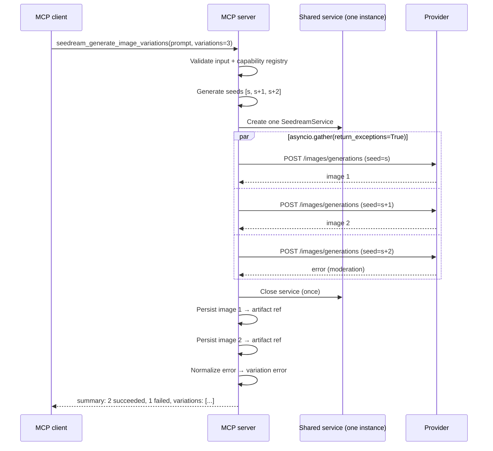

<!-- markdownlint-disable MD013 MD025 -->

# Parallel Multiple Generation for Seedance, Audio, and Seedream

## Outcome

Add three new MCP tools that generate multiple variations in parallel using
`asyncio.gather`, giving the user a set of distinct outputs from a single
tool call. The agent controls the number of assets via a `variations`
parameter (min=1, max per product, default=1).

- `seed_audio_generate_variations` — N parallel Seed Audio calls.
- `seedream_generate_image_variations` — N parallel Seedream calls.
- `seedance_create_task_variations` — N parallel Seedance task creations.

Each tool returns a list of per-variation results (artifact refs, errors,
and metadata), preserving partial failures so one bad variation does not
destroy the whole batch.

## Motivation

### Why client-side parallelism instead of provider-native batch?

| Product | Native batch? | Limitation |
|---|---|---|
| Seedream | Yes (`sequential_image_generation: "auto"`) | Produces a **coherent sequence** (storyboard), not independent variations. The images share visual continuity. For true variations with different seeds/prompts, you need separate calls. |
| Seed Audio | No | Single synchronous request/response. Max 120s output per call. |
| Seedance | No | One task per request. Async polling. |

For user-facing "give me N variations to choose from," each variation
should be an independent generation with its own seed (where supported)
or slightly perturbed prompt. This requires N concurrent provider calls,
not a single batch request.

### Provider concurrency limits

- **ModelArk (Seedream + Seedance):** 10 concurrent requests per account
  ([BytePlus rate limits](https://docs.byteplus.com/en/docs/modelark/1587798)).
  RPM limit: 600 for Seedance task creation. Image IPM: 500.
- **Seed Speech (Seed Audio):** Up to 10 concurrent requests for standard
  accounts ([Seed Audio guide](https://seedaudio.run/how-to-use/)).

The MCP server caps `variations` at the lower of the provider's
concurrency limit and a sensible server-side policy limit.

## Design Decisions

1. **New tools, not modified existing tools.** The existing single-generation
   tools stay unchanged. Parallel tools are additive, wrapping the
   single-generation logic in `asyncio.gather`.

2. **`variations` parameter: min=1, default=1, max per-product.** When
   `variations=1`, the tool behaves identically to the single-generation
   version. The max is capped by both the provider's concurrency limit
   and a server policy override.

3. **Per-variation seeds for Seedream.** Seedream supports `seed` (range
   -1 to 2147483647, default -1 — see
   [Seedream 4.0 API reference](https://limeng.mintlify.app/en/zmodelImage/byteplus/seedream-4-0-text-to-image)).
   Each variation gets a distinct seed derived from a base seed or random.
   Seedance 2.0 and Seed Audio do not support `seed`.

4. **Partial failure is a result, not an error.** If 3 of 5 variations
   succeed and 2 fail, the tool returns 3 artifacts and 2 error entries.
   The tool result is only an error if all variations fail or a
   pre-flight validation fails.

5. **Prompt override via `variation_prompts`.** The caller may pass a single
   `prompt` (optional when `variation_prompts` is provided) and the tool
   sends it to all variations, or pass an explicit list of `variation_prompts`
   (one per variation) for full control. A validator requires at least one
   of the two to be set.

6. **One shared service instance per tool call.** Each parallel tool call
   creates one `SeedreamService` / `SeedAudioService` / `SeedanceService`
   and passes it to all variation coroutines. The underlying
   `httpx.AsyncClient` is safe for concurrent use. The service is closed
   once in the outer handler's `finally` block.

7. **`asyncio.gather(*coros, return_exceptions=True)`.** Coroutines are
   created directly — no factory indirection. Each exception is caught and
   normalized into a per-variation error entry. `CancelledError` is not
   caught by `return_exceptions=True` in Python 3.12+, so it propagates
   correctly to the MCP client.

8. **Per-variation timeout.** Each variation coroutine is wrapped in
   `asyncio.wait_for(coro, timeout=per_variation_timeout)` to prevent a
   single hung variation from blocking the entire batch. The default
   timeout is the configured `BYTEPLUS_REQUEST_TIMEOUT_MS`. When
   `wait_for` times out, it cancels the inner coroutine and raises
   `asyncio.TimeoutError` to `gather(return_exceptions=True)`, which
   is then caught in the aggregation loop and recorded as
   `code="TIMEOUT"`.

## Architecture

```mermaid
flowchart TD
    Client["MCP client"] -->|variations=5| Tool["parallel_generate tool"]
    Tool -->|validate & build coroutines| Coros["N coroutines"]
    Coros -->|"asyncio.gather(return_exceptions=True)"| Gather{Gather}
    Gather -->|wait_for(coro_1, timeout)| V1["Variation #1"]
    Gather -->|wait_for(coro_2, timeout)| V2["Variation #2"]
    Gather -->|wait_for(coro_N, timeout)| VN["Variation #N"]
    V1 -->|artifact or error| Results["Aggregate results"]
    V2 -->|artifact or error| Results
    VN -->|artifact or error| Results
    Results -->|summary: VariationSummary| Client
```

## Shared Models

```python
# src/modelark_mcp/domain/models.py (additions)

from __future__ import annotations
from typing import Any
from pydantic import BaseModel, Field
from modelark_mcp.domain.artifacts import ArtifactRef


class VariationResult(BaseModel):
    """Result of a single variation within a parallel generation."""

    index: int = Field(..., description="0-based variation index.")
    seed: int | None = Field(None, description="Seed used (if applicable).")
    artifact: ArtifactRef | None = Field(
        None, description="Generated artifact (None if failed)."
    )
    task_id: str | None = Field(
        None, description="Task ID for async results (Seedance only)."
    )
    error: dict[str, Any] | None = Field(
        None, description="Error if this variation failed."
    )
    request_id: str | None = None
    provider_log_id: str | None = None


class VariationSummary(BaseModel):
    """Aggregate result of a parallel generation."""

    total: int = Field(..., description="Total variations requested.")
    succeeded: int = Field(..., description="Variations that produced output.")
    failed: int = Field(..., description="Variations that failed.")
    variations: list[VariationResult] = Field(default_factory=list)
```

These models live in `domain/models.py` alongside `SeedreamUsage`,
`SeedanceTaskSummary`, etc. — they are shared domain contracts, not
tool-specific. No circular import risk: `domain/artifacts.py` does not
import from `tools/`.

## Shared Parallel Helper

```python
# src/modelark_mcp/tools/_parallel.py

from __future__ import annotations

import asyncio
import random
from collections.abc import Awaitable, Callable
from typing import TypeVar

T = TypeVar("T")


def generate_seeds(base_seed: int | None, count: int) -> list[int | None]:
    """Generate distinct seeds for each variation.

    - ``base_seed=None`` → ``[None] * count`` (provider randomizes; seed
      is not recorded in VariationResult).
    - ``base_seed=-1`` → random seeds for each variation (client picks;
      recorded for reproducibility).
    - ``base_seed=N`` → ``[N, N+1, N+2, ...]`` (deterministic sequence,
      wrapped modulo 2147483648 to stay within the API's valid range).
    """
    if base_seed is None:
        return [None] * count
    if base_seed == -1:
        return [random.randint(0, 2147483647) for _ in range(count)]
    return [(base_seed + i) % 2147483648 for i in range(count)]


def resolve_prompts(
    base_prompt: str | None,
    variation_prompts: list[str] | None,
    count: int,
) -> list[str]:
    """Resolve the prompt for each variation.

    If ``variation_prompts`` is provided, it must have ``count`` entries.
    Otherwise, ``base_prompt`` is used for all variations.
    """
    if variation_prompts:
        return list(variation_prompts)
    if base_prompt is None:
        raise ValueError("Either base_prompt or variation_prompts must be provided.")
    return [base_prompt] * count


async def gather_with_timeout(
    coros: list[Awaitable[T]],
    timeout: float,
) -> list[T | Exception]:
    """Run N coroutines in parallel with a per-coroutine timeout.

    Wraps each coroutine in ``asyncio.wait_for``. Collects all results
    (including exceptions and timeouts) via ``asyncio.gather`` with
    ``return_exceptions=True``.
    """
    timed_coros = [asyncio.wait_for(coro, timeout=timeout) for coro in coros]
    results = await asyncio.gather(*timed_coros, return_exceptions=True)
    return list(results)
```

The helper uses `Callable[[], Awaitable[T]]` (not `asyncio.coroutine` which
was removed in Python 3.11+). The `gather_with_timeout` function wraps each
coroutine in `asyncio.wait_for` for per-variation timeout control.

## Tool Contracts

### Product-specific limits

| Product | Min | Default | Max | Seed support | Concurrency cap |
|---|---|---|---|---|---|
| Seedream | 1 | 1 | 10 | Yes (range -1 to 2147483647) | 10 (ModelArk) |
| Seed Audio | 1 | 1 | 5 | No | 5 (server policy, conservative) |
| Seedance | 1 | 1 | 5 | No (Seedance 2.0) | 5 (server policy, video cost) |

### 1. `seedream_generate_image_variations`

```python
# src/modelark_mcp/tools/seedream_generate_image_variations.py

class SeedreamVariationsInput(BaseModel):
    """Input for parallel Seedream image generation."""

    prompt: str | None = Field(
        None, description="Base prompt for all variations. Required if variation_prompts is None."
    )
    variations: int = Field(1, ge=1, le=10, description="Number of variations.")
    variation_prompts: list[str] | None = Field(
        None,
        description="Explicit prompts per variation. If provided, overrides prompt and must have `variations` entries.",
    )
    base_seed: int | None = Field(
        None, ge=-1, le=2147483647,
        description="Base seed. None = provider-randomized. -1 = client-randomized (recorded). N = deterministic (N+i per variation).",
    )
    images: list[MediaSource] | None = None
    model: str | None = None
    size: str | None = None
    output_format: Literal["png", "jpeg"] | None = None
    response_format: Literal["url", "b64_json"] | None = None
    watermark: bool | None = None
    prompt_optimization: Literal["standard", "fast"] | None = None
    persist: bool = True

    @model_validator(mode="after")
    def validate_prompt_required(self) -> "SeedreamVariationsInput":
        if self.prompt is None and not self.variation_prompts:
            raise ValueError("Either prompt or variation_prompts must be provided.")
        return self

    @model_validator(mode="after")
    def validate_prompts_length(self) -> "SeedreamVariationsInput":
        if self.variation_prompts and len(self.variation_prompts) != self.variations:
            raise ValueError(
                f"variation_prompts must have exactly {self.variations} entries, "
                f"got {len(self.variation_prompts)}"
            )
        return self


class SeedreamVariationsOutput(BaseModel):
    """Output for parallel Seedream image generation."""

    provider: Literal["byteplus-modelark"] = "byteplus-modelark"
    model: str
    created_at: str
    summary: VariationSummary
```

**Note on `max_images`:** The variations tool intentionally omits
`max_images` — each variation produces exactly one image. The existing
`seedream_generate_image` tool with `max_images` handles provider-native
batch (coherent sequence). These are different use cases.

**Note on usage:** Per-variation usage is not captured in `VariationResult`
because `SeedreamService.extract_usage` requires the full response, and the
per-variation function returns only an artifact or error. The
`SeedreamVariationsOutput` does not include a `usage` field — total token
usage can be retrieved from the provider's billing dashboard.

### 2. `seed_audio_generate_variations`

```python
# src/modelark_mcp/tools/seed_audio_generate_variations.py

class SeedAudioVariationsInput(BaseModel):
    """Input for parallel Seed Audio generation."""

    text_prompt: str | None = Field(
        None, min_length=1, max_length=3000,
        description="Base prompt. Required if variation_prompts is None."
    )
    variations: int = Field(1, ge=1, le=5, description="Number of variations.")
    variation_prompts: list[str] | None = Field(
        None, description="Explicit prompts per variation."
    )
    audio_references: list[AudioReference] = Field(default_factory=list, max_length=3)
    image_reference: MediaSource | None = None
    output: AudioOutputOptions | None = None
    watermark: AudioWatermarkOptions | None = None
    persist: bool = True

    @model_validator(mode="after")
    def validate_prompt_required(self) -> "SeedAudioVariationsInput":
        if self.text_prompt is None and not self.variation_prompts:
            raise ValueError("Either text_prompt or variation_prompts must be provided.")
        return self

    @model_validator(mode="after")
    def validate_no_media_mixing(self) -> "SeedAudioVariationsInput":
        if self.audio_references and self.image_reference:
            raise ValueError("Audio and image references are mutually exclusive.")
        return self

    @model_validator(mode="after")
    def validate_prompts_length(self) -> "SeedAudioVariationsInput":
        if self.variation_prompts and len(self.variation_prompts) != self.variations:
            raise ValueError(
                f"variation_prompts must have exactly {self.variations} entries"
            )
        return self


class SeedAudioVariationsOutput(BaseModel):
    """Output for parallel Seed Audio generation."""

    provider: Literal["byteplus-seed-speech"] = "byteplus-seed-speech"
    model: Literal["seed-audio-1.0"] = "seed-audio-1.0"
    summary: VariationSummary
```

**Note on subtitles:** Subtitles are not returned in parallel mode. The
`VariationResult` model does not carry a `subtitle` field. If subtitles
are needed, use the single-generation `seed_audio_generate` tool.

### 3. `seedance_create_task_variations`

```python
# src/modelark_mcp/tools/seedance_create_task_variations.py

class SeedanceVariationsInput(SeedanceCreateTaskInput):
    """Input for parallel Seedance video task creation.

    Inherits all fields and validators from SeedanceCreateTaskInput
    (prompt, images, videos, audios, model, resolution, duration, etc.)
    and adds variations-specific fields.
    """

    prompt: str | None = Field(
        None, description="Base prompt. Required if variation_prompts is None."
    )
    variations: int = Field(1, ge=1, le=5, description="Number of variations.")
    variation_prompts: list[str] | None = Field(
        None, description="Explicit prompts per variation."
    )

    @model_validator(mode="after")
    def validate_prompt_required(self) -> "SeedanceVariationsInput":
        if self.prompt is None and not self.variation_prompts:
            raise ValueError("Either prompt or variation_prompts must be provided.")
        return self

    @model_validator(mode="after")
    def validate_prompts_length(self) -> "SeedanceVariationsInput":
        if self.variation_prompts and len(self.variation_prompts) != self.variations:
            raise ValueError(
                f"variation_prompts must have exactly {self.variations} entries"
            )
        return self


class SeedanceVariationsOutput(BaseModel):
    """Output for parallel Seedance video task creation."""

    summary: VariationSummary
    recommended_poll_after_ms: int
```

**Note on Seedance `seed`:** The `SeedanceCreateProviderRequest` schema
already has a `seed` field, but Seedance 2.0 does not support it
(`VideoCapabilities.supports_seed = False`). The existing
`build_request` does not pass `seed` through. This plan does not add
seed support for Seedance. The pre-existing `seed` field in the schema
is dead code that should be cleaned up separately.

The `VariationResult.task_id` field is used for Seedance (instead of
`artifact`), since the tasks are asynchronous and the video artifacts
are only available after polling via `seedance_get_task`.

## Tool annotations

| Tool | `readOnlyHint` | `destructiveHint` | `idempotentHint` | `openWorldHint` |
|---|---|---|---|---|
| `seedream_generate_image_variations` | `False` | `False` | `False` | `True` |
| `seed_audio_generate_variations` | `False` | `False` | `False` | `True` |
| `seedance_create_task_variations` | `False` | `False` | `False` | `True` |

## Handler Implementation (Seedream — representative example)

```python
async def seedream_generate_image_variations(
    input: SeedreamVariationsInput, ctx: Context
) -> SeedreamVariationsOutput:
    """Generate multiple image variations in parallel through ModelArk Seedream."""
    await ctx.info(f"Starting {input.variations} parallel Seedream generations")
    await ctx.report_progress(progress=10, total=100)

    settings = get_settings()
    if not settings.has_modelark:
        raise ValueError("BYTEPLUS_MODELARK_API_KEY is not configured.")

    registry = get_capability_registry()
    caps = registry.get_image_capabilities(input.model)

    # Pre-flight capability validation (same as single-generation tool).
    if len(input.images or []) > caps.max_references:
        raise ValueError(
            f"Model '{caps.model_id}' supports at most {caps.max_references} "
            f"reference images, got {len(input.images or [])}."
        )
    registry.validate_output_format(input.model, input.output_format)
    registry.validate_image_size(input.model, input.size)

    seeds = generate_seeds(input.base_seed, input.variations)
    prompts = resolve_prompts(input.prompt, input.variation_prompts, input.variations)

    from modelark_mcp.server import get_artifact_store
    store = get_artifact_store()

    images_data = [src.model_dump() for src in input.images] if input.images else None
    timeout = settings.request_timeout_ms / 1000

    # Create one shared service instance — httpx.AsyncClient is concurrent-safe.
    service = SeedreamService()

    async def _generate_single(idx: int) -> VariationResult:
        """Generate a single image variation."""
        try:
            request = SeedreamService.build_request(
                model=caps.model_id,
                prompt=prompts[idx],
                images=images_data,
                size=input.size,
                output_format=input.output_format,
                response_format=input.response_format,
                watermark=input.watermark,
                prompt_optimization=input.prompt_optimization,
                seed=seeds[idx],
            )

            response, request_id = await service.generate(request)

            artifact: ArtifactRef | None = None
            if input.persist and response.data:
                item = response.data[0]
                source_expiry = (datetime.now(UTC) + timedelta(hours=24)).isoformat()
                mime = f"image/{input.output_format}" if input.output_format else "image/png"
                if item.b64_json:
                    artifact = await store.put_base64(
                        data=item.b64_json,
                        media_type="image",
                        mime_type=mime,
                        source_expires_at=source_expiry,
                    )
                elif item.url:
                    artifact = await store.copy_from_trusted_url(
                        url=item.url,
                        media_type="image",
                        mime_type=mime,
                        source_expires_at=source_expiry,
                    )
            elif not input.persist and response.data:
                # Return unpersisted provider-URL reference (will expire in 24h).
                item = response.data[0]
                if item.url:
                    artifact = ArtifactRef(
                        id="provider-url",
                        uri=item.url,
                        media_type="image",
                        mime_type=f"image/{input.output_format or 'png'}",
                        created_at=datetime.now(UTC).isoformat(),
                        source_expires_at=(
                            datetime.now(UTC) + timedelta(hours=24)
                        ).isoformat(),
                    )

            return VariationResult(
                index=idx, seed=seeds[idx], artifact=artifact, request_id=request_id,
            )
        except ProviderError as exc:
            return VariationResult(
                index=idx, seed=seeds[idx],
                error={"code": exc.code or "PROVIDER_ERROR", "message": exc.message},
                request_id=exc.request_id,
            )
        except Exception as exc:
            # Note: asyncio.TimeoutError is NOT caught here. It is raised
            # by wait_for OUTSIDE this coroutine, caught by gather, and
            # handled in the aggregation loop below.
            return VariationResult(
                index=idx, seed=seeds[idx],
                error={"code": "UNEXPECTED_ERROR", "message": str(exc)},
            )

    # Build coroutines directly — no factory indirection.
    coros = [_generate_single(i) for i in range(input.variations)]

    try:
        results = await gather_with_timeout(coros, timeout=timeout)
    finally:
        # Always close the shared service, even if gather is cancelled.
        await service.close()

    # Aggregate results — handle TimeoutError explicitly (from wait_for).
    variation_results: list[VariationResult] = []
    for i, result in enumerate(results):
        if isinstance(result, asyncio.TimeoutError):
            variation_results.append(VariationResult(
                index=i, seed=seeds[i],
                error={"code": "TIMEOUT", "message": f"Variation {i} timed out"},
            ))
        elif isinstance(result, Exception):
            variation_results.append(VariationResult(
                index=i, seed=seeds[i],
                error={"code": "GATHER_ERROR", "message": str(result)},
            ))
        else:
            variation_results.append(result)

    succeeded = sum(
        1 for r in variation_results
        if r.artifact is not None or r.task_id is not None
    )
    failed = input.variations - succeeded

    await ctx.report_progress(progress=100, total=100)
    log_info("seedream_variations_complete", total=input.variations, succeeded=succeeded, failed=failed)

    return SeedreamVariationsOutput(
        model=caps.model_id,
        created_at=datetime.now(UTC).isoformat(),
        summary=VariationSummary(
            total=input.variations,
            succeeded=succeeded,
            failed=failed,
            variations=variation_results,
        ),
    )
```

The Seed Audio and Seedance variation handlers follow the same pattern:

- **Seed Audio:** No `seed` parameter. One shared `SeedAudioService`
  per tool call, closed in a `finally` block. (This also fixes a
  pre-existing resource leak in the single-generation `seed_audio_generate`
  tool, which never calls `close()`.) Max 5 variations.

- **Seedance:** No `seed` parameter. One shared `SeedanceService` per
  tool call, closed in a `finally` block. Each variation creates a task
  and returns `task_id` (not `artifact`). The success count uses
  `r.task_id is not None` (not `r.artifact is not None`). The output's
  `recommended_poll_after_ms` is shared across all variations.
  `SeedanceVariationsInput` inherits from `SeedanceCreateTaskInput` to
  reuse all existing validators (media required, reference counts, media
  mixing). Max 5 variations.

## Provider Schema Changes

### Seedream: add `seed` to `SeedreamProviderRequest` and `build_request`

The BytePlus API supports `seed` (range -1 to 2147483647, default -1) for
all Seedream models — confirmed in the
[Seedream 4.0 API reference](https://limeng.mintlify.app/en/zmodelImage/byteplus/seedream-4-0-text-to-image).

```python
# providers/modelark/schemas.py — add seed field

class SeedreamProviderRequest(BaseModel):
    model: str
    prompt: str
    image: str | list[str] | None = None
    size: str | None = None
    seed: int | None = None  # NEW: -1 = random, 0+ = fixed
    sequential_image_generation: str | None = None  # "auto" or "disabled"
    sequential_image_generation_options: dict[str, Any] | None = None
    stream: bool = False
    output_format: str | None = None
    response_format: str | None = None
    watermark: bool | None = None
    optimize_prompt_options: dict[str, str] | None = None
```

The `build_request` static method must accept and pass through `seed`:

```python
# providers/modelark/seedream.py — updated build_request signature

@staticmethod
def build_request(
    *,
    model: str,
    prompt: str,
    images: list[dict[str, Any]] | None = None,
    size: str | None = None,
    seed: int | None = None,  # NEW
    max_images: int | None = None,
    output_format: str | None = None,
    response_format: str | None = None,
    watermark: bool | None = None,
    prompt_optimization: str | None = None,
) -> SeedreamProviderRequest:
    # ... existing logic ...
    return SeedreamProviderRequest(
        model=model,
        prompt=prompt,
        image=image_field,
        size=size,
        seed=seed,  # NEW
        # ...
    )
```

### Bug fix: `sequential_image_generation` type change from `bool` to `str`

The current `build_request` sets `sequential = True` (bool), but the API
expects `"auto"` (string). This is a **pre-existing bug** — the current
batch generation is broken. This plan fixes it:

```python
# providers/modelark/seedream.py — fix build_request

if max_images is not None and max_images > 1:
    sequential = "auto"  # was: True (bool — wrong per API docs)
    sequential_options = {"max_images": max_images}
```

The existing contract test `test_batch_request_derives_sequential` asserts
`request.sequential_image_generation is True` — it must be updated to
assert `== "auto"`.

## File Organization

```text
src/modelark_mcp/
├── domain/
│   └── models.py                  # MODIFIED: add VariationResult, VariationSummary
├── tools/
│   ├── _parallel.py               # NEW: generate_seeds, resolve_prompts, gather_with_timeout
│   ├── seedream_generate_image_variations.py  # NEW
│   ├── seed_audio_generate_variations.py      # NEW
│   └── seedance_create_task_variations.py      # NEW
├── providers/modelark/
│   ├── schemas.py                 # MODIFIED: add seed to SeedreamProviderRequest
│   └── seedream.py                # MODIFIED: add seed to build_request, fix sequential type
└── server.py                      # MODIFIED: register 3 new tools
```

Shared input model types (`AudioOutputOptions`, `AudioWatermarkOptions`,
`AudioReference` from `seed_audio_generate.py`; `SeedanceImageInput`,
`SeedanceVideoInput`, `SeedanceAudioInput` from
`seedance_create_task.py`) are imported by the variation tools. This is
acceptable tool-to-tool coupling — the variation tools depend on their
single-generation counterparts by design. If this becomes a maintenance
issue, these shared types can be extracted to `domain/models.py` later.

## Registration

The three new tools are registered in `server.py`'s `register_tools()`
under the same credential gates as their single-generation counterparts:

```python
if settings.has_seed_audio:
    # ... existing seed_audio_generate ...
    from modelark_mcp.tools.seed_audio_generate_variations import (
        TOOL_ANNOTATIONS as audio_var_annotations,
        seed_audio_generate_variations,
    )
    mcp.tool(
        name="seed_audio_generate_variations",
        annotations={**audio_var_annotations},
    )(seed_audio_generate_variations)

if settings.has_modelark:
    # ... existing seedream and seedance tools ...
    from modelark_mcp.tools.seedream_generate_image_variations import (
        TOOL_ANNOTATIONS as seedream_var_annotations,
        seedream_generate_image_variations,
    )
    mcp.tool(
        name="seedream_generate_image_variations",
        annotations={**seedream_var_annotations},
    )(seedream_generate_image_variations)

    from modelark_mcp.tools.seedance_create_task_variations import (
        TOOL_ANNOTATIONS as seedance_var_annotations,
        seedance_create_task_variations,
    )
    mcp.tool(
        name="seedance_create_task_variations",
        annotations={**seedance_var_annotations},
    )(seedance_create_task_variations)
```

## Test Plan

### Unit tests (`tests/unit/`)

| Test | What it covers |
|---|---|
| `test_variation_models.py` | `VariationResult` and `VariationSummary` validation |
| `test_parallel_helpers.py` | `generate_seeds` (None, -1, N), `resolve_prompts` (base, variation, mismatch), `gather_with_timeout` (success, partial failure, timeout) |
| `test_variation_validators.py` | Input model validators: `variations` range, `variation_prompts` length, `prompt` required when no `variation_prompts`, media mixing |

### Integration tests (`tests/integration/`)

**Mocking strategy for parallel execution:** Use a mock that inspects the
request (seed or prompt) to return different responses, rather than relying
on call order. `asyncio.gather` does not guarantee execution order, so a
call-counting mock is fragile. Instead, key off the request's `seed` or
`prompt` field:

```python
def _patch_service_by_seed(monkeypatch, responses_by_seed: dict[int, dict | Exception]):
    """Mock a service method to return different results based on the request seed.

    This is order-independent — works correctly with asyncio.gather.
    """
    async def mock_generate(self, request):
        seed = request.seed
        response = responses_by_seed.get(seed)
        if isinstance(response, Exception):
            raise response
        return SeedreamProviderResponse.model_validate(response), f"req-{seed}"

    monkeypatch.setattr(SeedreamService, "generate", mock_generate)
```

For tools without seeds (Seed Audio, Seedance), key off the prompt:

```python
def _patch_service_by_prompt(monkeypatch, responses_by_prompt: dict[str, dict | Exception]):
    """Mock a service method to return different results based on the request prompt."""
    async def mock_generate(self, request, **kwargs):
        response = responses_by_prompt.get(request.text_prompt)
        if isinstance(response, Exception):
            raise response
        return SeedAudioProviderResponse.model_validate(response), "log-test"

    monkeypatch.setattr(SeedAudioService, "generate", mock_generate)
```

| Test | What it covers |
|---|---|
| `test_seedream_variations_tool.py` | 3 variations, all succeed — verify 3 artifacts with distinct seeds |
| `test_seedream_variations_tool.py` | 5 variations, 2 fail — partial failure: 3 artifacts, 2 errors |
| `test_seedream_variations_tool.py` | `variation_prompts` with explicit prompts — verify each variation gets its prompt |
| `test_seedream_variations_tool.py` | `base_seed=42` — verify seeds are [42, 43, 44] |
| `test_seedream_variations_tool.py` | `base_seed=None` — verify `VariationResult.seed` is None |
| `test_seedream_variations_tool.py` | `base_seed=-1` — verify distinct random seeds |
| `test_seedream_variations_tool.py` | `base_seed=2147483647`, `variations=3` — verify no overflow (modulo wrapping) |
| `test_seedream_variations_tool.py` | `variations=1` (default) — behaves like single generation |
| `test_seedream_variations_tool.py` | No API key — raises before any provider call |
| `test_seedream_variations_tool.py` | All variations fail — returns all errors, no exception |
| `test_seedream_variations_tool.py` | Too many references — validation rejects before provider call |
| `test_seedream_variations_tool.py` | `persist=False` — returns provider-URL refs (not persisted artifacts) |
| `test_seedream_variations_tool.py` | One variation times out — recorded as `code="TIMEOUT"`, others succeed |
| `test_seed_audio_variations_tool.py` | 3 audio variations, all succeed |
| `test_seed_audio_variations_tool.py` | Partial failure (2 of 3) |
| `test_seed_audio_variations_tool.py` | `variation_prompts` override |
| `test_seed_audio_variations_tool.py` | Service `close()` called in `finally` even on failure |
| `test_seedance_variations_tool.py` | 3 task creations — verify 3 task IDs returned |
| `test_seedance_variations_tool.py` | No media input — validation rejects |
| `test_seedance_variations_tool.py` | `variations=6` — rejected (max is 5) |
| `test_seedance_variations_tool.py` | Inherited validators fire (media required, reference counts) |
| `test_seedance_variations_tool.py` | `succeeded` count uses `task_id`, not `artifact` |
| `test_parallel_helpers.py` | `gather_with_timeout` — all succeed |
| `test_parallel_helpers.py` | `gather_with_timeout` — one times out, recorded as `TimeoutError` |
| `test_parallel_helpers.py` | `generate_seeds` — `base_seed=2147483647` with `count=3` does not overflow |

### MCP conformance tests (`tests/integration/`)

| Test | What it covers |
|---|---|
| `test_mcp_conformance.py` | All 3 new tools discoverable, `parameters` schema has `variations` field, `ToolAnnotations` correct |

### Contract test update

| Test | What it covers |
|---|---|
| `test_seedream_adapter.py::test_batch_request_derives_sequential` | Update: assert `== "auto"` instead of `is True` |

### Manual live smoke test

```bash
uv run python scripts/live_smoke_test_variations.py
```

Generates 3 image variations (with distinct seeds), 3 audio variations,
and 3 video task variations, verifying all artifacts are persisted locally.

## Implementation Phases

### Phase 1 — Shared infrastructure + bug fixes

1. Add `VariationResult` and `VariationSummary` to `domain/models.py`.
2. Create `tools/_parallel.py` with `generate_seeds`, `resolve_prompts`,
   `gather_with_timeout`.
3. Add `seed: int | None = None` to `SeedreamProviderRequest` in
   `providers/modelark/schemas.py`.
4. Add `seed` parameter to `SeedreamService.build_request`.
5. Fix `sequential_image_generation` type: `True` → `"auto"` in
   `SeedreamService.build_request`.
6. Update `test_batch_request_derives_sequential` contract test.
7. Write unit tests for helpers and models.

**Acceptance:** `ruff check`, `mypy`, and `pytest` pass with the bug fix
and new shared code.

### Phase 2 — Seedream variations

1. Create `tools/seedream_generate_image_variations.py` with input/output
   models and handler.
2. Register in `server.py`.
3. Write integration tests with call-counting mock.
4. Write MCP conformance test.

**Acceptance:** Mocked 3-variation test produces 3 artifacts with distinct
seeds. Partial failure (2 of 3) returns 2 artifacts and 1 error.

### Phase 3 — Seed Audio variations

1. Create `tools/seed_audio_generate_variations.py`.
2. Register in `server.py`.
3. Write integration tests.
4. Write MCP conformance test.

**Acceptance:** Mocked 3-variation test produces 3 audio artifacts.

### Phase 4 — Seedance variations

1. Create `tools/seedance_create_task_variations.py` with
   `SeedanceVariationsInput(SeedanceCreateTaskInput)` inheritance.
2. Register in `server.py`.
3. Write integration tests.
4. Write MCP conformance test.

**Acceptance:** Mocked 3-variation test produces 3 task IDs. Validation
rejects 0 variations and >5 variations. Inherited validators fire.

### Phase 5 — Documentation and live smoke test

1. Update `docs/tools.md` with the three new tool references.
2. Create `scripts/live_smoke_test_variations.py`.
3. Run live smoke test with real credentials.
4. Final lint, typecheck, test, build.

**Acceptance:** All checks pass. Live test produces 3 image variations,
3 audio variations, and 3 video task IDs.

## Sequence Diagram



## Risks and Mitigations

| Risk | Effect | Mitigation |
|---|---|---|
| Provider rate limit (429) | Some variations fail | Cap at 5-10; variations are independent so a 429 on one doesn't block others. The 429 is captured as a per-variation error. |
| High cost for Seedance variations | Unexpected bill | Default `variations=1`; require explicit opt-in for >1; log cost estimate in handler |
| One variation hangs | Entire batch waits | Per-variation `asyncio.wait_for` timeout; timed-out variation is recorded as `code="TIMEOUT"` in the aggregation loop |
| All variations fail | User gets no output | Return structured error with all failure reasons; suggest trying with `variations=1` |
| `asyncio.CancelledError` (client cancels mid-batch) | Partial results lost | `CancelledError` propagates through `gather_with_timeout` to the MCP client; the shared service `close()` is in a `finally` block so the `httpx.AsyncClient` is always cleaned up |
| `variation_prompts` length mismatch | Validation error | Pydantic model validator catches at input time before any provider call |
| Seed overflow near 2147483647 | Provider rejects seeds | `generate_seeds` wraps with modulo 2147483648 |
| Pre-existing `sequential_image_generation` bug | Batch generation sends `true` instead of `"auto"` | Fixed in Phase 1 as part of the schema change |
| Pre-existing `seed_audio_generate` resource leak | `SeedAudioService` never closed | Fixed in the variations tool by closing in `finally`; single-generation tool should be patched separately |

## Sources

- [BytePlus ModelArk rate limits](https://docs.byteplus.com/en/docs/modelark/1587798) — 10 concurrent requests per account, 600 RPM for Seedance, 500 IPM for images.
- [BytePlus Seedream image generation API](https://docs.byteplus.com/en/docs/modelark/1541523) — `sequential_image_generation`, `max_images`, `seed` parameter.
- [Seedream 4.0 API reference](https://limeng.mintlify.app/en/zmodelImage/byteplus/seedream-4-0-text-to-image) — Full OpenAPI spec with `seed` (range -1 to 2147483647), `sequential_image_generation: "auto" | "disabled"`.
- [BytePlus Seed Audio API reference](https://docs.byteplus.com/en/docs/byteplusvoice/seedaudio-01) — synchronous, non-streaming, no batch, no seed.
- [Seed Audio integration guide](https://seedaudio.run/how-to-use/) — 10 concurrent requests, async Python recommended.
- [FastMCP tools](https://gofastmcp.com/servers/tools) — `@mcp.tool` decorator, `ToolAnnotations`, structured output.
