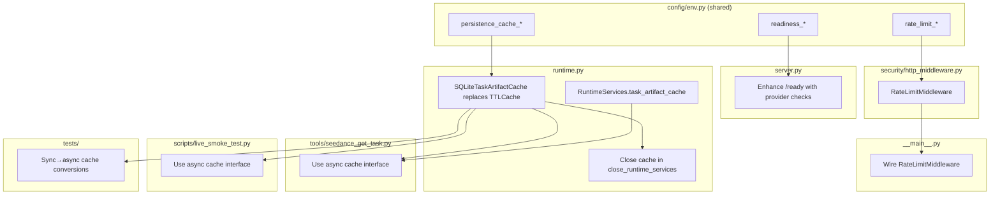

# Runtime Improvements Implementation Plan

**Goal:** Fix five runtime and operational gaps: durable SQLite-backed persistence cache (replacing in-memory `TTLCache`), provider health in `/ready`, HTTP rate limiting, stale README/docs, and a GH issue for per-model cost estimation.

**Source Context:**
- User request: improve MCP server runtime (items 2–6 from analysis)
- Docs/specs read: [`docs/runtime.md`], [`docs/security.md`], [`docs/deployment.md`], [`docs/configuration.md`], [`docs/transports.md`], [`docs/artifacts.md`], [`docs/architecture.md`]
- Code inspected: [`src/modelark_mcp/runtime.py`], [`src/modelark_mcp/server.py`], [`src/modelark_mcp/config/env.py`], [`src/modelark_mcp/__main__.py`], [`src/modelark_mcp/security/http_middleware.py`], [`src/modelark_mcp/providers/base.py`], [`src/modelark_mcp/providers/modelark/client.py`], [`src/modelark_mcp/providers/seed_speech/client.py`], [`src/modelark_mcp/providers/seed_speech/asr_http.py`], [`src/modelark_mcp/tools/seedance_get_task.py`], [`src/modelark_mcp/tools/seedance_create_task.py`], [`scripts/live_smoke_test.py`], [`tests/conftest.py`], [`tests/integration/conftest.py`], [`tests/integration/test_http_security.py`], [`tests/integration/test_seedance_tool.py`], [`tests/unit/test_runtime.py`]

**Architecture Decision:** All fixes stay within the existing single-process, SQLite + filesystem architecture. No new external dependencies. Each fix is additive — new env vars default to current behavior so existing deployments are backward-compatible. The in-memory `TTLCache` persistence cache is replaced by `SQLiteTaskArtifactCache` (same SQLite database file as ownership/budget), making task→artifact mappings durable across restarts. The new cache honors `maxsize` (via row-count eviction) and `ttl_seconds` (via `created_at` expiry check on `get`). Provider health checks are opt-in to avoid adding latency to readiness probes by default. STT health checks use `SeedSpeechAsrHttpGateway` (distinct host/key from Seed Audio), not the audio gateway.

**Parallelization Summary:** Tasks 1–4 all touch `config/env.py` (additive field additions) and `tests/conftest.py` (additive prefix additions). The `config/env.py` changes are non-overlapping (different fields), but concurrent edits to the same file risk merge conflicts. **Recommended: implement sequentially** — Tasks 1→2→3→4 share too many files for safe parallelism. Task 5 (docs) must wait for all code changes. Task 6 (GH issue) can be created at any time.



## File Ownership

| Path | Owner | Responsibility | Notes |
| --- | --- | --- | --- |
| `src/modelark_mcp/config/env.py` | Main agent | Add 6 new Settings fields | Tasks 1, 2, 3 contribute different fields |
| `src/modelark_mcp/runtime.py` | Main agent | SQLiteTaskArtifactCache, RuntimeServices change, close_runtime_services | Task 1 |
| `src/modelark_mcp/server.py` | Main agent | Enhance `/ready` endpoint | Task 2 |
| `src/modelark_mcp/providers/base.py` | Main agent | Add `health_check` method | Task 2 |
| `src/modelark_mcp/security/http_middleware.py` | Main agent | RateLimitMiddleware | Task 3 |
| `src/modelark_mcp/__main__.py` | Main agent | Wire rate limiter | Task 3 |
| `src/modelark_mcp/tools/seedance_get_task.py` | Main agent | Use async cache | Task 1 |
| `scripts/live_smoke_test.py` | Main agent | Use async cache | Task 1 |
| `tests/conftest.py` | Main agent | Add env var prefixes | Tasks 1, 2, 3 |
| `tests/unit/test_runtime.py` | Main agent | SQLiteTaskArtifactCache tests | Task 1 |
| `tests/unit/test_env.py` | Main agent | New Settings field tests | Tasks 1, 2, 3 |
| `tests/integration/test_seedance_tool.py` | Main agent | Sync→async cache conversions | Task 1 |
| `tests/integration/test_http_security.py` | Main agent | Provider health + rate limit tests | Tasks 2, 3 |
| `.env.example` | Main agent | Document new env vars | Task 4 |
| `docs/*.md` | Main agent | Update docs | Task 4 |
| `README.md` | Main agent | Update test count + status | Task 4 |

## Implementation Tasks

### Task 1: Replace in-memory persistence cache with configurable SQLite-backed cache

Merges the original "configurable cache" and "durable mapping" tasks into one coherent unit. The `TTLCache` is replaced by `SQLiteTaskArtifactCache` which honors `maxsize` (row-count eviction) and `ttl_seconds` (`created_at` expiry on `get`).

**Files:** `src/modelark_mcp/config/env.py`, `src/modelark_mcp/runtime.py`, `src/modelark_mcp/tools/seedance_get_task.py`, `scripts/live_smoke_test.py`, `tests/conftest.py`, `tests/unit/test_env.py`, `tests/unit/test_runtime.py`, `tests/integration/test_seedance_tool.py`

**Depends on:** None

**Can run in parallel with:** No — shares `config/env.py` with Tasks 2 and 3.

- [ ] Add `"PERSISTENCE_"` to `_SETTINGS_ENV_PREFIXES` in `tests/conftest.py`.

- [ ] Add two fields to `Settings` in `config/env.py`, in the `# --- Runtime policy ---` section (after `DAILY_BUDGET_USD`):
  ```python
  persistence_cache_max_size: int = Field(
      default=10_000,
      ge=1,
      validation_alias="PERSISTENCE_CACHE_MAX_SIZE",
      description="Maximum number of provider task IDs cached in the artifact-resolution cache.",
  )
  persistence_cache_ttl_seconds: int = Field(
      default=86_400,
      ge=60,
      validation_alias="PERSISTENCE_CACHE_TTL_SECONDS",
      description="TTL in seconds for cached provider task to artifact mappings. Entries older than this are ignored on read.",
  )
  ```

- [ ] Define a `TaskArtifactCache` `Protocol` in `runtime.py` (alongside `TaskOwnershipStore`):
  ```python
  class TaskArtifactCache(Protocol):
      async def get(self, task_id: str) -> dict[str, ArtifactRef | None] | None: ...
      async def set(self, task_id: str, artifacts: dict[str, ArtifactRef | None]) -> None: ...
      async def pop(self, task_id: str) -> dict[str, ArtifactRef | None] | None: ...
      async def clear(self) -> None: ...
      async def close(self) -> None: ...
  ```
  Include `pop` and `clear` because existing code in `seedance_get_task.py`, `test_seedance_tool.py`, and `live_smoke_test.py` uses these operations.

- [ ] Implement `SQLiteTaskArtifactCache` in `runtime.py`, using the same SQLite database file (shared with `SQLiteTaskOwnershipStore` and `BudgetLedger`). Schema:
  ```sql
  CREATE TABLE IF NOT EXISTS task_artifacts (
      task_id TEXT PRIMARY KEY,
      artifacts_json TEXT NOT NULL,
      created_at TEXT NOT NULL
  )
  ```
  - `__init__(self, database_path: Path, *, ttl_seconds: int = 86_400, max_size: int = 10_000)` — create table, store config, `asyncio.Lock`.
  - `get(task_id)` — `SELECT artifacts_json, created_at FROM task_artifacts WHERE task_id = ?`. If no row → `None`. If `created_at` older than `ttl_seconds` → return `None` (expired; row is lazily ignored, not deleted). Deserialize JSON: each value is either `null` or an `ArtifactRef` dict; reconstruct via `ArtifactRef.model_validate`.
  - `set(task_id, artifacts)` — `INSERT INTO task_artifacts ... ON CONFLICT(task_id) DO UPDATE SET artifacts_json = excluded.artifacts_json, created_at = excluded.created_at`. Serialize: `json.dumps({k: v.model_dump(mode="json") if v is not None else None for k, v in artifacts.items()})`. After insert, check row count; if `> max_size`, delete oldest rows beyond `max_size` (`DELETE FROM task_artifacts WHERE task_id NOT IN (SELECT task_id FROM task_artifacts ORDER BY created_at DESC LIMIT ?)`).
  - `pop(task_id)` — `SELECT artifacts_json FROM task_artifacts WHERE task_id = ?`, then `DELETE FROM task_artifacts WHERE task_id = ?`. Return deserialized dict or `None`.
  - `clear()` — `DELETE FROM task_artifacts`.
  - `close()` — close the connection.
  - Same `asyncio.Lock` pattern as the other SQLite stores.

- [ ] Replace `persistence_cache: TTLCache[str, dict[str, ArtifactRef | None]]` in `RuntimeServices` with `task_artifact_cache: TaskArtifactCache`.

- [ ] In `create_runtime_services`, construct:
  ```python
  task_artifact_cache=SQLiteTaskArtifactCache(
      database_path,
      ttl_seconds=settings.persistence_cache_ttl_seconds,
      max_size=settings.persistence_cache_max_size,
  ),
  ```
  Remove the `TTLCache(maxsize=10_000, ttl=86_400)` construction.

- [ ] In `close_runtime_services`, add `await runtime.task_artifact_cache.close()` before closing `ownership_store` (or after — order is not critical since they use separate connections).

- [ ] In `tools/seedance_get_task.py`, update the cache usage (3 call sites):
  - Line 111: `runtime.persistence_cache.get(input.task_id)` → `await runtime.task_artifact_cache.get(input.task_id)`
  - Line 162: `runtime.persistence_cache[input.task_id] = {...}` → `await runtime.task_artifact_cache.set(input.task_id, {...})`
  - Rename `persistence_cache` → `task_artifact_cache` in any local variable names.

- [ ] In `scripts/live_smoke_test.py`, update the cache usage (1 call site):
  - Line 268: `runtime.persistence_cache.pop(task_id, None)` → `await runtime.task_artifact_cache.pop(task_id)`

- [ ] In `tests/integration/test_seedance_tool.py`, update all cache usage (4 call sites):
  - Line 219: `fake_ctx.lifespan_context["runtime"].persistence_cache.clear()` → `await fake_ctx.lifespan_context["runtime"].task_artifact_cache.clear()`
  - Line 272: `persistence_cache = fake_ctx.lifespan_context["runtime"].persistence_cache` → `task_artifact_cache = fake_ctx.lifespan_context["runtime"].task_artifact_cache`
  - Line 273: `persistence_cache.clear()` → `await task_artifact_cache.clear()`
  - Line 289: `persistence_cache["task-cached"] = {"video": cached_ref, "last_frame": None}` → `await task_artifact_cache.set("task-cached", {"video": cached_ref, "last_frame": None})`
  - Line 315: `fake_ctx.lifespan_context["runtime"].persistence_cache.clear()` → `await fake_ctx.lifespan_context["runtime"].task_artifact_cache.clear()`

- [ ] Add tests in `tests/unit/test_env.py` asserting `persistence_cache_max_size` and `persistence_cache_ttl_seconds` have correct defaults (10000, 86400) and env-var overrides.

- [ ] Add tests in `tests/unit/test_runtime.py`:
  - `test_task_artifact_cache_set_and_get` — set a mapping with an `ArtifactRef`, get it back, assert `id` and `uri` match.
  - `test_task_artifact_cache_returns_none_for_missing` — get unknown task_id, assert `None`.
  - `test_task_artifact_cache_upsert` — set twice for same task_id with different `ArtifactRef`, assert second value overwrites.
  - `test_task_artifact_cache_pop` — set a mapping, `pop` it, assert returned value matches; `get` returns `None` after pop.
  - `test_task_artifact_cache_clear` — set two mappings, `clear`, assert both return `None`.
  - `test_task_artifact_cache_ttl_expiry` — set with `ttl_seconds=1`, sleep 1.1s, assert `get` returns `None`.
  - `test_task_artifact_cache_max_size_eviction` — set `max_size=2`, insert 3 items, assert oldest is evicted (get returns `None`).
  - `test_task_artifact_cache_survives_reopen` — set, close, reopen `SQLiteTaskArtifactCache` with same DB path, assert value is retrievable.

### Task 2: Add provider health check to `/ready`

**Files:** `src/modelark_mcp/config/env.py`, `src/modelark_mcp/providers/base.py`, `src/modelark_mcp/server.py`, `tests/conftest.py`, `tests/integration/test_http_security.py`

**Depends on:** None (different files from Task 1 except `config/env.py`)

**Can run in parallel with:** No — shares `config/env.py`.

- [ ] Add `"READINESS_"` to `_SETTINGS_ENV_PREFIXES` in `tests/conftest.py`.

- [ ] Add two fields to `Settings` in `config/env.py`, in the `# --- MCP transport ---` section (after `MCP_TENANT_CLAIM`):
  ```python
  readiness_check_providers: bool = Field(
      default=False,
      validation_alias="READINESS_CHECK_PROVIDERS",
      description="When true, the /ready endpoint also checks provider connectivity. Increases probe latency by up to READINESS_PROVIDER_TIMEOUT_SECONDS per configured provider.",
  )
  readiness_provider_timeout_seconds: float = Field(
      default=2.0,
      ge=0.5,
      le=10.0,
      validation_alias="READINESS_PROVIDER_TIMEOUT_SECONDS",
      description="Per-provider timeout for readiness connectivity checks.",
  )
  ```

- [ ] Add a `health_check` method to `BaseHttpGateway` in `providers/base.py`:
  ```python
  async def health_check(self, *, timeout_seconds: float = 2.0) -> bool:
      """Return True if the provider base URL responds within the timeout."""
      client = await self._ensure_client()
      try:
          await client.get(
              self._base_url,
              timeout=httpx.Timeout(timeout_seconds, connect=timeout_seconds),
          )
          return True
      except Exception:
          return False
  ```
  Any HTTP response (even 401/404) means the provider is reachable. Only connection/timeout errors return `False`. Import `httpx` at module level (already imported in `base.py`).

- [ ] In `server.py`, enhance the `/ready` route:
  - When `settings.readiness_check_providers` is `False` (default), behave exactly as before (no change to response).
  - When `True`, after the local-state checks pass, check each configured provider:
    - If `settings.has_modelark`, create a `ModelArkGateway()` and call `health_check(timeout_seconds=settings.readiness_provider_timeout_seconds)`. Key: `"modelark"`.
    - If `settings.has_seed_audio`, create a `SeedSpeechGateway()` and call `health_check(...)`. Key: `"seed_audio"`.
    - If `settings.has_stt`, create a `SeedSpeechAsrHttpGateway()` (from `providers/seed_speech/asr_http.py`) and call `health_check(...)`. Key: `"stt"`. **Do not reuse the audio gateway** — STT uses a different class (`SeedSpeechAsrHttpGateway`), base URL (`seed_speech_asr_base_url`), and API key (`seed_speech_asr_api_key`).
    - Close each gateway client after checking (`await gateway.close()`).
  - Build a `providers: {name: "reachable" | "unreachable"}` dict.
  - If all configured providers are reachable → 200 `{"status": "ready", "providers": {...}}`.
  - If any configured provider is unreachable → 503 `{"status": "degraded", "providers": {...}}`.

- [ ] Add integration tests in `tests/integration/test_http_security.py`:
  - `test_ready_without_provider_check` — default behavior, response has no `providers` field, status 200.
  - `test_ready_with_provider_check_enabled` — `READINESS_CHECK_PROVIDERS=true`, mock `BaseHttpGateway.health_check` to return `True`, assert `providers` field present and status 200.
  - `test_ready_degraded_when_provider_down` — mock `health_check` to return `False`, assert 503 and `"degraded"`.

### Task 3: Add HTTP rate limiting middleware

**Files:** `src/modelark_mcp/config/env.py`, `src/modelark_mcp/security/http_middleware.py`, `src/modelark_mcp/__main__.py`, `tests/conftest.py`, `tests/integration/test_http_security.py`

**Depends on:** None (different files from Tasks 1–2 except `config/env.py`)

**Can run in parallel with:** No — shares `config/env.py`.

- [ ] Add `"RATE_LIMIT_"` to `_SETTINGS_ENV_PREFIXES` in `tests/conftest.py`.

- [ ] Add two fields to `Settings` in `config/env.py`, in the `# --- MCP transport ---` section (after `MCP_HTTP_MAX_BODY_BYTES`, which is in the `# --- Artifact persistence ---` section — move the new fields to the end of the transport section for logical grouping, or add them after the artifact persistence section):
  ```python
  rate_limit_rpm: int = Field(
      default=0,
      ge=0,
      validation_alias="RATE_LIMIT_RPM",
      description="Maximum HTTP requests per minute per client IP. 0 disables rate limiting.",
  )
  rate_limit_burst: int = Field(
      default=0,
      ge=0,
      validation_alias="RATE_LIMIT_BURST",
      description="Maximum burst size for the token bucket. 0 defaults to RATE_LIMIT_RPM.",
  )
  ```

- [ ] Add `RateLimitMiddleware` to `security/http_middleware.py`:
  - `__init__(self, app: ASGIApp, *, rpm: int, burst: int | None = None)` — if `rpm <= 0`, the middleware is a no-op.
  - `burst` defaults to `rpm` if `None` or `0`.
  - In-memory token bucket per client IP: `dict[str, tuple[float, float]]` mapping `ip → (tokens, last_refill_time)`.
  - Refill rate: `rpm / 60` tokens per second. Capacity: `burst`.
  - `asyncio.Lock` to protect the bucket dict.
  - On request (HTTP scope only):
    1. If `rpm <= 0`, pass through.
    2. Extract client IP from `scope["client"][0]` (or `"unknown"` if `scope["client"]` is `None`).
    3. Acquire lock. Refill: `elapsed = now - last_refill; tokens = min(capacity, tokens + elapsed * rate)`. If `tokens >= 1`: consume 1, store, release lock, proceed. Else: compute `retry_after = ceil((1 - tokens) / rate)`, release lock, return 429.
    4. 429 response: `PlainTextResponse("Rate limit exceeded", status_code=429, headers={"Retry-After": str(retry_after)})`.
  - Only applies to HTTP scope (`scope["type"] == "http"`), same guard as `RequestBodyLimitMiddleware`.

- [ ] In `__main__.py`, wire `RateLimitMiddleware` alongside `RequestBodyLimitMiddleware` when `settings.rate_limit_rpm > 0`:
  ```python
  from modelark_mcp.security.http_middleware import RateLimitMiddleware

  middleware = [
      Middleware(
          RequestBodyLimitMiddleware,
          max_bytes=settings.mcp_http_max_body_bytes,
      ),
  ]
  if settings.rate_limit_rpm > 0:
      middleware.append(
          Middleware(
              RateLimitMiddleware,
              rpm=settings.rate_limit_rpm,
              burst=settings.rate_limit_burst or settings.rate_limit_rpm,
          )
      )
  ```
  Then pass `middleware=middleware` to `mcp.run(...)`.

- [ ] Add integration tests in `tests/integration/test_http_security.py`:
  - `test_rate_limit_allows_under_threshold` — configure `RateLimitMiddleware(rpm=10, burst=10)`, send 5 requests to `/health`, all return 200.
  - `test_rate_limit_blocks_over_threshold` — configure `RateLimitMiddleware(rpm=2, burst=2)`, send 3 requests to `/health`, 3rd returns 429.
  - `test_rate_limit_disabled_by_default` — no `RateLimitMiddleware` in the stack, send 10 requests, all pass.
  - `test_rate_limit_retry_after_header` — 429 response includes `Retry-After` header with a positive integer.
  - Note: rate limit tests need their own `_http_client` variant that includes `RateLimitMiddleware` in the middleware list, since the existing `_http_client` doesn't add it.

### Task 4: Update README, .env.example, and docs

**Files:** `README.md`, `.env.example`, `docs/configuration.md`, `docs/runtime.md`, `docs/security.md`, `docs/transports.md`, `docs/deployment.md`, `docs/architecture.md`, `docs/artifacts.md`

**Depends on:** Tasks 1–3 (need final env var names and behavior)

**Can run in parallel with:** No — depends on Tasks 1–3.

- [ ] Run the test suite and capture the actual test count and coverage:
  ```bash
  uv run pytest --cov=modelark_mcp --cov-report=term-missing 2>&1 | tail -5
  ```
- [ ] Update `README.md`:
  - Replace "459 offline tests" with the actual count from the test run.
  - Replace "88.08% branch coverage" with the actual coverage.
  - Add `RATE_LIMIT_RPM` to the key features list (e.g., "HTTP rate limiting — optional per-IP token bucket, configurable via `RATE_LIMIT_RPM`").
  - Add provider health check to the key features list.
- [ ] Update `.env.example`:
  - Add `PERSISTENCE_CACHE_MAX_SIZE=10000` and `PERSISTENCE_CACHE_TTL_SECONDS=86400` in the "Runtime policy" section (after `DAILY_BUDGET_USD`).
  - Add `READINESS_CHECK_PROVIDERS=false` and `READINESS_PROVIDER_TIMEOUT_SECONDS=2.0` in the "MCP transport" section.
  - Add `RATE_LIMIT_RPM=0` and `RATE_LIMIT_BURST=0` in the "MCP transport" section.
- [ ] Update `docs/configuration.md`:
  - Add `PERSISTENCE_CACHE_MAX_SIZE` and `PERSISTENCE_CACHE_TTL_SECONDS` to the "Persistence and runtime policy" table.
  - Add `READINESS_CHECK_PROVIDERS` and `READINESS_PROVIDER_TIMEOUT_SECONDS` to the "Transport and authentication" table.
  - Add `RATE_LIMIT_RPM` and `RATE_LIMIT_BURST` to the "Transport and authentication" table.
- [ ] Update `docs/runtime.md`:
  - Replace the `persistence_cache` row in the `RuntimeServices` fields table: `task_artifact_cache` / `SQLiteTaskArtifactCache` / `SQLiteTaskArtifactCache(database_path, ttl_seconds, max_size)`.
  - Rewrite the "Persistence cache" section: describe SQLite-backed storage, the `task_artifacts` table schema, TTL expiry on read, max-size eviction, and that it survives restarts. Remove "hard-coded, not exposed via `Settings`" note.
  - Add `PERSISTENCE_CACHE_MAX_SIZE` and `PERSISTENCE_CACHE_TTL_SECONDS` to the env var table.
- [ ] Update `docs/security.md`:
  - Add a "Rate limiting" section after the "Body-limit middleware" section: describe `RateLimitMiddleware`, the token bucket algorithm, env vars (`RATE_LIMIT_RPM`, `RATE_LIMIT_BURST`), the 429 response with `Retry-After`, and that it is per-client-IP and disabled by default.
- [ ] Update `docs/transports.md`:
  - Update the `/ready` row in the operational HTTP routes table: mention `READINESS_CHECK_PROVIDERS` and the `providers` field in the response.
  - Mention that when provider checks are enabled, `/ready` may return 503 `"degraded"`.
- [ ] Update `docs/deployment.md`:
  - Add `RATE_LIMIT_RPM` to the security checklist.
  - Mention `READINESS_CHECK_PROVIDERS` in the probes and monitoring section.
- [ ] Update `docs/architecture.md`:
  - Line 108: change `persistence_cache` to `task_artifact_cache` in the `RuntimeServices` fields table.
  - Update the description from "TTLCache" to "SQLiteTaskArtifactCache".
- [ ] Update `docs/artifacts.md`:
  - Line 155: update the reference to `RuntimeServices.persistence_cache` to `task_artifact_cache`.
  - Update the description to mention SQLite-backed persistence.

### Task 5: Create GitHub issue for per-model cost estimation

**Depends on:** None

**Can run in parallel with:** Yes — no code changes.

- [ ] Create a GitHub issue with `gh issue create`:
  - Title: "Cost estimation: add per-model and per-family cost tiers"
  - Body:
    - **Current state**: flat per-product rates in `tools/_cost.py` — `$0.03/image`, `$0.07/video`, `$0.0031/audio-second`. No per-model differentiation.
    - **Gap**: `SeedreamFamily` (`pro`/`lite`/`4x`) and `SeedanceFamily` (`standard`/`fast`/`mini`) exist as config constructs but do not affect cost estimates.
    - **Proposed approach**: extend `tools/_cost.py` with a model-aware cost table keyed by `(product, family)` so that `estimate_cost` can look up per-family rates. Keep the flat rates as fallbacks for unknown families.
    - **Files to change**: `src/modelark_mcp/tools/_cost.py`, `tests/unit/test_cost.py`.

## Parallel Subagent Execution Plan

| Lane | Agent Role | Write Scope | Task(s) | Can Start After | Conflict Guard |
| --- | --- | --- | --- | --- | --- |
| — | — | — | — | — | **No parallelism recommended** — Tasks 1–3 share `config/env.py` and `tests/conftest.py` |

**Implementation handoff:** All tasks should be implemented sequentially by the main agent. The shared `config/env.py` and `tests/conftest.py` edits are additive but risk merge conflicts if done concurrently. Task 4 (docs) must wait for all code changes. Task 5 (GH issue) can be created at any time.

## Validation

- `uv run ruff check src tests scripts && uv run ruff format --check src tests scripts`: lint clean
- `uv run mypy src`: strict type-check clean
- `uv run pytest --cov=modelark_mcp --cov-report=term-missing`: all tests pass, coverage ≥ 85%
- `uv run python -c "from modelark_mcp.config.env import validate; validate()"`: env validation passes
- Manual: `MCP_TRANSPORT=http MCP_HOST=127.0.0.1 RATE_LIMIT_RPM=5 uv run python -m modelark_mcp` — server starts, `/ready` returns 200, flooding `/health` returns 429 after 5 requests

## Documentation And Follow-Up

- Docs to update: `README.md`, `.env.example`, `docs/configuration.md`, `docs/runtime.md`, `docs/security.md`, `docs/transports.md`, `docs/deployment.md`, `docs/architecture.md`, `docs/artifacts.md`
- `.agents/skills/modelark-mcp/SKILL.md` should be updated if env vars are mentioned there
- Known risk: `SQLiteTaskArtifactCache` uses the same SQLite file as ownership/budget stores — concurrent writes from multiple stores are serialized by separate per-instance `asyncio.Lock`s, not a shared lock. This is safe for single-process use but would need a shared connection or distributed store for multi-replica.
- Non-blocking follow-up: per-model cost estimation (GH issue created in Task 5)
