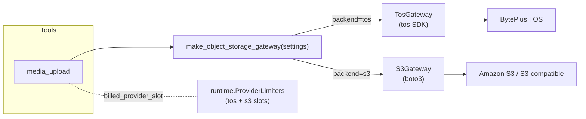
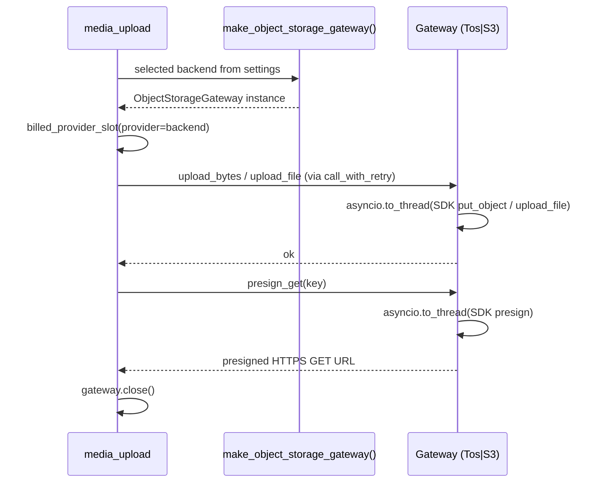
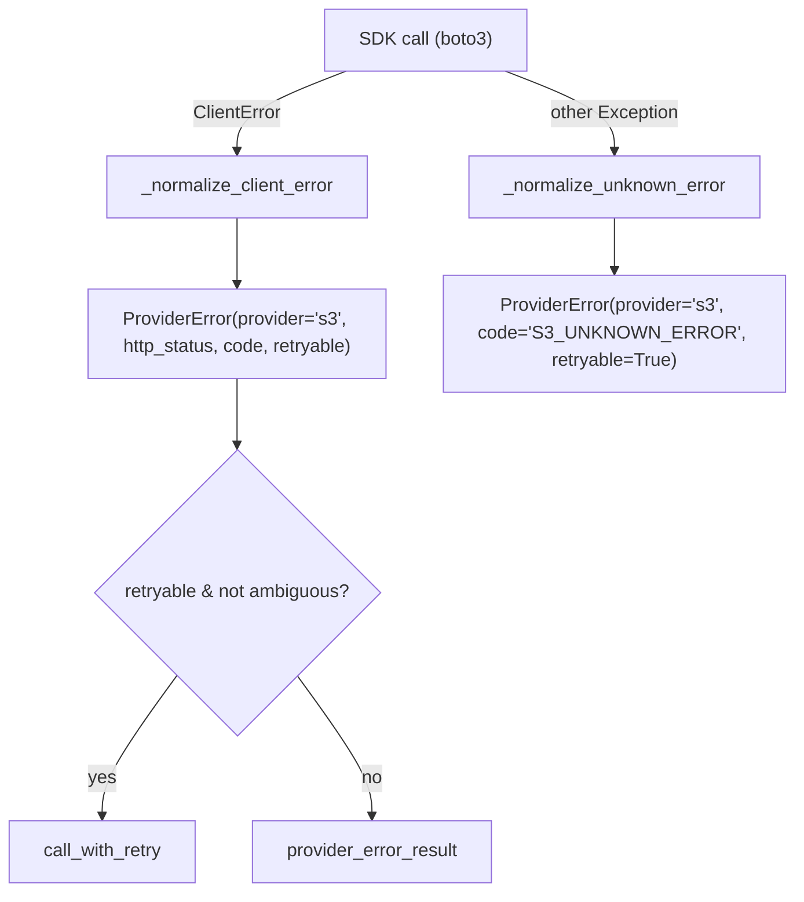

# Plan — Add S3 Object Storage Support Alongside TOS

## Goal

The server's object-storage surface (upload media + mint presigned HTTPS GET
URLs) is hard-wired to **BytePlus TOS**. One tool instantiates `TosGateway`
directly with no backend abstraction:

- `media_upload` — generic Base64 / local-file upload.

> **Note:** An earlier version of this plan also refactored
> `speech_to_text_create_task::_resolve_audio_url`, which used to upload
> Base64 / local-file audio to TOS for LAS ASR. That STT architecture was
> deprecated — the shipped `speech_to_text` tool resolves audio to raw bytes
> (URL download, Base64 decode, file read) and submits directly to Seed Speech
> ASR over HTTP, with **no object-storage coupling**. See
> `plans/PLAN_SPEECH_TO_TEXT.md` (status: deprecated).

This plan adds a **native Amazon S3** backend (`boto3`) as a peer to TOS,
selected by configuration, behind a shared `ObjectStorageGateway` protocol —
mirroring the existing `ArtifactStore` protocol pattern. Existing TOS users see
**no behavior change** (default backend stays `tos`).

**Non-goals (YAGNI):** no multi-backend fan-out/replication (one active
backend per process); no replacing the `tos` SDK with boto3 for TOS access;
no `ArtifactStore`/filesystem changes (separate durable-persistence layer).

---

## Research summary (deep research)

**1. BytePlus TOS is S3-compatible** — TOS exposes an S3-compatible API for
object operations (PutObject, GetObject, presigned URLs). This confirms an S3
backend shares the exact operation shape as the TOS gateway, and boto3 can
even target TOS via `endpoint_url`.

**2. boto3 is the right SDK (not aiobotocore)** — `TosGateway` wraps a
**synchronous** SDK behind `asyncio.to_thread`. For DRY/consistency the S3
backend uses `boto3` (synchronous, standard, mature) with the identical
`asyncio.to_thread` dispatch. `aiobotocore` would add a second async paradigm
+ dependency for no benefit.

**3. boto3 API surface:**
- Client: `boto3.client("s3", aws_access_key_id=..., aws_secret_access_key=...,
  region_name=..., endpoint_url=..., config=Config(signature_version="s3v4"))`.
- Upload bytes: `client.put_object(Bucket, Key, Body, ContentType)`.
- Upload file: `client.upload_file(Filename, Bucket, Key, ExtraArgs={"ContentType": ...})`.
- Presigned GET: `client.generate_presigned_url("get_object",
  Params={"Bucket": ..., "Key": ...}, ExpiresIn=...)`.
- Errors: `from botocore.exceptions import ClientError`; `err.response`
  (dict) exposes `response["Error"]["Code"]`, `response["Error"]["Message"]`,
  `response["ResponseMetadata"]["RequestId"]`,
  `response["ResponseMetadata"]["HTTPStatusCode"]`.

**4. Current coupling points:** `providers/tos/client.py` (concrete gateway);
`tools/media_upload.py` (direct `TosGateway()` + `provider="tos"`);
`config/env.py` (`tos_*` + `has_tos`); `domain/errors.py` (`ProviderName`
lacks `"s3"`); `runtime.py` (`ProviderKey` + semaphore dict lack `"s3"`);
`server.py` (`if settings.has_tos` registration + health); `.env.example`,
`docs/*`, `README.md`; `tests/contract/test_tos_gateway.py`;
`tests/integration/test_media_upload_tool.py`
(`patch("...media_upload.TosGateway")`).

**5. Reusable pattern:** `artifacts/store.py::ArtifactStore` is a
`@runtime_checkable Protocol` with async methods — the new gateway protocol
follows the same shape.

---

## Design decisions

- **D1 — Protocol abstraction:** `ObjectStorageGateway` protocol with four
  methods (`upload_bytes`, `upload_file`, `presign_get`, `close`).
  `TosGateway` already conforms; `S3Gateway` will conform.
- **D2 — Explicit backend selection:** `OBJECT_STORAGE_BACKEND`
  (`Literal["tos", "s3"]`, default `"tos"`). `media_upload` registers when
  `has_object_storage` is true. Factory `make_object_storage_gateway()` returns
  the correct gateway and validates the selected backend is configured
  (fail-closed). Matches the codebase's explicit-config philosophy.
- **D3 — boto3 over aiobotocore:** mirror `TosGateway`'s `asyncio.to_thread`
  dispatch + `ProviderError` normalization exactly.
- **D4 — `s3` as first-class provider:** add `"s3"` to `ProviderName`
  (`domain/errors.py`) and `ProviderKey` + semaphore dict (`runtime.py`). Tools
  pass `provider=settings.object_storage_backend` (a valid `ProviderKey`).
- **D5 — Backward compatible:** default `tos`; `has_tos` + TOS env untouched; S3
  env purely additive; `media_upload` name/schema/output unchanged.
- **D6 — Credentials startup-only:** S3 creds are env vars, never tool args.
- **D7 — Protocol over ABC (considered alternatives):** the codebase uses two
  abstraction styles: `BaseHttpGateway(ABC)` for HTTP providers (shared `httpx`
  transport, ~100 lines of shared `_request`/`close`/error-normalization) and
  `ArtifactStore(Protocol)` for storage backends (different implementations, no
  shared transport). Object storage falls in the second category: TOS wraps the
  `tos` SDK, S3 wraps `boto3` — no shared HTTP client, and the SDK exception
  types differ (`TosServerError`/`TosClientError` vs `botocore.ClientError`). A
  `BaseObjectStorageGateway` ABC was considered but rejected: the only shared
  code would be `_dispatch` (~5 lines) and `close` (~8 lines), not enough to
  justify ABC boilerplate for 2 implementations. `except` clauses can't be
  templated across SDK-specific exception types. Protocol (structural typing)
  is the right fit, mirroring `ArtifactStore`.

---

## Architecture

### Component view



### Upload + presign sequence (backend-agnostic)



### Error normalization (S3)



---

## Implementation

### Dependency

Add `boto3` (run, do not hand-edit `pyproject.toml`):

```bash
uv add "boto3>=1.43,<2.0"
```

`botocore` comes transitively. Add a mypy override (mirrors existing `tos.*`):

```toml
# pyproject.toml
[[tool.mypy.overrides]]
module = ["boto3.*", "botocore.*"]
ignore_missing_imports = true
```

### Phase 1 — Config (`src/modelark_mcp/config/env.py`)

Add S3 fields + backend selector after the existing TOS block:

```python
# --- S3 object storage (Amazon S3 / S3-compatible) -----------------------
s3_access_key: str = Field(default="", validation_alias="S3_ACCESS_KEY")
s3_secret_key: str = Field(default="", validation_alias="S3_SECRET_KEY")
s3_bucket: str = Field(default="", validation_alias="S3_BUCKET")
s3_region: str = Field(default="us-east-1", validation_alias="S3_REGION")
# Empty = native AWS endpoint resolved from region. Set for S3-compatible
# storage (e.g. "https://tos-<region>.bytepluses.com", MinIO).
s3_endpoint: str = Field(default="", validation_alias="S3_ENDPOINT")
s3_presign_ttl_seconds: int = Field(
    default=86400, ge=60, le=604800, validation_alias="S3_PRESIGN_TTL_SECONDS",
)
object_storage_backend: Literal["tos", "s3"] = Field(
    default="tos", validation_alias="OBJECT_STORAGE_BACKEND",
)
```

Convenience properties (after `has_tos`):

```python
@property
def has_s3(self) -> bool:
    return bool(self.s3_access_key and self.s3_secret_key and self.s3_bucket)

@property
def has_object_storage(self) -> bool:
    """Whether the *selected* object-storage backend is configured."""
    if self.object_storage_backend == "s3":
        return self.has_s3
    return self.has_tos

@property
def presign_ttl_seconds(self) -> int:
    """Presign TTL of the *selected* backend (avoids duplicating the
    backend-selection ternary in every tool that computes ``expires_at``)."""
    if self.object_storage_backend == "s3":
        return self.s3_presign_ttl_seconds
    return self.tos_presign_ttl_seconds
```

Validation in `model_validator` (after existing TOS checks):

```python
if bool(self.s3_access_key) != bool(self.s3_secret_key):
    raise ValueError("S3_ACCESS_KEY and S3_SECRET_KEY must both be set or both be empty.")
if self.s3_access_key and not self.s3_bucket:
    raise ValueError("S3_BUCKET is required when S3 credentials are set.")
if self.object_storage_backend == "s3" and not self.has_s3:
    raise ValueError(
        "OBJECT_STORAGE_BACKEND=s3 requires S3_ACCESS_KEY, S3_SECRET_KEY, and S3_BUCKET."
    )
if self.object_storage_backend == "tos" and self.has_s3 and not self.has_tos:
    raise ValueError(
        "OBJECT_STORAGE_BACKEND=tos but TOS credentials are missing while S3 "
        "credentials are set. Set OBJECT_STORAGE_BACKEND=s3 or provide TOS_*."
    )
```

> Backward-compat: default `tos` with no S3 creds passes all new checks
> unchanged. The last check only fires when S3 creds are set but the backend
> was left on `tos` — guiding the user to pick `s3`.

### Phase 2 — Protocol + factory (`src/modelark_mcp/providers/object_storage.py`)

New module; protocol mirrors the `ArtifactStore` style.

```python
"""Object-storage gateway protocol and backend factory.

Both BytePlus TOS (``tos`` SDK) and Amazon S3 (``boto3``) implement this
protocol. Tools program to the protocol; the active backend is selected by
``OBJECT_STORAGE_BACKEND`` at startup.
"""
from __future__ import annotations
from typing import TYPE_CHECKING, Protocol, runtime_checkable

if TYPE_CHECKING:
    from modelark_mcp.config.env import Settings


@runtime_checkable
class ObjectStorageGateway(Protocol):
    """Protocol for object-storage upload and presigned-URL backends.

    Both ``TosGateway`` and ``S3Gateway`` conform. SDK calls are dispatched
    via ``asyncio.to_thread``; all methods raise ``ProviderError`` on
    failure, normalized with ``retryable``/``http_status`` for uniform
    retry handling via ``call_with_retry``.
    """

    async def upload_bytes(
        self, *, key: str, data: bytes, mime_type: str,
    ) -> None:
        """Upload raw bytes. Raises ``ProviderError`` on SDK failure."""
        ...

    async def upload_file(
        self, *, key: str, file_path: str, mime_type: str,
    ) -> None:
        """Upload a local file (streamed, not loaded into memory).

        Raises ``ProviderError`` on SDK failure.
        """
        ...

    async def presign_get(
        self, *, key: str, expires: int | None = None,
    ) -> str:
        """Return a presigned HTTPS GET URL for the object.

        ``expires`` overrides the backend default TTL when provided.
        Raises ``ProviderError`` on SDK failure.
        """
        ...

    async def close(self) -> None:
        """Release SDK client resources. Idempotent; safe to call in ``finally``."""
        ...


def make_object_storage_gateway(settings: Settings | None = None) -> ObjectStorageGateway:
    """Return the configured object-storage gateway (tos or s3)."""
    from modelark_mcp.config.env import get_settings
    settings = settings or get_settings()
    if settings.object_storage_backend == "s3":
        if not settings.has_s3:
            raise ValueError(
                "S3 object storage selected but S3 credentials are not configured. "
                "Set S3_ACCESS_KEY, S3_SECRET_KEY, and S3_BUCKET."
            )
        from modelark_mcp.providers.s3.client import S3Gateway
        return S3Gateway()
    if not settings.has_tos:
        raise ValueError(
            "TOS object storage selected but TOS credentials are not configured. "
            "Set TOS_ACCESS_KEY, TOS_SECRET_KEY, and TOS_BUCKET."
        )
    from modelark_mcp.providers.tos.client import TosGateway
    return TosGateway()
```

### Phase 3 — `S3Gateway` (`src/modelark_mcp/providers/s3/__init__.py` + `client.py`)

Mirrors `TosGateway`: same constructor shape (`client`, `bucket`,
`presign_ttl`), same four methods, `asyncio.to_thread` dispatch, identical
`ProviderError` normalization. `PROVIDER: ProviderName = "s3"`.

```python
"""Amazon S3 (and S3-compatible) gateway — object upload + presigned URLs.

Wraps the synchronous ``boto3`` S3 client behind async-friendly methods using
``asyncio.to_thread``, mirroring ``TosGateway``. ``botocore.exceptions.
ClientError`` is normalized to ``ProviderError`` so retry policy and error
helpers work uniformly across all object-storage backends.
"""
from __future__ import annotations

import asyncio
import contextlib
from typing import Any, cast

import boto3
from botocore.config import Config as BotoConfig
from botocore.exceptions import ClientError

from modelark_mcp.config.env import get_settings
from modelark_mcp.domain.errors import NormalizedProviderError, ProviderError, ProviderName
from modelark_mcp.observability.logger import info as log_info

PROVIDER: ProviderName = "s3"


class S3Gateway:
    """Amazon S3 gateway wrapping ``boto3.client('s3', ...)``."""

    def __init__(self, *, client: Any = None, bucket: str | None = None,
                 presign_ttl: int | None = None) -> None:
        settings = get_settings()
        self._bucket = bucket if bucket is not None else settings.s3_bucket
        self._presign_ttl = (
            presign_ttl if presign_ttl is not None else settings.s3_presign_ttl_seconds
        )
        self._client: Any = client or boto3.client(
            "s3",
            aws_access_key_id=settings.s3_access_key,
            aws_secret_access_key=settings.s3_secret_key,
            region_name=settings.s3_region,
            endpoint_url=settings.s3_endpoint or None,
            config=BotoConfig(
                signature_version="s3v4",
                s3={"addressing_style": "path"} if settings.s3_endpoint else {},
            ),
        )

    async def upload_bytes(self, *, key: str, data: bytes, mime_type: str) -> None:
        def _upload() -> None:
            response = self._client.put_object(
                Bucket=self._bucket, Key=key, Body=data, ContentType=mime_type,
            )
            request_id = (
                (response.get("ResponseMetadata", {}) or {}).get("RequestId")
            )
            log_info("s3_upload", key=key, bytes=len(data), request_id=request_id)
        await self._dispatch(_upload, operation="upload")

    async def upload_file(self, *, key: str, file_path: str, mime_type: str) -> None:
        def _upload() -> None:
            self._client.upload_file(
                Filename=file_path, Bucket=self._bucket, Key=key,
                ExtraArgs={"ContentType": mime_type},
            )
            log_info("s3_upload_file", key=key, file_path=file_path)
        await self._dispatch(_upload, operation="upload_file")

    # NOTE: boto3 ``upload_file`` returns ``None`` (transfer manager), unlike
    # TOS ``put_object_from_file`` which returns an output with ``request_id``.
    # No ``request_id`` is available here; this is a deliberate API difference.

    async def presign_get(self, *, key: str, expires: int | None = None) -> str:
        ttl = expires or self._presign_ttl
        def _presign() -> str:
            return str(self._client.generate_presigned_url(
                "get_object",
                Params={"Bucket": self._bucket, "Key": key},
                ExpiresIn=ttl,
            ))
        return cast("str", await self._dispatch(_presign, operation="presign"))

    async def close(self) -> None:
        client = self._client
        self._client = None
        close = getattr(client, "close", None)
        if not callable(close):
            return
        with contextlib.suppress(Exception):
            await asyncio.to_thread(close)

    async def _dispatch(self, func: Any, *, operation: str) -> Any:
        try:
            return await asyncio.to_thread(func)
        except ClientError as exc:
            raise _normalize_client_error(exc, operation) from None
        except Exception as exc:
            raise _normalize_unknown_error(exc, operation) from None


def _normalize_client_error(exc: ClientError, operation: str) -> ProviderError:
    response = getattr(exc, "response", {}) or {}
    error = response.get("Error", {}) or {}
    metadata = response.get("ResponseMetadata", {}) or {}
    code = error.get("Code") or "S3_CLIENT_ERROR"
    message = error.get("Message") or str(exc)
    status = metadata.get("HTTPStatusCode")
    retryable = status is None or status >= 500 or status == 429
    return ProviderError(NormalizedProviderError(
        provider=PROVIDER, operation=operation, http_status=status,
        code=code, message=f"S3 {operation} failed: {message}",
        request_id=metadata.get("RequestId"), retryable=retryable,
    ))


def _normalize_unknown_error(exc: Exception, operation: str) -> ProviderError:
    return ProviderError(NormalizedProviderError(
        provider=PROVIDER, operation=operation, http_status=None,
        code="S3_UNKNOWN_ERROR",
        message=f"S3 {operation} failed with unexpected error: {exc}",
        request_id=None, retryable=True,
    ))
```

> **Retryability parity (review fix):** `_normalize_client_error` uses
> `retryable = status is None or status >= 500 or status == 429`. The
> `status is None` clause is deliberate — boto3 connection errors
> (`EndpointConnectionError`, a `ClientError` subclass) carry no
> `HTTPStatusCode`; without this clause they'd be non-retryable, diverging from
> TOS which treats `TosClientError` as unconditionally retryable. This keeps
> `call_with_retry` behavior identical across backends. A contract test must
> cover the no-`HTTPStatusCode` case.

> **Path-style addressing (review fix):** `BotoConfig` sets
> `s3={"addressing_style": "path"}` when `S3_ENDPOINT` is set, so
> S3-compatible hosts (MinIO, R2, TOS-via-boto3) that require path-style
> addressing work out of the box. Native AWS S3 (no endpoint) uses the default
> virtual-host style.

### Phase 4 — Refactor the tool call site to the protocol

#### `src/modelark_mcp/tools/media_upload.py`

- Replace `from modelark_mcp.providers.tos.client import TosGateway` with
  `from modelark_mcp.providers.object_storage import make_object_storage_gateway`.
- Replace the guard:

```python
if not settings.has_object_storage:
    raise ValueError(
        "Object storage is not configured. Set TOS_* or S3_* credentials and "
        "OBJECT_STORAGE_BACKEND (tos|s3)."
    )
```

- Replace `gateway = TosGateway()` → `gateway = make_object_storage_gateway(settings)`.
- Replace `provider="tos"` in `billed_provider_slot` → `provider=settings.object_storage_backend`.
- Replace `expires_at` computation — instead of a backend ternary in the tool,
  use the new `settings.presign_ttl_seconds` property (Phase 1) so backend
  selection lives in one place:

```python
expires_at = (
    datetime.now(UTC) + timedelta(seconds=settings.presign_ttl_seconds)
).isoformat()
```

- Update the following backend-specific strings to be backend-agnostic:
  - Docstring: `"Upload media to BytePlus TOS..."` → `"Upload media to object storage (TOS or S3)..."`.
  - `await ctx.info("Starting TOS media upload")` → `await ctx.info("Starting media upload")`.
  - `await ctx.error(f"TOS upload failed: {exc.message}")` → `await ctx.error(f"Media upload failed: {exc.message}")`.
  - `MediaUploadOutput.object_key` field **name** stays `object_key`; update its
    **description** from `"TOS object key of the uploaded media."` →
    `"Object key of the uploaded media."`.

#### `src/modelark_mcp/tools/speech_to_text_create_task.py::_resolve_audio_url`

> **Removed.** This subsection described refactoring the old LAS ASR STT
> tool that uploaded audio to TOS. The shipped `speech_to_text` tool
> (`tools/speech_to_text.py::_resolve_audio_bytes`) resolves audio to raw
> bytes and submits directly to Seed Speech ASR over HTTP — it has **no
> object-storage coupling** and needs no changes for this plan.

### Phase 5 — Provider identity (`domain/errors.py`, `runtime.py`)

- `domain/errors.py`:
  `ProviderName = Literal["modelark", "seed-speech", "tos", "s3"]`.
- `runtime.py`:
  `ProviderKey = Literal["modelark", "seed-speech", "tos", "s3"]` and
  add `"s3": asyncio.Semaphore(provider_limit)` to `_provider` in
  `ProviderLimiters.__init__`. No other runtime changes.

### Phase 6 — Server registration + health (`src/modelark_mcp/server.py`)

- `if settings.has_tos:` → `if settings.has_object_storage:` (registers
  `media_upload` for either backend). Registration block body is unchanged.
- Health resource: add S3 + backend lines (preserve the existing `STT
  configured` line):

```python
f"TOS configured: {resolved_settings.has_tos}\n"
f"S3 configured: {resolved_settings.has_s3}\n"
f"Object storage backend: {resolved_settings.object_storage_backend}\n"
f"STT configured: {resolved_settings.has_stt}\n"
```

- The server `instructions` text already enumerates "Seed Audio, Seedream,
  Seedance, and Speech-to-Text tools" and does not mention TOS — no change
  needed.

### Phase 7 — Tests (TDD)

Both gateways share the same `ObjectStorageGateway` contract. Instead of
cloning `test_tos_gateway.py` for S3, use a **shared parametrized contract
suite** that both backends must pass. This enforces true parity, prevents
drift, and makes a third backend a one-line parametrize entry.

#### 7a — Protocol conformance test

**New `tests/contract/test_object_storage_protocol.py`**: asserts
`isinstance(TosGateway(...), ObjectStorageGateway)` and
`isinstance(S3Gateway(...), ObjectStorageGateway)` — catches structural
drift (e.g., a method rename on `TosGateway` that breaks the protocol
without a type error).

```python
from modelark_mcp.providers.object_storage import ObjectStorageGateway
from modelark_mcp.providers.tos.client import TosGateway
from modelark_mcp.providers.s3.client import S3Gateway

class TestProtocolConformance:
    @pytest.mark.parametrize("cls", [TosGateway, S3Gateway])
    def test_conforms_to_protocol(self, cls, mock_client_factory) -> None:
        gateway = cls(client=mock_client_factory(), bucket="test", presign_ttl=3600)
        assert isinstance(gateway, ObjectStorageGateway)
```

#### 7b — Shared parametrized contract suite

**New `tests/contract/test_object_storage_gateway.py`**: replaces the
existing `test_tos_gateway.py` and the would-be `test_s3_gateway.py` with a
single parametrized test module. Both `TosGateway` and `S3Gateway` are
tested against the same contract via a `gateway_factory` fixture.

```python
@pytest.fixture
def gateway_factory(request):
    """Return a callable that creates a gateway with a mock SDK client."""
    backend = request.param  # "tos" | "s3"
    if backend == "tos":
        from tests.contract.test_tos_gateway import _make_mock_client
        from modelark_mcp.providers.tos.client import TosGateway
        client = _make_mock_client()
        return lambda: TosGateway(client=client, bucket="test-bucket", presign_ttl=3600)
    else:
        from tests.contract.test_s3_helpers import _make_mock_boto_client
        from modelark_mcp.providers.s3.client import S3Gateway
        client = _make_mock_boto_client()
        return lambda: S3Gateway(client=client, bucket="test-bucket", presign_ttl=3600)


@pytest.mark.parametrize("gateway_factory", ["tos", "s3"], indirect=True)
class TestObjectStorageGatewayContract:
    """Shared contract both backends must satisfy."""

    async def test_upload_bytes_calls_sdk_put(self, gateway_factory) -> None: ...
    async def test_upload_file_calls_sdk_upload(self, gateway_factory) -> None: ...
    async def test_presign_get_returns_url(self, gateway_factory) -> None: ...
    async def test_presign_get_uses_custom_ttl(self, gateway_factory) -> None: ...
    async def test_close_is_idempotent(self, gateway_factory) -> None: ...
    async def test_server_error_5xx_is_retryable(self, gateway_factory) -> None: ...
    async def test_server_error_4xx_is_not_retryable(self, gateway_factory) -> None: ...
    async def test_server_error_429_is_retryable(self, gateway_factory) -> None: ...
    async def test_connection_error_is_retryable(self, gateway_factory) -> None: ...
    async def test_unknown_error_is_retryable(self, gateway_factory) -> None: ...
    async def test_error_in_presign_is_normalized(self, gateway_factory) -> None: ...
```

**Mock client helpers** — each backend provides a small factory that
returns a `MagicMock` configured with the right return values for that
SDK's method names:
- TOS: `put_object` → `_FakeOutput(request_id=...)`, `put_object_from_file`
  → `_FakeOutput`, `pre_signed_url` → URL string, `close` → `MagicMock`.
  Errors via `TosServerError(resp, msg, code, ...)`, `TosClientError(msg, cause)`.
- S3: `put_object` → `{"ResponseMetadata": {"RequestId": ...}}`,
  `upload_file` → `None`, `generate_presigned_url` → URL string, `close` →
  callable. Errors via
  `ClientError({"Error": {...}, "ResponseMetadata": {...}}, "PutObject")`.

**Backend-specific test cases** (kept outside the parametrized suite because
they assert SDK-specific call shapes or API differences):
- `test_upload_bytes_logs_request_id` — TOS logs `request_id` from
  `put_object` output; S3 logs `request_id` from the `ResponseMetadata`
  dict in the `put_object` response.
- `test_upload_file_does_not_log_request_id` — S3 only: boto3 `upload_file`
  returns `None` (documented API difference in Phase 3). TOS logs
  `request_id` from `put_object_from_file` output, so this assertion is
  S3-only.
- `test_connection_error_no_http_status` — S3 only: boto3
  `EndpointConnectionError` (a `ClientError` subclass) carries no
  `HTTPStatusCode` in `.response`; assert it's retryable (mirrors TOS
  `TosClientError` semantics). Built via
  `ClientError({"Error": {"Code": "X"}, "ResponseMetadata": {}}, "PutObject")`.

**Migrating `test_tos_gateway.py`**: extract the shared assertions into the
parametrized suite, keep backend-specific TOS assertions (SDK call arg
shapes, `TosServerError` construction) in a separate `TestTosGatewaySpecific`
class in the same file. The existing `test_tos_gateway.py` is either
deleted (its shared tests move to the new module) or reduced to only
TOS-specific cases.

#### 7c — Tool and config tests (unchanged from original plan)

- **Update `tests/integration/test_media_upload_tool.py`**: patch target changes
  from `...media_upload.TosGateway` to `...media_upload.make_object_storage_gateway`
  (return the same `AsyncMock` gateway). Update the no-credentials test to clear
  both TOS *and* S3 and assert the new "object storage is not configured"
  message. Add a parametrized variant that sets `OBJECT_STORAGE_BACKEND=s3` +
  S3 creds and asserts `provider="s3"` flows through `billed_provider_slot`.
- **Update `tests/unit/test_env_config.py`** (+ `test_env.py`): add a
  `TestS3Config` class — `has_s3_false_when_empty`, `has_s3_true_when_set`,
  default `object_storage_backend=="tos"`, `has_object_storage` reflects the
  selected backend, `presign_ttl_seconds` returns the selected backend's TTL,
  AK/SK-must-both-be-set validation, `backend=s3` requires S3
  creds, and the `tos`-with-S3-creds-missing-TOS guidance error.
- **Update `tests/integration/test_mcp_conformance.py`**: today
  `test_all_tools_registered` uses a fixture with ModelArk, Seed Audio, and
  ASR credentials but no TOS creds, so `media_upload` is NOT in the expected
  set (the set includes `speech_to_text` because `SEED_SPEECH_ASR_API_KEY`
  is set). Add a fixture variant with S3-only creds (+
  `OBJECT_STORAGE_BACKEND=s3`) to assert `media_upload` registers under
  `has_object_storage`.

### Phase 8 — Docs, env template, skills

- **`.env.example`**: add an `# --- S3 object storage (optional) ---` section
  after the existing TOS block with `S3_ACCESS_KEY`, `S3_SECRET_KEY`,
  `S3_BUCKET`, `S3_REGION`, `S3_ENDPOINT`, `S3_PRESIGN_TTL_SECONDS`, and
  `OBJECT_STORAGE_BACKEND=tos`.
- **`docs/configuration.md`**: rename "TOS object storage" → "Object storage
  (TOS or S3)"; document the new vars + backend selection + precedence.
- **`docs/api-keys.md`**: add an "S3 (Object Storage)" subsection parallel to TOS.
- **`docs/artifacts.md`**: clarify object-storage upload is distinct from the
  filesystem `ArtifactStore`; mention TOS *and* S3 backends.
- **`docs/tools.md`**: note `media_upload` works with TOS *or* S3.
- **`docs/api-reference.md`**: update the "host on your own endpoint (S3, TOS)"
  line and the `media_upload` description.
- **`README.md`**: tool table row "TOS (optional)" → "Object storage (TOS or S3,
  optional)"; update the video-reference callout.
- **`.agents/skills/`**: update any fastmcp/modelark-mcp skill doc that lists the
  `media_upload` backend or env vars to mention S3 + `OBJECT_STORAGE_BACKEND`.

---

## File change manifest

| File | Action | Summary |
|---|---|---|
| `pyproject.toml` | Edit | add `boto3` dep (via `uv add`); mypy override for `boto3.*`/`botocore.*` |
| `src/modelark_mcp/config/env.py` | Edit | S3 fields, `has_s3`, `has_object_storage`, `object_storage_backend`, validations |
| `src/modelark_mcp/providers/object_storage.py` | **New** | `ObjectStorageGateway` protocol + `make_object_storage_gateway()` factory |
| `src/modelark_mcp/providers/s3/__init__.py` | **New** | package marker |
| `src/modelark_mcp/providers/s3/client.py` | **New** | `S3Gateway` (boto3) + error normalization |
| `src/modelark_mcp/providers/tos/client.py` | Edit (none) | already conforms to protocol; no code change needed |
| `src/modelark_mcp/domain/errors.py` | Edit | add `"s3"` to `ProviderName` |
| `src/modelark_mcp/runtime.py` | Edit | add `"s3"` to `ProviderKey` + semaphore dict |
| `src/modelark_mcp/tools/media_upload.py` | Edit | use factory + `has_object_storage` + `provider=settings.object_storage_backend` |
| `src/modelark_mcp/server.py` | Edit | `has_object_storage` registration; health S3 + backend lines |
| `.env.example` | Edit | S3 section + `OBJECT_STORAGE_BACKEND` |
| `docs/configuration.md`, `api-keys.md`, `artifacts.md`, `tools.md`, `api-reference.md` | Edit | TOS → TOS or S3 |
| `README.md` | Edit | tool table + video-reference callout |
| `.agents/skills/*` | Edit | mention S3 backend + env vars |
| `tests/contract/test_object_storage_protocol.py` | **New** | `isinstance` conformance test for both gateways |
| `tests/contract/test_object_storage_gateway.py` | **New** | shared parametrized contract suite (both backends) |
| `tests/contract/test_tos_gateway.py` | Edit/Reduce | extract shared tests to parametrized suite; keep TOS-specific cases only |
| `tests/integration/test_media_upload_tool.py` | Edit | patch factory; S3 variant; new error message |
| `tests/unit/test_env_config.py`, `test_env.py` | Edit | `TestS3Config` |
| `tests/integration/test_mcp_conformance.py` | Edit | S3-only registration variant |

---

## Testing strategy

- **Contract (shared parametrized, no network):** both `TosGateway` and
  `S3Gateway` pass the same `TestObjectStorageGatewayContract` suite (mock SDK
  clients; assert SDK call args and `ProviderError` retryability: 5xx/429
  retryable, 4xx not, connection errors retryable, unknown errors retryable).
  Backend-specific cases (SDK call arg shapes, `request_id` logging
  differences, S3 connection-error-without-status) live in separate classes.
- **Protocol conformance:** `isinstance` assertion ensures both gateways
  structurally satisfy `ObjectStorageGateway` at runtime.
- **Unit (config):** `has_s3`, `has_object_storage`, backend default,
  AK/SK-pair validation, `backend=s3` requires creds.
- **Integration (`media_upload`):** patched factory for both Base64 and
  file_path; S3-backend variant asserts `provider="s3"` in
  `billed_provider_slot`; no-creds raises new message.
- **E2E:** existing `tests/e2e/test_mcp_e2e.py` remains green unchanged
  (default backend `tos`, TOS mocked in fixtures). Optionally add an S3-backend
  e2e smoke that mocks `make_object_storage_gateway`.
- **Lint/type/build:** `ruff check`, `mypy src`, `make build` (or `uv build`),
  `pytest` must all pass; coverage stays ≥ 85%.

---

## Open questions / follow-ups

- **Both backends configured:** by design only one is active per process
  (selected by `OBJECT_STORAGE_BACKEND`). A future enhancement could add an
  explicit error if *both* TOS and S3 creds are set with `backend=auto`;
  out of scope here (YAGNI).
- **S3-compatible storage (MinIO, R2, TOS-via-boto3):** supported via
  `S3_ENDPOINT` + automatic path-style addressing when `S3_ENDPOINT` is set
  (Phase 3 `BotoConfig`). Some exotic hosts may need additional `Config`
  tweaks; documented in Phase 1 / Phase 8.
- **Object lifecycle:** the server does not auto-delete uploaded objects; S3
  users should configure a bucket lifecycle rule on the `references/` prefix
  (same guidance as TOS today).
- **`upload_file` multipart:** boto3 `upload_file` handles multipart
  automatically; the existing media size limits (image/audio 10 MiB, video
  200 MiB) still gate before upload, so no change.

---

## Sources

- boto3 — Presigned URLs: https://boto3.amazonaws.com/v1/documentation/api/latest/guide/s3-presigned-urls.html
- boto3 — `put_object` reference: https://boto3.amazonaws.com/v1/documentation/api/latest/reference/services/s3/client/put_object.html
- boto3 — Error handling (`botocore.exceptions.ClientError`): https://boto3.amazonaws.com/v1/documentation/api/latest/guide/error-handling.html
- boto3 — S3 customization (`endpoint_url`, `Config(signature_version=...)`): https://boto3.amazonaws.com/v1/documentation/api/latest/reference/customizations/s3.html
- BytePlus TOS S3-compatibility overview: https://docs.byteplus.com/en/docs/tos-en/S3-compatibility-overview

---

## Review history

A sub-agent independently verified every codebase claim against the actual
source and reviewed the plan. **Verdict: APPROVE WITH CHANGES.** All findings
were incorporated:

1. **Critical — S3 connection-error retryability:** `_normalize_client_error`
   now uses `retryable = status is None or status >= 500 or status == 429` so
   boto3 connection errors (no `HTTPStatusCode`) are retried, matching TOS's
   unconditional client-error retryability. Added a contract-test requirement
   for the no-status case.
2. **Important — Path-style addressing:** `BotoConfig` now sets
   `s3={"addressing_style": "path"}` when `S3_ENDPOINT` is set so MinIO/R2 work;
   the open-questions MinIO claim was corrected.
3. **Important — Conformance framing:** Phase 7 now correctly states
   `media_upload` is NOT in today's expected set (fixture has no TOS creds);
   the S3-only fixture variant is the addition.
4. **Minor — `contextlib`:** replaced `__import__("contextlib")` with a
   top-level `import contextlib` (matches `TosGateway`).
5. **Minor — `request_id` logging:** `upload_bytes` now logs `request_id`
   from the `put_object` response (parity with TOS).
6. **Minor — boto3 version:** bumped `>=1.39` → `>=1.43`.

### Improvements pass (post-review)

A final self-review against the codebase found four additional improvements,
all applied:

7. **DRY — `presign_ttl_seconds` property:** Phase 1 now adds a
   `Settings.presign_ttl_seconds` property that returns the selected backend's
   TTL. Phase 4's tool change uses `settings.presign_ttl_seconds` instead of a
   backend-selection ternary duplicated in the tool. Backend selection lives in
   one place (`Settings`), not scattered across tools.
8. **Explicit string updates (Phase 4):** the plan now lists every
   backend-specific string to update — docstring, `ctx.info`, `ctx.error`,
   `object_key` field description — so the implementer doesn't miss any.
9. **`object_key` field description:** clarified that the field *name* stays
   `object_key` but the *description* changes from `"TOS object key..."` →
   `"Object key..."` (the original wording "keep field name/description" was
   ambiguous).
10. **`upload_file` `request_id` limitation documented:** Phase 3 now has an
    inline note that boto3 `upload_file` returns `None` (transfer manager),
    unlike TOS `put_object_from_file` which returns an output with
    `request_id`. No `request_id` is available for `upload_file` logging.
    Phase 7's contract test description notes this so tests don't assert
    `request_id` for `upload_file`.
11. **`close()` style alignment:** `S3Gateway.close()` now uses the early-return
    guard (`if not callable(close): return`) matching `TosGateway.close()`
    exactly, instead of an inverted `if callable(close):` block.

### Staleness remediation pass (2026-07-27)

A deep research pass against the current codebase found the plan was stale
because the STT architecture was redesigned after the plan was written.
All stale references were corrected:

12. **Critical — STT no longer uses object storage:** the shipped
    `speech_to_text` tool (`tools/speech_to_text.py::_resolve_audio_bytes`)
    resolves audio to raw bytes (URL download, Base64 decode, file read) and
    submits directly to `SeedSpeechAsrService.transcribe()` over HTTP. It has
    **zero `TosGateway` coupling** — no import, no instantiation, no
    `billed_provider_slot(provider="tos")`. The old
    `speech_to_text_create_task.py::_resolve_audio_url` that uploaded to TOS
    for LAS ASR no longer exists. The plan's Goal, Research summary point 4,
    Architecture diagrams, Phase 4 STT subsection, and File manifest were
    updated to remove all STT/object-storage coupling claims.
13. **Critical — `"las"` never added to provider types:** the plan's Phase 5
    incorrectly assumed `ProviderName`/`ProviderKey` already included `"las"`.
    The actual types are `Literal["modelark", "seed-speech", "tos"]` — STT
    uses `provider="seed-speech"`, not `"las"`. Phase 5 now correctly adds
    only `"s3"`.
14. **Important — STT test file doesn't exist:**
    `tests/integration/test_speech_to_text_create_task.py` was removed from
    Phase 7 and the file manifest. The actual STT tests are live tests
    (`tests/live/test_stt_live.py`, `tests/live/test_stt_podcast.py`) that
    don't patch `TosGateway` or `LasAsrService`.
15. **Important — Health resource preserves STT line:** Phase 6 now shows the
    `STT configured` line being preserved (it was added after the plan was
    written). Server `instructions` already enumerate "Speech-to-Text" and
    don't mention TOS — no instructions change needed.
16. **Important — Conformance test already includes `speech_to_text`:** Phase 7
    now notes that `speech_to_text` IS in the expected tool set (the fixture
    sets `SEED_SPEECH_ASR_API_KEY`), which the original plan didn't mention.
17. **Minor — `.env.example` has STT section:** the plan should insert the S3
    section after the existing TOS block (not after STT, which is in a
    separate section).
18. **Minor — `tags` and `related`:** removed `stt` from tags and
    `plans/PLAN_SPEECH_TO_TEXT.md` from `related` (the STT plan is
    `status: deprecated`).
19. **Minor — `tos_security_token`:** TOS has an optional
    `tos_security_token` (STS) field; S3 uses different credential mechanisms
    (IAM roles, instance profiles) and doesn't need an equivalent. No action
    required — just documenting the difference.

### Design improvements pass (2026-07-27)

A pattern-review pass against the codebase's existing abstractions
(`BaseHttpGateway(ABC)`, `ArtifactStore(Protocol)`, `TaskOwnershipStore`)
found four improvements, all applied:

20. **Shared parametrized contract test (DRY):** Phase 7 now proposes a
    single `tests/contract/test_object_storage_gateway.py` with a
    `@pytest.mark.parametrize("gateway_factory", ["tos", "s3"], indirect=True)`
    suite that both backends must pass. This replaces the original "clone
    `test_tos_gateway.py` as `test_s3_gateway.py`" approach. Benefits: true
    contract enforcement (not copy-paste), prevents drift as either gateway
    evolves, and a third backend is a one-line parametrize entry. Backend-
    specific cases (SDK call arg shapes, `request_id` logging differences,
    S3 connection-error-without-status) live in separate classes.
21. **Protocol conformance test:** Phase 7a adds
    `tests/contract/test_object_storage_protocol.py` asserting
    `isinstance(TosGateway(...), ObjectStorageGateway)` and
    `isinstance(S3Gateway(...), ObjectStorageGateway)`. Without this, a
    method rename on `TosGateway` would silently break the protocol at
    runtime (no type error, since `TosGateway` doesn't explicitly inherit
    from the Protocol). The `@runtime_checkable` decorator makes this
    `isinstance` check possible.
22. **Protocol method docstrings:** Phase 2's `ObjectStorageGateway` protocol
    now has docstrings on the class and each method, mirroring the
    `ArtifactStore` protocol's documentation style. Each method documents
    what it does, that it raises `ProviderError` on failure, and the
    retryability contract. This gives implementers a clear contract without
    reading the implementation.
23. **ABC-vs-Protocol decision documented (D7):** Design decisions now
    include D7 explaining why Protocol was chosen over ABC. The codebase
    uses both patterns: `BaseHttpGateway(ABC)` for HTTP providers (shared
    `httpx` transport, ~100 lines of shared code) and `ArtifactStore(Protocol)`
    for storage backends (different implementations). Object storage has only
    ~20 lines of shared `_dispatch`/`close` code across 2 implementations
    with different SDK exception types — not enough to justify ABC
    boilerplate. `except` clauses can't be templated across SDK-specific
    exception types. Protocol is the right fit, mirroring `ArtifactStore`.
