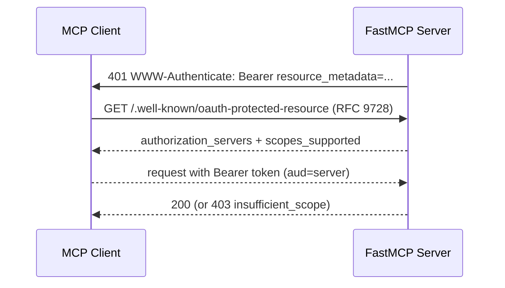

# Security Hardening Research

**Research question:** Which security implementations should the Ark Seed
MCP server adopt to harden its attack surface, given its current posture
(`docs/security.md`, `src/ark_mcp/security/`)?

**Method:** Five parallel researcher sub-agents investigated bounded
sub-questions (MCP-specific threats; SSRF/URL safety; authN/authZ; DoS/rate
limiting; secrets/supply chain). The orchestrator independently re-verified
load-bearing claims against the live MCP specification, live FastMCP docs,
and the server's source code. Corrections to worker claims are marked inline.

## Baseline — what is already strong

The server already implements: fail-closed JWT mode (`StrictJWTVerifier`,
RS256 pin + `exp` required + `ssrf_safe=True`), per-tool OAuth-style scopes,
principal/tenant derivation with SQLite task/artifact ownership, budgets, and
per-principal/provider concurrency limits; SSRF-safe URL validation with DNS +
IP-class denial and an IP-pinned, redirect-revalidating downloader; body-limit
and rate-limit middleware; FastMCP-native host/origin protection; truststore
TLS; media MIME/size/duration policy; and bandit/detect-secrets/pip-audit
tooling. These are a solid foundation — the gaps below are incremental, not
greenfield.

## Findings

### F1. Auth is not MCP-spec-conformant for HTTP transport (HIGH, verified)

The current MCP authorization spec (2026-07-28) states that an MCP server on an
HTTP transport **MUST** act as an OAuth 2.1 resource server and **MUST**
implement OAuth 2.0 Protected Resource Metadata (RFC 9728), returning
`401` with `WWW-Authenticate: Bearer resource_metadata=...` (and optionally
`scope=...`), and `403` with `error="insufficient_scope"` + `scope="..."` for
under-scoped tokens. FastMCP itself documents `TokenVerifier`/`JWTVerifier`
alone as "somewhat outside the formal MCP authentication flow" (internal/m2m
only).

**Gap:** `build_auth_provider` returns a bare `StrictJWTVerifier`; the server
serves no discovery endpoints and cannot be discovered/authorized by
spec-compliant MCP clients.

**Fix:** wrap the existing verifier in FastMCP's `RemoteAuthProvider`
(composes `token_verifier` + `authorization_servers` + `base_url`, and
auto-serves `/.well-known/oauth-protected-resource`). Optionally advertise
`scopes_supported`. Keep JWT-only as the documented internal m2m fallback.

### F2. Scope/denial semantics (MEDIUM)

- **Gap:** per-tool `require_scopes` (via `component_auth`) hides a tool and
  returns "not found" on denial rather than a spec-correct `403
  insufficient_scope` challenge. Per FastMCP docs this is inherent: a
  per-tool denial is a JSON-RPC error inside `200`.
- **Fix:** set `required_scopes` on the verifier so token-level shortfalls
  produce a spec-correct transport `403 insufficient_scope` challenge.
  `required_scopes` exists on `TokenVerifier`/`JWTVerifier` in the installed
  FastMCP 3.4.4 (verified via signature); the `InsufficientScopeError` class
  that *names* missing scopes in per-tool errors is newer. In 3.4.4, keep
  tool-level `require_scopes` for coarse deny-by-default.
- **Confirmed:** streamable-HTTP sessions are already bound to the
  `(client_id, issuer, subject)` credential triple (a different credential for
  an existing session returns 404), which mitigates session-ID replay.

### F3. JWT verification hardening (MEDIUM)

- **Already good:** RS256 pin, mandatory `exp`, `ssrf_safe=True`, `aud`/`iss`
  required.
- **Add (RFC 8725, RFC 9700):** `nbf` validation with a bounded clock-skew
  allowance; reject tokens that are valid OIDC ID tokens for the same issuer
  (cross-JWT confusion — enforce a distinguishing `typ`/`aud`); prefer
  audience restricted to a single canonical resource URI (RFC 8707); consider
  sender-constrained tokens (DPoP RFC 9449 / mTLS RFC 8705) and opaque-token
  introspection (RFC 7662) if revocation matters. JWT-only mode has no
  revocation — short TTL is currently the only mitigation.
- **Open (resolved by review):** FastMCP 3.4.4's `JWTVerifier` caches JWKS
  with a 3600s TTL and refreshes on an unknown `kid`
  (`fastmcp/.../providers/jwt.py:312-376`); it does not implement an `nbf`
  check. Confirm fail-closed behavior on JWKS fetch errors before relying on
  it.

### F4. SSRF / URL-policy gaps (HIGH, verified in code)

The downloader is already strong: it validates every resolved address and
rejects if *any* is non-public, IP-pins the connection, and revalidates each
redirect hop. Verified against the repo's pinned CPython 3.12 (and 3.14):
`is_reserved` already covers NAT64 `64:ff9b::/96` and IPv4-compatible `::/96`,
so those are **fail-closed today** (and the current code even over-blocks
legitimate public NAT64 addresses — a minor availability issue, not a security
gap). The two *live* gaps are CGNAT and the missing port allowlist.

| Gap | Detail (verified) | Fix |
|---|---|---|
| **CGNAT shared space** | `100.64.0.1` → `is_private=False, is_global=False, is_reserved=False`, so `_is_blocked_address` (`url_policy.py:57-75`) admits it | Require `is_global is True` (with the embedded-IPv4 unwrap retained as defense-in-depth) |
| **No port allowlist** | `validate_url('https://example.com:25')` is accepted; `url_policy.py:78-98` never checks port | Restrict to 443 (and 80 only when HTTP is opted in), re-checked per redirect hop |
| **NAT64 / `::/96` unwrap** | Already blocked via `is_reserved` on 3.12/3.14; robustness only | Keep the `ipv4_mapped`/`sixtofour`/`teredo` checks; optionally add explicit NAT64/`::/96` unwrap for version independence |
| **IPv6 zone IDs** | Already rejected in practice (scoped addresses parse as link-local/doc and are blocked); RFC 6874 hardening | Reject/normalize hosts containing `%`-encoded zone IDs before resolution (robustness) |

*Correction to worker claim:* "pin to all resolved IPs" is **not** a gap here —
`resolve_public_addresses` already rejects the whole host if any address is
blocked, so dialing `addresses[0]` is safe. Do not change that behavior.

### F5. Multi-tenant isolation / IDOR (LOW-MEDIUM, verified)

- **Already enforced:** `FilesystemArtifactStore.get` compares
  `principal_id`/`tenant_id` and raises `PermissionError` on mismatch;
  `SQLiteTaskOwnershipStore.require_owner` does the same;
  `ObjectStorageArtifactStore.get` checks ownership at
  `object_storage_store.py:247-249` **before** fetching the data object
  (line 254) — the object-storage path is already correct.
- **Hardening (filesystem only):** `FilesystemArtifactStore.get` reads the
  artifact bytes **before** the ownership check (filesystem_store.py:342-347).
  Reorder so ownership is checked before the read, preventing a cross-tenant
  probe from forcing disk reads or leaking existence via timing (note:
  `FileNotFoundError` at 339-340 already distinguishes not-found vs
  forbidden). Prefer tenant-predicate pushdown in SQL (already done in
  `list_task_ids`) over post-fetch comparison; never accept a tenant/principal
  identifier from the request body.
- **TTL hygiene:** `ObjectStorageArtifactStore.delete_expired` is a no-op
  (`object_storage_store.py:274-278`) — expired objects accumulate in the
  bucket indefinitely (cost/exposure, not a direct security bug).

### F6. MCP-specific threats — prompt injection / tool poisoning (MEDIUM)

Tool poisoning, "rug pulls" (post-approval tool-definition changes), malicious
tool/resource content, and indirect prompt injection are the dominant
documented MCP attack classes. **Most mitigations are client/proxy-side**
(trust-on-first-use pinning, schema-wide description substitution, response
quarantine, policy proxies) and cannot be fully enforced by a server.

Server-side levers that *do* apply here:

- Return **schema-constrained output**; never pass attacker-influenceable free
  text back to the model as instructions.
- Treat all server-returned media as untrusted content (it is generated, but
  callers can seed it via prompt/edit/tool inputs).
- Keep scopes minimal and deny-by-default so a compromised client is
  blast-radius-limited.
- Do not echo caller-controlled text into tool `instructions`/descriptions.

*Open question (no primary source):* returned generated media (image/video/
audio) as an injection/exfiltration channel is not modeled as a demonstrated
attack in any cited source — flag as a research gap, not a confirmed threat.

### F7. DoS, rate limiting & abuse (MEDIUM)

| Gap | Fix |
|---|---|
| In-memory token bucket multiplies across replicas (N× `RATE_LIMIT_RPM`) | Move counters to Redis (GCRA via `CL.THROTTLE` or a Lua script); synchronize on store time |
| Keyed only on client IP; spoofable when `X-Forwarded-For` trusted | Enforce per-principal and per-tool limits (cost-weighted: generation ≫ list/get); trust proxy headers only from known proxy IPs (uvicorn `--forwarded-allow-ips`) |
| No server-level concurrency/connection bound | uvicorn `--limit-concurrency`, `--backlog`, `--timeout-keep-alive`, `--limit-max-requests`; absolute connection timeouts; time-bound the streamed body read, not just byte-bound |
| SQLite budget ledger is single-instance/single-writer | Move quota ledger to a shared store when multi-node; keep semaphores as local bulkheads (pair with the single-instance warning in `runtime.py:580-584`) |
| Incomplete backoff signals | `Retry-After` is already returned (`http_middleware.py:109`); add `X-RateLimit-Limit/Remaining/Reset` and cost-weighted per-tool limits |

### F8. Secrets & supply chain (LOW-MEDIUM)

- **Secrets:** env-var loading already supports `/run/secrets` file overrides
  (`env.py:87`, Docker/Kubernetes); what remains is rotation/revocation,
  non-Docker deployments, and per-provider least-privilege keys. Move keys to a
  secrets manager or mounted secret files where env vars are avoidable (env
  vars leak via `/proc/<pid>/environ`); schedule rotation with tested
  revocation. Treat the existing detect-secrets baseline as a backlog
  (`detect-secrets audit`), and run `detect-secrets-hook` as a blocking
  pre-commit gate.
- **Supply chain:** add `pypa/gh-action-pip-audit` as a blocking CI step +
  scheduled run; emit a CycloneDX SBOM per release and sign it (cosign);
  adopt SLSA Build L3 provenance via `slsa-github-generator`; pin GitHub
  Actions to full SHAs; enable Dependabot alerts.
- **Logging:** central redaction filter (strip `Authorization`/`X-Api-Key`,
  scrub URL query tokens), sanitize CR/LF in logged data (CWE-117), and use a
  "generic message + correlation ID" error pattern with full detail
  server-side only.

### F9. Object-storage key ownership & error sanitization (MEDIUM, found in review)

- **Object-storage key ownership (IDOR class):** `media_presign`
  (`tools/media_presign.py:70-121`) mints a read URL for any syntactically
  valid `object_key` with **no ownership check**, and `media_upload`
  records no key→principal ledger. Artifact resources (`seed-media://`)
  enforce ownership, but raw object-storage keys do not. Keys are unguessable
  UUIDs, but a tenant who learns another's key (logs, shared context) can mint
  read URLs against the shared bucket. **Fix:** record
  `(object_key → principal_id, tenant_id)` at upload time (extend the SQLite
  state store) and verify it in `media_presign`.
- **Tool-response error sanitization (low):** `speech_to_text` returns raw
  exception text to callers (`tools/speech_to_text.py:136-143`) — a
  `UrlValidationError` leaks the resolved blocked IP/hostname — and
  `media_upload` echoes local paths (`tools/media_upload.py:153`). This is
  distinct from log redaction. **Fix:** route tool errors through a shared
  safe-message path (e.g. `tools/_errors.py`) so caller-visible text never
  contains hostnames, IPs, or filesystem paths.

## Implications — prioritized roadmap

| Priority | Item | Effort | Status |
|---|---|---|---|
| **P0** | SSRF: block CGNAT (`is_global` semantics) + add port allowlist (F4) | Small, local to `url_policy.py` | ✅ shipped |
| **P0** | Auth conformance: wrap `JWTVerifier` in `RemoteAuthProvider` + discovery, config-gated so m2m-only clients keep working (F1/F2) | Small–medium, `http_auth.py` + config | ✅ shipped |
| **P1** | Object-storage key ownership: key→principal ledger + check in `media_presign` (F9) | Medium (new state table) | ✅ shipped |
| **P1** | Ownership check before artifact read (filesystem only) (F5) | Small | ✅ shipped |
| **P1** | JWT hardening: `nbf` + bounded skew (F3) | Small | ✅ shipped |
| **P1** | Tool-response error sanitization (F9) | Small | ✅ shipped |
| **P1** | uvicorn limits + `X-RateLimit-*` headers (F7) | Small | ⚠️ partial — headers shipped; uvicorn concurrency tuning deferred |
| **P2** | NAT64/`::/96` explicit unwrap + IPv6 zone-ID normalization (defense-in-depth) (F4) | Small | ⏳ deferred |
| **P2** | Distributed Redis rate limiting + per-principal/tool quotas (F7) | Medium (new infra dep) | ⏳ deferred |
| **P2** | Secrets rotation + CI pip-audit/SBOM/SLSA (F8) | Medium | ⏳ deferred |
| **P2** | Schema-constrained outputs + threat-model doc for prompt injection (F6) | Medium | ⏳ deferred |
| **P2** | Object-storage TTL sweep (`delete_expired` no-op) (F5) | Medium (gateway list/delete API) | ⏳ deferred |
| **P1** | JWT cross-JWT confusion (`typ`/`aud` policy) (F3) | Small–medium (needs IdP claim decision) | ⏳ deferred |

## Open Questions

1. Is returned generated media a real injection/exfiltration channel, or only
   an extension of tool-response poisoning? (No primary source; needs threat
   modeling.)
2. ~~JWKS caching behavior~~ — resolved: FastMCP 3.4.4 caches JWKS with a
   3600s TTL and refreshes on unknown `kid`; remaining unknown is whether JWKS
   fetch failures fail closed.
3. Is Redis acceptable as a new runtime dependency, or is
   single-instance/sticky-session a viable interim for rate limiting?
4. Which release platform is used (to finalize SLSA builder + SBOM signing)?
   Is a CDN/WAF edge layer already in the path (several F7 defenses belong
   there)?
5. Do the BytePlus providers support key rotation/dynamic credentials, or only
   scheduled manual rotation?

> **Note:** this is a research note + roadmap, not an executable plan. Concrete
> code structure for each item (file changes, signatures, tests) should be
> written into a follow-up `plans/PLAN_SECURITY_HARDENING.md` before
> implementation, per AGENTS.md's plans-vs-specs split.

## Sources

Consolidated and deduplicated (all accessed 2026-08-29).

- [MCP Authorization specification (2026-07-28)](https://modelcontextprotocol.io/specification/2026-07-28/basic/authorization) — primary spec
- [MCP Security Best Practices (2026-07-28)](https://modelcontextprotocol.io/docs/2026-07-28/tutorials/security/security_best_practices) — official docs
- [FastMCP — Token Verification](https://gofastmcp.com/servers/auth/token-verification) — official docs
- [FastMCP — Remote OAuth](https://gofastmcp.com/servers/auth/remote-oauth) — official docs
- [FastMCP — OIDC Proxy](https://gofastmcp.com/servers/auth/oidc-proxy) — official docs
- [FastMCP — Authorization](https://gofastmcp.com/servers/authorization) — official docs
- [RFC 8725 — JWT Best Current Practices](https://www.rfc-editor.org/info/rfc8725/) — IETF RFC
- [RFC 9700 — OAuth 2.0 Security BCP](https://www.rfc-editor.org/rfc/rfc9700.html) — IETF RFC
- [RFC 9728 — OAuth 2.0 Protected Resource Metadata](https://www.rfc-editor.org/rfc/rfc9728) — IETF RFC
- [RFC 6874 — IPv6 Zone Identifiers in URIs](https://datatracker.ietf.org/doc/html/rfc6874/) — IETF RFC
- [OWASP SSRF Prevention Cheat Sheet](https://cheatsheetseries.owasp.org/cheatsheets/Server_Side_Request_Forgery_Prevention_Cheat_Sheet.html) — OWASP
- [OWASP JWT Cheat Sheet](https://cheatsheetseries.owasp.org/cheatsheets/JSON_Web_Token_Cheat_Sheet) — OWASP
- [OWASP Authorization Cheat Sheet](https://cheatsheetseries.owasp.org/cheatsheets/Authorization_Cheat_Sheet.html) — OWASP
- [OWASP MCP Security Cheat Sheet](https://cheatsheetseries.owasp.org/cheatsheets/MCP_Security_Cheat_Sheet.html) — OWASP
- [OWASP Denial of Service Cheat Sheet](https://cheatsheetseries.owasp.org/cheatsheets/Denial_of_Service_Cheat_Sheet.html) — OWASP
- [OWASP API4:2023 Unrestricted Resource Consumption](https://owasp.org/API-Security/editions/2023/en/0xa4-unrestricted-resource-consumption/) — OWASP
- [OWASP Secrets Management Cheat Sheet](https://cheatsheetseries.owasp.org/cheatsheets/Secrets_Management_Cheat_Sheet.html) — OWASP
- [OWASP Software Supply Chain Security Cheat Sheet](https://cheatsheetseries.owasp.org/cheatsheets/Software_Supply_Chain_Security_Cheat_Sheet.html) — OWASP
- [OWASP Logging Cheat Sheet](https://cheatsheetseries.owasp.org/cheatsheets/Logging_Cheat_Sheet.html) — OWASP
- [Python `ipaddress` module docs](https://docs.python.org/3/library/ipaddress.html) — CPython docs
- [Invariant Labs — MCP Security Notification: Tool Poisoning Attacks](https://invariantlabs.ai/blog/mcp-security-notification-tool-poisoning-attacks) — security research, 2025-04-01
- [Invariant Labs — Introducing MCP-Scan](https://invariantlabs.ai/blog/introducing-mcp-scan) — security research, 2025-04-11
- [Microsoft — Protecting against indirect prompt injection attacks in MCP](https://developer.microsoft.com/blog/protecting-against-indirect-injection-attacks-mcp/) — vendor blog, 2025-04-28
- [Trail of Bits — mcp-context-protector](https://github.com/trailofbits/context-protector) — tool repository
- [Prefect PR #21591 — SSRF-protected httpx transport](https://github.com/PrefectHQ/prefect/pull/21591) — upstream fix
- [tachyon-oss/drawbridge](https://github.com/tachyon-oss/drawbridge) — SSRF library
- [Redis Rate Limiting](https://redis.io/glossary/rate-limiting/) — vendor docs
- [Brandur — Rate Limiting, Cells, and GCRA](https://brandur.org/rate-limiting) — algorithm reference
- [Uvicorn Settings](https://www.uvicorn.org/settings/) — vendor docs
- [pypa/pip-audit](https://github.com/pypa/pip-audit) — tool docs
- [Yelp/detect-secrets](https://github.com/Yelp/detect-secrets) — tool docs
- [slsa-framework/slsa-github-generator](https://github.com/slsa-framework/slsa-github-generator) — SLSA tooling
