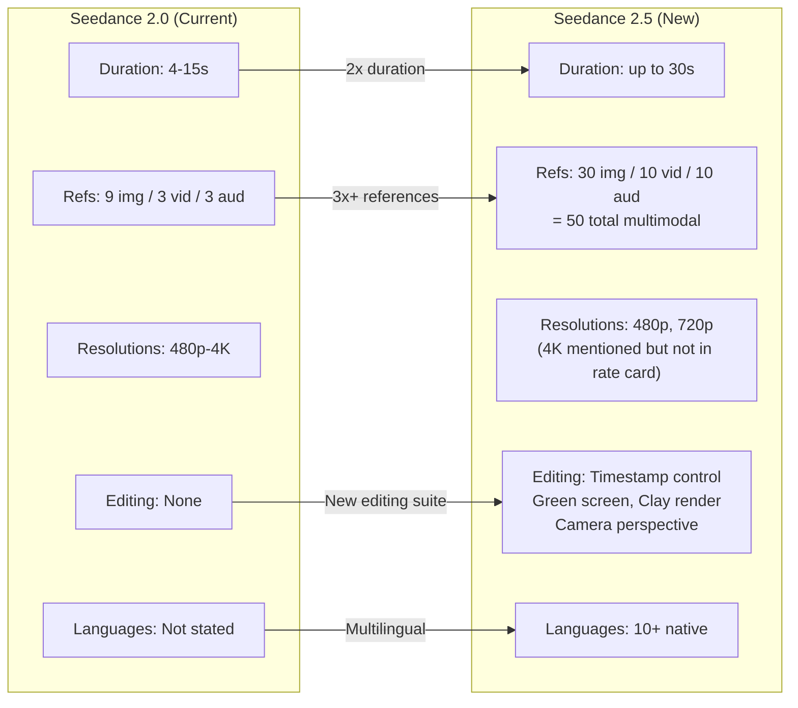
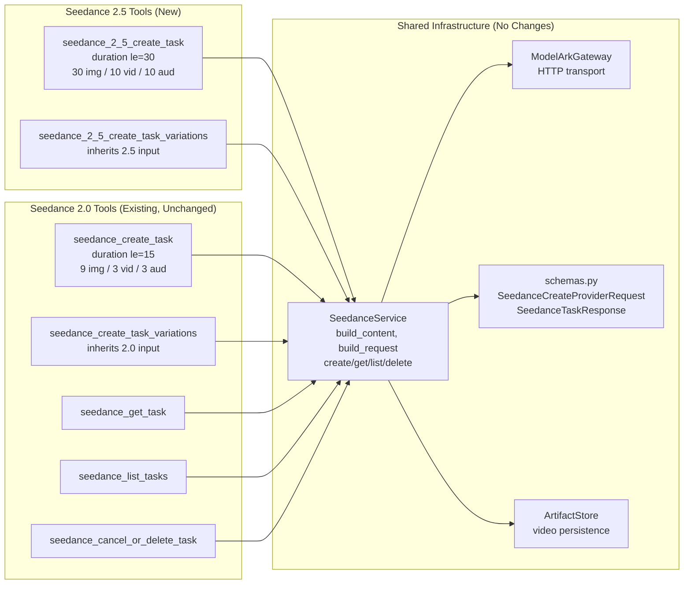

# Seedance 2.5 API — Deep Research

## Question

**Is the Seedance 2.5 API available, and what are the capability and contract differences from Seedance 2.0 that affect the modelark-mcp server?**

## TL;DR

**Seedance 2.5 is live and callable via BytePlus ModelArk.** The API uses the **same endpoint, auth, and request/response shape** as Seedance 2.0 — only the `model` ID changes. The model is **activation-gated per account** (`ModelNotOpen` 404 until enabled in the Ark Console). Key capability deltas: **30-second max duration** (up from 15), **50 multimodal references** (up from 12), and new editing capabilities (timestamp control, green screen, clay render).

**Architectural decision: separate tools.** Seedance 2.0 and 2.5 have fundamentally different limits (duration, reference counts, resolutions). MCP generates the tool schema — including field descriptions — once at startup, so a single tool cannot emit accurate per-model descriptions like "Max 9" for 2.0 vs "Max 30" for 2.5. Rather than lying to the client with a global maximum or complex conditional descriptions, we create **dedicated 2.5 create tools** with their own clean, accurate input models. The shared lifecycle tools (get, list, cancel) are model-agnostic and need no changes.

---

## Findings

### 1. API Availability & Model ID

| Item | Value |
|---|---|
| **BytePlus model ID** | `dreamina-seedance-2-5-260628` |
| **Volcano Engine (China) model ID** | `doubao-seedance-2-5-260628` |
| **API endpoint** | `POST https://ark.ap-southeast.bytepluses.com/api/v3/contents/generations/tasks` |
| **Auth** | `Authorization: Bearer $ARK_API_KEY` (same as 2.0) |
| **Activation** | Per-account, via Ark Console — returns `404 ModelNotOpen` if not activated |
| **Official launch** | July 31, 2026 (ByteDance Seed blog) |
| **BytePlus availability** | August 6, 2026 (BytePlus blog: "now available on BytePlus") |
| **API reference last updated** | August 7, 2026 |

**Timeline:**
- **June 23, 2026** — Previewed at Volcano Engine FORCE conference
- **July 31, 2026** — Official launch on ByteDance Seed blog; consumer surfaces (Jimeng AI, Doubao Pro) live; ByteDance said "API access coming soon via BytePlus ModelArk"
- **August 6, 2026** — BytePlus blog confirms: "Dreamina Seedance 2.5 is now available through BytePlus ModelArk in supported markets globally"
- **August 7, 2026** — User-provided curl example confirms the endpoint is callable with `dreamina-seedance-2-5-260628`

**Sources:**
- [ByteDance Seed launch blog](https://seed.bytedance.com/en/blog/one-take-creation-flexible-referencing-introducing-seedance-2-5) — Jul 31, 2026 (official)
- [BytePlus availability blog](https://www.byteplus.com/blog/dreamina-seedance2-5) — Aug 6, 2026 (official)
- [BytePlus ModelArk API reference](https://docs.byteplus.com/en/docs/ModelArk/1520757) — last updated Aug 7, 2026 (official)
- [EvoLink status tracker](https://evolink.ai/blog/seedance-2-5-api-status) — Aug 2026 (third-party)
- [TanStack adapter docs](https://tanstack.com/ai/latest/docs/adapters/byteplus) — confirms `dreamina-seedance-2-5-260628` is "real and reachable" but "activation-gated per account"
- **User-provided curl example** — confirms live API call with the model ID

### 2. Pricing

| Input type | Rate (USD per 1M tokens) |
|---|---|
| Without video input | $10.70 |
| With video input | $6.40 |
| Published output tiers | 480p, 720p |
| Failed-generation billing | Only successful videos are charged |

For comparison, Seedance 2.0 is priced at $2.50/1M tokens (all input types). **Seedance 2.5 is ~4.3x more expensive** without video input and ~2.6x more expensive with video input.

**Source:** [CometAPI pricing analysis](https://www.cometapi.com/seedance-2-5-api-pricing/) (Aug 4, 2026, citing BytePlus ModelArk pricing docs at `docs.byteplus.com/en/docs/ModelArk/1544106`)

### 3. Capability Delta: Seedance 2.0 → 2.5



| Capability | Seedance 2.0 | Seedance 2.5 | Delta |
|---|---|---|---|
| **Max duration (single pass)** | 15 seconds | **30 seconds** | 2x |
| **Multi-round extension** | Not supported | **Supported** (several minutes) | New |
| **Max reference images** | 9 | **30** | 3.3x |
| **Max reference videos** | 3 | **10** | 3.3x |
| **Max reference audios** | 3 | **10** | 3.3x |
| **Total multimodal references** | 15 (9+3+3) | **50** (30+10+10) | 3.3x |
| **Resolutions (rate card)** | 480p, 720p, 1080p, 4K | **480p, 720p** | Reduced (may expand) |
| **4K output** | Yes (10-bit H.265) | Mentioned on product pages, not in rate card | Unclear |
| **Timestamp editing** | No | **Yes** — control narrative, camera, rhythm per time frame | New |
| **Green screen editing** | No | **Yes** — replace backgrounds, keep subject intact | New |
| **Clay render referencing** | No | **Yes** — 3D white-model blockouts for camera/blocking | New |
| **Camera perspective editing** | No | **Yes** | New |
| **Region-level editing** | No | **Yes** — modify specific elements while preserving composition | New |
| **Multilingual creation** | Not stated | **10+ languages** (Chinese, English, French, Spanish, Hindi, Japanese, Korean, Arabic, Portuguese, Vietnamese, Indonesian, Malay, Thai) | New |
| **Audio-video joint generation** | Yes | Yes (same) | — |
| **`return_last_frame`** | Yes | Yes (same) | — |
| **`generate_audio`** | Yes | Yes (same) | — |
| **`priority` (0-9)** | Yes | Likely yes (same API contract) | — |
| **`watermark`** | Yes | Yes + C2PA Content Credentials | Enhanced |
| **Real-face restriction** | No | **Yes** — technical controls to restrict real-face video generation | New |
| **Prompt adherence** | Baseline | **~20% improvement** (ByteDance claim, no independent benchmark) | Claimed |

**Sources:**
- [ByteDance Seed launch blog](https://seed.bytedance.com/en/blog/one-take-creation-flexible-referencing-introducing-seedance-2-5) — Jul 31, 2026
- [BytePlus availability blog](https://www.byteplus.com/blog/dreamina-seedance2-5) — Aug 6, 2026
- [CineD analysis](https://www.cined.com/bytedance-seedance-2-5-api-goes-live-30-second-single-shot-clips-50-reference-inputs-and-3d-camera-blockouts/) — Jul 21, 2026
- [The Decoder](https://the-decoder.com/bytedances-seedance-2-5-generates-30-second-video-clips-with-built-in-audio/) — Aug 1, 2026
- [Lumina product page](https://ai.byteplus.com/lumina/en/video/seedance-2-5) — Aug 2026

### 4. API Contract (Verified from User-Provided curl + Official Docs)

**The API contract is backward-compatible with Seedance 2.0.** The same endpoint, auth header, content array structure, and parameter names are used. The only required change is the `model` field value.

#### Request Shape (from user-provided curl example)

```bash
POST https://ark.ap-southeast.bytepluses.com/api/v3/contents/generations/tasks
Authorization: Bearer $ARK_API_KEY
Content-Type: application/json

{
    "model": "dreamina-seedance-2-5-260628",
    "content": [
        {
            "type": "text",
            "text": "Use the first-person POV framing from Video 1 throughout..."
        },
        {
            "type": "image_url",
            "image_url": { "url": "https://..." },
            "role": "reference_image"
        },
        {
            "type": "image_url",
            "image_url": { "url": "https://..." },
            "role": "reference_image"
        },
        {
            "type": "video_url",
            "video_url": { "url": "https://..." },
            "role": "reference_video"
        },
        {
            "type": "audio_url",
            "audio_url": { "url": "https://..." },
            "role": "reference_audio"
        }
    ],
    "generate_audio": true,
    "ratio": "16:9",
    "duration": 11,
    "watermark": false
}
```

#### Key Contract Observations

1. **Same `content[]` array** — `type`, `text`, `image_url`, `video_url`, `audio_url`, `role` fields are identical to 2.0
2. **Same roles** — `reference_image`, `reference_video`, `reference_audio` (plus `first_frame`, `last_frame` from 2.0 docs)
3. **Same parameters** — `generate_audio`, `ratio`, `duration`, `watermark` are all present and named identically
4. **Duration exceeds 2.0 ceiling** — the example uses `duration: 11` (within 2.0 range), but the model supports up to 30
5. **No new required parameters** — the curl example doesn't include any parameters not already in the 2.0 contract
6. **Same async pattern** — returns a task ID, poll via `GET /contents/generations/tasks/{id}`

#### What's NOT Yet Confirmed in the API

- Whether 2.5 accepts `priority`, `execution_expires_after`, `safety_identifier`, `callback_url`, `return_last_frame` (likely yes, given backward compatibility, but not in the example)
- Whether the 50-reference limit and 30-second duration are enforced at the API level or are model-behavior-only
- Whether editing features (timestamp, green screen, clay render) are API parameters or prompt-only controls
- Whether 4K is available via API (rate card only lists 480p/720p)
- Whether `seed`, `camera_fixed`, `frames`, `service_tier` are supported (2.0 rejects these; 2.5 behavior unknown)

### 5. Architectural Decision: Separate Tools

#### Why Not One Tool with a Model Switch

MCP generates the tool's JSON schema — including every field's `description` — once at startup. A single tool cannot produce different descriptions for different models:

| Field | 2.0 description | 2.5 description |
|---|---|---|
| `images` | "Max 9." | "Max 30." |
| `videos` | "Max 3." | "Max 10." |
| `audios` | "Max 3." | "Max 10." |
| `duration` | "Max 15." | "Max 30." |
| `model` | "dreamina-seedance-2-0-260128" | "dreamina-seedance-2-5-260628" |
| `resolution` | "480p, 720p, 1080p, 4k" | "480p, 720p" |

Options considered:

1. **One tool, widen to global max, conditional descriptions** — descriptions like "Max 9 for 2.0, 30 for 2.5" are verbose, confusing to MCP clients, and the Pydantic constraints can't enforce the right ceiling per model.
2. **One tool, capability-driven validation** — the Pydantic field accepts up to 30s / 30 imgs, and `CapabilityRegistry` rejects mismatches at runtime. But the schema description still lies ("Max 30" when 2.0 only allows 15).
3. **Separate tools** — each tool has its own accurate, clean schema with correct Pydantic constraints and descriptions. The provider/service/DTO layer is shared. **This is the correct MCP design.**

#### Tool Surface After the Change



| Tool | 2.0 | 2.5 | Scope |
|---|---|---|---|
| `seedance_create_task` | Existing, unchanged | — | `seedance:create` |
| `seedance_create_task_variations` | Existing, unchanged | — | `seedance:create` |
| `seedance_2_5_create_task` | — | **New** | `seedance:create` |
| `seedance_2_5_create_task_variations` | — | **New** | `seedance:create` |
| `seedance_get_task` | Existing, unchanged | Existing, unchanged | `seedance:read` |
| `seedance_list_tasks` | Existing, unchanged | Existing, unchanged | `seedance:read` |
| `seedance_cancel_or_delete_task` | Existing, unchanged | Existing, unchanged | `seedance:delete` |

**Only 2 new tool files** are created. The get/list/cancel tools are completely model-agnostic — they operate on task IDs, not model IDs — so they work for both 2.0 and 2.5 tasks without any changes.

#### 2.5 Tool Input Model

The new `Seedance25CreateTaskInput` is a **separate Pydantic model** with 2.5-specific constraints:

```python
class Seedance25CreateTaskInput(BaseModel):
    prompt: str | None = Field(None, min_length=1, max_length=32000, ...)
    images: list[SeedanceImageInput] | None = Field(
        None,
        max_length=30,
        description="Reference images with optional roles (first_frame, last_frame, reference_image). Max 30 for Seedance 2.5.",
    )
    videos: list[SeedanceVideoInput] | None = Field(
        None,
        max_length=10,
        description="Reference videos. Max 10 for Seedance 2.5.",
    )
    audios: list[SeedanceAudioInput] | None = Field(
        None,
        max_length=10,
        description="Reference audio. Max 10 for Seedance 2.5. Cannot be the sole media input.",
    )
    model: str | None = Field(
        None,
        description="Model ID. Defaults to 'dreamina-seedance-2-5-260628'. Omit to use the default.",
    )
    resolution: Literal["480p", "720p"] | None = Field(
        None,
        description="Output video resolution. Seedance 2.5 supports 480p and 720p.",
    )
    duration: int | None = Field(
        None, ge=-1, le=30,
        description="Video duration in seconds (-1 for auto). Max 30 for Seedance 2.5.",
    )
    # ... same remaining fields as 2.0 (generate_audio, watermark, etc.)

    @model_validator(mode="after")
    def validate_media_required(self) -> Seedance25CreateTaskInput:
        """Audio cannot be the sole media input; text-only is allowed."""
        # Same logic as 2.0's validate_media_required
        ...

    @model_validator(mode="after")
    def validate_reference_counts(self) -> Seedance25CreateTaskInput:
        """Enforce reference count limits per Seedance 2.5 docs."""
        # Redundant with max_length but kept for clear error messages
        if self.images and len(self.images) > 30:
            raise ValueError(f"Too many reference images: {len(self.images)}. Maximum is 30.")
        if self.videos and len(self.videos) > 10:
            raise ValueError(f"Too many reference videos: {len(self.videos)}. Maximum is 10.")
        if self.audios and len(self.audios) > 10:
            raise ValueError(f"Too many reference audios: {len(self.audios)}. Maximum is 10.")
        return self
```

> **Design note:** The 2.5 model uses Pydantic's native `max_length` on list fields (which emits `maxItems` in the JSON Schema, letting MCP clients enforce the limit at the UI level) plus a `model_validator` for clear error messages. The existing 2.0 model uses only `model_validator` — this should be left unchanged to avoid altering the 2.0 tool's behavior.

**Key differences from the 2.0 input model:**

| Field | 2.0 constraint (current) | 2.5 constraint (new) |
|---|---|---|
| `images` | `model_validator: len(images) <= 9` | `max_length=30` + `model_validator: len(images) <= 30` |
| `videos` | `model_validator: len(videos) <= 3` | `max_length=10` + `model_validator: len(videos) <= 10` |
| `audios` | `model_validator: len(audios) <= 3` | `max_length=10` + `model_validator: len(audios) <= 10` |
| `duration` | Pydantic `le=15` | Pydantic `le=30` |
| `resolution` | `Literal["480p", "720p", "1080p", "4k"]` | `Literal["480p", "720p"]` |
| `model` default | `dreamina-seedance-2-0-260128` (via `SEEDANCE_DEFAULT_MODEL`) | `dreamina-seedance-2-5-260628` (see model resolution below) |

#### Model-ID Resolution for the 2.5 Tool

The existing 2.0 flow resolves `model=None` through `CapabilityRegistry.get_video_capabilities(None)` → `settings.seedance_default_model` → returns the 2.0 model ID. The 2.5 tool **cannot rely on this** when the global `SEEDANCE_DEFAULT_MODEL` is still the 2.0 model.

The 2.5 handler resolves its model explicitly:

```python
async def seedance_2_5_create_task(input: Seedance25CreateTaskInput, ctx: Context):
    settings = get_settings()
    registry = get_capability_registry()

    # Resolve model: explicit > first SEEDANCE_2_5 binding > error
    if input.model:
        caps = registry.get_video_capabilities(input.model)
        if caps.family is not ModelFamily.SEEDANCE_2_5:
            raise ValueError(
                f"Model '{input.model}' is not a Seedance 2.5 model. "
                f"Use seedance_create_task for Seedance 2.0 models."
            )
    else:
        # Find the first SEEDANCE_2_5-family binding in configured models
        video_models = registry.list_video_models()
        seedance_2_5_ids = [
            mid for mid in video_models
            if registry.get_video_capabilities(mid).family is ModelFamily.SEEDANCE_2_5
        ]
        if not seedance_2_5_ids:
            raise ValueError(
                "No Seedance 2.5 model is configured. Set SEEDANCE_MODEL_BINDINGS "
                'to include a {"model_id": "dreamina-seedance-2-5-260628", "family": "seedance_2_5"} binding.'
            )
        caps = registry.get_video_capabilities(seedance_2_5_ids[0])

    # Proceed with caps.model_id — same as 2.0 handler from here
    ...
```

This pattern ensures the 2.5 tool **always** uses a `SEEDANCE_2_5`-family model regardless of the global default, and gives a clear error if no 2.5 model is configured.

#### `SeedanceFamily` Semantic Design Note

The current `SeedanceFamily` enum represents **quality tiers**: `STANDARD`, `FAST`, `MINI`. Adding `SEEDANCE_2_5` mixes a **version axis** into a **tier axis**. If Seedance 2.5 later gets FAST and MINI variants, this enum cannot represent them.

**Pragmatic decision:** Accept this for now — only one 2.5 model exists (`dreamina-seedance-2-5-260628`), and there is no announced 2.5 Fast or 2.5 Mini. If variants arrive later, the enum can be restructured to a compound scheme (e.g., `SEEDANCE_2_5_STANDARD`, `SEEDANCE_2_5_FAST`) or a separate `version` field on `VideoModelBinding`. This is a low-risk deferral, not a permanent design.

#### Shared Input Components

`SeedanceImageInput`, `SeedanceVideoInput`, and `SeedanceAudioInput` are **shared** between the 2.0 and 2.5 tools — they define the `content[]` item shape (type, url, role), which is identical across both models. These will be **extracted to a new `tools/_seedance_shared.py` module** to avoid a 2.5→2.0 module dependency. The 2.0 tools will re-import from `_seedance_shared.py` as well.

#### Files to Create / Change

| File | Action | Effort |
|---|---|---|
| **New files** | | |
| `tools/_seedance_shared.py` | **Create** — extract `SeedanceImageInput`, `SeedanceVideoInput`, `SeedanceAudioInput`, and a shared `_execute_seedance_create` helper. Both 2.0 and 2.5 tools import from here. | Medium |
| `tools/seedance_2_5_create_task.py` | **Create** — `Seedance25CreateTaskInput` (with `max_length=30/10/10`, `le=30`, validators), `Seedance25CreateTaskOutput`, handler. Imports shared types from `_seedance_shared.py`. Handler calls `_execute_seedance_create` with 2.5 model resolution. | Medium |
| `tools/seedance_2_5_create_task_variations.py` | **Create** — `Seedance25VariationsInput` (inherits `Seedance25CreateTaskInput`), handler. Near-identical to 2.0 variations. | Small |
| **Config changes** | | |
| `config/env.py:36-39` | Add `SEEDANCE_2_5 = "seedance_2_5"` to `SeedanceFamily` enum | Trivial |
| `config/env.py:441-456` | Update auto-inference: add exact-match branch for `dreamina-seedance-2-5-260628` → `SEEDANCE_2_5` (matching the existing exact-match pattern, not glob) | Trivial |
| `config/model_capabilities.py:27-37` | Add `SEEDANCE_2_5 = "seedance_2_5"` to `ModelFamily` enum | Trivial |
| `config/model_capabilities.py:129-160` | Add `SEEDANCE_2_5` branch: `duration_range=(-1, 30)`, `max_reference_images=30`, `max_reference_videos=10`, `max_reference_audios=10`, `supported_resolutions=("480p", "720p")` | Small |
| **Registration** | | |
| `server.py:199-263` | Add two new entries to the `registrations` tuple: `seedance_2_5_create_task` and `seedance_2_5_create_task_variations`, both with scope `seedance:create` | Small |
| **Cost** | | |
| `tools/_cost.py` | Add per-model cost estimation. Current `COST_PER_VIDEO_TASK = 0.07` is a flat per-task estimate for 2.0. Seedance 2.5 is priced **per 1M tokens** ($6.40 with video input, $10.70 without). Add a `MODEL_COST_OVERRIDES` dict mapping model IDs to per-task cost estimates, or make `estimate_cost` accept a `model_id` parameter. | Small |
| **Existing tools — minor description updates** | | |
| `tools/seedance_create_task.py` | **Minor update** — update `model` field description to mention 2.5 model ID and point users to `seedance_2_5_create_task` for 2.5. Keep all constraints unchanged. Re-import shared types from `_seedance_shared.py`. | Small |
| `tools/seedance_create_task_variations.py` | **Minor update** — update import to use `_seedance_shared.py` | Trivial |
| `tools/seedance_get_task.py` | **Minor description update** — mention `seedance_2_5_create_task` and `seedance_2_5_create_task_variations` as valid sources of task IDs | Trivial |
| `tools/seedance_list_tasks.py` | **Minor description update** — mention 2.5 model ID in the `model` filter field description | Trivial |
| **Existing tools — genuinely unchanged** | | |
| `tools/seedance_cancel_or_delete_task.py` | **Unchanged** — operates on task IDs, model-agnostic | None |
| `providers/modelark/seedance.py` | **Unchanged** — service is model-agnostic | None |
| `providers/modelark/schemas.py` | **Unchanged** — DTOs are model-agnostic | None |
| `providers/modelark/client.py` | **Unchanged** — gateway is model-agnostic | None |
| `domain/models.py` | **Unchanged** — status enum, usage, summary are model-agnostic | None |
| **Tests** | | |
| `tests/unit/test_model_capabilities.py` | Add 2.5 capability tests (30s duration, 30/10/10 refs, 480p/720p only) | Small |
| `tests/unit/test_seedance_2_5_input.py` | **Create** — unit tests for `Seedance25CreateTaskInput` validators (31 images rejected, duration 31 rejected, 1080p rejected, audio-only rejected, text-only accepted) | Medium |
| `tests/unit/test_cost.py` | Add cost estimation tests for 2.5 model | Small |
| `tests/contract/test_seedance_adapter.py` | Add 2.5 model ID to existing parametrized tests | Small |
| `tests/integration/test_seedance_2_5_tool.py` | **Create** — integration tests for the new 2.5 create and variations tools | Medium |
| `tests/integration/test_seedance_tool.py` | Verify 2.0 tools still pass after shared extraction | Small |

#### Code Duplication Mitigation

The 2.5 handlers will be near-identical to the 2.0 handlers (same service calls, same error handling, same ownership recording). To avoid copy-paste:

- **Extract a shared `_execute_seedance_create` helper** to `tools/_seedance_shared.py`. Both 2.0 and 2.5 handlers call it, parameterized by the resolved `VideoCapabilities`. The helper handles: content building, request building, billing slot, retry, ownership recording, and logging.
- **Extract `SeedanceImageInput`, `SeedanceVideoInput`, `SeedanceAudioInput`** to `tools/_seedance_shared.py`. Both 2.0 and 2.5 input models import them. This avoids a 2.5→2.0 module dependency.
- **Both variations inputs inherit** from their respective create input, following the existing 2.0 pattern.

---

## Implementation Plan

### Phase 1 — Config & Capability Registry

1. Add `SEEDANCE_2_5 = "seedance_2_5"` to `SeedanceFamily` in `config/env.py`
2. Update auto-inference logic in `config/env.py` — add exact-match branch for `dreamina-seedance-2-5-260628` → `SEEDANCE_2_5` (matching the existing exact-match pattern at line 449)
3. Add `SEEDANCE_2_5 = "seedance_2_5"` to `ModelFamily` in `config/model_capabilities.py`
4. Add `SEEDANCE_2_5` branch in `_seedance_capabilities()` with 2.5 limits
5. Add unit tests for 2.5 capabilities in `tests/unit/test_model_capabilities.py`

### Phase 2 — Shared Module & Tool Models

6. Create `tools/_seedance_shared.py` — extract `SeedanceImageInput`, `SeedanceVideoInput`, `SeedanceAudioInput`, and `_execute_seedance_create` helper
7. Update `tools/seedance_create_task.py` to re-import from `_seedance_shared.py`; update `model` field description to mention 2.5 and point to `seedance_2_5_create_task`
8. Create `tools/seedance_2_5_create_task.py` with `Seedance25CreateTaskInput` (`max_length=30/10/10`, `le=30`, `Literal["480p", "720p"]`, validators), `Seedance25CreateTaskOutput`, and handler with explicit 2.5 model resolution
9. Create `tools/seedance_2_5_create_task_variations.py` with `Seedance25VariationsInput` (inherits 2.5 input) and handler
10. Register both new tools in `server.py` with scope `seedance:create`
11. Update `tools/seedance_get_task.py` and `tools/seedance_list_tasks.py` with minor description updates mentioning 2.5

### Phase 3 — Cost & Tests

12. Update `tools/_cost.py` — make `estimate_cost` model-aware or add a cost overrides dict for 2.5 (per-token pricing, not flat per-task)
13. Create `tests/unit/test_seedance_2_5_input.py` — unit tests for 2.5 input model validators
14. Update `tests/unit/test_cost.py` — add 2.5 cost estimation tests
15. Add integration tests in `tests/integration/test_seedance_2_5_tool.py`
16. Update `tests/contract/test_seedance_adapter.py` with 2.5 model ID parametrization
17. Verify existing 2.0 tests pass after shared extraction
18. Update `.env.example` with 2.5 model binding examples

### Phase 4 — Documentation & Skills

19. Update `docs/tools.md` with 2.5 tool entries
20. Update `docs/models.md` with 2.5 `ModelFamily` and `SeedanceFamily` entries, capability table, and model ID
21. Update `docs/configuration.md` with `seedance_2_5` family value for `SEEDANCE_MODEL_FAMILY`
22. Update `.agents/skills/modelark-mcp/SKILL.md` with 2.5 tool descriptions
23. Update `README.md` — add 2.5 model ID to supported models table and input modalities table

---

## What We Don't Know Yet (Open Questions)

1. **Are editing features (timestamp, green screen, clay render) API parameters or prompt-only?** The curl example doesn't include any new parameters for them. ByteDance's launch blog describes them as prompt-driven ("users can use prompts to control the narrative, camera perspective, movement, and overall rhythm for a specific time frame"). They may be entirely prompt-based with no API parameter changes.
2. **Is 4K available via API for 2.5?** The rate card lists only 480p/720p. Product pages mention "clean 4K output." This may be a consumer-surface-only feature or may be added later.
3. **Does 2.5 support `priority`, `execution_expires_after`, `safety_identifier`?** Likely yes (backward compat), but not confirmed in the example.
4. **Is the 50-reference limit enforced at the API level?** The curl example uses 4 references. Need to test with >9 images to see if the API rejects or accepts.
5. **Does `return_last_frame` work for chaining 30s clips?** This would be the API-level mechanism for multi-round extensions.
6. **What is the actual max duration the API accepts?** Product pages say 30s. Beta long-video mode mentions 180s. Need to test `duration: 30` and `duration: 180`.
7. **Are there new error codes for 2.5?** E.g., for real-face restriction violations.
8. **Should 2.5 have `return_last_frame` enabled by default for multi-round extensions?** The 2.5 model supports chaining clips; `return_last_frame` would provide the next first-frame automatically.

---

## Confidence Assessment

| Finding | Confidence | Reason |
|---|---|---|
| Model ID `dreamina-seedance-2-5-260628` is correct | **High** | Confirmed by BytePlus pricing docs, TanStack adapter, CometAPI, EvoLink, and user-provided working curl |
| API endpoint and auth are identical to 2.0 | **High** | Same `POST /contents/generations/tasks`, same Bearer auth, confirmed by curl |
| API contract is backward-compatible | **High** | curl example uses identical `content[]` structure and parameter names |
| 30-second max duration | **High** | Confirmed by official ByteDance launch blog, multiple third-party reports |
| 50 multimodal references (30 img / 10 vid / 10 aud) | **High** | Confirmed by ByteDance blog and BytePlus blog |
| Pricing: $6.40/$10.70 per 1M tokens | **Medium** | Cited by CometAPI and EvoLink from BytePlus pricing docs; pricing page itself requires JS rendering |
| API is activation-gated per account | **High** | Confirmed by TanStack adapter docs: "activation-gated per account... until the model is switched on in the Ark Console, Ark answers 404 ModelNotOpen" |
| Editing features are prompt-only (no new API params) | **Medium** | Launch blog describes them as prompt-driven; curl example has no new params; but absence of evidence is not evidence of absence |
| 4K is NOT available in the initial API for 2.5 | **Medium** | Rate card only lists 480p/720p; product pages mention 4K; may be consumer-only or future |
| `priority`, `execution_expires_after`, `safety_identifier` are supported | **Medium** | Backward compat suggests yes, but unconfirmed in the example |

---

## Sources

### Official (ByteDance / BytePlus)

1. **[ByteDance Seed Launch Blog](https://seed.bytedance.com/en/blog/one-take-creation-flexible-referencing-introducing-seedance-2-5)** — Jul 31, 2026 — Official model launch announcement with capability details
2. **[BytePlus Availability Blog](https://www.byteplus.com/blog/dreamina-seedance2-5)** — Aug 6, 2026 — BytePlus confirms "now available through BytePlus ModelArk"
3. **[BytePlus ModelArk API Reference — Create Task](https://docs.byteplus.com/en/docs/ModelArk/1520757)** — Last updated Aug 7, 2026 — API endpoint documentation (JS-rendered, content couldn't be fully extracted)
4. **[BytePlus ModelArk Pricing](https://docs.byteplus.com/en/docs/ModelArk/1544106)** — Last updated Jul 31, 2026 — Pricing page (JS-rendered, content couldn't be fully extracted)
5. **[ByteDance Seed — Seedance 2.5 Product Page](https://seed.bytedance.com/en/seedance2_5)** — Aug 2026 — Product overview
6. **[BytePlus Seedance Product Page](https://www.byteplus.com/en/product/seedance)** — Aug 2026 — Consumer product page
7. **[BytePlus Lumina — Seedance 2.5](https://ai.byteplus.com/lumina/en/video/seedance-2-5)** — Aug 2026 — Consumer creative platform
8. **[BytePlus ModelArk — Seedance 1.0 Pro Model Intro](https://docs.byteplus.com/en/docs/ModelArk/1587798)** — Model introduction page (historical reference)

### Third-Party (Verified)

9. **[CineD — Seedance 2.5 API Goes Live](https://www.cined.com/bytedance-seedance-2-5-api-goes-live-30-second-single-shot-clips-50-reference-inputs-and-3d-camera-blockouts/)** — Jul 21, 2026 — Detailed analysis with filmmaker perspective
10. **[The Decoder](https://the-decoder.com/bytedances-seedance-2-5-generates-30-second-video-clips-with-built-in-audio/)** — Aug 1, 2026 — Launch coverage
11. **[TechNode](https://technode.com/2026/07/31/bytedance-launches-seedance-2-5-video-generation-model/)** — Jul 31, 2026 — Launch coverage
12. **[RuntimeWire](https://runtimewire.com/article/bytedance-seedance-2-5-video-generation-editing)** — Aug 1, 2026 — Analysis of editing capabilities
13. **[CometAPI — Seedance 2.5 API Pricing Guide](https://www.cometapi.com/seedance-2-5-api-pricing/)** — Aug 4, 2026 — Pricing analysis citing BytePlus ModelArk docs
14. **[EvoLink — Seedance 2.5 Released: What's New](https://evolink.ai/blog/seedance-2-5-api-status)** — Jul 31, 2026 — Availability status tracker with model IDs and pricing
15. **[TanStack AI — BytePlus Adapter](https://tanstack.com/ai/latest/docs/adapters/byteplus)** — Aug 2026 — SDK adapter confirming `dreamina-seedance-2-5-260628` and activation-gating behavior
16. **[SeedanceTips — Seedance API Guide](https://seedancetips.com/guides/seedance-api/)** — Aug 1, 2026 — Comprehensive API guide for 2.0 series with 2.5 status notes
17. **[LaoZhang AI Blog — How to Call the Seedance 2.0 API](https://blog.laozhang.ai/en/posts/seedance-2-api)** — Aug 4, 2026 — Integration guide with 2.5 status analysis
18. **[Powertokens — Seedance Video Generation API Reference](https://docs.powertokens.ai/en/zmodelVideo/byteplus/seedance/seedance-video)** — Full parameter reference YAML for Seedance 2.0 series

### User-Provided

19. **User-provided curl example** — Live API call with `dreamina-seedance-2-5-260628` model ID, confirming endpoint, auth, and request shape
