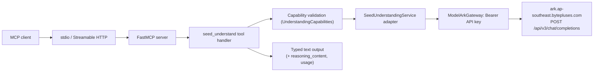
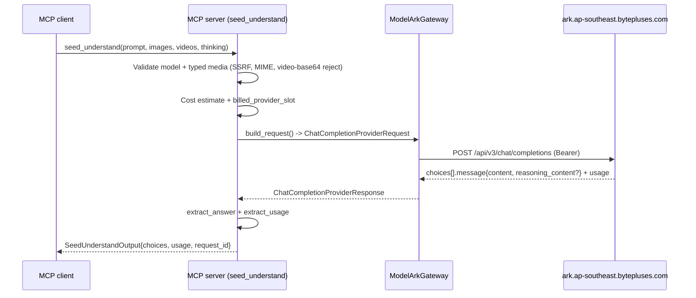

<!-- markdownlint-disable MD013 MD025 MD060 -->

# Seed 2.1 Multimodal Understanding Support Plan

## Goal

Add Seed 2.1 multimodal **understanding** support to the ModelArk Seed MCP
server, exposing video understanding, image understanding, and a reasoning
sub-agent through a single typed MCP tool backed by ModelArk's
OpenAI-compatible Chat Completions API.

## Source Context

- User request: add Seed 2.1 model support for video understanding, image
  understanding, and sub-agent use; invoked via MCP.
- Docs read: Seed 2.1 model card, ModelArk multimodal-understanding guide,
  ModelArk Chat API reference, LAS multimodal deep-thinking (Doubao-Seed)
  cookbook, ByteDance-Seed-1.8 API examples, TanStack BytePlus adapter docs,
  BytePlus model list.
- Code inspected: `src/modelark_mcp/server.py`, `config/env.py`,
  `config/model_capabilities.py`, `providers/modelark/client.py`,
  `providers/modelark/seedream.py`, `providers/modelark/seedance.py`,
  `providers/modelark/schemas.py`, `providers/base.py`, `domain/models.py`,
  `domain/media.py`, `domain/artifacts.py`, `tools/seedream_generate_image.py`,
  `tools/speech_to_text.py`, `tools/_errors.py`, `tools/_cost.py`,
  `tools/_parallel.py`, `docs/tools.md`.
- Existing plan: `plans/PLAN_MODELARK_SEED_MULTIMODAL_MCP.md` (generation-only
  MVP; no understanding/chat capability was in scope).

## Research Conclusion: Feasible

**Seed 2.1 is fully supported by the existing architecture with no new
gateway or credential.** The key research findings:

1. **Seed 2.1 is a multimodal *understanding* model** — the inverse of the
   current generation tools (Seedream/Seedance/Seed Audio). It takes
   text + image + video inputs and returns text (with optional
   chain-of-thought `reasoning_content`). See [Seed 2.1 model card](
   https://seed.bytedance.com/en/seed2_1).

2. **Same ModelArk data plane, same auth.** Seed 2.1 is served via ModelArk's
   OpenAI-compatible **Chat Completions API** at
   `POST {MODELARK_BASE_URL}/chat/completions` — the same host
   (`https://ark.ap-southeast.bytepluses.com/api/v3`) and the same
   `Authorization: Bearer` auth as Seedream and Seedance. This means the new
   tool **reuses `ModelArkGateway` and `BYTEPLUS_MODELARK_API_KEY` directly**;
   no new provider gateway and no new credential are required. See [Chat API
   reference](https://docs.byteplus.com/api/docs/ModelArk/1494384) and
   [ByteDance-Seed-1.8 examples](https://docs.byteplus.com/en/docs/ModelArk/2123228)
   (same `/chat/completions` path, same Bearer header).

3. **OpenAI-compatible request/response shape.** Messages are an array whose
   `content` can be a string or a list of typed parts: `text`, `image_url`
   (`{url}`), and `video_url` (`{url}`). The response is the standard
   OpenAI `choices[].message` with `content`, optional `reasoning_content`,
   optional `tool_calls`, and a `usage` object. See [LAS multimodal deep
   thinking cookbook](
   https://docs.byteplus.com/en/docs/Byteplus_LAS/Multimodal-Deep-Thinking-Doubao-Seed-2-0)
   for verified video/image content-part shapes.

4. **Model IDs.** The BytePlus model list and TanStack adapter docs confirm
   `dola-seed-2-1-turbo-260628` as the current Seed 2.1 Turbo ID. A Pro
   variant (`dola-seed-2-1-pro-260628`) is implied by the family. As with
   Seedream/Seedance, model IDs are **configuration, not hard-coded truth**.

5. **Capabilities relevant to the use cases:**
   - **Video understanding** — SOTA on VideoMME (89.2), hour-long video
     processing, temporal/action/motion reasoning.
   - **Image understanding** — visual reasoning, spatial reasoning,
     chart/infographic understanding (MMMU-Pro, CharXiv, BabyVision).
   - **Sub-agent / reasoning** — deep-thinking mode via `thinking` parameter
     returning `reasoning_content`; native function/tool calling; strong
     agent benchmarks (GDPVal, Workspace Bench). The model can serve as a
     capable reasoning sub-agent that other MCP clients delegate
     understanding tasks to.
   - **Context window** — 256K tokens.

6. **Ark-only additions** beyond standard OpenAI parameters: `thinking`
     (`{"type": "enabled"}`), `reasoning_effort` (`low`/`medium`/`high`),
     `repetition_penalty`, and `service_tier`. See [TanStack BytePlus adapter
     docs](https://tanstack.com/ai/latest/docs/adapters/byteplus).

## Architecture Decision

Add **one unified multimodal understanding tool** (`seed_understand`) backed
by a new `SeedUnderstandingService` adapter that reuses the existing
`ModelArkGateway` (Bearer auth, same base URL) and the existing
`BYTEPLUS_MODELARK_API_KEY`. The adapter translates typed domain inputs into
the OpenAI-compatible Chat Completions request and normalizes the response.
This mirrors the established service-adapter pattern (Seedream/Seedance
services) and keeps vendor DTOs internal to the provider layer.

**MVP scope:** non-streaming Chat Completions only (consistent with the
existing tools which force `stream: false`); single-shot request/response;
optional reasoning (deep thinking); text + image + video inputs. **Deferred:**
multi-turn tool-calling agent loops, audio input, and
`seed_understand_variations` (variations are not meaningful for a reasoning
model).

The Chat Completions API is OpenAI-compatible, simpler, more broadly
documented, and sufficient for all three requested use cases.

Streaming is not planned — MCP tools return a single `ToolResult` with no
partial-text delivery mechanism, and the caller needs the full answer to act
on it.

## Parallelization Summary

Implementation is **mostly sequential** because the new tool has a tight
contract dependency chain: provider DTOs → service adapter → tool handler →
registration. However, two safe parallel lanes exist:

- **Lane 1 (main agent):** provider DTOs + service adapter + tool handler +
  config + registration + tests. These share contract types and must be
  authored together.
- **Lane 2 (worker):** documentation + skill updates (`docs/tools.md`,
  `docs/configuration.md`, `.agents/skills/modelark-mcp/SKILL.md`,
  `README.md`). Disjoint write set; can start after the tool contract
  (input/output models) is finalized in Lane 1, against the agreed schema.

Splitting Lane 1 across agents would create contract instability and is not
recommended.



## File Ownership

| Path | Owner | Responsibility | Notes |
| --- | --- | --- | --- |
| `src/modelark_mcp/providers/modelark/schemas.py` | Main agent | Add chat completion provider DTOs | Internal-only; no field descriptions needed |
| `src/modelark_mcp/providers/modelark/understanding.py` | Main agent | New `SeedUnderstandingService` adapter | `generate()`, `build_request()`, `extract_*()` |
| `src/modelark_mcp/tools/seed_understand.py` | Main agent | New tool handler + input/output models | Client-facing; all fields need `description` |
| `src/modelark_mcp/domain/models.py` | Main agent | Add `UnderstandingUsage`, `UnderstandingChoice` | Client-facing; field descriptions required |
| `src/modelark_mcp/config/env.py` | Main agent | Add `SEED_UNDERSTANDING_DEFAULT_MODEL`, bindings, `has_understanding` | Gated by existing `has_modelark` |
| `src/modelark_mcp/config/model_capabilities.py` | Main agent | Add `UnderstandingCapabilities` + registry entry | Context window, modality flags |
| `src/modelark_mcp/server.py` | Main agent | Register `seed_understand` in ModelArk batch | New tuple entry ~L192-256 |
| `src/modelark_mcp/tools/_cost.py` | Main agent | Add understanding cost constants | Per-1M-token pricing |
| `tests/contract/test_understanding_contract.py` | Main agent | Provider DTO + service adapter contract tests | respx mocks |
| `tests/integration/test_seed_understand.py` | Main agent | Tool handler integration test | FakeContext |
| `docs/tools.md` | Worker | Document `seed_understand` | Parallel lane 2 |
| `docs/configuration.md` | Worker | Document new env vars | Parallel lane 2 |
| `.agents/skills/modelark-mcp/SKILL.md` | Worker | Update tool inventory | Parallel lane 2 |
| `README.md` | Worker | Update tool list / feature blurb | Parallel lane 2 |
| `.env.example` | Worker | Add `SEED_UNDERSTANDING_DEFAULT_MODEL` | Parallel lane 2 |

## Verified API Contract

### Request — `POST {MODELARK_BASE_URL}/chat/completions`

```bash
curl https://ark.ap-southeast.bytepluses.com/api/v3/chat/completions \
  -H "Content-Type: application/json" \
  -H "Authorization: Bearer $ARK_API_KEY" \
  -d '{
    "model": "dola-seed-2-1-turbo-260628",
    "messages": [
      {"role": "system", "content": "You are a video understanding assistant."},
      {"role": "user", "content": [
        {"type": "video_url", "video_url": {"url": "https://.../sample.mp4"}},
        {"type": "image_url", "image_url": {"url": "https://.../frame.png"}},
        {"type": "text", "text": "Describe what happens in this video and image."}
      ]}
    ],
    "thinking": {"type": "enabled"},
    "reasoning_effort": "medium",
    "temperature": 0.7,
    "max_tokens": 4096
  }'
```

Content part types (Chat API): `text` (`{type, text}`), `image_url`
(`{type, image_url: {url}}` — supports HTTPS URLs and `data:` base64 URIs for
images), `video_url` (`{type, video_url: {url}}` — HTTPS URL only; video
base64 is not supported inline and must be uploaded via `media_upload` first).

### Response — OpenAI-compatible

```json
{
  "id": "chatcmpl-...",
  "model": "dola-seed-2-1-turbo-260628",
  "choices": [
    {
      "index": 0,
      "message": {
        "role": "assistant",
        "content": "The video shows ...",
        "reasoning_content": "First, I observe ...",
        "tool_calls": null
      },
      "finish_reason": "stop"
    }
  ],
  "usage": {
    "prompt_tokens": 1234,
    "completion_tokens": 567,
    "total_tokens": 1801
  }
}
```

`reasoning_content` is present only when `thinking` is enabled.
`finish_reason` is one of `stop`, `length`, `tool_calls`, `content_filter`.

## Implementation Tasks

### Task 1: Chat completion provider DTOs

**Files:** `src/modelark_mcp/providers/modelark/schemas.py`

**Depends on:** None

**Can run in parallel with:** Task 2 (config/capabilities, disjoint file)

- [ ] Add internal Pydantic DTOs for the Chat Completions request body and
      response. These are provider-internal (no `Field(description=)` needed).
      Models to add:
  - `ChatContentPart` — discriminated by `type`: `text` (`text: str`),
    `image_url` (`image_url: {url: str}`), `video_url`
    (`video_url: {url: str}`).
  - `ChatMessage` — `role: Literal["system","user","assistant"]`,
    `content: str | list[ChatContentPart]`.
  - `ChatThinkingConfig` — `type: Literal["enabled"] = "enabled"`.
  - `ChatCompletionProviderRequest` — `model`, `messages: list[ChatMessage]`,
    `temperature: float | None`, `max_tokens: int | None`, `top_p: float |
    None`, `repetition_penalty: float | None`, `reasoning_effort:
    Literal["low","medium","high"] | None`, `thinking:
    ChatThinkingConfig | None`, `service_tier: str | None`, `stream:
    Literal[False] = False`.
  - `ChatUsage` — `prompt_tokens`, `completion_tokens`, `total_tokens`.
  - `ChatChoice` — `index`, `message` (`role`, `content`, `reasoning_content`,
    `tool_calls`), `finish_reason`.
  - `ChatCompletionProviderResponse` — `id`, `model`, `choices:
    list[ChatChoice]`, `usage: ChatUsage`.

### Task 2: Configuration and capabilities

**Files:** `src/modelark_mcp/config/env.py`,
`src/modelark_mcp/config/model_capabilities.py`

**Depends on:** None

**Can run in parallel with:** Task 1 (disjoint files)

- [ ] In `config/env.py`, add settings mirroring the Seedream/Seedance
      pattern exactly:
  - A `SeedUnderstandingFamily` `StrEnum` (mirrors `SeedreamFamily` /
    `SeedanceFamily`) with members `PRO` and `TURBO`.
  - `SEED_UNDERSTANDING_DEFAULT_MODEL` (validation alias
    `seed_understanding_default_model`) default
    `dola-seed-2-1-turbo-260628`.
  - `SEED_UNDERSTANDING_MODEL_FAMILY` default `seed-2-1` (used to seed the
    family list when no explicit bindings are configured).
  - `SEED_UNDERSTANDING_MODEL_BINDINGS` — JSON list of `{model_id, family}`,
    parsed into `list[ModelBinding[SeedUnderstandingFamily]]`, same shape as
    the existing `seedream_model_bindings` / `seedance_model_bindings`.
    Include a built-in default binding list for the two documented IDs so the
    tool works out of the box when the ModelArk key is set.
  - `has_understanding` property — returns `self.has_modelark` (same API key,
    same gateway; no separate credential). This keeps the tool gated on the
    ModelArk key so it is registered alongside Seedream/Seedance.
- [ ] In `config/model_capabilities.py`, make these **concrete** additions
      (the current file has no understanding support — verify against the
      existing `ImageCapabilities`/`VideoCapabilities` shape):
  - Add `ModelFamily` enum members (currently only Seedream/Seedance families
    exist at L22-31): `SEED_2_1_PRO = "seed_2_1_pro"` and
    `SEED_2_1_TURBO = "seed_2_1_turbo"`.
  - Add an `@dataclass(frozen=True) class UnderstandingCapabilities` (mirrors
    the frozen-dataclass shape of `ImageCapabilities`): `family:
    ModelFamily`, `model_id: str`, `context_window_tokens: int` (default
    256_000), `supports_image: bool` (True), `supports_video: bool` (True),
    `supports_audio: bool` (False for Seed 2.1; reserved),
    `supports_thinking: bool` (True), `max_media_parts: int` (default 32),
    `reasoning_efforts: tuple[str, ...]` (default
    `("low", "medium", "high")`).
  - Add a `_seed_understanding_capabilities() -> dict[str,
    UnderstandingCapabilities]` builder (mirrors
    `_seedream_capabilities()`): iterate
    `settings.seed_understanding_model_bindings`, map `PRO`→`ModelFamily.
    SEED_2_1_PRO` and `TURBO`→`ModelFamily.SEED_2_1_TURBO`, and emit
    `UnderstandingCapabilities` with the defaults above keyed by `model_id`.
  - In `CapabilityRegistry.__init__` (currently L144-146, only
    `_image_caps` + `_video_caps`), add
    `self._understanding_caps: dict[str, UnderstandingCapabilities] =
    _seed_understanding_capabilities()`.
  - Add `get_understanding_capabilities(self, model_id: str | None = None)
    -> UnderstandingCapabilities` (mirrors
    `get_image_capabilities`: fall back to
    `settings.seed_understanding_default_model`, raise `ValueError` listing
    allowed models when not found).
  - Add `list_understanding_models(self) -> list[str]` (mirrors
    `list_image_models`).

### Task 3: SeedUnderstandingService adapter

**Files:** `src/modelark_mcp/providers/modelark/understanding.py`

**Depends on:** Task 1 (DTOs)

**Can run in parallel with:** No (contract owner is Task 1)

- [ ] Create `SeedUnderstandingService` following the `SeedreamService`
      pattern (`providers/modelark/seedream.py`):
  - Constructor `__init__(self, gateway: ModelArkGateway | None = None)` —
    lazily creates a `ModelArkGateway` from settings if none injected (for
    test injection via `respx`/`MockTransport`).
  - `async def generate(self, request: ChatCompletionProviderRequest) ->
    ChatCompletionProviderResponse` — calls
    `await self._gateway.post("/chat/completions", request.model_dump(
    exclude_none=True, by_alias=True))`, parses the JSON into
    `ChatCompletionProviderResponse`.
  - `@staticmethod build_request(...)` — maps domain input (prompt, images,
    videos, system, thinking, generation params, model) into
    `ChatCompletionProviderRequest`. Translates typed media inputs:
    `UnderstandingImageInput(kind="url")` → `image_url` part;
    `UnderstandingImageInput(kind="base64")` → `image_url` part with `data:`
    URI (`data:{mime};base64,{data}`); `UnderstandingVideoInput(kind="url")`
    → `video_url` part; `UnderstandingVideoInput(kind="base64")` → reject
    with `ValueError` ("video base64 is not supported; upload via
    media_upload and pass a URL").
  - `@staticmethod extract_usage(resp) -> ChatUsage` — returns normalized
    usage.
  - `@staticmethod extract_answer(resp) -> tuple[str, str | None,
    list | None]` — returns `(content, reasoning_content, tool_calls)`.
  - `async def close(self)` — closes the gateway.
- [ ] Reuse `ModelArkGateway.post()` (Bearer auth + error normalization are
      already correct for the chat endpoint). Verify
      `ModelArkGateway.normalize_error` treats the OpenAI-style error body
      (`{"error": {"code":..., "message":...}}`) correctly; adjust the error
      extractor if the chat endpoint uses a different error envelope.
- [ ] **Billing-safety fix in `providers/modelark/client.py:83`.** The
      current mutation set is hard-coded:
      `mutation = operation in {"generate_image", "create_task",
      "delete_task"}`. The new chat-completion operation is billable (output
      tokens) and **must** be added to this set so that 5xx errors and
      timeouts get `ambiguous_completion=True`. Without this, `call_with_retry`
      (`providers/retry.py:45-49`) would retry 5xx responses (which are
      `retryable=True`) — causing **double-billing** on chat completions.
      Change to:
      `mutation = operation in {"generate_image", "create_task",
      "delete_task", "chat_completion"}`.
      Use the operation name `"chat_completion"` consistently in
      `SeedUnderstandingService.generate()` when it calls
      `self._gateway.post(..., operation="chat_completion")`. **Do not
      retry** chat completions (non-idempotent, billable); the existing
      `call_with_retry` already refuses `ambiguous_completion=True` mutations,
      so adding the operation to the mutation set both flags ambiguity and
      blocks retry.
- [ ] Confirm `normalize_timeout` (`providers/base.py`) already sets
      `ambiguous_completion=True`; it does, but the mutation-set membership
      above is the gating control for the 5xx path, so both edits are
      required.

### Task 4: Domain output models

**Files:** `src/modelark_mcp/domain/models.py`

**Depends on:** None

**Can run in parallel with:** Task 1, Task 2

- [ ] Add client-facing output models (every field needs `Field(description=...)`):
  - `UnderstandingUsage` — `prompt_tokens: int`, `completion_tokens: int`,
    `total_tokens: int` (descriptions noting these are token counts).
  - `UnderstandingChoice` — `role: Literal["assistant"]`, `content: str`,
    `reasoning_content: str | None` (chain-of-thought, present only when
    thinking enabled), `finish_reason: str` (one of `stop`, `length`,
    `tool_calls`, `content_filter`).
- [ ] These appear in the tool's output schema, so descriptions are
      client-facing documentation per the AGENTS.md tool contract rules.

### Task 5: Tool handler — `seed_understand`

**Files:** `src/modelark_mcp/tools/seed_understand.py`

**Depends on:** Task 3 (service), Task 4 (domain models)

**Can run in parallel with:** No (depends on service + models)

- [ ] Define input model `SeedUnderstandInput` (all fields with
      `Field(description=...)`). **Use separate typed `MediaSource` subclasses
      for images vs videos** (mirroring the `SeedanceImageInput` /
      `SeedanceVideoInput` pattern in `tools/seedance_create_task.py:35-71`),
      because `MediaSource.MEDIA_CATEGORY` is a `ClassVar` defaulting to
      `MediaType.IMAGE` (`domain/media.py:43`) — a single `media` list would
      validate all items against image MIME types and the 10 MB image limit
      instead of the 200 MB video limit. Define:

```python
class UnderstandingImageInput(MediaSource):
    MEDIA_CATEGORY: ClassVar[MediaType] = MediaType.IMAGE

class UnderstandingVideoInput(MediaSource):
    MEDIA_CATEGORY: ClassVar[MediaType] = MediaType.VIDEO
```

```python
class SeedUnderstandInput(BaseModel):
    prompt: str = Field(..., min_length=1, max_length=32000,
        description="The question or task for the model to reason about. "
                    "Becomes a user text content part.")
    images: list[UnderstandingImageInput] | None = Field(default=None,
        max_length=32,
        description="Images to understand (URL or Base64). For local files, "
                    "upload via media_upload first to get an HTTPS URL.")
    videos: list[UnderstandingVideoInput] | None = Field(default=None,
        max_length=32,
        description="Videos to understand. Must be HTTPS URLs — video Base64 "
                    "is not supported by the chat endpoint; upload local "
                    "videos via media_upload first.")
    system: str | None = Field(default=None, max_length=32000,
        description="Optional system instruction to guide the model's behavior.")
    model: str | None = Field(default=None,
        description="Override the configured Seed 2.1 model ID. Must be "
                    "present in the capability registry.")
    thinking: bool = Field(default=False,
        description="Enable deep-thinking (chain-of-thought) reasoning. "
                    "When true, the response includes reasoning_content.")
    reasoning_effort: Literal["low", "medium", "high"] | None = Field(
        default=None,
        description="Reasoning effort level. Only applies when thinking=true.")
    temperature: float | None = Field(default=None, ge=0.0, le=2.0,
        description="Sampling temperature (0.0-2.0). Lower is more deterministic.")
    max_tokens: int | None = Field(default=None, ge=1, le=32768,
        description="Maximum output tokens (1-32768).")
    top_p: float | None = Field(default=None, ge=0.0, le=1.0,
        description="Nucleus sampling probability (0.0-1.0).")
    repetition_penalty: float | None = Field(default=None, ge=0.0, le=2.0,
        description="Repetition penalty (0.0-2.0). Ark-only parameter.")
```

- [ ] Define output model `SeedUnderstandOutput` (all fields with
      `description`), including the provider completion ID for tracing:

```python
class SeedUnderstandOutput(BaseModel):
    provider: Literal["byteplus-modelark"] = Field(
        default="byteplus-modelark", description="Provider identifier.")
    model: str = Field(..., description="Model ID used for the completion.")
    completion_id: str | None = Field(
        default=None,
        description="Provider completion ID (e.g. 'chatcmpl-...') for tracing.")
    choices: list[UnderstandingChoice] = Field(
        ..., description="Model completion choices (one for non-streaming).")
    usage: UnderstandingUsage = Field(
        ..., description="Token usage for this completion.")
    request_id: str | None = Field(
        default=None, description="Provider request ID for support tracing.")
```

- [ ] Implement the handler following the established pattern from
      `tools/seedream_generate_image.py`:
  1. Credential guard: check `settings.has_understanding`, else raise
     `ValueError` with a helpful message.
  2. Resolve model via capability registry (`get_capability_registry()`); fall
     back to `settings.seed_understanding_default_model`. Validate that the
     model supports the requested modalities.
  3. Validate media using the typed subclasses' `MEDIA_CATEGORY` (already
     enforced by `MediaSource.validate_source`): images use
     `validate_image_mime` + 10 MB limit; videos use `validate_video_mime` +
     200 MB limit. Reject `UnderstandingVideoInput` with `kind="base64"` with
     a clear `ValueError` ("video Base64 is not supported by the chat
     endpoint; upload via media_upload and pass a URL"). Reuse `MediaSource`
     validators (already enforce SSRF, MIME, size limits).
  4. Cost estimate: `log_cost_estimate(product="understanding", ...)` using
     per-1M-token pricing (input ~$0.50/M, output ~$3.0/M; conservative).
  5. Build the request via `SeedUnderstandingService.build_request(...)`.
  6. Wrap the provider call in `call_with_retry(lambda: service.generate(...))`
     — but with a retry policy that does **not** retry billable completions
     (retry only on 429 with `Retry-After` if the gateway marks it safe, per
     existing policy; the existing `call_with_retry` already refuses
     ambiguous-completion mutations).
  7. `except ProviderError as exc: return provider_error_result(exc)`.
  8. `finally: await service.close()`.
  9. Report progress via `ctx.info(...)` / `ctx.report_progress(...)`.
- [ ] Add the handler docstring (FastMCP uses it as the tool description):

```python
async def seed_understand(input: SeedUnderstandInput, ctx: Context) -> SeedUnderstandOutput:
    """Understand images and videos, or reason about a task, through the
    Seed 2.1 multimodal model.

    Accepts a natural-language prompt plus optional images and videos, and
    returns the model's text answer. Supports deep-thinking reasoning. Use
    this for video understanding, image understanding, and as a multimodal
    reasoning sub-agent. For local media files, upload them first with
    media_upload to obtain an HTTPS URL; video Base64 is not supported by the
    chat endpoint.
    """
```

- [ ] Add `TOOL_ANNOTATIONS` at module bottom:
  `ToolAnnotations(readOnlyHint=True, destructiveHint=False,
  idempotentHint=False, openWorldHint=False)`. Understanding is read-only
  (no side effects, no media generation). Set `idempotentHint=False`
  because each call bills tokens — a client retry is not free, so the hint
  must not signal "safe to repeat without cost."

### Task 6: Registration

**Files:** `src/modelark_mcp/server.py`

**Depends on:** Task 5 (handler)

**Can run in parallel with:** No

- [ ] In `register_tools()`, add `seed_understand` to the ModelArk tool
      batch (the `registrations` tuple near L192-256), gated by
      `settings.has_modelark` (or `has_understanding`). Import the handler,
      `SeedUnderstandOutput`, and `TOOL_ANNOTATIONS`. Register with
      `server.tool(name="seed_understand", annotations=...,
      output_schema=SeedUnderstandOutput.model_json_schema(),
      auth=component_auth(settings, "understanding:read"))(handler)`.
- [ ] Add the `understanding:read` auth scope to the documented scope list
      (mirrors `seedream:generate`, etc.).

### Task 7: Cost constants

**Files:** `src/modelark_mcp/tools/_cost.py`

**Depends on:** None

**Can run in parallel with:** Task 1, 2, 4

- [ ] Add `COST_UNDERSTANDING_INPUT_PER_MTOK = 0.50` and
      `COST_UNDERSTANDING_OUTPUT_PER_MTOK = 3.00` (conservative Seed 2.x
      pricing from the BytePlus model list; operators can adjust).
- [ ] **Extend the `estimate_cost` / `log_cost_estimate` signature** (current
      signature at `tools/_cost.py:22-27` is
      `estimate_cost(*, product, variations, duration_seconds=0.0)` with no
      token parameter). Add keyword-only params:
      `prompt_tokens: int | None = None` and `max_tokens: int | None = None`.
      Backward-compatible: existing callers pass neither. Add a branch:
      ```python
      if product == "understanding":
          out = (max_tokens or 0) / 1_000_000 * COST_UNDERSTANDING_OUTPUT_PER_MTOK
          inp = (prompt_tokens or 0) / 1_000_000 * COST_UNDERSTANDING_INPUT_PER_MTOK
          return round(variations * (inp + out), 4)
      ```
      In the handler, call
      `log_cost_estimate(product="understanding", variations=1,
      max_tokens=input.max_tokens)` before dispatch. Exact input tokens are
      only known after the response; the pre-flight estimate is approximate
      (output-bounded) and is logged as a cost estimate, not a hard budget.

### Task 8: Contract tests

**Files:** `tests/contract/test_understanding_contract.py`

**Depends on:** Task 3 (service)

**Can run in parallel with:** Task 5, 6 (disjoint, but needs service)

- [ ] Test `SeedUnderstandingService.build_request()` mapping:
  - Text-only prompt → single user message with a `text` part.
  - Prompt + image URL → `image_url` part.
  - Prompt + image base64 → `image_url` part with `data:` URI.
  - Prompt + video URL → `video_url` part.
  - Prompt + video base64 → raises `ValueError`.
  - `system` → prepended system message.
  - `thinking=True` → `thinking: {type: "enabled"}` in request.
  - `reasoning_effort` propagation.
  - Combined images + videos → both part types in one user message.
- [ ] Test response parsing with a fixture `ChatCompletionProviderResponse`:
  `extract_answer` returns `(content, reasoning_content, tool_calls)`
  correctly; `reasoning_content` is `None` when absent.
- [ ] Test `extract_usage` returns token counts.
- [ ] Test error normalization: mock a 401, 429, 500, and malformed JSON;
      verify `ProviderError` fields (`retryable`, `ambiguous_completion`,
      `request_id`). **Add an explicit case** asserting that a 500 on
      operation `"chat_completion"` yields `ambiguous_completion=True` and
      `retryable=True` (which `call_with_retry` then refuses to replay),
      validating the `client.py:83` mutation-set fix from Task 3.

### Task 9: Integration test

**Files:** `tests/integration/test_seed_understand.py`

**Depends on:** Task 6 (registration)

**Can run in parallel with:** Task 8

- [ ] Full handler test using `FakeContext` (from
      `tests/fixtures/fake_context.py`) and a `respx`-mocked
      `/chat/completions` endpoint:
  - Happy path: image URL + prompt → structured output with content + usage.
  - Reasoning path: `thinking=True` → output includes `reasoning_content`.
  - Video understanding: video URL + prompt → content.
  - Error path: mock 429 → `ToolResult(is_error=True)`.
  - Credential-absent path: settings without ModelArk key → handler raises
    `ValueError` (or tool not registered).

### Task 10: Documentation and skills (parallel lane 2)

**Files:** `docs/tools.md`, `docs/configuration.md`,
`.agents/skills/modelark-mcp/SKILL.md`, `README.md`, `.env.example`

**Depends on:** Task 5 (finalized input/output schema)

**Can run in parallel with:** Task 8, 9 (tests)

- [ ] `docs/tools.md`: add a `## seed_understand` section following the
      existing format (annotations, input table, output table, example JSON).
- [ ] `docs/configuration.md`: document `SEED_UNDERSTANDING_DEFAULT_MODEL`,
      `SEED_UNDERSTANDING_MODEL_FAMILY`,
      `SEED_UNDERSTANDING_MODEL_BINDINGS`, and the `understanding:read`
      scope.
- [ ] `.agents/skills/modelark-mcp/SKILL.md`: add `seed_understand` to the tool
      inventory with a one-line use-case summary (video/image understanding +
      reasoning sub-agent).
- [ ] `README.md`: add "Multimodal understanding (Seed 2.1)" to the feature
      list and update the tool count.
- [ ] `.env.example`: add
      `SEED_UNDERSTANDING_DEFAULT_MODEL=dola-seed-2-1-turbo-260628`.

## Parallel Subagent Execution Plan

| Lane | Agent Role | Write Scope | Task(s) | Can Start After | Conflict Guard |
| --- | --- | --- | --- | --- | --- |
| Main agent | main | `providers/modelark/understanding.py`, `providers/modelark/schemas.py`, `domain/models.py`, `config/env.py`, `config/model_capabilities.py`, `tools/seed_understand.py`, `tools/_cost.py`, `server.py`, `tests/**` | 1-9 | Immediately | Owns all contract-defining files |
| Worker | worker | `docs/tools.md`, `docs/configuration.md`, `.agents/skills/modelark-mcp/SKILL.md`, `README.md`, `.env.example` | 10 | Task 5 finalized | Must not edit any `src/` or `tests/` files |

**Implementation handoff:** When the user asks to implement this plan, the
main agent must recheck the current worktree, finalize the
`SeedUnderstandInput`/`SeedUnderstandOutput` contract first (so the docs
worker has a stable schema), spawn only the docs worker in parallel, sequence
the provider → tool → registration chain, and retain ownership of
integration, validation, and final reporting.

## Sequence



## Validation

- `make lint` (ruff): no new warnings in added files.
- `make typecheck` (mypy strict): no new type errors. Note: tool input models
  use the `call-arg` override already configured for `tools/*` and
  `domain/models.py`.
- `make test`: all unit + contract + integration tests pass.
- `make build`: clean build.
- Smoke: with a real `BYTEPLUS_MODELARK_API_KEY` and `RUN_BYTEPLUS_LIVE_TESTS=1`,
  run one image-understanding and one video-understanding call with
  `thinking=True` and confirm `content` + `reasoning_content` are returned.

## Documentation And Follow-Up

**Docs/specs to update (in-scope):**
- `docs/tools.md` — new `seed_understand` section.
- `docs/configuration.md` — new env vars + scope.
- `.agents/skills/modelark-mcp/SKILL.md` — tool inventory.
- `README.md` — feature list.
- `.env.example` — default model var.

**Known risks / non-blocking follow-up:**
- **Multi-turn tool-calling agent loop** — the model supports
  `tools`/`tool_calls`, but a multi-turn loop (model calls tool → execute →
  feed back) exceeds single-call MCP tool semantics. Defer to a future
  "agentic understanding" tool or rely on the MCP client to orchestrate.
- **Audio input** — Seed 2.0 Lite supports audio; Seed 2.1 audio support is
  unconfirmed. `UnderstandingCapabilities.supports_audio` is reserved as
  `False` until confirmed.
- **Exact pricing** — conservative estimates used; confirm live pricing in
  the target BytePlus region/account before production.
- **Video base64** — not supported by the chat endpoint. Document the
  `media_upload` → URL workflow clearly so callers upload local videos first.
- **Token counting** — exact input tokens are only known after the response;
  pre-flight cost estimates are approximate. Consider a tokenization API call
  for precise budget enforcement in a future hardening pass.

## Sources

All live sources accessed on **2026-08-05**.

- [Seed 2.1 model card](https://seed.bytedance.com/en/seed2_1) — capabilities,
  benchmarks (VideoMME, MMMU-Pro, BabyVision), agent/coding strengths.
- [ModelArk multimodal understanding — video understanding](
  https://docs.byteplus.com/en/docs/ModelArk/1895586) — confirms Seed models
  serve video/image understanding via ModelArk.
- [ModelArk Chat API reference](https://docs.byteplus.com/api/docs/ModelArk/1494384)
  — `/chat/completions` endpoint, OpenAI compatibility.
- [LAS multimodal deep thinking (Doubao-Seed-2.0)](
  https://docs.byteplus.com/en/docs/Byteplus_LAS/Multimodal-Deep-Thinking-Doubao-Seed-2-0)
  — verified `video_url` / `image_url` / `text` content-part shapes and
  `reasoning_content` deep-thinking behavior.
- [ByteDance-Seed-1.8 API examples](https://docs.byteplus.com/en/docs/ModelArk/2123228)
  — confirmed `/chat/completions` path, Bearer auth, `thinking`,
  `reasoning_content`, tool-calling request shape.
- [TanStack BytePlus adapter docs](https://tanstack.com/ai/latest/docs/adapters/byteplus)
  — confirmed `dola-seed-2-1-turbo-260628` model ID, Ark-only parameters
  (`thinking`, `reasoning_effort`, `repetition_penalty`, `service_tier`), and
  base URL.
- [BytePlus model list](https://www.byteplus.com/en/model) — Seed 2.1
  Turbo/Pro availability on ModelArk, approximate pricing.
