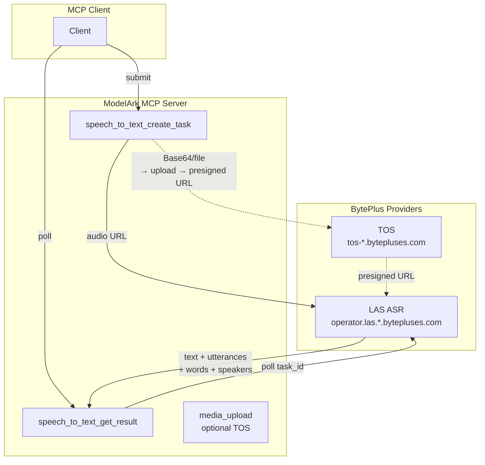
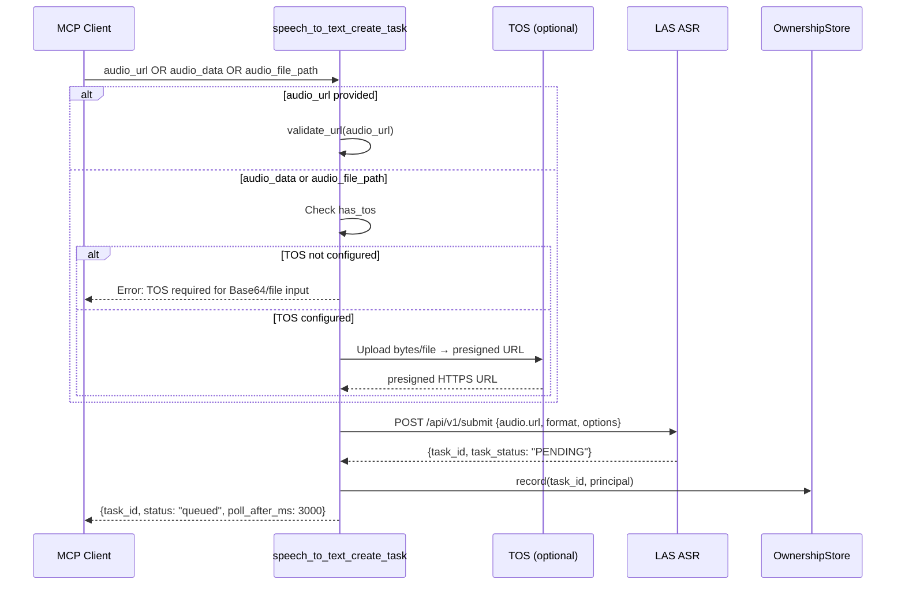
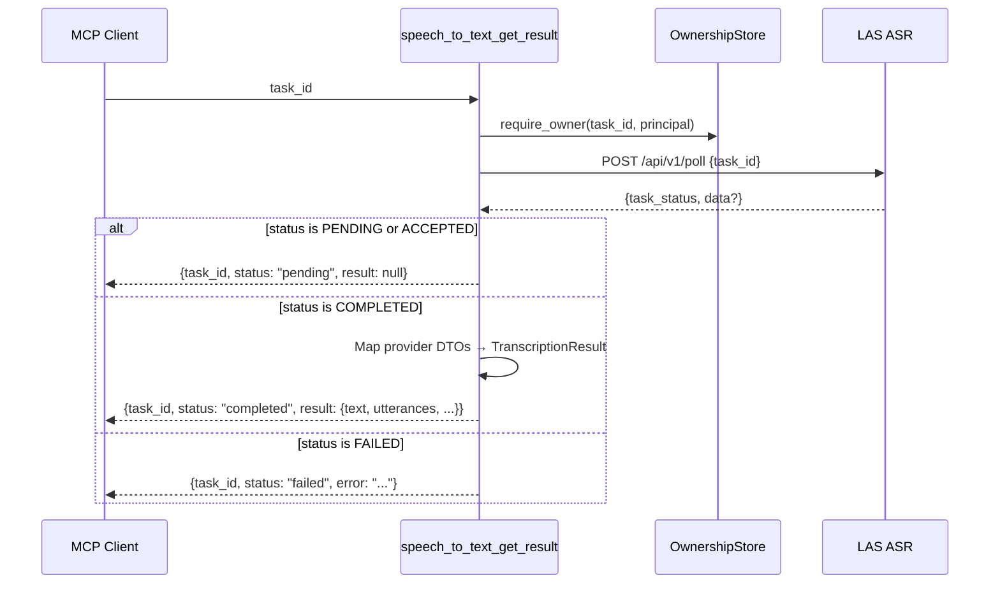

# Plan: Speech-to-Text via BytePlus LAS ASR

Add a speech-to-text (STT) tool surface to the ModelArk Seed MCP server using
the **BytePlus LAS ASR Service** — an asynchronous HTTP submit/poll API that
transcribes audio (and video) files into timestamped, speaker-diarized text.

## Architecture Overview



The STT tools follow the same async submit/poll pattern as Seedance
(`seedance_create_task` → `seedance_get_task`). The key difference is that
LAS ASR accepts **audio via URL only** — there is no inline Base64 path in the
provider API. When TOS is configured, the submit tool transparently uploads
Base64 or local-file audio to TOS and passes the resulting presigned URL to
LAS. When TOS is absent, the tool accepts URL input only.

## Research Findings

### LAS ASR API Contract

**Host:** `https://operator.las.ap-southeast-1.bytepluses.com`
**Auth:** `Authorization: $LAS_API_KEY` (bare key, **no** "Bearer" prefix)

#### Two operators

| Operator | ID | Version | Resource | Formats | Limits | Languages |
|---|---|---|---|---|---|---|
| Standard | `las_asr` | `v2` | — | raw, wav, mp3, ogg | ≤ 2 hours | limited |
| Enhanced | `las_asr_pro` | `v1` | `bigasr` or `seedasr` | + mp4, mov, mkv, flac | no limit | 99 |

**Default:** `las_asr_pro` with `resource: bigasr`. The `seedasr` resource uses
the SeedASR model (same family as Seed Audio TTS).

#### Submit — `POST /api/v1/submit`

Request:
```json
{
    "operator_id": "las_asr_pro",
    "operator_version": "v1",
    "data": {
        "resource": "bigasr",
        "audio": {
            "url": "https://example.com/audio.wav",
            "format": "wav"
        },
        "request": {
            "model_name": "bigmodel",
            "enable_punc": true,
            "enable_itn": true,
            "enable_speaker_info": false,
            "enable_lid": false,
            "show_utterances": true,
            "show_words": true
        }
    }
}
```

Response:
```json
{
    "metadata": {
        "task_id": "xxxxx123ef24ea40546c",
        "task_status": "PENDING",
        "business_code": "0",
        "error_msg": "",
        "request_id": "494022a8a0fc3eadb758cf8b0e8b20ef"
    }
}
```

#### Poll — `POST /api/v1/poll`

Request:
```json
{
    "operator_id": "las_asr_pro",
    "operator_version": "v1",
    "task_id": "xxxxx123ef24ea40546c"
}
```

Response (completed):
```json
{
    "metadata": {
        "task_id": "xxxxx123ef24ea40546c",
        "task_status": "COMPLETED",
        "business_code": "0",
        "error_msg": "",
        "request_id": "d204c21f5c7c8f8cfeb85d211b9c20ac"
    },
    "data": {
        "audio_info": {
            "duration": 3575
        },
        "result": {
            "text": "Full transcript text here.",
            "utterances": [
                {
                    "text": "Segment text.",
                    "start_time": 640,
                    "end_time": 2320,
                    "words": [
                        {
                            "text": "word",
                            "confidence": 0.98,
                            "start_time": 640,
                            "end_time": 920
                        }
                    ],
                    "additions": {
                        "channel_id": "1",
                        "speaker_id": "spk_0"
                    }
                }
            ],
            "additions": {
                "duration": "3575",
                "speech_rate": "normal",
                "volume": "normal"
            }
        }
    }
}
```

**task_status values:** `PENDING`, `ACCEPTED` (in progress), `COMPLETED`,
`FAILED` (inferred from `business_code != "0"` + non-empty `error_msg`).

**Timestamps** are in **milliseconds** (integer).

### Input Handling: With and Without TOS

LAS ASR accepts only `audio.url` — there is no Base64 field in the API. The
tool resolves audio input to a URL:

| Input mode | Without TOS | With TOS |
|---|---|---|
| `audio_url` (HTTPS) | Works directly | Works directly |
| `audio_data` (Base64) | **Rejected** with clear error | Upload to TOS → presigned URL |
| `audio_file_path` (stdio only) | **Rejected** with clear error | Read → upload to TOS → presigned URL |

This mirrors the existing `media_upload` tool pattern for file reading and the
`seedance_create_task` pattern for URL-only video references.

### Transport Compatibility

- **stdio (local):** All three input modes available (URL, Base64, file_path
  when TOS is configured).
- **HTTP (remote):** URL and Base64 (when TOS is configured). `file_path` is
  rejected with the same guard as `media_upload`.

## Implementation

### Phase 1 — Provider Layer

#### `src/modelark_mcp/providers/las/__init__.py`

Empty package init.

#### `src/modelark_mcp/providers/las/client.py` — `LasGateway`

Subclass of `BaseHttpGateway`. LAS uses `Authorization: <key>` (bare key, no
"Bearer" prefix), distinct from both ModelArk (`Bearer`) and Seed Speech
(`X-Api-Key`).

```python
class LasGateway(BaseHttpGateway):
    """Authenticated HTTP client for BytePlus LAS (Lake AI Service)."""

    PROVIDER: ClassVar[ProviderName] = "las"

    def __init__(
        self,
        *,
        api_key: str | None = None,
        base_url: str | None = None,
        timeout: float | None = None,
        connect_timeout: float | None = None,
    ) -> None:
        settings = get_settings()
        self._api_key = api_key or settings.las_api_key
        self._base_url = (base_url or settings.las_base_url).rstrip("/")
        self._timeout = timeout or settings.request_timeout_ms / 1000
        self._connect_timeout = connect_timeout or settings.connect_timeout_ms / 1000
        self._client: httpx.AsyncClient | None = None

    def _headers(self) -> dict[str, str]:
        return {
            "Authorization": self._api_key,
            "Content-Type": "application/json",
            "Accept": "application/json",
        }

    async def post(
        self,
        path: str,
        json_body: dict[str, Any],
    ) -> httpx.Response:
        return await self._request("POST", path, json=json_body)

    @staticmethod
    def extract_request_id(response: httpx.Response) -> str | None:
        value = response.headers.get("X-Request-Id") or response.headers.get("x-request-id")
        return str(value) if value is not None else None

    @classmethod
    def normalize_error(cls, response: httpx.Response, operation: str) -> ProviderError:
        # Same structure as ModelArkGateway.normalize_error, but:
        # - provider = "las"
        # - error body shape: {"metadata": {"business_code": "...", "error_msg": "..."}}
        # - mutations: submit_asr_task (ambiguous on 5xx)
        # - reads: poll_asr_task (not ambiguous)
        ...
```

**Important:** Unlike ModelArk (which returns request IDs in the `X-Request-Id`
header) and Seed Speech (which uses `X-Tt-Logid`), **LAS returns `request_id`
in the response body** (`metadata.request_id`), not in headers. The
`extract_request_id` header lookup is kept for compatibility but will typically
return `None`. The `LasAsrService.submit` and `poll` methods should extract the
request_id from the **parsed response body** (`response.metadata.request_id`)
in the success path, not from `extract_request_id(response)`. The
`normalize_error` classmethod reads `metadata.request_id` from the error body
directly.

**Error normalization** parses the LAS response envelope:
- `metadata.business_code` → `code`
- `metadata.error_msg` → `message`
- `metadata.request_id` → `request_id`
- Retryable: `429` or `>= 500`
- Ambiguous completion: `submit_asr_task` + `>= 500` (the task may have been
  created despite the error response).

#### `src/modelark_mcp/providers/las/schemas.py` — Provider DTOs

```python
class LasAudioInput(BaseModel):
    """Audio input for LAS ASR submit."""
    url: str
    format: str  # "wav", "mp3", "ogg", "raw", "mp4", "mov", "mkv", "flac"

class LasAsrRequestConfig(BaseModel):
    """Request configuration toggles."""
    model_config = ConfigDict(extra="allow")  # preserve unknown provider fields
    model_name: str = "bigmodel"
    enable_punc: bool | None = None
    enable_itn: bool | None = None
    enable_ddc: bool | None = None        # semantic smoothing
    enable_speaker_info: bool | None = None
    enable_channel_split: bool | None = None
    enable_lid: bool | None = None         # language ID
    show_utterances: bool | None = None
    show_words: bool | None = None
    show_speech_rate: bool | None = None
    show_volume: bool | None = None

class LasAsrSubmitData(BaseModel):
    """The `data` object in the submit request."""
    audio: LasAudioInput
    request: LasAsrRequestConfig
    resource: str | None = None  # "bigasr" | "seedasr"; only for las_asr_pro

class LasAsrSubmitRequest(BaseModel):
    """Full submit request body."""
    operator_id: str = "las_asr_pro"
    operator_version: str = "v1"
    data: LasAsrSubmitData

class LasTaskMetadata(BaseModel):
    """Metadata returned by submit and poll."""
    model_config = ConfigDict(extra="allow")
    task_id: str
    task_status: str  # "PENDING" | "ACCEPTED" | "COMPLETED" | "FAILED"
    business_code: str = "0"
    error_msg: str = ""
    request_id: str | None = None

class LasAsrSubmitResponse(BaseModel):
    """Response from POST /api/v1/submit."""
    metadata: LasTaskMetadata

class LasAsrWord(BaseModel):
    """A single word with timing and confidence."""
    model_config = ConfigDict(extra="allow")
    text: str = ""
    confidence: float | None = None
    start_time: int | None = None  # milliseconds
    end_time: int | None = None    # milliseconds

class LasAsrUtterance(BaseModel):
    """An utterance segment with timing, words, and speaker metadata."""
    model_config = ConfigDict(extra="allow")
    text: str = ""
    start_time: int | None = None  # milliseconds
    end_time: int | None = None    # milliseconds
    words: list[LasAsrWord] = Field(default_factory=list)
    additions: dict[str, Any] | None = None  # channel_id, speaker_id, etc.

class LasAsrResult(BaseModel):
    """The `data.result` object in the poll response."""
    model_config = ConfigDict(extra="allow")
    text: str = ""
    utterances: list[LasAsrUtterance] = Field(default_factory=list)
    additions: dict[str, Any] | None = None  # duration, speech_rate, volume

class LasAsrAudioInfo(BaseModel):
    """Audio metadata in poll response."""
    duration: int | None = None  # milliseconds

class LasAsrPollData(BaseModel):
    """The `data` object in the poll response."""
    audio_info: LasAsrAudioInfo | None = None
    result: LasAsrResult | None = None

class LasAsrPollResponse(BaseModel):
    """Full poll response."""
    metadata: LasTaskMetadata
    data: LasAsrPollData | None = None
```

#### `src/modelark_mcp/providers/las/asr.py` — `LasAsrService`

Service layer that translates domain input to provider DTOs and calls the
gateway. Follows the `SeedanceService` pattern.

```python
class LasAsrService:
    """Service layer for LAS ASR (speech-to-text)."""

    def __init__(self, gateway: LasGateway | None = None) -> None:
        self._gateway = gateway or LasGateway()

    async def submit(
        self,
        request: LasAsrSubmitRequest,
    ) -> tuple[LasAsrSubmitResponse, str | None]:
        """Call POST /api/v1/submit. Returns (response, request_id).

        The request_id is extracted from the parsed response body
        (``response.metadata.request_id``), not from response headers.
        """
        # Same httpx exception → normalize_* pattern as SeedanceService.create_task
        # Success path: request_id = parsed_response.metadata.request_id
        ...

    async def poll(
        self,
        task_id: str,
        operator_id: str = "las_asr_pro",
        operator_version: str = "v1",
    ) -> tuple[LasAsrPollResponse, str | None]:
        """Call POST /api/v1/poll. Returns (response, request_id).

        The request_id is extracted from the parsed response body
        (``response.metadata.request_id``), not from response headers.
        """
        ...

    @staticmethod
    def build_submit_request(
        *,
        audio_url: str,
        audio_format: str,
        resource: str | None = "bigasr",
        model_name: str = "bigmodel",
        enable_punc: bool | None = None,
        enable_itn: bool | None = None,
        enable_speaker_info: bool | None = None,
        enable_lid: bool | None = None,
        show_utterances: bool | None = None,
        show_words: bool | None = None,
        operator_id: str = "las_asr_pro",
        operator_version: str = "v1",
    ) -> LasAsrSubmitRequest:
        """Build a submit request from domain-level parameters."""
        ...

    async def close(self) -> None:
        await self._gateway.close()
```

### Phase 2 — Domain Layer

#### `src/modelark_mcp/domain/errors.py` — Add `"las"` to `ProviderName`

```python
ProviderName = Literal["modelark", "seed-speech", "tos", "las"]
```

#### `src/modelark_mcp/runtime.py` — Add `"las"` to `ProviderKey`

```python
ProviderKey = Literal["modelark", "seed-speech", "tos", "las"]
```

Add `"las"` to the `ProviderLimiters._provider` dict:

```python
self._provider = {
    "modelark": asyncio.Semaphore(provider_limit),
    "seed-speech": asyncio.Semaphore(provider_limit),
    "tos": asyncio.Semaphore(provider_limit),
    "las": asyncio.Semaphore(provider_limit),
}
```

#### `src/modelark_mcp/domain/transcription.py` — New domain models

Shared transcription result types used in tool output. These are
provider-agnostic and mirror the structure of `domain/models.py`.

```python
class TranscriptionWord(BaseModel):
    """A single word with timing and confidence."""
    text: str = ""
    confidence: float | None = None
    start_time_ms: int | None = None
    end_time_ms: int | None = None

class TranscriptionUtterance(BaseModel):
    """An utterance segment with timing, words, and speaker metadata."""
    text: str = ""
    start_time_ms: int | None = None
    end_time_ms: int | None = None
    words: list[TranscriptionWord] = Field(default_factory=list)
    speaker_id: str | None = None
    channel_id: str | None = None

class TranscriptionResult(BaseModel):
    """Full transcription result returned by speech_to_text_get_result."""
    text: str
    utterances: list[TranscriptionUtterance] = Field(default_factory=list)
    duration_ms: int | None = None

class AsrTaskStatus(StrEnum):
    PENDING = "pending"
    ACCEPTED = "accepted"
    COMPLETED = "completed"
    FAILED = "failed"
```

**Key design choice: no artifact persistence.** The STT output is text, which
has no provider URL expiry. The transcription is returned directly as
structured output. This differs from Seedream/Seedance/Seed Audio, which
persist binary media because provider URLs expire.

### Phase 3 — Config Layer

#### `src/modelark_mcp/config/env.py` — New settings

```python
# --- LAS (Lake AI Service) -----------------------------------------------

las_api_key: str = Field(default="", validation_alias="BYTEPLUS_LAS_API_KEY")
las_base_url: str = Field(
    default="https://operator.las.ap-southeast-1.bytepluses.com",
    validation_alias="BYTEPLUS_LAS_BASE_URL",
)
las_default_operator: str = Field(
    default="las_asr_pro",
    validation_alias="LAS_DEFAULT_OPERATOR",
    description="LAS ASR operator: 'las_asr_pro' (enhanced) or 'las_asr' (standard).",
)
las_default_resource: str = Field(
    default="bigasr",
    validation_alias="LAS_DEFAULT_RESOURCE",
    description="Model resource for las_asr_pro: 'bigasr' or 'seedasr'.",
)
```

Convenience flag:

```python
@property
def has_las(self) -> bool:
    """Whether LAS (Lake AI Service) credentials are configured."""
    return bool(self.las_api_key)
```

Add `las_base_url` to the existing `validate_provider_url` field validator:

```python
@field_validator("modelark_base_url", "seed_audio_base_url", "las_base_url")
```

Update the URL-scheme check to handle the LAS URL (contains "las" or
"operator"):

```python
variable = (
    "BYTEPLUS_MODELARK_BASE_URL"
    if "ark" in value.lower()
    else "BYTEPLUS_LAS_BASE_URL"
    if "las" in value.lower() or "operator" in value.lower()
    else "BYTEPLUS_SEED_AUDIO_BASE_URL"
)
```

> **Heuristic caveat:** This value-based variable-name guess is inherited
> from the existing validator pattern. It is fragile — a custom LAS URL
> containing `"ark"` (e.g. `https://ark-las.example.com`) would be
> misclassified as ModelArk in the error message. This only affects the
> error message text, not the actual HTTPS/hostname validation. A future
> refactor should use `cls` field-name introspection instead of value
> guessing.

Also update the `validate()` function at the bottom of `env.py` to check
`las_base_url` HTTPS (mirroring the existing `modelark_base_url` and
`seed_audio_base_url` checks):

```python
if not settings.las_base_url.startswith("https://"):
    raise ValueError("BYTEPLUS_LAS_BASE_URL must use HTTPS")
```

Add field validators for the LAS operator and resource enums so invalid
values are rejected at config load time, matching the existing
`validate_transport` pattern:

```python
@field_validator("las_default_operator")
@classmethod
def validate_las_operator(cls, value: str) -> str:
    allowed = {"las_asr_pro", "las_asr"}
    if value not in allowed:
        raise ValueError(f"LAS_DEFAULT_OPERATOR must be one of {allowed}, got '{value}'")
    return value

@field_validator("las_default_resource")
@classmethod
def validate_las_resource(cls, value: str) -> str:
    allowed = {"bigasr", "seedasr"}
    if value not in allowed:
        raise ValueError(f"LAS_DEFAULT_RESOURCE must be one of {allowed}, got '{value}'")
    return value
```

> **Note:** The `language: str | None` field was intentionally **removed**
> from `SpeechToTextCreateTaskInput`. The LAS ASR REST API has no language
> parameter — language is handled exclusively via `enable_lid` (automatic
> language identification). Exposing a `language` field that is silently
> ignored would mislead clients. Pass `options.enable_lid=True` for
> auto-detection instead.

#### `.env.example` — Add LAS section

```bash
# --- LAS (Lake AI Service) — speech-to-text (optional) --------------------
# Enables the speech_to_text tools. LAS ASR is an async submit/poll API.
# Auth uses a bare Authorization header (no Bearer prefix).
# Audio input requires a URL. Base64/file_path input also needs TOS configured.
BYTEPLUS_LAS_API_KEY=
BYTEPLUS_LAS_BASE_URL=https://operator.las.ap-southeast-1.bytepluses.com
# Operator: 'las_asr_pro' (enhanced, 99 languages, video) or 'las_asr' (standard).
LAS_DEFAULT_OPERATOR=las_asr_pro
# Model resource for las_asr_pro: 'bigasr' or 'seedasr'.
LAS_DEFAULT_RESOURCE=bigasr
```

### Phase 4 — Tool Layer

#### `src/modelark_mcp/tools/speech_to_text_create_task.py`

Submit tool. Mirrors `seedance_create_task` structure.

```python
class AsrAudioInput(BaseModel):
    """Audio source for STT — resolved to a URL for the provider."""

    audio_url: str | None = Field(
        None,
        description="HTTPS URL of the audio file. Always available.",
    )
    audio_data: str | None = Field(
        None,
        description="Base64-encoded audio bytes. Requires TOS configured. Mutually exclusive with other inputs.",
    )
    audio_file_path: str | None = Field(
        None,
        description="Absolute local file path. stdio transport only. Requires TOS configured. Mutually exclusive with other inputs.",
    )
    audio_format: Literal["wav", "mp3", "ogg", "raw", "flac", "mp4", "mov", "mkv"] = Field(
        ...,
        description="Audio/video format: wav, mp3, ogg, raw, flac (audio); mp4, mov, mkv (video).",
    )

    @model_validator(mode="after")
    def validate_exactly_one_source(self) -> AsrAudioInput:
        provided = sum(1 for v in (self.audio_url, self.audio_data, self.audio_file_path) if v)
        if provided != 1:
            raise ValueError("Provide exactly one of audio_url, audio_data, or audio_file_path.")
        if self.audio_url:
            validate_url(self.audio_url)
        return self


class AsrRequestOptions(BaseModel):
    """Optional transcription feature toggles."""
    enable_punc: bool | None = Field(None, description="Enable automatic punctuation. Default: true.")
    enable_itn: bool | None = Field(None, description="Enable inverse text normalization (number formatting). Default: true.")
    enable_speaker_info: bool | None = Field(None, description="Enable speaker diarization (up to 10 speakers).")
    enable_lid: bool | None = Field(None, description="Enable automatic language identification.")
    show_utterances: bool | None = Field(None, description="Return utterance-level segments with timestamps.")
    show_words: bool | None = Field(None, description="Return word-level timestamps within utterances.")


class SpeechToTextCreateTaskInput(BaseModel):
    """Input model for speech_to_text_create_task."""
    audio: AsrAudioInput
    options: AsrRequestOptions | None = Field(
        None,
        description="Optional transcription feature toggles.",
    )
    operator: Literal["las_asr_pro", "las_asr"] | None = Field(
        None,
        description="Override LAS operator: 'las_asr_pro' (enhanced) or 'las_asr' (standard). Defaults to LAS_DEFAULT_OPERATOR.",
    )


class SpeechToTextCreateTaskOutput(BaseModel):
    """Output model for speech_to_text_create_task."""
    task_id: str
    status: Literal["queued"] = "queued"
    recommended_poll_after_ms: int


async def speech_to_text_create_task(
    input: SpeechToTextCreateTaskInput, ctx: Context
) -> SpeechToTextCreateTaskOutput | ToolResult:
    """Submit audio for speech-to-text transcription via BytePlus LAS ASR.

    Accepts audio via URL (always), Base64 (requires TOS), or local file path
    (stdio + TOS). Returns a task ID — use speech_to_text_get_result to poll
    for the transcription.
    """
    # 1. Validate LAS credentials
    # 2. Resolve audio to a URL:
    #    - audio_url → validate_url, pass through
    #    - audio_data → require TOS, upload via TosGateway, get presigned URL
    #    - audio_file_path → require TOS + stdio, read file, upload, get URL
    # 3. Build LasAsrSubmitRequest via LasAsrService.build_submit_request
    # 4. call_with_retry(lambda: service.submit(request)) inside billed_provider_slot
    #    (provider="las", product="stt")
    # 5. Extract task_id from response.metadata.task_id
    # 6. Record task ownership via runtime.ownership_store.record(task_id, principal)
    # 7. Return task_id, status="queued", recommended_poll_after_ms=3000
    ...

TOOL_ANNOTATIONS = {
    "readOnlyHint": False,
    "destructiveHint": False,
    "idempotentHint": False,
    "openWorldHint": True,
}
```

**Audio URL resolution logic** (the core of the with/without TOS design):

The TOS upload path mirrors `media_upload.py`: it wraps the upload in
`billed_provider_slot(provider="tos", product="upload")` and
`call_with_retry`, validates the MIME type against `media_policy`, and
uses `decode_base64_safely` / file-size checks before upload. The
`audio_format` field on `AsrAudioInput` (e.g. "wav", "mp4", "mkv", "flac")
must be mapped to a MIME type (e.g. "wav"→"audio/wav", "mp4"→"video/mp4",
"mkv"→"video/x-matroska", "flac"→"audio/flac") before calling
`validate_audio_mime` / `validate_video_mime` and `TosGateway.upload_bytes`.

```python
_FORMAT_TO_MIME = {
    "wav": "audio/wav", "mp3": "audio/mpeg", "ogg": "audio/ogg",
    "raw": "audio/pcm", "flac": "audio/flac",
    "mp4": "video/mp4", "mov": "video/quicktime", "mkv": "video/x-matroska",
}

async def _resolve_audio_url(input: AsrAudioInput, settings: Settings, ctx: Context) -> str:
    if input.audio_url:
        return input.audio_url

    # Base64 and file_path both require TOS upload.
    if not settings.has_tos:
        raise ValueError(
            "Base64 or file_path audio input requires TOS credentials. "
            "Set TOS_ACCESS_KEY, TOS_SECRET_KEY, and TOS_BUCKET, or provide audio_url."
        )

    mime_type = _FORMAT_TO_MIME.get(input.audio_format)
    if mime_type is None:
        raise ValueError(f"Unsupported audio format: {input.audio_format}")
    # Validate MIME against media policy before upload.
    if mime_type.startswith("audio/"):
        validate_audio_mime(mime_type)
    else:
        validate_video_mime(mime_type)

    limits = get_media_limits()
    max_bytes = limits.audio_max_bytes if mime_type.startswith("audio/") else limits.video_max_bytes

    prefix = "stt-input"
    key = f"{prefix}/{input.audio_format}/{uuid4()}"
    gateway = TosGateway()
    try:
        async with billed_provider_slot(
            ctx, provider="tos", product="upload", estimated_cost_usd=0.0
        ):
            if input.audio_file_path is not None:
                if settings.mcp_transport != "stdio":
                    raise ValueError("file_path input is only supported in stdio transport mode.")
                path = Path(input.audio_file_path).expanduser().resolve()
                if not path.is_file():
                    raise ValueError(f"File not found: {input.audio_file_path}")
                file_size = path.stat().st_size
                if file_size > max_bytes:
                    raise ValueError(
                        f"Audio file size ({file_size} bytes) exceeds limit ({max_bytes} bytes)."
                    )
                await call_with_retry(
                    lambda: gateway.upload_file(
                        key=key, file_path=str(path), mime_type=mime_type
                    )
                )
            elif input.audio_data is not None:
                raw = decode_base64_safely(input.audio_data, max_bytes, label="audio")
                await call_with_retry(
                    lambda: gateway.upload_bytes(
                        key=key, data=raw, mime_type=mime_type
                    )
                )
            url = await gateway.presign_get(key=key)
    except ProviderError as exc:
        return provider_error_result(exc)
    finally:
        await gateway.close()
    return url
```

#### `src/modelark_mcp/tools/speech_to_text_get_result.py`

Poll tool. Mirrors `seedance_get_task` structure.

```python
class SpeechToTextGetResultInput(BaseModel):
    """Input model for speech_to_text_get_result."""
    task_id: str = Field(..., description="Task ID returned by speech_to_text_create_task.")
    operator: Literal["las_asr_pro", "las_asr"] | None = Field(
        None,
        description="Override LAS operator. Must match the submit call. Defaults to LAS_DEFAULT_OPERATOR.",
    )


class SpeechToTextGetResultOutput(BaseModel):
    """Output model for speech_to_text_get_result."""
    task_id: str
    status: AsrTaskStatus
    result: TranscriptionResult | None = None
    error: str | None = None
    request_id: str | None = None


async def speech_to_text_get_result(
    input: SpeechToTextGetResultInput, ctx: Context
) -> SpeechToTextGetResultOutput | ToolResult:
    """Retrieve the result of a speech-to-text transcription task.

    Polls the LAS ASR service for task status. Returns the full transcription
    when complete, including utterances, word-level timestamps, and speaker
    labels if enabled.
    """
    # 1. Check task ownership via runtime.ownership_store.require_owner
    # 2. Resolve operator_id and operator_version:
    #    - operator_id from input.operator or settings.las_default_operator
    #    - operator_version is fixed per operator: "v1" for las_asr_pro,
    #      "v2" for las_asr. Derive from operator_id, not a separate input.
    # 3. call_with_retry(lambda: service.poll(task_id, operator_id, version))
    # 4. Map response:
    #    - PENDING/ACCEPTED → status, result=None
    #    - COMPLETED → status, result=TranscriptionResult (map provider DTOs)
    #    - FAILED → status, error=error_msg
    # 4. Return structured output
    ...

TOOL_ANNOTATIONS = {
    "readOnlyHint": True,
    "destructiveHint": False,
    "idempotentHint": True,
    "openWorldHint": False,
}
```

**Provider → domain mapping** in the poll tool:

```python
def _map_result(response: LasAsrPollResponse) -> TranscriptionResult:
    data = response.data
    if data is None or data.result is None:
        return TranscriptionResult(text="")

    result = data.result
    utterances = [
        TranscriptionUtterance(
            text=u.text,
            start_time_ms=u.start_time,
            end_time_ms=u.end_time,
            words=[
                TranscriptionWord(
                    text=w.text,
                    confidence=w.confidence,
                    start_time_ms=w.start_time,
                    end_time_ms=w.end_time,
                )
                for w in u.words
            ],
            speaker_id=u.additions.get("speaker_id") if u.additions else None,
            channel_id=u.additions.get("channel_id") if u.additions else None,
        )
        for u in result.utterances
    ]

    duration_ms = None
    if data.audio_info and data.audio_info.duration:
        duration_ms = data.audio_info.duration
    elif result.additions and result.additions.get("duration"):
        duration_ms = int(result.additions["duration"])

    return TranscriptionResult(
        text=result.text,
        utterances=utterances,
        duration_ms=duration_ms,
    )
```

### Phase 5 — Server Registration

#### `src/modelark_mcp/server.py` — Register STT tools

Add a conditional block for LAS, mirroring the `has_seed_audio` block:

```python
if settings.has_las:
    from modelark_mcp.tools.speech_to_text_create_task import (
        TOOL_ANNOTATIONS as stt_create_annotations,
    )
    from modelark_mcp.tools.speech_to_text_create_task import (
        SpeechToTextCreateTaskOutput,
        speech_to_text_create_task,
    )
    from modelark_mcp.tools.speech_to_text_get_result import (
        TOOL_ANNOTATIONS as stt_get_annotations,
    )
    from modelark_mcp.tools.speech_to_text_get_result import (
        SpeechToTextGetResultOutput,
        speech_to_text_get_result,
    )

    server.tool(
        name="speech_to_text_create_task",
        annotations={**stt_create_annotations},
        output_schema=SpeechToTextCreateTaskOutput.model_json_schema(),
        auth=component_auth(settings, "las:asr:create"),
    )(speech_to_text_create_task)
    server.tool(
        name="speech_to_text_get_result",
        annotations={**stt_get_annotations},
        output_schema=SpeechToTextGetResultOutput.model_json_schema(),
        auth=component_auth(settings, "las:asr:read"),
    )(speech_to_text_get_result)
```

Place this block **before** the `has_modelark` early-return guard, so LAS
tools register independently of ModelArk credentials. The existing
`register_tools` function has an early `return` when `has_modelark` is false
(line 111-113); any LAS registration placed after that return would be
skipped. The structure:

```python
def register_tools(server, settings):
    # seed_media_get_artifact — always registered
    ...

    if settings.has_seed_audio:
        ...  # seed_audio tools

    if settings.has_tos:
        ...  # media_upload

    if settings.has_las:
        ...  # speech_to_text tools

    if not settings.has_modelark:
        log_info("tools_skipped", reason="BYTEPLUS_MODELARK_API_KEY not configured")
        return

    # ModelArk tools (seedream, seedance)
    ...
```

Also update the health status resource to report LAS:

```python
f"LAS configured: {resolved_settings.has_las}\n"
```

And update the server instructions:

```python
instructions=(
    "BytePlus multimodal generation server. Provides Seed Audio, Seedream, "
    "Seedance, and Speech-to-Text tools. Generated media is persisted as "
    "durable MCP resources."
),
```

### Phase 6 — Cost Estimation

#### `src/modelark_mcp/tools/_cost.py` — Add STT cost

```python
COST_PER_AUDIO_SECOND_STT = 0.0006  # estimate; verify against LAS pricing

def estimate_cost(*, product: str, variations: int, duration_seconds: float = 0.0) -> float:
    ...
    if product == "stt":
        return round(max(duration_seconds, 10) * COST_PER_AUDIO_SECOND_STT, 2)
    ...
```

The submit tool estimates cost based on audio duration (unknown at submit
time, so use a conservative default of 60 seconds):

```python
estimated_cost = log_cost_estimate(product="stt", variations=1, duration_seconds=60.0)
```

### Phase 7 — Security

#### `src/modelark_mcp/security/media_policy.py` — Add video MIME types for LAS

LAS ASR Pro accepts video containers (mp4, mov, mkv, flac). The existing
`_ALLOWED_VIDEO_MIMES` already includes `video/mp4` and `video/quicktime`.
Add the remaining:

```python
_ALLOWED_VIDEO_MIMES: frozenset[str] = frozenset(
    {
        "video/mp4",
        "video/quicktime",
        "video/x-matroska",  # .mkv
    }
)
```

Add `audio/flac` and `audio/x-flac` to `_ALLOWED_AUDIO_MIMES`:

```python
_ALLOWED_AUDIO_MIMES: frozenset[str] = frozenset(
    {
        "audio/wav",
        "audio/x-wav",
        "audio/wave",
        "audio/mpeg",
        "audio/mp3",
        "audio/pcm",
        "audio/x-pcm",
        "audio/ogg",
        "audio/ogg;codecs=opus",
        "audio/webm",
        "audio/flac",
        "audio/x-flac",
    }
)
```

The `AsrAudioInput` model uses these validators when TOS upload is needed
(reading the file / decoding Base64 before upload).

> **Size limit caveat:** The existing `MediaLimits.audio_max_bytes` (10 MB)
> and `audio_max_seconds` (30 s) are tuned for Seed Audio TTS output, not
> LAS ASR input. LAS ASR Pro supports audio up to 2 hours — a 10 MB cap
> would reject most real-world transcription files. The `_resolve_audio_url`
> helper should use a larger limit for STT uploads (e.g. 200 MB, matching
> `video_max_bytes`) rather than the default `audio_max_bytes`. Either add
> a new `stt_audio_max_bytes` limit to `MediaLimits` or override the limit
> inline in the upload path.

### Phase 8 — Tests

#### Contract Tests — `tests/contract/test_las_asr_adapter.py`

Mirrors `tests/contract/test_seed_audio_adapter.py`. Uses `respx` to mock
HTTP responses.

```python
LAS_BASE = "https://operator.las.ap-southeast-1.bytepluses.com"

@pytest.fixture
def service() -> LasAsrService:
    gateway = LasGateway(
        api_key="las-test-key",  # pragma: allowlist secret
        base_url=LAS_BASE,
        timeout=10.0,
        connect_timeout=5.0,
    )
    return LasAsrService(gateway=gateway)


class TestLasAsrRequestBuilding:
    def test_submit_request_with_defaults(self) -> None: ...
    def test_submit_request_with_all_options(self) -> None: ...
    def test_submit_request_resource_for_pro(self) -> None: ...
    def test_submit_request_no_resource_for_standard(self) -> None: ...


class TestLasAsrSubmit:
    @respx.mock
    async def test_success_returns_task_id(self, service) -> None: ...
    @respx.mock
    async def test_request_id_header(self, service) -> None: ...
    @respx.mock
    async def test_provider_error_raised(self, service) -> None: ...
    @respx.mock
    async def test_timeout_raises_ambiguous(self, service) -> None: ...
    @respx.mock
    async def test_connection_error_raises(self, service) -> None: ...


class TestLasAsrPoll:
    @respx.mock
    async def test_pending_status(self, service) -> None: ...
    @respx.mock
    async def test_completed_with_utterances(self, service) -> None: ...
    @respx.mock
    async def test_completed_without_utterances(self, service) -> None: ...
    @respx.mock
    async def test_failed_status(self, service) -> None: ...
```

#### Integration Tests — `tests/integration/test_speech_to_text_create_task.py`

```python
class TestSpeechToTextCreateTask:
    async def test_url_input_submit(
        self, test_env, fake_ctx, monkeypatch
    ) -> None:
        """Submit with audio_url — no TOS needed."""
        ...

    async def test_base64_input_requires_tos(
        self, test_env, fake_ctx, monkeypatch
    ) -> None:
        """Base64 without TOS credentials raises ValueError."""
        ...

    async def test_base64_input_with_tos(
        self, test_env, fake_ctx, temp_store, monkeypatch
    ) -> None:
        """Base64 with TOS — uploads then submits."""
        ...

    async def test_file_path_stdio_only(
        self, test_env, fake_ctx, monkeypatch
    ) -> None:
        """file_path rejected on non-stdio transport."""
        ...

    async def test_progress_reporting(self, ...) -> None: ...

    async def test_provider_error_propagates(self, ...) -> None: ...

    async def test_task_ownership_recorded(self, ...) -> None: ...
```

#### Integration Tests — `tests/integration/test_speech_to_text_get_result.py`

```python
class TestSpeechToTextGetResult:
    async def test_pending_result(self, ...) -> None: ...

    async def test_completed_result_with_utterances(self, ...) -> None: ...

    async def test_completed_result_with_speakers(self, ...) -> None: ...

    async def test_failed_result(self, ...) -> None: ...

    async def test_ownership_enforced(self, ...) -> None: ...

    async def test_provider_error_propagates(self, ...) -> None: ...
```

#### Unit Tests — `tests/unit/test_env_config.py`

Add LAS env var tests:

```python
class TestLasConfig:
    def test_has_las_true_when_key_set(self, monkeypatch) -> None: ...
    def test_has_las_false_when_key_empty(self, monkeypatch) -> None: ...
    def test_las_base_url_default(self, monkeypatch) -> None: ...
    def test_las_base_url_override(self, monkeypatch) -> None: ...
    def test_default_operator_is_pro(self, monkeypatch) -> None: ...
    def test_default_resource_is_bigasr(self, monkeypatch) -> None: ...
    def test_operator_override(self, monkeypatch) -> None: ...
    def test_resource_override(self, monkeypatch) -> None: ...
    def test_invalid_operator_rejected(self, monkeypatch) -> None: ...
    def test_invalid_resource_rejected(self, monkeypatch) -> None: ...
```

Also update `test_validate_passes_with_https_urls` and
`test_validate_passes_with_default_urls` in the existing `TestValidate` class
to include `BYTEPLUS_LAS_BASE_URL` (set or deleted) so `validate()` passes with
the new check.

#### Conftest Updates — `tests/integration/conftest.py`

Add `BYTEPLUS_LAS_API_KEY` to `test_env`:

```python
monkeypatch.setenv("BYTEPLUS_LAS_API_KEY", "las-test-key")
monkeypatch.setenv("BYTEPLUS_LAS_BASE_URL", "https://las.test.example.com")
monkeypatch.setenv("LAS_DEFAULT_OPERATOR", "las_asr_pro")
monkeypatch.setenv("LAS_DEFAULT_RESOURCE", "bigasr")
```

The test URL `https://las.test.example.com` contains "las" (matching the
validator heuristic) and does not contain "ark", so the error-message
guess is correct if validation fails.

### Phase 9 — Documentation

#### `docs/tools.md` — Add STT tool sections

Add `speech_to_text_create_task` and `speech_to_text_get_result` sections
with input/output tables, following the existing format.

#### `.env.example` — Add LAS section (Phase 3 above)

#### `docs/configuration.md` — Add LAS env vars

#### `docs/models.md` — Add LAS operator table

#### `.agents/skills/modelark-mcp/SKILL.md` — Update tool inventory

### Phase 10 — Observability

The `BaseHttpGateway` already instruments `PROVIDER_REQUESTS` and
`PROVIDER_DURATION` with the provider label. No new metrics are needed —
the `"las"` provider label will appear automatically.

The `billed_provider_slot` context manager tracks budget and concurrency with
`provider="las"`. No changes needed beyond adding `"las"` to the `ProviderKey`
literal and the `_provider` semaphore dict.

## File Inventory

| File | Action | Description |
|---|---|---|
| `src/modelark_mcp/providers/las/__init__.py` | **New** | Package init |
| `src/modelark_mcp/providers/las/client.py` | **New** | `LasGateway` — HTTP gateway with bare `Authorization` header |
| `src/modelark_mcp/providers/las/schemas.py` | **New** | Provider DTOs for submit/poll request/response |
| `src/modelark_mcp/providers/las/asr.py` | **New** | `LasAsrService` — submit/poll service layer |
| `src/modelark_mcp/domain/transcription.py` | **New** | Domain models: `TranscriptionResult`, `TranscriptionUtterance`, `TranscriptionWord`, `AsrTaskStatus` |
| `src/modelark_mcp/tools/speech_to_text_create_task.py` | **New** | Submit tool with URL/Base64/file_path input resolution |
| `src/modelark_mcp/tools/speech_to_text_get_result.py` | **New** | Poll tool with provider→domain mapping |
| `src/modelark_mcp/domain/errors.py` | **Edit** | Add `"las"` to `ProviderName` literal |
| `src/modelark_mcp/runtime.py` | **Edit** | Add `"las"` to `ProviderKey` + semaphore dict |
| `src/modelark_mcp/config/env.py` | **Edit** | Add `las_api_key`, `las_base_url`, `las_default_operator`, `las_default_resource`, `has_las` property, `las_base_url` to `validate_provider_url` and `validate()` |
| `src/modelark_mcp/server.py` | **Edit** | Register STT tools under `has_las` conditional; update health + instructions |
| `src/modelark_mcp/tools/_cost.py` | **Edit** | Add `COST_PER_AUDIO_SECOND_STT` + `product == "stt"` case |
| `src/modelark_mcp/security/media_policy.py` | **Edit** | Add flac/mkv MIME types |
| `.env.example` | **Edit** | Add LAS section |
| `docs/tools.md` | **Edit** | Add STT tool reference sections |
| `docs/configuration.md` | **Edit** | Add LAS env vars |
| `docs/models.md` | **Edit** | Add LAS operator table |
| `.agents/skills/modelark-mcp/SKILL.md` | **Edit** | Update tool inventory |
| `tests/contract/test_las_asr_adapter.py` | **New** | Contract tests for `LasAsrService` |
| `tests/integration/test_speech_to_text_create_task.py` | **New** | Integration tests for submit tool |
| `tests/integration/test_speech_to_text_get_result.py` | **New** | Integration tests for poll tool |
| `tests/unit/test_env_config.py` | **Edit** | Add LAS config tests |
| `tests/integration/conftest.py` | **Edit** | Add `BYTEPLUS_LAS_API_KEY` to `test_env` |

## Sequence Diagrams

### Submit Flow



### Poll Flow



## Design Decisions

1. **LAS ASR over Seed Speech ASR.** LAS is a clean HTTP submit/poll API that
   mirrors the existing Seedance async pattern. Seed Speech ASR requires a
   custom binary WebSocket protocol (4-byte framing + gzip JSON) that doesn't
   fit MCP's request/response model and would be a much larger implementation
   effort. LAS also supports longer audio (2h standard, unlimited Pro) and
   video containers.

2. **Two tools, not one.** LAS ASR is asynchronous. A single tool would either
   block for the entire transcription (potentially minutes) or return
   incompletely. Two tools (create + get) mirror the Seedance pattern and let
   the client control polling cadence.

3. **No artifact persistence.** STT output is text, which has no provider URL
   expiry. The transcription is returned as structured Pydantic output. This
   avoids unnecessary filesystem I/O and keeps the result immediately
   available to the MCP client.

4. **URL resolution with/without TOS.** LAS ASR only accepts `audio.url`.
   When TOS is configured, the submit tool transparently uploads Base64/file
   audio to TOS and passes the presigned URL. Without TOS, only `audio_url`
   is accepted. This makes the tool useful in minimal setups (URL-only) while
   supporting full local workflows when TOS is available.

5. **Default to `las_asr_pro`.** The enhanced operator supports 99 languages,
   video containers, no file size limit, and noise reduction. The standard
   `las_asr` is available as an override for simpler use cases.

6. **Milliseconds for timestamps.** LAS ASR returns timestamps in
   milliseconds (integer). The domain models preserve this as
   `start_time_ms` / `end_time_ms` for clarity, avoiding ambiguity with the
   Seed Audio subsystem's float seconds.

7. **Auth scope: `las:asr:create` / `las:asr:read`.** Follows the existing
   naming convention (`seed:audio:generate`, `seedance:create`,
   `seedance:read`). The `las` prefix distinguishes it from other providers.

## Open Questions

- **LAS ASR pricing.** The cost estimate uses a placeholder
  (`COST_PER_AUDIO_SECOND_STT = 0.0006`). Verify against actual LAS pricing
  before shipping.
- **`task_status` for failures.** The docs show `PENDING`, `ACCEPTED`, and
  `COMPLETED`. The `FAILED` status is inferred from `business_code != "0"` +
  non-empty `error_msg`. Verify the exact failure status value with a real
  API call or console documentation.
- **`seedasr` resource.** The `las_asr_pro` operator supports
  `resource: "bigasr"` or `"seedasr"`. The difference (beyond model lineage)
  is not fully documented. Defaulting to `bigasr` is safe; `seedasr` can be
  configured via `LAS_DEFAULT_RESOURCE`.
- **Polling rate limits.** No documented rate limit for the poll endpoint.
  The `recommended_poll_after_ms: 3000` (3 seconds) is conservative. Monitor
  for 429 responses and adjust.
- **`operator_version` matching on poll.** The poll API requires both
  `operator_id` and `operator_version` to match the submit call. The plan
  derives `operator_version` from `operator_id` (`las_asr_pro`→`v1`,
  `las_asr`→`v2`) rather than accepting it as a separate input. Verify this
  mapping is stable and won't break if LAS adds a new operator version.

## Sources

- [BytePlus LAS ASR Service](https://docs.byteplus.com/en/docs/Byteplus_LAS/las_asr) — official docs, accessed Jul 2026
- [BytePlus LAS ASR Pro (Enhanced)](https://docs.byteplus.com/en/docs/Byteplus_LAS/las_asr_pro) — official docs, accessed Jul 2026
- [Volcengine 豆包语音 streaming ASR](https://docs.volcengine.com/docs/6561/1354869) — domestic mirror, protocol reference, accessed Jul 2026
- [Local: `providers/seed_speech/client.py`](file:///Users/bytedance/Repositories/modelark-mcp/src/modelark_mcp/providers/seed_speech/client.py) — gateway pattern reference
- [Local: `tools/seedance_create_task.py`](file:///Users/bytedance/Repositories/modelark-mcp/src/modelark_mcp/tools/seedance_create_task.py) — async submit tool pattern
- [Local: `tools/seedance_get_task.py`](file:///Users/bytedance/Repositories/modelark-mcp/src/modelark_mcp/tools/seedance_get_task.py) — async poll tool pattern
- [Local: `tools/media_upload.py`](file:///Users/bytedance/Repositories/modelark-mcp/src/modelark_mcp/tools/media_upload.py) — file_path/Base64 input pattern
